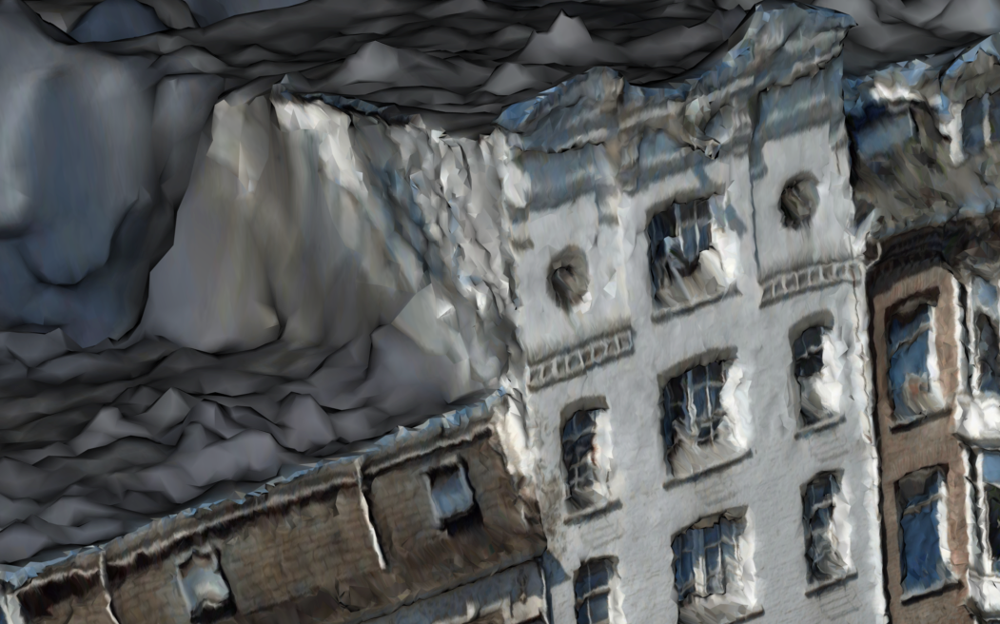
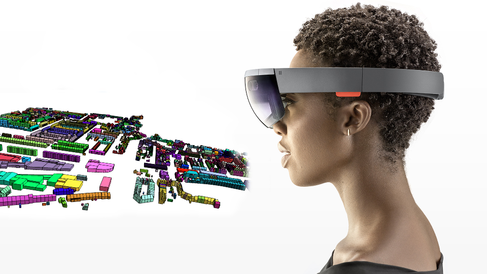

- - -

## Line of sight (visibility) and raytracing analyses on a point cloud dataset

{:width="600px"}

Calculating the visibility between two points using 3D city models provides valuable input to many application domains, such as solar analyses (shadowing) and finding the optimal place to install a surveillance camera or a billboard. This list is growing, e.g. a potential application could be to estimate the visibility of an urban canyon from a satellite.

We have developed a 3D skeleton-based approach (part of that [research project](https://3d.bk.tudelft.nl/projects/3dsm/)) ([PDF here](https://3d.bk.tudelft.nl/hledoux/pdfs/15_udmv_visibility.pdf)) that would be the start of the project.

Knowledge of Python and FME is sufficient.

**Contact:** [Ravi Peters](http://tudelft.nl/rypeters) and [Hugo Ledoux](http://tudelft.nl/hledoux)

- - -

## 3D breakline extraction from point clouds

{:width="400px"}

Point clouds, unstructured collections of 3D points in space, are nowadays collected with different acquisition methods, eg photogrammetry and LiDAR, and contain a wealth of information on both natural and man-made structures.

The aim of this project is to extract 3D breaklines directly from a point cloud such as the national AHN3.
Breaklines indicate discontinuities in a terrain (such as the ridges in a mountain) and are needed for applications such as flood simulations and noise simulations.

As a starting point the [3D medial-axis transform (MAT)](https://3d.bk.tudelft.nl/projects/3dsm/) can be used (used to generate the image above).

Prior knowledge of programming in Python or C++ is required.

**Contact:** [Ravi Peters](http://tudelft.nl/rypeters) and [Hugo Ledoux](http://tudelft.nl/hledoux)

- - -

## Automatic Derivation and Storage of Metadata for 3D City Models

{:width="350px"}

The size of 3D City Models makes it temporally and computationally expensive to quickly parse a dataset to understand if it is suitable for a specific application. Furthermore, datasets are created and modified by different users, this makes it difficult to know what level of processing it has experienced and to track its lineage to understand changes over time. Metadata is crucial for establishing data confidence, estimating fitness-for-purpose, maintaining dataset lineage and credit recognition amongst many other benefits. The problem is that it sounds boring and can be laborious to produce and maintain.

The aim of this project is to: 

* Develop a methodology that parses a 3D City Model and automatically derives metadata, e.g. spatial extent, the presence of semantic information, level of detail, etc. 

* Discover a method of storing metadata that a) ensures it is still coupled with its parent dataset and b) is easily queried. 

* Examine the limitations of 2D metadata standards and make recommendations about how to extend standards to include 3D data.

If there is interest the student may wish to examine a Resource Description Framework as the metadata data model. 

For this position we ask for programming skills, preferably in Python. SQL is an asset but you can easily learn it over the course of the project. 

*Contact:* [Anna Labetski](http://3d.bk.tudelft.nl/alabetski) and [Hugo Ledoux](http://tudelft.nl/hledoux)

- - -

## Compression of CityJSON files

As an alternative format for the [CityGML](https://www.citygml.org) data model, we have recently developed [CityJSON](http://www.cityjson.org), it uses [JavaScript Object Notation](http://json.org).
The aim of CityJSON is to offer an alternative to the GML encoding of CityGML, which can be verbose and complex (and thus rather frustrating to work with). 
CityJSON aims at being easy-to-use, both for reading datasets, and for creating them.
It was designed with programmers in mind, so that tools and APIs supporting it can be quickly built.

Based on some preliminary and limited tests, we concluded that it can compress many datasets with a factor of at least 4X, often 10X+.
The aim of this MSc project is to verify (or disprove!) this claim by:

  1. developing a conversion tool from CityGML datasets, using either [citygml4j](https://github.com/citygml4j) or the [new GDAL driver](http://www.gdal.org/drv_gmlas.html).
  2. identifying how files could be further compressed. At this moment, only a [simpler compression method is implemented](http://www.cityjson.org/en/0.1/specs/#id21) ([code here](https://github.com/tudelft3d/cityjson/tree/master/software/cityjson-compress/c%2B%2B11)).
  3. testing with very large files, eg a whole German region with 10M+ buildings.

Knowledge of Python is enough.

*Contacts:* [Hugo Ledoux](http://tudelft.nl/hledoux) and [Stelios Vitalis](mailto:s.vitalis@tudelft.nl)

- - - 

## GeoOBJ: developing a spatial extension to OBJ

3D formats found in 3D computer graphics are in many ways superior to GIS formats such as CityGML: they have wide software support and great visualisation capabilities. However, they fall short with spatial analyses, because of various limitations, such as lack of geo-referencing, and lack of semantic structuring. The goal of this project is to bridge the two worlds, by developing a spatial extension to a computer graphics format such as OBJ. This thesis is suitable for MSc Geomatics students, and it may be adapted to any other format.

*Contacts:* [Filip Biljecki](https://3d.bk.tudelft.nl/biljecki) and [Hugo Ledoux](http://tudelft.nl/hledoux)

- - - 

## BIM/IFC and its integration with CityGML & 3D GIS

{:width="600px"}

An MSc Geomatics student recently completed his thesis work on the automatic conversion of IFC buildings to CityGML LOD3 models ([MSc thesis here](http://repository.tudelft.nl/view/ir/uuid%3A31380219-f8e8-4c66-a2dc-548c3680bb8d/); and also published as a [paper in Transactions in GIS](http://doi.org/10.1111/tgis.12162)). 
Several issues are still open, and an MSc project could investigate these. 
For instance: creation of interior rooms at different LODs (interior used to be LOD4, but CityGML v3.0 will have different interior LODs), integration with the terrain, and the conversion applied to other city objects (tunnels and bridges).

*Contact:* [Hugo Ledoux](http://tudelft.nl/hledoux) and [Jantien Stoter](http://3d.bk.tudelft.nl/jstoter)

- - -

## Automatic repair of 3D buildings

{:width="650px"}

To be used as input in most simulation and modelling software, 3D city models should be geometrically and topologically valid.
Unfortunately, the vast majority of 3D city models (eg in CityGML) available are of very poor quality: they contain geometric errors such part of roofs missing, a bridge not connected to the shore, self-intersections of surfaces, two buildings overlapping, wrong orientation of surfaces, etc.
The aim of this project is to build a workflow so that the new [generic CGAL repair operators](http://doc.cgal.org/latest/Polygon_mesh_processing/) can be used to repair automatically 3D buildings.
Other modules of CGAL could also be used, eg the [Nef Polyhedra](http://doc.cgal.org/latest/Nef_3/index.html).

I have already experience in repairing 3D buildings, but these new operators would make the software simpler, robuster, and easier to maintain.
Moreover, a Geomatics student graduated 2 years ago on a similar topic: [voxel-based methods were then investigated](http://repository.tudelft.nl/islandora/object/uuid:8ef4459d-b940-4007-bc3c-d87349015129/?collection=research).

CGAL is in C++, thus the knowledge of C++---or a strong desire to learn it---is necessary.
I am patient if you want to take this opportunity to learn, and many staff of my group could help.

*Contact:* [Hugo Ledoux](http://tudelft.nl/hledoux)

## Extraction of 3D roof segments from aerial imagery 

{:width="350px"}

This project is done in cooperation with [Readaar](http://www.readaar.com).
Readaar already developed a method to efficiently determine 3D roof segments from LiDAR data. 
Their current method is extremely fast (less than 2 days to process the entire Netherlands on a normal workstation) and gives a coarse estimation (~1m planar accuracy) of all roof segments in the Netherlands. 
They want to upgrade their current method to combine LiDAR with aerial imagery to profit from the much higher resolution of imagery w.r.t. LiDAR. 
There are multiple ways to achieve this, which could be focused more on traditional point cloud processing methods or more on object detection/machine learning approaches.
Both stereo imagery and LiDAR data are available for the entire Netherlands. 

The student will be helped by a remote sensing specialist (ir. Sven Briels) and a machine learning expert (Jean-Michel Renders, PhD) from [Readaar](http://www.readaar.com), and supervisors from TU Delft.

For this position we ask for programming skills, preferably in Matlab. 
The student will have to develop and test a large number of algorithms and approaches to get information from the raw data.

[More information is found there.](http://jobs.readaar.com/blog/internship-remote-sensing-machine-learning)

*Contact:* [Hugo Ledoux](http://tudelft.nl/hledoux) 

## "Straightening" and improvements of meshes of 3D city models obtained from image matching

<iframe src="https://player.vimeo.com/video/146221307?color=ff9933" width="640" height="360" frameborder="0" webkitallowfullscreen mozallowfullscreen allowfullscreen></iframe>

<a href="https://vimeo.com/146221307">3D - Amsterdam</a> from <a href="https://vimeo.com/cyclomedia">CycloMedia</a> on <a href="https://vimeo.com">Vimeo</a>.

{:width="500px"}

The video above of a part of Amsterdam was created automatically by [Cyclomedia](http://www.cyclomedia.com) from matching images taken from car driving around and of aerial photos.
From far away, the model looks admittedly great, but if you zoom in it is very "noisy", eg surfaces are not straight, and there are a lot of artefacts.
Different methods have been tried (eg [this one](https://hal.inria.fr/hal-00759261)), and here the goal is to see how methods you learned in the 3D modelling course (eg [RANSAC](https://en.wikipedia.org/wiki/RANSAC)) can be used.

We have a large area of Amsterdam already (in COLLADA format: textured triangles), so the project can start right away!

Notice that it's possible to do this project with a mix of software (FME, CloudCompare) and Python.

*Contact:* [Hugo Ledoux](http://tudelft.nl/hledoux) and [Abdoulaye Diakité](mailto:a.a.diakite@tudelft.nl)

- - -

## Automatic guesstimation of the level of detail of a 3D city model

{:width="800px"}

Every 3D city model has a level of detail, a measure that indicates its grade, usability and value. The LOD of a 3D city model is usually stored in the metadata, but it can also be evident from a quick inspection.

However, this is not always the case, and the number of non-homogeneous datasets with variable LOD is increasing. The goal of this project is to build and implement a method that is able to automatically deduce the level of detail of a 3D GIS dataset.

*Contact:* [Hugo Ledoux](http://tudelft.nl/hledoux) and [Filip Biljecki](http://tudelft.nl/biljecki)

- - -

## Generalisation of semantic 3D city models

Generalisation from a higher to a lower level of detail of a dataset is one of the key research topics in cartography (maps/scale) and computer graphics (3D models/simplification). 
In semantically enriched 3D city models, such as CityGML, the topic is not extensively researched because of some additional concepts, and due to differences such as selective generalisation (retaining the complexity of a part of a building such as the footprint while generalising only the roof). 
This research will investigate the generalisation of 3D city models, which will, beside the simplification of geometry, include generalisation of semantics and texture, and aggregation of city objects. Further, the student is expected to create a web interface which returns an generalised version of the uploaded CityGML dataset. 
The generalisation will be done according to the [new paradigm of levels of detail](http://3d.bk.tudelft.nl/biljecki/Random3Dcity.html) developed in our group.

*Contacts:* [Filip Biljecki](http://3d.bk.tudelft.nl/biljecki) and [Hugo Ledoux](http://tudelft.nl/hledoux)

- - - 

## Edge-matching with a constrained triangulation

While the edge-matching problem is usually tackled by snapping geometries within a certain threshold, in our [previous work](http://homepage.tudelft.nl/23t4p/pdfs/_11ostrava.pdf) we have shown that this solution is often not satisfactory and can be "dangerous". 
We have developed a novel edge-matching algorithm for polygons where vertices are not moved, instead gaps and overlaps between polygons are corrected by using a constrained triangulation as a supporting structure and assigning values to triangles. 
The aim of this MSc project is to extend that work to polylines, ie how can polygons and lines be snapped together robustly by using a triangulation as a base structure. 
The project involves first a literature review of the specifications for the edge-matching of features across countries (INSPIRE document), a translation of these into specific rules in a triangulation and a prototype implementation. 
The existing prototype (called [pprepair](https://github.com/tudelft3d/pprepair) that needs to be extended has been developed in C++, thus the knowledge of C++ or a strong desire to learn is necessary.

*Contact:* [Hugo Ledoux](http://tudelft.nl/hledoux)

- - - 

## Automatic thematic and semantic labelling of 3D city models

Many 3D city models are available as a soup of triangles, i.e. their geometry is not structured as in CityGML. This means that they do not contain semantics, i.e. the geometry of a building is not differentiated from a geometry of a road (above example), and the geometry within the same object (e.g. roof, windows and walls) have the same problem (see the image below, left with the desired result on the right). While such models may still be valuable in visualisation, their use for GIS purposes is hindered by the lack of semantics.

The goal of this thesis is to develop a reasoning system that would automatically infer the theme (semantics) of each geometric primitive, on two levels:

* City level (is it a tree, a building, or a road?)
* City object level (is the geometry a roof, a window, or a wall)?

The solution might involve pattern recognition techniques to aid the classification, hence it can be conducted in collaboration with the [Pattern Recognition Laboratory](http://prlab.tudelft.nl) at TU Delft.

*Contact:* [Filip Biljecki](http://3d.bk.tudelft.nl/biljecki), [David Tax](http://prlab.tudelft.nl/users/david-tax),  and [Hugo Ledoux](http://tudelft.nl/hledoux)

- - -

## Automatic construction of the 3D BAG datasets

{:width="800px"}

The aim is to develop a methodology to automatically construct the 3D BAG, using the BAG ([*Basisregistraties Adressen en Gebouwen*](https://bagviewer.kadaster.nl)), the BGT ([*Basisregistratie Grootschalige Topografie*](https://www.pdok.nl/nl/producten/pdok-downloads/download-basisregistratie-grootschalige-topografie)), and the AHN2 ([*Actueel Hoogtebestand Nederland*](http://www.ahn.nl/index.html)).
This dataset would contain---as shown in the figure above---the units within buildings (these are inferred from the BAG and the height of the building).

The project would be made in collaboration with the City of Den Haag, who have developed a prototype.
The student will have to improve their methodology, ensure that it is robust, and scale it for the whole country, if possible (or at least other municipalities).

The project requires programming in Python, the use of FME, and a desire to fight with a great amount of data.

*Contact:* [Hugo Ledoux](http://tudelft.nl/hledoux) and [Jantien Stoter](http://3d.bk.tudelft.nl/jstoter)

- - -

## Automatic construction of the 3D map of Amsterdam

  

  

  

The aim is to develop a methodology to automatically construct the 3D map of (parts of) Amsterdam so that it can be used by architects and others to "discover" hidden parts of the city.
The project would be in collaboration with people involved in the [Hidden Amsterdam Festival](http://stimuleringsfonds.nl/nl/actueel/toekenningen/hidden_amsterdam_festival/) and the [AMS institute](http://ams-amsterdam.com), and if successful would be used for the festival during the summer 2016.

Right now these 3D models are made manually, and the main objective of the project would be to investigate if these can be constructed automatically, and if yes with which datasets at what is the quality/accuracy of the 3D models?
The exterior of the buildings could be reconstructed with already available datasets (AHN, BAG, BGT, etc.), but the interior is also of interest.
Therefore, this topic is potentially suitable for 2-3 students working on different aspects.

*Contact:* [Hugo Ledoux](http://tudelft.nl/hledoux) or [Jantien Stoter](http://3d.bk.tudelft.nl/jstoter) or [Sisi Zlatanova](http://3d.bk.tudelft.nl/szlatanova)

- - -

## Shape grammar to subdivide spaces

Indoor environment in public buildings consist of very large spaces and usually it is difficult to give instructions how to get to a specific part of the such space. Therefore for indoor localisation and navigation, spaces are subdivided into functional areas. There several approaches to subdivide spaces. 

This research will concentrate on space subdivision using shape grammar. A shape grammar consists of number of shape rules and a generation process that selects and processes rules. In general, shape rule specifies the transformations on  existing (part of a) shape. This research is part of [SIMs3D](www.sims3d.net) project.

*Contact:* [Abdoulaye Diakité](http://3d.bk.tudelft.nl/adiakite)

- - -

## Octree – Indoor/Outdoor navigation

3D raster representation is increasingly gaining the interest of the researchers. They are simple structures but usually result in large data sets. Therefore in previous research we have investigated Octree data structure and its use for indoor path computation.

This research topic will continue and extend previous work by considering rasterization of outdoor space. The goal is to investigate what kind of Octree would be needed for seamless indoor/outdoor navigation. 

*Contact*: [Sisi Zlatanova](http://3d.bk.tudelft.nl/szlatanova) 

- - -

## Indoor modelling with the Google Tango tablet

The Google Tango tablet is a very intuitive, interactive and interesting tool for indoor scanning. The device contains suitable sensors to rapidly produce 3D models. But the few apps available for this task are very limited, and only provides either an already processed mesh or point cloud samples. 

The goal of this research is to evaluate to which extent the tablet can be used for indoor modelling. It is about fully exploiting the skills of the tablet to extract proper point clouds and perform semantically rich surface reconstruction, by relying on other information such as the scanning trajectories, the coloured pictures of the environment, etc. 

*Contact:* [Abdoulaye Diakité](http://3d.bk.tudelft.nl/adiakite)

- - -

## Dynamic changes of the 3D indoor spaces

In order to perform fine-grained indoor navigation, one needs to consider the entire 3D free and non-free space. The non-free space is often characterized by furniture elements and people activities (crowd, queue, etc).  The free space that is available for navigation cannot be evaluated without considering the obstacles. This problem is even more complex because the obstacles can move in the indoor space.

The goal of this research is to investigate the best way to consider the moving objects in an indoor environment to optimally evaluate the real free space available for navigation. This research is part of [SIMs3D](www.sims3d.net) project.
 
*Contact:* [Abdoulaye Diakité](http://3d.bk.tudelft.nl/adiakite)

- - -

## FaciliDat: 3D Indoor model and a database schema for facility management  

Most building managers have little to no information about the indoor status of their buildings: the number of buildings, their structure, rooms, size of windows, doors, area of room floors, etc. Many maintenance daily and yearly tasks such as cleaning, renovation, painting, refurnishing, safety are performed in an ad-hoc manner, which cost extra effort and money. There is great interest in a 3D indoor model, which geometry, topology and semantic information will serve the tasks of the building managers. 

Currently two international standards for 3D indoor modelling are available IFC and CityGML LOD4. Both standards have their advantages and disadvantages for such purposes. IFC has too many details and it is difficult to integrate with GIS. CityGML LOD4 is relatively simple, but hardly supported by major vendors.
* First option: Is it possible to establish a 3D indoor model that can serve facility management purposes? This research will evaluate the suitability of the two standards (and available database implementations such as 3DCityDB) and propose a solution: extend/adapt one of them or design a new model combining best characteristics of the two. The proposed approach should be realised as a data model in DBMS and validated against a predefined set of user requirements. A simple web application allowing access and view to the database would be recommendable.  (Required skills: UML, SQL, basic programming)
* Second option: What kind of algorithms are needed to convert automatically IFC to CityGML LOD4 taking care of valid geometry and semantics. It is expected that recommendations for design of a building model will be derived, which will facilitate a fully automatic conversion. This might also result in more strict rules for representing indoor objects in CityGML. (Required skills: computational geometry, programming)

*Contact*: [Sisi Zlatanova](http://3d.bk.tudelft.nl/szlatanova) (in cooperation with More For You, Charim) 

- - - 

## Flexible 3D Indoor model for navigation of different types of users  

Many indoor navigation apps are currently available but they are focussed on specific application (i.e. shopping, tourism) and have no flexibility. They cannot be adapted to the profile of the user or the task he/she is completing. They do not take into consideration temporal or permanent changes of the environment such as renovation, reorganisation of spaces or in case of emergency. User profiles and changed environment reflect the 3D Indoor model (geometry and network) that is used to compute the navigation paths. 

This research will investigate what kind of 3D indoor model which can provide sufficient information to navigate different users through changing indoor environments. Are different LOD/layers needed? How to maintain connectivity of spaces? Can the network be derived on the fly or should be stored with the geometry model? Fundamental concepts of IndoorGML such as dual graph and Multi-Layered Space Model will be the starting point of the research. Generic user profiles and parameters reflecting changing indoor environmental need to be identified. A final app should demonstrate the flexibility of the model and the proposed strategy for path navigation (Required skills: UML, SQL, programming)

*Contact*: [Sisi Zlatanova](http://3d.bk.tudelft.nl/szlatanova) (in cooperation with CGI) 

- - - 

## 3D Indoor navigation: what kind of path?  

Current navigation outdoor and indoor system are relatively simple and offer limited choices. Car navigation systems offer a choice between the shorter path or faster path, or avoiding tolls, highways. Indoor navigation apps can compute optimal path to visit a sequence of targets (e.g. in shopping). Various other options have been reported in the literature such as the least turn’s path, the most interesting paths, the least traversing path or the least obstruction path. Furthermore, the current navigation systems mostly consider that one person is navigated to one static target point. But are these options sufficient for indoor navigation? How the people want to move indoors? What kind of algorithms should be used, or developed. What kind of network is needed? 

	

	

	

This research should investigate conditions for indoor navigation, corresponding algorithms and networks. Starting point of the research will be the taxonomy for navigation of emergency responders developed at the 3D geoinformation group. The research should identify, implement and validate new ways for indoor navigation (Required skills: graph theory, programming) 

*Contact*: [Sisi Zlatanova](http://3d.bk.tudelft.nl/szlatanova), Liu Liu

- - - 

## Indoor scanning for 3D modelling

3D indoor models are still very rare and difficult to obtain. 3D BIM models hardly contain recent modifications, 2D floor plans are not accurate and lack 3D. Range or optical images are some of the relatively easy and cheap way to collect 3D data to be provided for 3D modelling algorithms. There several interesting technologies currently at the market, which seem suited for indoor modelling, but they have never been thoroughly investigated and compared.

	

	

	

	

This research will concentrated on several technologies for collection point clouds ZEB1, Tango, terrestrial scanner, and optical video/images. A comparative study will be completed on the basis of a set of parameters, including time for collecting and processing data to a uniform point cloud. The 4 technologies will be tested on the same building under the same conditions. The most prominent technology should be identified for quick update of parts of 3D models. A test bed for testing and evaluation should be set up.  (Required skills interest on scanning technology, processing of point clouds).      

*Contact*: [Sisi Zlatanova](http://3d.bk.tudelft.nl/szlatanova) (related to M4C project SIMs3D)

- - - 

## 3D reconstruction of rooms (floors, ceilings and walls) from point clouds

3D reconstruction of indoor environments is complex task: rooms contain many objects in rooms or attached to walls and ceilings; many of the indoor spaces are half open and there are intermediate floors, balconies and strains. Manual reconstruction is tedious and time consuming; no automatic or semi-automatic approaches currently exist. This research will investigate and design/adapt approaches for **identifying** the walls, ceilings and floors belonging to an indoor space and construct solids (where possible). The research should also suggest a data structure for integrated management of vector geometry and corresponding point clouds. Several approaches can be addressed that can lead to different Master topics: shape grammar, voxels, segmentation/classification, etc.  (Required skills: interest in processing point clouds, programming alternatively using existing software)

*Contact*: [Sisi Zlatanova](http://3d.bk.tudelft.nl/szlatanova), Ben Gorte (related to M4C project SIMs3D)

- - - 

## 3D reconstruction of doors and windows from point clouds

Doors and windows are of critical importance for indoor navigation and localisation, but very difficult to identify from point clouds: doors and windows can be closed or open during the scanning, windows can be covered with curtains or sun shutters.  This research will concentrate investigated which outdoor approach could be appropriate for indoor environments. Recently completed research of [Kaixuan Zhou](http://repository.tudelft.nl/view/ir/uuid%3A8f548788-1e42-475b-adbf-93f9dbcd04a1/) could be used as starting point. Different approaches can lead to different MSc topics: use of floor plans, semi-automatics, feature detection, etc. (Required skills: interest in processing point clouds, programming or alternatively using existing software)

*Contact*: [Sisi Zlatanova](http://3d.bk.tudelft.nl/szlatanova), Ben Gorte (related to M4C project SIMs3D)

- - - 

## System architecture for flexible indoor path computation making use of IndoorGML

IndoorGML is recently accepted standard for exchange of indoor information needed mostly for navigation. The standard suggests three options for encoding geometry and network information that is needed for navigation:  1) the geometry is provided by IFC, KML or CityGML file and the IndoorGML contains only the path/network for navigation, 2) simple geometry&semantics is stored in the IndoorGML file, and finally 3) no geometry is provided

The three different options have their pros and cons for different types of server-client applications. Sever-based or client-based computations? How much information to be sent to the client: only the navigation path or the navigation path and the building model? Provide the whole path or wait for requests from the user? An android application should be developed that demonstrates the different approaches 
(Required skills: web technology, app development)

*Contact*: [Sisi Zlatanova](http://3d.bk.tudelft.nl/szlatanova) (related to OGC pilot project)

- - - 

## Colouring point clouds obtained from ZEB1

Scanning indoor environments with ZEB1 is quick and accurate method for obtaining indoor point clouds. However,  the point clouds don’t have colour. This research will investigate an approach for integrating images with the ZEB1 point clouds to obtain coloured points. The research will be in collaboration with CSIRO, GeoSlam and university of Picardie. (Required skills: interest in processing point clouds, programming)

*Contact*: [Sisi Zlatanova](http://3d.bk.tudelft.nl/szlatanova) (in cooperation with LEAP3D)

- - - 

## Smart City 

Connecting and visualizing real-time sensors with point cloud. Used for analysis of data and influencing the environment (smart city concept). Details to be provided later. 

*Contact*: [Sisi Zlatanova](http://3d.bk.tudelft.nl/szlatanova) and Ester de Bruin (LEAP3D) 

- - - 

## Augmented Reality applications for City Models (Hololens)

Augmented Reality is an emerging technology in visualisation and perseption of digital worlds. City models could be benefited from such a technology, as users could better explore and understand the data that are integrated in such a virtual model of a city. This project is about the development of a visualization application on Microsoft Hololens platform, exploring potential benefits and issues of such an application and the potential use cases for future use. The application should focus on the visualisation of geometry and attributes of a city model. The implementation will be done through the use of the Unity 3D engine and the C# programming language.

*Contact:* [Stelios Vitalis](http://3d.bk.tudelft.nl/svitalis)