- - -

* Table of Content
{:toc}

- - -

## Automatic construction of the 3D BAG datasets

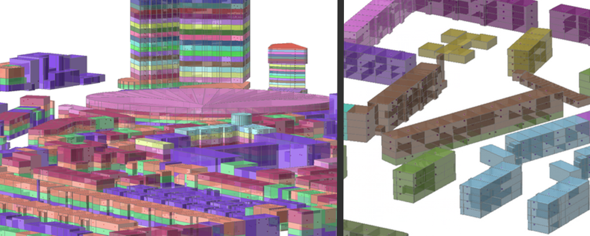{:width="800px"}

The aim is to develop a methodology to automatically construct the 3D BAG, using the BAG ([*Basisregistraties Adressen en Gebouwen*](https://bagviewer.kadaster.nl)), the BGT ([*Basisregistratie Grootschalige Topografie*](https://www.pdok.nl/nl/producten/pdok-downloads/download-basisregistratie-grootschalige-topografie)), and the AHN2 ([*Actueel Hoogtebestand Nederland*](http://www.ahn.nl/index.html)).
This dataset would contain---as shown in the figure above---the units within buildings (these are inferred from the BAG and the height of the building).

The project would be made in collaboration with the City of Den Haag, who have developed a prototype.
The student will have to improve their methodology, ensure that it is robust, and scale it for the whole country, if possible (or at least other municipalities).

The project requires programming in Python, the use of FME, and a desire to fight with a great amount of data.

*Contact:* [Hugo Ledoux](http://tudelft.nl/hledoux) and [Jantien Stoter](http://3d.bk.tudelft.nl/jstoter)

- - -

## Automatic thematic and semantic labelling of 3D city models (possibly two topics in one)

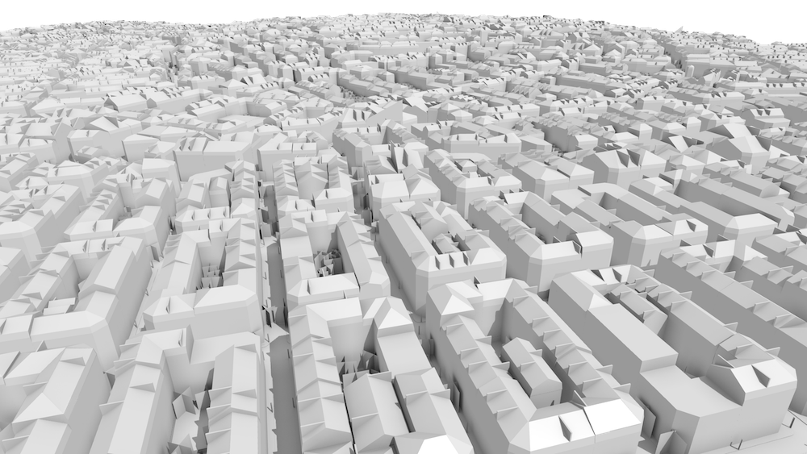

Many 3D city models are available as a soup of triangles, i.e. their geometry is not structured as in CityGML. This means that they do not contain semantics, i.e. the geometry of a building is not differentiated from a geometry of a road (above example), and the geometry within the same object (e.g. roof, windows and walls) have the same problem (see the image below, left with the desired result on the right). While such models may still be valuable in visualisation, their use for GIS purposes is hindered by the lack of semantics.

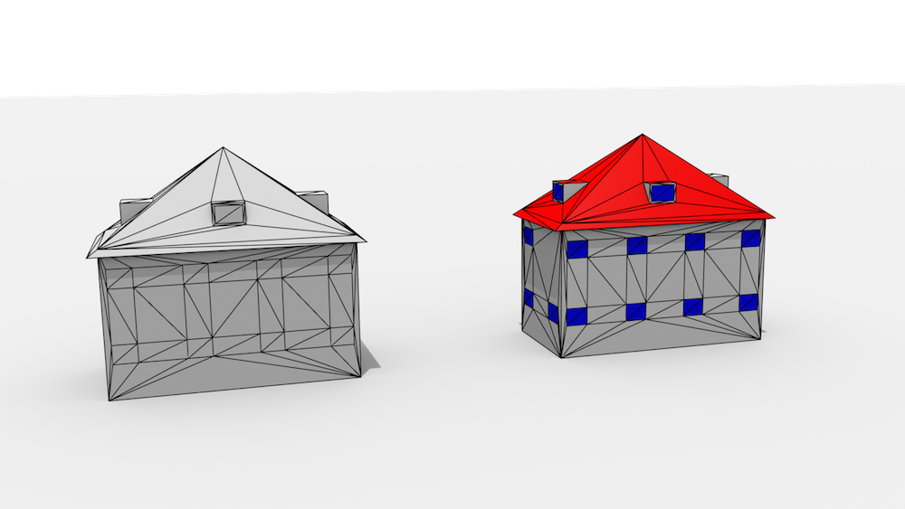

The goal of this thesis is to develop an automatic reasoning system that would automatically infer the theme (semantics) of each geometric primitive, on two levels:

* City level (is it a tree, a building, or a road?)
* City object level (is the geometry a roof, a window, or a wall)?

The thesis may involve machine learning techniques to aid the classification.

*Contact:* [Filip Biljecki](http://3d.bk.tudelft.nl/biljecki) and [Hugo Ledoux](http://tudelft.nl/hledoux)

- - -

## Improving house price models with 3D city models and LiDAR datasets

{:width="500px"}

Apartments having more sun and a nice view are worth more than those without windows.
Sounds trivial, but this fact is rarely taken into account when house prices models are developed.
The aim of this MSc project is to apply the methodology developed in [this paper](http://dx.doi.org/10.1016/j.compenvurbsys.2013.01.001) to the Dutch housing situation (and potentially to improve it).
The student will have to use AHN2, 3D city models, and learn about house price models.

The project would be co-supervised by one staff from the 3D geoinformation group (for the technical part related to 3D visibility) and [Jan de Haan](http://www.otb.tudelft.nl/en/about-otb/staff/alle-medewerkers/prof-dr-j-jan-de-haan/), who is a professor in housing systems here at the faculty.

*Contact:* [Hugo Ledoux](http://tudelft.nl/hledoux)

- - -

## Snap rounding in a triangulation 

{:width="500px"}

The most common way to do edge-matching or to clean small inconsistencies within and between datasets is to apply snapping (point-to-point or point-to-line). 
However, simple snapping creates many problems, including topological changes and inconsistencies. 
Snap rounding extends this method in order to give robustness guarantees, but current implementations, such as [the one in CGAL](http://doc.cgal.org/latest/Snap_rounding_2/index.html), are *extremely* slow. 
Related to this, in the project [pprepair](https://github.com/tudelft3d/pprepair), we have previously used a constrained triangulation as a robust method to repair polygons and planar partitions. 
Using this approach topological errors are automatically fixed.
We therefore believe that using a triangulation as a base structure is an intuitive and efficient way to optimize snap rounding, since we can perform simple snapping and recover from topological errors afterwards.

The existing prototype ([pprepair](https://github.com/tudelft3d/pprepair) that needs to be extended has been developed in C++, thus the knowledge of C++---or a strong desire to learn it---is necessary.

*Contact:* [Hugo Ledoux](http://tudelft.nl/hledoux)

- - -

## BIM and its integration with CityGML & 3D GIS

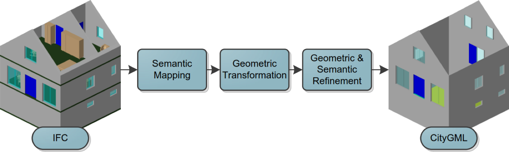{:width="500px"}

A student recently completed his MSc Geomatics thesis work on the automatic conversion of IFC buildings to CityGML LOD3 models ([MSc thesis here](http://repository.tudelft.nl/view/ir/uuid%3A31380219-f8e8-4c66-a2dc-548c3680bb8d/)). 
Several issues are still open, and an MSc project could investigate these. 
For instance: creation of interior rooms at different LODs (CityGML v3 will have that concept), integration with the terrain, and the conversion applied to other city objects (tunnels and bridges).

The project could be embedded in the [BIMlab at CiTG/TU Delft](http://www.tubimlab.nl).
That is, as an MSc student, you work one day per week during your thesis work there and you get the support of other students (from different faculties) working with BIM, and potential of the companies involved in the project.
The BIMlab offers [other project too](http://www.tubimlab.nl/?page_id=50).

*Contact:* [Jantien Stoter](http://3d.bk.tudelft.nl/jstoter) and [Hugo Ledoux](http://tudelft.nl/hledoux)

- - -

## Automatic guesstimation of the level of detail of a 3D city model

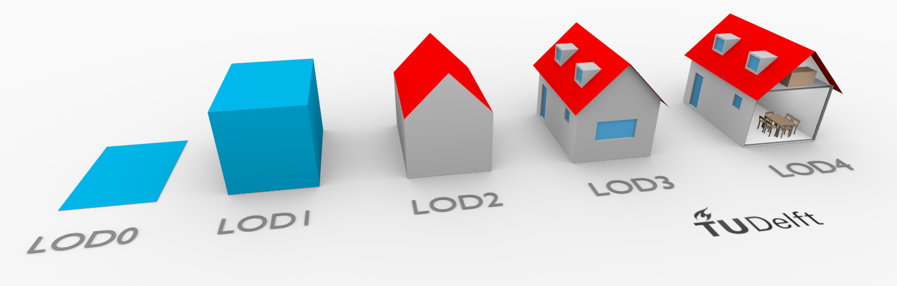{:width="800px"}

Every 3D city model has a level of detail, a measure that indicates its grade, usability and value. The LOD of a 3D city model is usually stored in the metadata, but it can also be evident from a quick inspection.

However, this is not always the case, and the number of non-homogeneous datasets with variable LOD is increasing. The goal of this project is to build and implement a method that is able to automatically deduce the level of detail of a 3D GIS dataset.

*Contact:* [Filip Biljecki](http://tudelft.nl/biljecki)

- - -

## Estimating the cooling demand with 3D city models

This MSc thesis will be conducted in collaboration with the [European Institute for Energy Research (EIFER)](http://www.eifer.org).

It involves:

* Developing a cooling energy model based on 3D city model: morphological analysis, urban typological and classification of 3D data, cooling energy needs calculation, etc.

* Study the influence of urban morphology on cooling needs (e.g. through statistical regressions)

* Implement this relation (e.g. equation between urban density and cooling needs) in a procedural tool.

For more information, please read [here](https://lsecities.net/publications/reports/cities-and-energy-urban-morphology-and-heat-energy-demand/
) about a project that EIFER led with the LSE for studying the relation between urban morphology and cooling demand.

*Contact:* [Filip Biljecki](http://tudelft.nl/biljecki)

- - -

## Line of sight (visibility) and raytracing analyses on a 3D dataset

Calculating the visibility between two points using 3D city models provides valuable input to many application domains, such as solar analyses (shadowing) and finding the optimal place to install a surveillance camera or a billboard. This list is growing, e.g. a potential application could be to estimate the visibility of an urban canyon from a satellite.

This MSc thesis will investigate visibility algorithms and potential applications.

*Contacts:* [Ravi Peters](http://tudelft.nl/rypeters), [Filip Biljecki](http://tudelft.nl/biljecki) and [Hugo Ledoux](http://tudelft.nl/hledoux)

- - -

## Edge-matching with a constrained triangulation

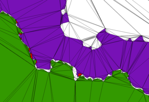

While the edge-matching problem is usually tackled by snapping geometries within a certain threshold, in our [previous work](http://homepage.tudelft.nl/23t4p/pdfs/_11ostrava.pdf) we have shown that this solution is often not satisfactory and can be "dangerous". 
We have developed a novel edge-matching algorithm for polygons where vertices are not moved, instead gaps and overlaps between polygons are corrected by using a constrained triangulation as a supporting structure and assigning values to triangles. 
The aim of this MSc project is to extend that work to polylines, ie how can polygons and lines be snapped together robustly by using a triangulation as a base structure. 
The project involves first a literature review of the specifications for the edge-matching of features across countries (INSPIRE document), a translation of these into specific rules in a triangulation and a prototype implementation. 
The existing prototype (called [pprepair](https://github.com/tudelft3d/pprepair) that needs to be extended has been developed in C++, thus the knowledge of C++ or a strong desire to learn is necessary.

*Contact:* [Hugo Ledoux](http://tudelft.nl/hledoux)

- - -

## 3D data modelling

The growing awareness for our intensively used environment requires more advanced modelling of spatial situations and events. Over the years, a lot of research has been conducted to create and maintain 3D geoinformation and in 2014 a high resolution point data set -- (Actueel Hoogtebestand Nederland 2) -- has become available as open data describing the shape of the whole of The Netherlands quite accurately. The national 3D standard which was established early 2012 as an Application Domain Extension (ADE) of the OGC 3D standard CityGML further stimulates 3D developments in practice. The new standard allows to extend this information into 3D in a common approach. There are remaining research challenges for 3D that can be studied within an MSc research:

  * Other domain information models can be studied for extension into 3D. For example spatial plans are 2D until now and there is also no good 3D representation for the Transportation domain (i.e. how to model road-directions at the several levels of detail) nor for cables and pipelines. The urge for a 3D extension of these domain models shows from several use cases
  * Another MSc project could focus on the integration between BIM (for design and construction) and 3D geoinformation (to have a framework on what is and what is not allowed/possible in the design phase or to serve 3D geoinformation models with data from the BIM domain)
  * Currently a 3D topographic data set covering the whole of the Netherlands is being processed. It consists of 30.000 tiles; 15 million objects and 2 TB data volume. An MSc project could work on the design and implementation of a methodology (including appropriate data structure) to disseminate this data seamlessly to users in a Web environment
  * Environmental modelling in 3D: Simulation models (noise; wind; air pollution) work in 3D; but planning instruments don't. 

An MSc task would be to develop and implement a methodology that acknowledges (and integrates) the 3D component of environmental modelling for a selection of aspects.

*Contact:* [Jantien Stoter](http://3d.bk.tudelft.nl/jstoter)

- - - 

## Generalisation of semantic 3D city models

Generalisation from a higher to a lower level of detail of a dataset is one of the key research topics in cartography (maps/scale) and computer graphics (3D models/simplification). 
In semantically enriched 3D city models, such as CityGML, the topic is not extensively researched because of some additional concepts, and due to differences such as selective generalisation (retaining the complexity of a part of a building such as the footprint while generalising only the roof). 
This research will investigate the generalisation of 3D city models, which will, beside the simplification of geometry, include generalisation of semantics and texture, and aggregation of city objects. Further, the student is expected to create a web interface which returns an generalised version of the uploaded CityGML dataset. 
The generalisation will be done according to the [new paradigm of levels of detail](http://3d.bk.tudelft.nl/biljecki/Random3Dcity.html) developed in our group.

*Contacts:* [Filip Biljecki](http://3d.bk.tudelft.nl/biljecki) and [Hugo Ledoux](http://tudelft.nl/hledoux)

- - - 

## Automatic matching of 3D city models 

3D city models may be derived with different acquisition techniques from different producers in different levels of detail (LOD), resulting in multiple datasets of the same area. The aim of this research is to design and implement a method that finds corresponding features in two or more datasets. The benefits of this research are, for instance, linking objects for consistency (e.g. updating only one model and propagate the changes in the other models).

This topic is analogous with data matching in cartography.

*Contact:* [Filip Biljecki](http://3d.bk.tudelft.nl/biljecki)

- - -

## Procedural modelling in CityGML

Procedural modelling deals with automatic model generation by means of a procedure. It is common in computer graphics, but less so in 3D city modelling. This aim of this thesis is to design a procedural modelling engine focused on 3D GIS and CityGML in multiple levels of detail (LOD). There are two possibilities: generating 3D models from real-world (2D) data supplementing synthetic content (e.g. height of a building, windows), or generating completely synthetic 3D data.

*Contact:* [Filip Biljecki](http://3d.bk.tudelft.nl/biljecki)

- - - 

## Extension of the ISO standard 19157 for 3D data

The standard ISO 19157:2013 Geographic information---Data quality is the principal standard for describing the quality of geodata. For instance, the positional and thematic errors. However, the standard falls short when it comes to 3D data. For instance, it is not possible to describe invalid 3D geometry such as solids, and that the dataset has been acquired in an insufficient level of detail. The aim of this thesis is to investigate how is it possible to extend the standard for quality concepts found in 3D.

Upon successful completion of this topic, the student will become proficient with this important standard, and potentially give valuable recommendations for the new version of the standard to the developers. 

*Contact:* [Filip Biljecki](http://3d.bk.tudelft.nl/biljecki)

- - -

## Voxel to Object for Geological Survey of NL

The Geological Survey of the Netherlands produces an advanced 3D raster based (100x100x0.5 m^3) model of the top 30 meters of the Dutch subsurface (GeoTop) as one of the products of the Key Registration Subsurface. At present the West of the country is ready. When fully finalized it will contain some 200 million voxels with all physico-chemical properties relevant in the Dutch situation.In the last few years in various domains new 3d object oriented information models and application environments have been adopted (CityGML, BIM ). For combined analysis of the subsurface and the built environment, e.g. in questions concerning the potential of subsurface heat and cold storage in urban areas, interactions between voxel and object models are needed. In this project the student will explore and design various concepts for conversion of voxels (GeoTop ) to object-oriented (CityGML). The research should report on advantages and disadvantages of various approaches of storage for use in combination with object oriented user application environments like CityGML.

The student could carry (part of) his/her work at TNO.

*Contact:* [Sisi Zlatanova](http://3d.bk.tudelft.nl/szlatanova)

- - - 

## 3D Path-finding in a voxelized model of indoor environments

Voxelisation is an approach to represent 3D grid. Voxel-based models describe indoor space in a discrete form. In contrast to the commonly used boundary representation (B-Rep), voxel representation allows for better analysis of the *empty* space. Therefore, voxelized building models can be very appropriate for 3D indoor navigation. Currently path-finding is mostly conducted on 2D or 2,5D representations (e.g. floor plans and indoor surface models) of indoor environments. However, these approaches cannot deal with some cases such as "going under or above obstacles", "moving at a certain height (e.g. flying)" or avoiding overhanging parts.
This research aims at developing a voxel-based path-finding method to obtain specific 3D paths in terms of distinct requirements ( e.g. on surface and in the air) at different modes ( e.g. normal case or emergency). Research questions to be investigated are: the data structure to organise the voxels, the required semantic information and the path-finding algorithms for different modes.

*Contact:* [Sisi Zlatanova](http://3d.bk.tudelft.nl/szlatanova)

- - - 

## Topics with AMS

Several MSc researches can be done within the context of [Amsterdam Institute for Advanced Metropolitan Solutions](http://www.ams-amsterdam.com), with help of Amsterdam employees. For example:

  * Finding "fraud" (illegal hotels; illegal occupation of buildings) by a smart combination of (spatial) data
  * Exploring additional use of photographs that are taken from public space every week to find abuse of parking licences
  * Identify and analyse spreading of certain aspects (e.g. by using social media) to find out how "full" Amsterdam is
  * Tracking and tracing of wheel chairs to provide insight in good and bad wheel chair routes and possible obstacles

*Contact:* [Jantien Stoter](http://3d.bk.tudelft.nl/jstoter)

## FaciliDat: 3D Indoor model and a database schema for facility management  

Most building managers have little to no information about the indoor status of their buildings: the number of buildings, their structure, rooms, size of windows, doors, area of room floors, etc. Many maintenance daily and yearly tasks such as cleaning, renovation, painting, refurnishing, safety are performed in an ad-hoc manner, which cost extra effort and money. There is great interest in a 3D indoor model, which geometry, topology and semantic information will serve the tasks of the building managers. 

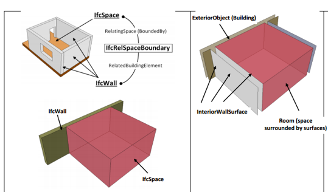

Currently two international standards for 3D indoor modelling are available IFC and CityGML LOD4. Both standards have their advantages and disadvantages for such purposes. IFC has too many details and it is difficult to integrate with GIS. CityGML LOD4 is relatively simple, but hardly supported by major vendors.
* First option: Is it possible to establish a 3D indoor model that can serve facility management purposes? This research will evaluate the suitability of the two standards (and available database implementations such as 3DCityDB) and propose a solution: extend/adapt one of them or design a new model combining best characteristics of the two. The proposed approach should be realised as a data model in DBMS and validated against a predefined set of user requirements. A simple web application allowing access and view to the database would be recommendable.  (Required skills: UML, SQL, basic programming)
* Second option: What kind of algorithms are needed to convert automatically IFC to CityGML LOD4 taking care of valid geometry and semantics. It is expected that recommendations for design of a building model will be derived, which will facilitate a fully automatic conversion. This might also result in more strict rules for representing indoor objects in CityGML. (Required skills: computational geometry, programming)
Contact: [Sisi Zlatanova](http://3d.bk.tudelft.nl/szlatanova) (in cooperation with More For You, Charim) 

## Flexible 3D Indoor model for navigation of different types of users  

Many indoor navigation apps are currently available but they are focussed on specific application (i.e. shopping, tourism) and have no flexibility. They cannot be adapted to the profile of the user or the task he/she is completing. They do not take into consideration temporal or permanent changes of the environment such as renovation, reorganisation of spaces or in case of emergency. User profiles and changed environment reflect the 3D Indoor model (geometry and network) that is used to compute the navigation paths. 

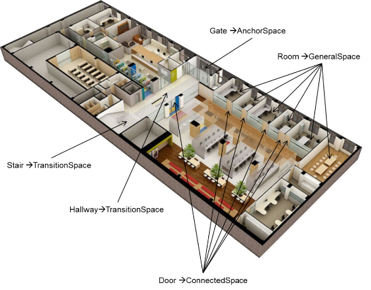

This research will investigate what kind of 3D indoor model which can provide sufficient information to navigate different users through changing indoor environments. Are different LOD/layers needed? How to maintain connectivity of spaces? Can the network be derived on the fly or should be stored with the geometry model? Fundamental concepts of IndoorGML such as dual graph and Multi-Layered Space Model will be the starting point of the research. Generic user profiles and parameters reflecting changing indoor environmental need to be identified. A final app should demonstrate the flexibility of the model and the proposed strategy for path navigation (Required skills: UML, SQL, programming)
Contact: [Sisi Zlatanova](http://3d.bk.tudelft.nl/szlatanova) (in cooperation with CGI) 

## 3D Indoor navigation: what kind of path?  

Current navigation outdoor and indoor system are relatively simple and offer limited choices. Car navigation systems offer a choice between the shorter path or faster path, or avoiding tolls, highways. Indoor navigation apps can compute optimal path to visit a sequence of targets (e.g. in shopping). Various other options have been reported in the literature such as the least turn’s path, the most interesting paths, the least traversing path or the least obstruction path. Furthermore, the current navigation systems mostly consider that one person is navigated to one static target point. But are these options sufficient for indoor navigation? How the people want to move indoors? What kind of algorithms should be used, or developed. What kind of network is needed? 

	
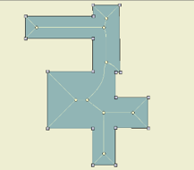

	
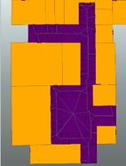

	
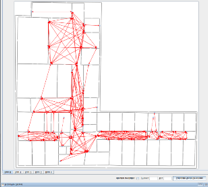

This research should investigate conditions for indoor navigation, corresponding algorithms and networks. Starting point of the research will be the taxonomy for navigation of emergency responders developed at the 3D geoinformation group. The research should identify, implement and validate new ways for indoor navigation (Required skills: graph theory, programming) 
Contact: [Sisi Zlatanova](http://3d.bk.tudelft.nl/szlatanova), Liu Liu

## Indoor scanning for 3D modelling

3D indoor models are still very rare and difficult to obtain. 3D BIM models hardly contain recent modifications, 2D floor plans are not accurate and lack 3D. Range or optical images are some of the relatively easy and cheap way to collect 3D data to be provided for 3D modelling algorithms. There several interesting technologies currently at the market, which seem suited for indoor modelling, but they have never been thoroughly investigated and compared.

	
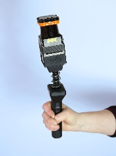

	
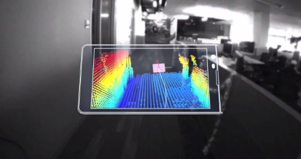

	
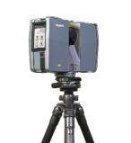

	
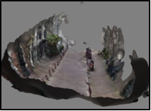

This research will concentrated on several technologies for collection point clouds ZEB1, Tango, terrestrial scanner, and optical video/images. A comparative study will be completed on the basis of a set of parameters, including time for collecting and processing data to a uniform point cloud. The 4 technologies will be tested on the same building under the same conditions. The most prominent technology should be identified for quick update of parts of 3D models. A test bed for testing and evaluation should be set up.  (Required skills interest on scanning technology, processing of point clouds).      
Contact: [Sisi Zlatanova](http://3d.bk.tudelft.nl/szlatanova) (related to M4C project SIMs3D)

## 3D reconstruction of rooms (floors, ceilings and walls) from point clouds

3D reconstruction of indoor environments is complex task: rooms contain many objects in rooms or attached to walls and ceilings; many of the indoor spaces are half open and there are intermediate floors, balconies and strains. Manual reconstruction is tedious and time consuming; no automatic or semi-automatic approaches currently exist. This research will investigate and design/adapt approaches for **identifying** the walls, ceilings and floors belonging to an indoor space and construct solids (where possible). The research should also suggest a data structure for integrated management of vector geometry and corresponding point clouds. Several approaches can be addressed that can lead to different Master topics: shape grammar, voxels, segmentation/classification, etc.  (Required skills: interest in processing point clouds, programming alternatively using existing software)
Contact: [Sisi Zlatanova](http://3d.bk.tudelft.nl/szlatanova), Ben Gorte (related to M4C project SIMs3D)

## 3D reconstruction of doors and windows from point clouds

Doors and windows are of critical importance for indoor navigation and localisation, but very difficult to identify from point clouds: doors and windows can be closed or open during the scanning, windows can be covered with curtains or sun shutters.  This research will concentrate investigated which outdoor approach could be appropriate for indoor environments. Recently completed research of [Kaixuan Zhou](http://repository.tudelft.nl/view/ir/uuid%3A8f548788-1e42-475b-adbf-93f9dbcd04a1/) could be used as starting point. Different approaches can lead to different MSc topics: use of floor plans, semi-automatics, feature detection, etc. (Required skills: interest in processing point clouds, programming or alternatively using existing software)
Contact: [Sisi Zlatanova](http://3d.bk.tudelft.nl/szlatanova), Ben Gorte (related to M4C project SIMs3D)

## System architecture for flexible indoor path computation making use of IndoorGML

IndoorGML is recently accepted standard for exchange of indoor information needed mostly for navigation. The standard suggests three options for encoding geometry and network information that is needed for navigation:  1) the geometry is provided by IFC, KML or CityGML file and the IndoorGML contains only the path/network for navigation, 2) simple geometry&semantics is stored in the IndoorGML file, and finally 3) no geometry is provided

The three different options have their pros and cons for different types of server-client applications. Sever-based or client-based computations? How much information to be sent to the client: only the navigation path or the navigation path and the building model? Provide the whole path or wait for requests from the user? An android application should be developed that demonstrates the different approaches 
(Required skills: web technology, app development)
Contact: [Sisi Zlatanova](http://3d.bk.tudelft.nl/szlatanova) (related to OGC pilot project)

## Colouring point clouds obtained from ZEB1

Scanning indoor environments with ZEB1 is quick and accurate method for obtaining indoor point clouds. However,  the point clouds don’t have colour. This research will investigate an approach for integrating images with the ZEB1 point clouds to obtain coloured points. The research will be in collaboration with CSIRO, GeoSlam and university of Picardie. (Required skills: interest in processing point clouds, programming)
Contact: [Sisi Zlatanova](http://3d.bk.tudelft.nl/szlatanova) (in cooperation with LEAP3D)

## Smart City 

Connecting and visualizing real-time sensors with point cloud. Used for analysis of data and influencing the environment (smart city concept). Details to be provided later. 
Contact: [Sisi Zlatanova](http://3d.bk.tudelft.nl/szlatanova) and Ester de Bruin (LEAP3D) 
