- - -

* Table of Content
{:toc}

- - -

## Develop a framework for sharing sensor data

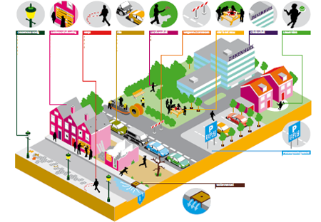

The ISO/OGC standard [Observations and Measurements](http://www.opengeospatial.org/standards/om) (O&M) provides a model for the exchange of information about sensor observations. 
It’s a rather concise and abstract model and it has always raised questions about how to create a profile in order to use it in practice. 
A framework for this is needed.

Creating a profile involves the definition of an information model that extends the [abstract O&M model](http://portal.opengeospatial.org/files/?artifact_id=41579). 
O&M is defined in UML. 
In addition, there is an XML-based exchange format, the [O&M GML encoding](http://portal.opengeospatial.org/files/?artifact_id=41510), a [JSON implementation](https://portal.opengeospatial.org/files/64910), and a linked data based ontology called [Semantic Sensor Network ontology](https://www.w3.org/TR/vocab-ssn/). 
All of these may play a role in the framework, but the central question of this MSc topic is how to create a working O&M profile.

A practical case for the study could be the [Base Registry Underground](https://www.basisregistratieondergrond.nl), which will contain a lot of sensor data such as groundwater measurements and soil quality observations. 

This project is done in cooperation with [Geonovum](https://www.geonovum.nl/), the govermental organisation responsible for developing geo-standards.

*Contacts:* [Linda van den Brink](l.vandenbrink@geonovum.nl) and [Jantien Stoter](http://3d.bk.tudelft.nl/jstoter)

- - -

## Linked data: Extend CityJSON with machine-readable semantics

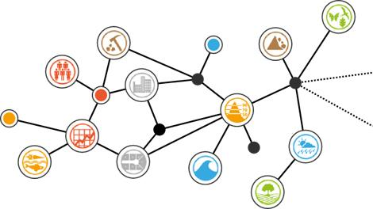

[CityJSON](http://www.cityjson.org) is based on JavaScript Object Notation, a lightweight data-interchange format primarily used on the Web. 
However, JSON is just syntax, without any machine-readable knowledge about the meaning (semantics) of the data. Currently, the only way to figure out what the data in a CityJSON file means (e.g. what is a building?) is to read the [CityGML](https://www.citygml.org) specification (assuming you know where to find it), something only humans can do. 

The aim of this MSc project is to find out how to encode the meaning of CityJSON files in a machine-readable way, directly embedded or linked in the JSON document, and to discover what benefits (or disadvantages) this would bring. This could be done by creating a vocabulary which describes the keys that can be used in CityJSON, basically a CityGML vocabulary or (simple) ontology; and using [JSON-LD](https://json-ld.org/) to map the keys in CityJSON to this vocabulary. 

The "LD" in JSON-LD stands for "[linked data](https://www.w3.org/wiki/LinkedData)". 
Once CityJSON-LD is created, we effectively have a lightweight linked data format for CityGML. 
But this is not a benefit in itself. 
The project would go on to explore the advantages and disadvantages of working with CityJSON-LD, as opposed to just CityJSON.

This project is done in cooperation with [Geonovum](https://www.geonovum.nl/), the govermental organisation responsible for developing geo-standards.

*Contacts:* [Linda van den Brink](l.vandenbrink@geonovum.nl) and [Jantien Stoter](http://3d.bk.tudelft.nl/jstoter)

- - -

## 3D city model to BIM to 3D city model

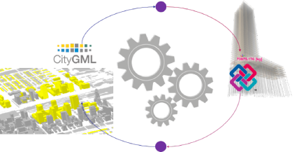

The interoperability of 3D city models (in [CityGML](https://www.citygml.org)) and detailed building information models (BIM in [IFC](http://www.buildingsmart-tech.org/specifications/ifc-overview)), has a lot of potential but there are several unresolved problems.
Many software tools exist to manage CityGML and IFC data. The aim of this project is to design and test workflows for conversions from CityGML to IFC and vice versa without loss of quality of the data (in geometry or semantics), through existing software’s import and export functions.

*Contacts:* [Francesca Noardo](https://3d.bk.tudelft.nl/fnoardo/), [Ken Arroyo Ohori](http://tudelft.nl/kenohori) and [Jantien Stoter](http://3d.bk.tudelft.nl/jstoter)

- - -
## Integrated 3D geo-information for Building permissions issuing

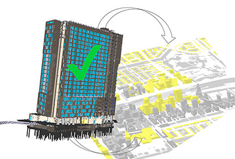

The aim of the project is to design a platform for automatically checking building information models (BIM) against city regulations. Through analysing the requirements and needs for building permissions (in Europe), the characteristics of the needed information must be established. Procedures, tools and methodologies need to be defined to automatically check a building design against spatial regulations (especially height regulations).

*Contacts:* [Francesca Noardo](https://3d.bk.tudelft.nl/fnoardo/), [Ken Arroyo Ohori](http://tudelft.nl/kenohori) and [Jantien Stoter](http://3d.bk.tudelft.nl/jstoter)

- - -

## Flat roofs

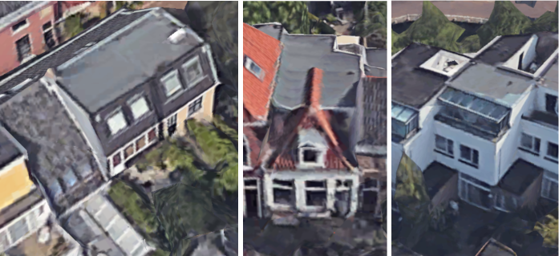 

Several applications require information about the geometry of a building's roof, particularly whether it is flat or not. In theory this information can be derived from a point cloud. But deciding if a roof is flat is not always straightforward, and different domains have different definitions for *flat*. Think about calculating water runoff, or finding roofs with a potential terraces. Thus better if we can say something about the area of the flat surface in a roof, if there is any.

The aim of this MSc project is to develop a method for computing the area of the flat surface in a roof from a point cloud, and identify whether the roof has structure that consists of multiple levels. Additionally, the work can be extended to modelling multi-level roofs (aka. [LoD1.3](http://doi.org/10.1016/j.compenvurbsys.2016.04.005)). Ultimately, to goal is to incorporate such a method in [3dfier](https://github.com/tudelft3d/3dfier) and it should therefore be computationally efficient.

Knowledge of a programming language like python is required. You should also be comfortable with, or at least have the strong desire to learn some statistics.

The topic is done in collaboration with Rijkswaterstaat.

*Contacts:* [Balázs Dukai](https://3d.bk.tudelft.nl/bdukai/) and [Ravi Peters](https://3d.bk.tudelft.nl/rypeters/)

- - -

## Develop a framework to handle massive CityJSON files

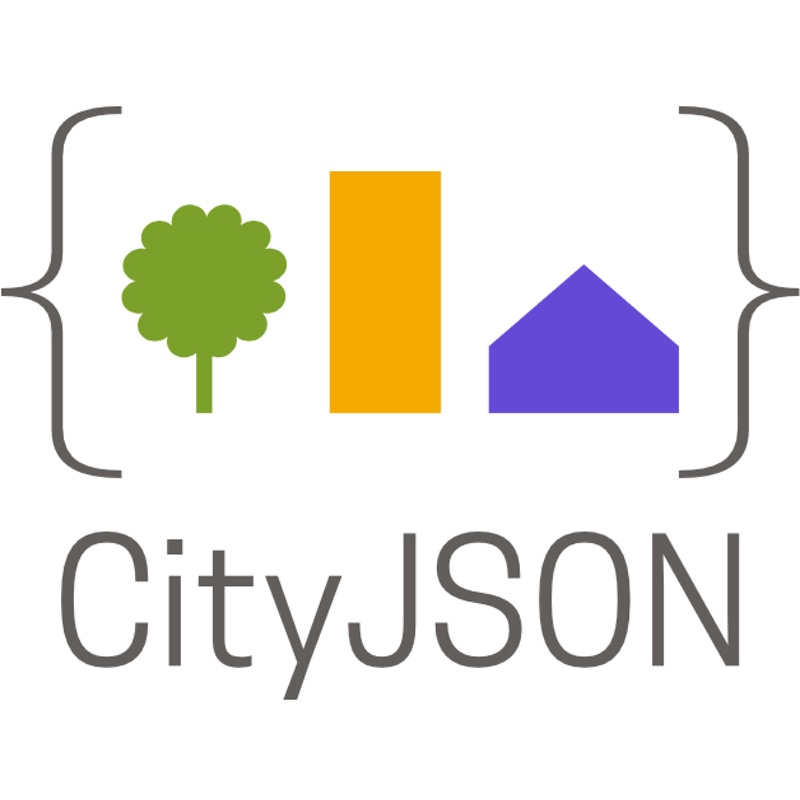

As an alternative format for the [CityGML](https://www.citygml.org) data model, we have recently developed [CityJSON](http://www.cityjson.org), it uses [JavaScript Object Notation](http://json.org).
The aim of CityJSON is to offer an alternative to the GML encoding of CityGML, which can be verbose and complex (and thus rather frustrating to work with).
CityJSON aims at being easy-to-use, both for reading datasets, and for creating them.
It was designed with programmers in mind, so that tools and APIs supporting it can be quickly built.

While a CityJSON file is [about 7X compacter](https://github.com/tudelft3d/cityjson/wiki/Compression-factor-for-a-few-open-CityGML-datasets) than the equivalent CityGML file, very large areas (like the [whole of city of Berlin](https://www.businesslocationcenter.de/en/downloadportal)) are still problematic.

The aim of this MSc project is to design a framework to deal with such massive CityJSON files.
The potential solution is to design a tiling scheme, and find a way to make it work with a web-based viewer, eg [Cesium](https://cesiumjs.org/) or [three.js](https://threejs.org/).
There is an emerging standard about the tiling of 3D GIS datasets ([3D Tiles](https://github.com/AnalyticalGraphicsInc/3d-tiles)), which should probably be reused/modified.

Knowledge of Python and of web technologies (javascript; although that can be learned with the project) is enough.

*Contacts:* [Hugo Ledoux](http://tudelft.nl/hledoux) and [Stelios Vitalis](mailto:s.vitalis@tudelft.nl)

- - -

## Develop a Blender addon with a complete set of tools for CityJSON files

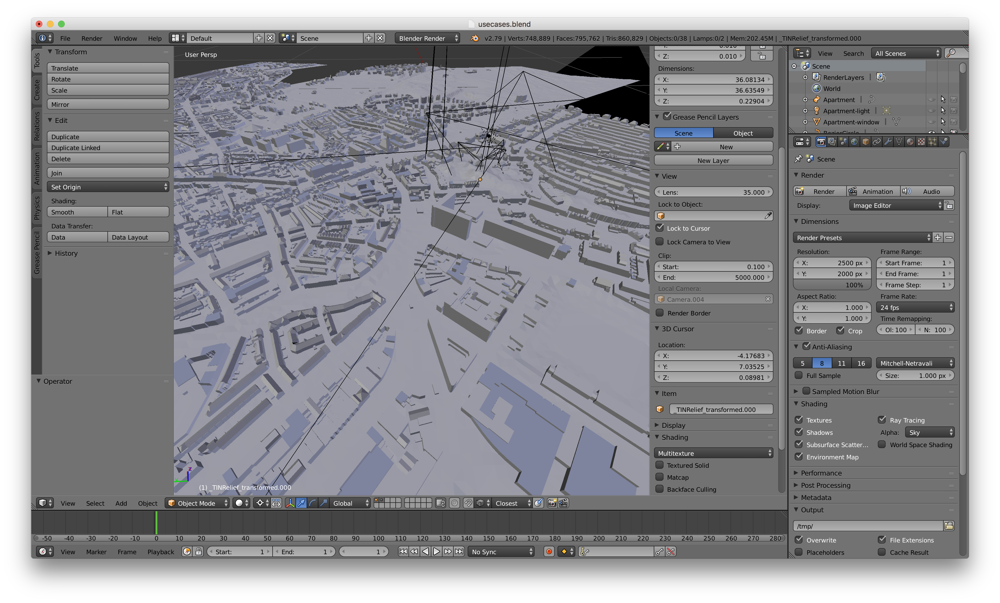{:width="500px"}

[Blender](https://www.blender.org/) is a 3D modelling tool with the ability to be extended through the Python programming language. 
Through the [BlenderGIS](https://github.com/domlysz/BlenderGIS) addon it can incorporate GIS functionality for the manipulation of 3D geospatial datasets.

The aim of this MSc project is to create an addon that adds the ability in Blender to import/export and manipulate all aspects of a 3D city model in [CityJSON format](http://www.cityjson.org). 
The addon should be able to:

* Import/export CityJSON files
* Incorporate the tools of [cjio](https://github.com/tudelft3d/cjio) for validation and reporting of the data
* Allow editing of the city object semantic information, including geometric constraints according to [ISO 19107](http://geovalidation.bk.tudelft.nl/val3dity/docs/definitions/)
* Provide searching functionality for the city objects

Knowledge of Python is enough.

*Contacts:* [Stelios Vitalis](mailto:s.vitalis@tudelft.nl) and [Hugo Ledoux](http://tudelft.nl/hledoux)

- - -

## Extraction of characteristics of buildings from aerial imagery

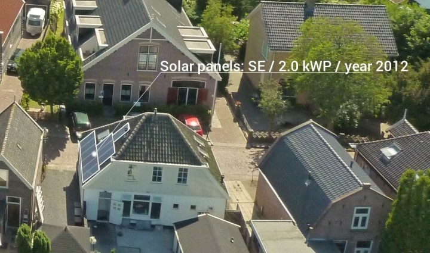{:width="350px"}

This project is done in cooperation with [Readaar](http://www.readaar.com).
Readaar was founded in 2016 and extracts all kind of information from aerial imagery.
To do this they combine remote sensing with machine learning.

Readaar has already developed a method to generate point clouds and 3D building models from stereo imagery.
The next step is to translate this into useful insights like:

  - how many solar panels can we fit on the roof,
  - what is the roof type,
  - how many floors does the building have.

The focus of the student within this project will be on using the datasets to develop methods that extract (data mining) the insights that Readaar's customers want to have.

[More information is found there.](http://jobs.readaar.com/blog/internship-datamining-on-aerial-imagery)

*Contact:* [Hugo Ledoux](http://tudelft.nl/hledoux) + [Sven Briels](mailto:svenbriels@readaar.com)

- - -

## Interoperability between BIM IFC & BEM gbXML

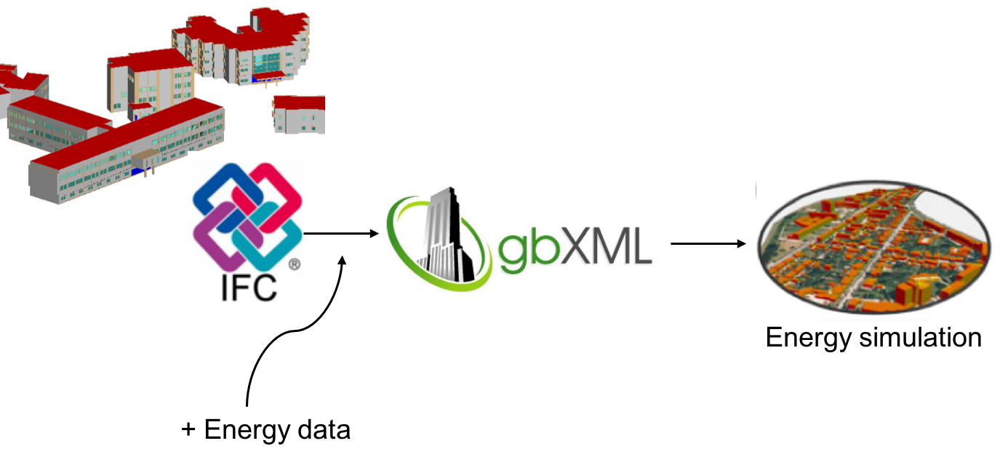{:width="400px"}

The aim of the project is to investigate the interoperability between two popular standards in the BIM (Building Information Modelling) and BEM (Building Energy Modelling) domains: [IFC](https://www.buildingsmart.org/about/what-is-openbim/ifc-introduction/) and [gbXML](http://www.gbxml.org). The goal is to compare and identify the schematic mapping between these two standards and develop a (Python/C++) prototype based on these mappings for data conversion. Real world gbXML datasets are to be generated for testing in gbXML energy simulations using tools such as EnergyPlus, Revit or IES.

Prior knowledge of programming in Python or C++ is required.

*Contact:* [Kavisha](http://3d.bk.tudelft.nl/kavisha), [Francesca Noardo](https://3d.bk.tudelft.nl/fnoardo/) and [Hugo Ledoux](http://tudelft.nl/hledoux)

## Level of Detail of Roads in CityGML

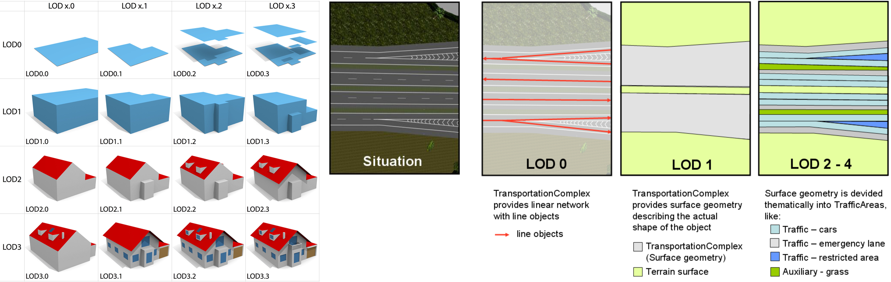{:width="800px"}

Road networks are utilised within a wide range of applications for navigation, city planning, and visibility analysis. There is a growing need for road networks within 3D city models for cases such as autonomous vehicle routing and road maintenance and repair. At the same time, while the concept of Levels of Detail (LoD) for buildings in CityGML has been extensively studied, this is not the case for roads. This project will examine a multitude of road standards, in both 2D and 3D, to refine and enhance the concept of LoDs for roads. A road network at various levels will then be created (with procedural modelling utilising ESRI CityEngine if there is interest) to test within an application of the student’s choice.

*Contact:* [Anna Labetski](http://3d.bk.tudelft.nl/alabetski) and [Hugo Ledoux](http://tudelft.nl/hledoux)

- - -

## Handling massive 3D data using NoSQL databases

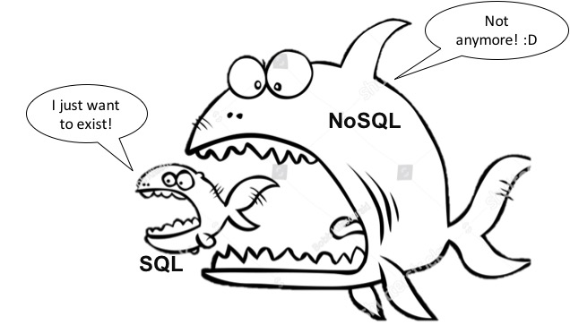{:width="400px"}

The project is about exploring NoSQL databases for storing massive 3D data. The main test dataset is the TIN generated from national elevation model of the Netherlands (AHN3) with a point density of over 10 points/m2. Several data structures have been proposed for the representation and storage of TINs in memory and in databases. A few of those data structures ([here](https://www.int-arch-photogramm-remote-sens-spatial-inf-sci.net/XLI-B2/123/2016/)) are to be tested with the generated TIN models to account for their geometry, topology, storage, indexing, and loading times in a NoSQL database and compare the results with already available results of testing with Postgres/PostGIS database to analyse the performance of NoSql vs. SQL databases.

Prior knowledge of databases and programming in Python or C++ is required.

*Contact:* [Kavisha](http://3d.bk.tudelft.nl/kavisha) and [Hugo Ledoux](http://tudelft.nl/hledoux)

- - -

## 3D breakline extraction from point clouds

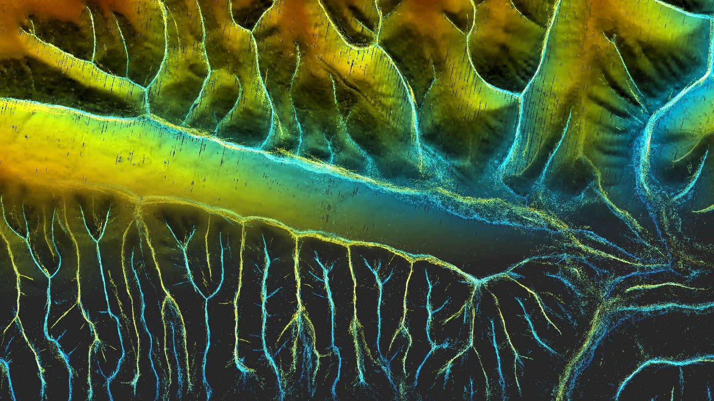{:width="400px"}

Point clouds, unstructured collections of 3D points in space, are nowadays collected with different acquisition methods, eg photogrammetry and LiDAR, and contain a wealth of information on both natural and man-made structures.

The aim of this project is to extract 3D breaklines directly from a point cloud such as the national AHN3.
Breaklines indicate discontinuities in a terrain (such as the ridges in a mountain) and are needed for applications such as flood simulations and noise simulations.

As a starting point the [3D medial-axis transform (MAT)](https://3d.bk.tudelft.nl/projects/3dsm/) can be used (used to generate the image above).

Prior knowledge of programming in Python or C++ is required.

*Contacts:* [Ravi Peters](http://tudelft.nl/rypeters) and [Hugo Ledoux](http://tudelft.nl/hledoux)

- - -

## Point cloud normal estimation based on the 3D medial axis transform

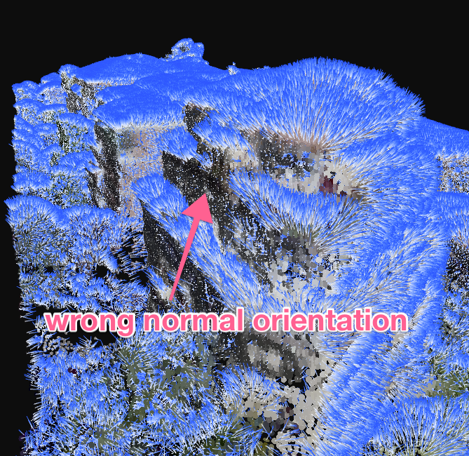{:width="400px"}

Point clouds, unstructured collections of 3D points in space, are nowadays collected with different acquisition methods, eg photogrammetry and LiDAR.
While current point clouds are dense and offer an accurate representation of real-world objects and landscapes, they lack structure and semantics.

The aim of this project is to properly *orient* a point cloud, ie to find an approximation of the normal at each point; this normal should point outwards.
Surface normals are essential for different processing of a point cloud, eg visualisation, shadow analysis or segmentation.

"Standard" methods, eg [that function in PCL](http://pointclouds.org/documentation/tutorials/normal_estimation.php), usually find the nearest points of a given point, fit a plane, and choose between the 2 possible normals (up or down) based on a viewpoint.
The problem is that in practice, eg with the [AHN3 dataset](http://www.ahn.nl), we do not have that information.

The topic involved building on our work with the [3D medial-axis transform (MAT)](https://3d.bk.tudelft.nl/projects/3dsm/) and use the 3D MAT of a point cloud as a base to obtain high quality normals with a proper orientation.

It is possible to use Python for this project, although some knowledge of C++ would surely help.

*Contacts:* [Ravi Peters](http://tudelft.nl/rypeters) and [Hugo Ledoux](http://tudelft.nl/hledoux)

- - -

## Improvements (trees, bridges, viaducs) to 3dfier

{:width="600px"}

We have developed a software, [3dfier](https://github.com/tudelft3d/3dfier), to automatically construct 3D city models from 2D GIS datasets (e.g. topographical datasets) and LiDAR/pointcloud datasets.
The software creates a 3D model by lifting every polygon to 3D, and the semantics of every polygon is used to perform the lifting.
That is, water polygons are extruded to horizontal polygons, buildings to LOD1 blocks, roads as smooth surfaces, etc. Every polygon is triangulated (constrained Delaunay triangulation) and the lifted polygons are "stitched" together so that one digital surface model (DSM) is constructed.
Our aim is to obtain one DSM that is error-free, i.e. no intersecting triangles, no holes (the surface is watertight), where buildings are integrated in the surface, etc.

The aim of this MSc project is to further develop some lacking features of 3dfier, it could be one of the following:

  1. adding 3D representation of trees by *iconisation*, ie by inserting a parametric template that has the general shape/dimension of a tree. This implies automatically finding this, and a good start is the methodology described in [this paper (Section 4.2)](https://infoscience.epfl.ch/record/206788/files/paper.pdf)
  2. adding bridges and other man-made structures (such as viaducs) by first modelling them with [Esri CityEngine](http://www.esri.com/software/cityengine) and then "stitching" them to the 3D model.

These topics can be done with Python as a post-processing of 3dfier.

*Contacts:* [Hugo Ledoux](http://tudelft.nl/hledoux) and [Tom Commandeur](mailto:t.j.f.commandeur@tudelft.nl)

- - -

## Smart weather data filtering using a 3D city model

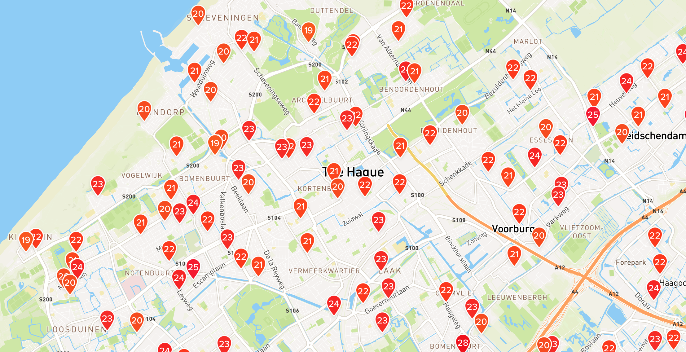

[Netatmo](https://www.netatmo.com/) sells low-cost personal weather stations that anyone can buy, and so there are now close to [1000 stations](https://weathermap.netatmo.com) in The Hague, Delft and the surrounding areas! By default, Netatmo owners share their data publicly, but like all crowdsourced datasets, it is all quite messy. The stations' locations are only roughly known, some outdoor modules are in the sunlight (at certain times), have different exposure to the wind, etc.

The aim of the project is to *improve the dataset by using the 3D model of The Hague to filter the data in a smart way*. For instance, maybe we can find out if some of the stations are not located in the places where they say they are, or maybe some of the stations' readings are reliable only during certain periods of the day due to the sunlight hitting them directly.

For this project, the student should be able to program well enough to read a CityGML model and to do analyses with geometric operations (such as casting shadows). C++ programming would be ideal but any other language should be good enough.

*Contact:* [Ken Arroyo Ohori](http://tudelft.nl/kenohori) or Alexander Wandl

- - -

## 3D visualization of massive TINs

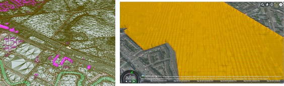{:width="400px"}

Visualization is an important and complex issue in the context of 3D city models. The enormous amount of data to be fetched, the heterogeneity of data sources, and the complexity of rendering are only a few parts of this challenge. The project aims at investigating 3D tiling schemes for efficiently visualizing massive TINs using [Cesium](https://cesiumjs.org) 3D webglobe.
The knowledge of programming in C++ is required.

*Contact:* [Kavisha](http://3d.bk.tudelft.nl/kavisha) and [Hugo Ledoux](http://tudelft.nl/hledoux)

- - -

## Semantic Feature Matching

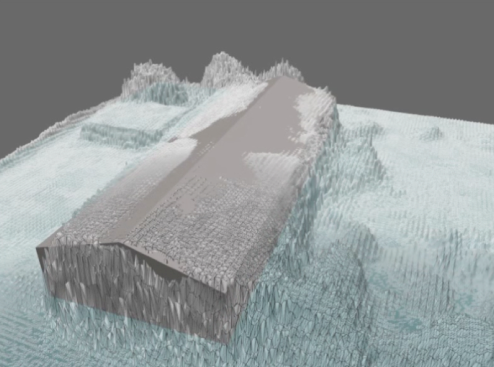{:width="400px"}

For large parts of the world, the available 3D geoinformation is limited, outdated or inaccurate. To cost-effectively obtain an up to date and high-resolution 3D (urban) environment model, automated 3D reconstruction techniques need to be applied on raw elevation and imagery sensor data, in order to find which features (vegetation, buildings, etc.) are present in the terrain and the representation of the relevant feature properties (tree species, roof type). Semantic model based feature matching is a reconstruction approach where a priori knowledge on the environment is used to represent and constrain a search space of possible feature models that can be found in the terrain.

The key in this research is to devise semantic model representations and search algorithms that explore the search space and find instances of the semantic feature model that best match the available sensor data. The project will focus on encoding and using object relations (e.g. between a building and adjacent street) in semantic feature models to improve the correctness of the matches. The project is carried out in co-operation with [TNO in The Hague](https://www.tno.nl/nl/), where these techniques are applied in the field of gaming and simulation.

*Contact:* [Jantien Stoter](http://3d.bk.tudelft.nl/jstoter)

- - -

## DTM Filtering for Photogrammetric DSM’s

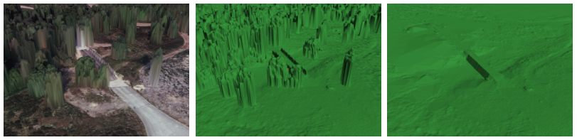{:width="700px"}

Although laser point clouds have become a common data resource for world modelling, photogrammetrically derived digital surface models are still widely used as the basis for a terrain modelling work flow. With current high resolution camera systems, highly detailed Digital Surface Models (DSM) can be obtained. Digital Terrain Model (DTM) filtering is used to remove features from the DSM and obtain a ground level elevation model. Although DTM filtering is a very basic step in terrain modelling, it is still a challenging task. One of the difficulties is the filtering of forested areas in hilly terrain, but also rough terrain is often not a trivial case.

This research will aim at finding improved filtering and interpolation techniques to resolve the difficulties in DTM filtering for photogrammetrically derived DSM’s. The project is carried out in co-operation with [TNO in The Hague](https://www.tno.nl/nl/), where these techniques are applied in the field of gaming and simulation.

*Contact:* [Jantien Stoter](http://3d.bk.tudelft.nl/jstoter)

- - -

## Automatic generalisation of depth contours

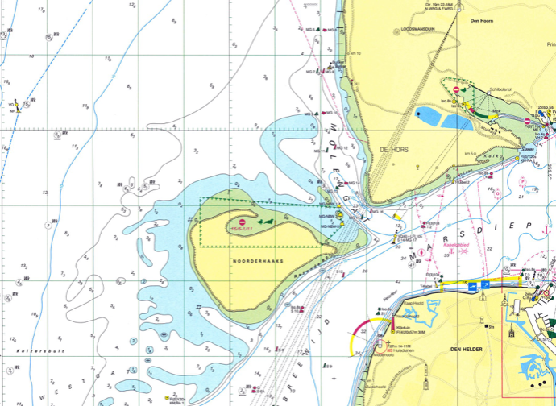{:width="500px"}

For some years, we have been working on a novel method to automatically generate "good" depth-contours for hydrographic charts.
Our latest results, based on the [MSc thesis of Ravi Peters](http://repository.tudelft.nl/view/ir/uuid%3A5977a99b-0875-44b4-abe1-09288bf2aed1/) and published in that [paper](https://3d.bk.tudelft.nl/hledoux/pdfs/14_marinegeo.pdf), have been picked up by major companies who are implementing it.

The aim of the proposed project is to improve the results.
That is, we can at this moment generate smooth contours for most seabed types, but the generation is applied for the whole dataset and a human must decide when the results are okay.
The student would have to focus on automatically applying the algorithms only where they are needed and design methods to assess when sufficiently good results have been achieved.

The [code of the project](https://github.com/Ylannl/Surfonoi) is in C++, but probably possible to make do with Python.

*Contacts:* [Hugo Ledoux](http://tudelft.nl/hledoux) and [Ravi Peters](http://tudelft.nl/rypeters)

- - -

## Snap rounding in a triangulation

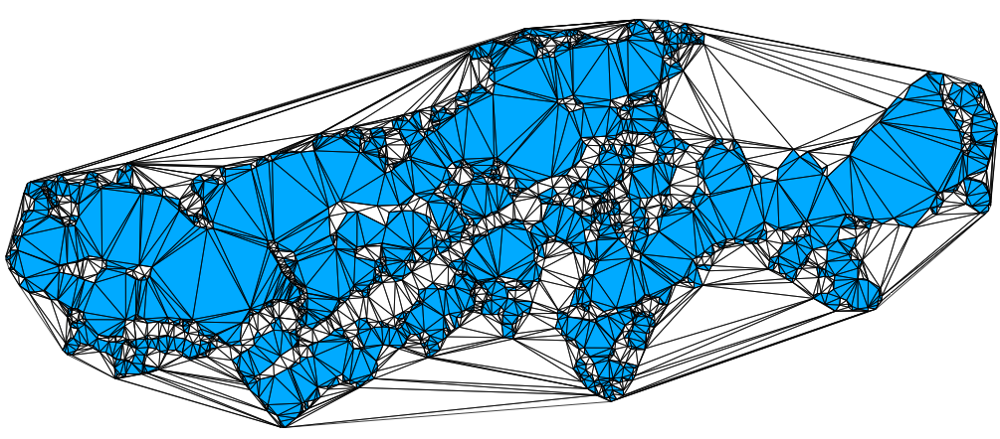{:width="500px"}

The most common way to do edge-matching or to clean small inconsistencies within and between datasets is to apply snapping (point-to-point or point-to-line).
However, simple snapping creates many problems, including topological changes and inconsistencies.
Snap rounding extends this method in order to give robustness guarantees, but current implementations, such as [the one in CGAL](http://doc.cgal.org/latest/Snap_rounding_2/index.html), are *extremely* slow.
Related to this, in the project [pprepair](https://github.com/tudelft3d/pprepair), we have previously used a constrained triangulation as a robust method to repair polygons and planar partitions.
Using this approach topological errors are automatically fixed.
We therefore believe that using a triangulation as a base structure is an intuitive and efficient way to optimize snap rounding, since we can perform simple snapping and recover from topological errors afterwards.

The existing prototype ([pprepair](https://github.com/tudelft3d/pprepair) that needs to be extended has been developed in C++, thus the knowledge of C++---or a strong desire to learn it---is necessary.

*Contact:* [Ken Arroyo Ohori](http://tudelft.nl/kenohori)

- - -

## Line of sight (visibility) and raytracing analyses on a point cloud dataset

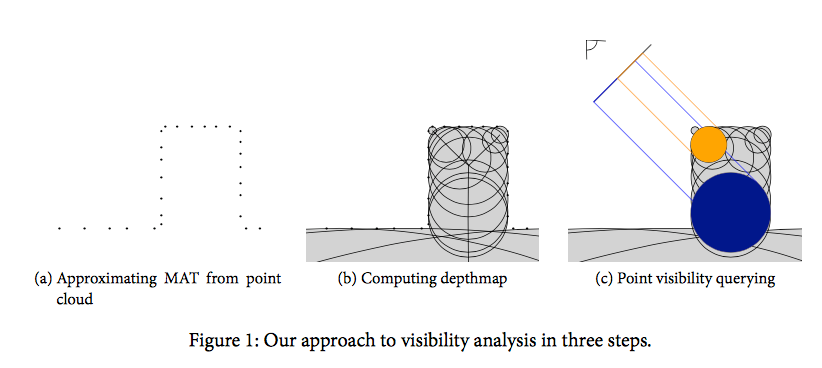{:width="600px"}

Calculating the visibility between two points using 3D city models provides valuable input to many application domains, such as solar analyses (shadowing) and finding the optimal place to install a surveillance camera or a billboard. This list is growing, e.g. a potential application could be to estimate the visibility of an urban canyon from a satellite.

We have developed a 3D skeleton-based approach (part of that [research project](https://3d.bk.tudelft.nl/projects/3dsm/)) ([PDF here](https://3d.bk.tudelft.nl/hledoux/pdfs/15_udmv_visibility.pdf)) that would be the start of the project.

Knowledge of Python and FME is sufficient.

*Contacts:* [Ravi Peters](http://tudelft.nl/rypeters) and [Hugo Ledoux](http://tudelft.nl/hledoux)

- - -

## Structure-aware Urban Model Simplification

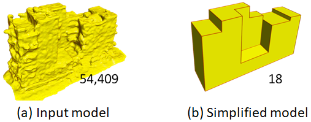

With the advances of data acquisition technologies, point clouds of urban scenes can be easily captured by various means (e.g., laser scanners, drones, and various cameras). With such data, it is possible to automatically and quickly reconstruct 3D models of urban buildings (e.g., the 3D models in Google Earth). Though such models admittedly look great with textures, they cannot be used in several applications due to the imperfections and complexity of the models (i.e., gigantic meshes, missing regions, noise, and undesired structures).

The aim of this project is to develop algorithms and tools to convert the dense triangular mesh models to lightweight polygonal models by assuming the building surface is piecewise planar. We consider a method to be effective to this problem if it meets the following requirements
-	The simplified model should reliably approximate the initial model,
-	The simplified model is an oriented 2-manifold (i.e., physically valid),
-	The method should not closely follow surface details due to imperfections (i.e., noise, outliers, and missing data) being simplified to recover sharp features of the building,
-	(optional) It would be nice to provide a way to control the detail levels of the model, by introducing an extra parameter.

**Required Skills**: Proficient in one programming language (e.g., C/C++, Python, Java); experiences in CGAL and Numerical Optimization is a bonus.

**Contact**: [Liangliang Nan](https://3d.bk.tudelft.nl/liangliang/)

- - -

## Repairing 3D Urban Models

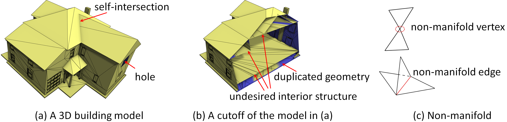

Nowadays the number of 3D building models are increasing explosively (e.g., the 3D models in Google Earth). These models can be easily obtained by applying state-of-the-art modeling/reconstruction techniques, or by manual creation using various software packages. It is quite common to observe errors and imperfections in these models, like gaps, holes, self-intersections, duplicated geometry (e.g., double walls), T-junctions, degeneracies, non-manifold (e.g., more than two polygons meeting at the same edge), etc. Unfortunately, most applications, such as physical-based simulation, digital fabrication (e.g., 3D printing), intelligent model editing tools, can only accept clean surface models as input, which restricts the existing models mainly to visualization purpose. It becomes extremely difficult to eliminate these flaws when a certain combination of them are present. Thus, the restoration of these 3D models remains an open problem.

In this project, we would like to develop robust algorithms and tools for automatic restoration and cleaning of the models. We would expect our method to produce a closed surface representation of a building that partitions the space into disjoint internal and external half spaces without ambiguities.

**Required Skills**: Proficient in one programming language (e.g., C/C++, Python, Java); experiences in mesh processing, machine learning (in particular Deep Learning) is a bonus.

**Contact**: [Liangliang Nan](https://3d.bk.tudelft.nl/liangliang/)

- - -

## Coupling 3D city models with Ladybug tools for environmental analyses

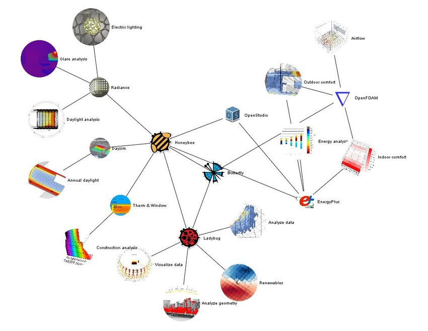

The MSc thesis will focus on interoperability between the Ladybug tools and CityGML-based 3D city models. The [Ladybug Tools](https://www.ladybug.tools/) are a collection of free applications that support environmental design and education. They are among the most comprehensive, connecting 3D Computer-Aided Design (CAD) interfaces to a host of validated simulation engines.

Particular attention will be paid to energy-related topics in order verify how and to which extent the CityGML [Energy ADE](http://www.citygmlwiki.org/index.php/CityGML_Energy_ADE) (Application Domain Extension) can be used to deliver and store additional energy-related data needed by the Ladybug tools.

The students’ task will consist in choosing (together with the supervisors) a specific application covered by a Ladybug tool, to analyse the software and data requirements of the selected Ladybug  tool(s) and to perform a mapping to the CityGML/Energy ADE data model. In addition, proper interfaces will have to be developed and tested by means of a concrete case study.
This topic is available for up to **two students** (each one choosing a different application area).

Prerequisites: Knowledge of CityGML and its ADE mechanism. A bonus is experience with the CityGML 3D City Database and the associated tools. A programming language of choice (e.g. Java or Python) will be used.

**Contact**: [Giorgio Agugiaro](https://3d.bk.tudelft.nl/gagugiaro/) and [Jantien Stoter](https://3d.bk.tudelft.nl/jstoter/)

- - -

## Interaction between urban heat islands and semantic 3D city models

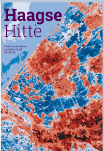

This summer was exceptionally hot and the Netherlands suffered two consecutive heat waves, which had severe negative impacts on human health and the urban environment caused by drought. The department of Urbanism is running Netatmo weather station network with more than 100 stations all across the city of the Hague. This means there is a rich data set which allows to study the formation of the **urban heat islands** in relation to the direct, local built environment around these sensors.

The MSc thesis will focus on investigating how a semantically enriched, CityGML-based **3D city model** can help in understanding and forecasting urban heat islands. Additionally, based on a real case study, the 3D city model will be used to analyse qualitatively and quantitatively how certain physical urban conditions can contribute to (reducing) the heat island effect.

This MSc thesis will be jointly supervised by the 3D Geoinformation group and the group of Environmental Technology and Design.

**Contact**: [Giorgio Agugiaro](https://3d.bk.tudelft.nl/gagugiaro/) and Alexander Wandl

- - -

## Urban metabolism and semantic 3D city models

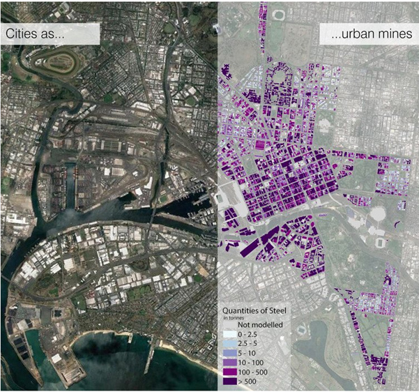

This thesis topic is connected to the Horizon 2020 Research Project REPAiR: Resource management in peri-urban areas, going beyond urban metabolism. The project has developed a 2D urban mining model of the Amsterdam metropolitan area.

The MSc thesis will focus on defining and implementing a 3D “urban mining” model which will help to investigate and quantitatively describe where, when, and how many critical materials can be obtained (“extracted”) from existing, ageing cities/neighbourhoods in order to be directly reused or recycled in the context of circular economy. A CityGML-based 3D city model of a real case study area will represent the main source of integrated spatial and non-spatial information the 3D urban mining model will be implemented onto.

This MSc thesis will be jointly supervised by the 3D Geoinformation group and the group of Environmental Technology and Design.

**Contact**: [Giorgio Agugiaro](https://3d.bk.tudelft.nl/gagugiaro/) and Alexander Wandl

- - -

## Integrated modelling of utility networks in the urban environment

In the framework of Smart Cities, the MSc thesis will focus on interoperability issues when it comes the heterogeneous utility networks (e.g. gas, water, electricity, sewage, district heating, telecommunications, etc.) that are found in the urban environment.
Starting from a CityGML-based 3D city model, the Msc. thesis will focus on testing and further extending the Utility Network ADE (Application Domain Extension), based on a concrete case study which will be agreed upon with the student. A possible application area is in the energy sector, e.g. when it comes to coupling networks to specific simulation programs.
The image shown here is taken from the [Msc thesis of Xander van den Duijn](https://repository.tudelft.nl/islandora/object/uuid:fed24b16-cf95-4fa0-a109-ece6e91b61e9?collection=education) (2018) and is an example - and a starting point - of the overall topic of the thesis proposed here.

Prerequisites: Knowledge of CityGML and its ADE mechanism, FME and Enterprise Architect are required. A bonus is experience of the CityGML 3D City Database and the associated tools.

**Contact**: [Giorgio Agugiaro](https://3d.bk.tudelft.nl/gagugiaro/) and [Jantien Stoter](https://3d.bk.tudelft.nl/jstoter/)

