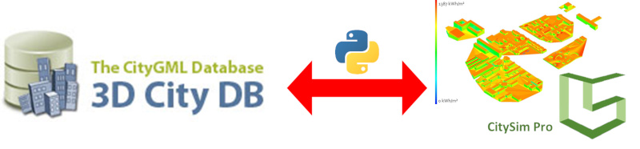
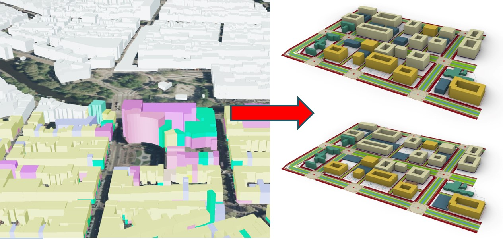
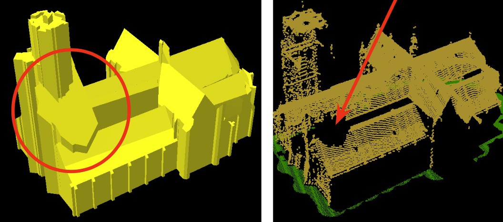
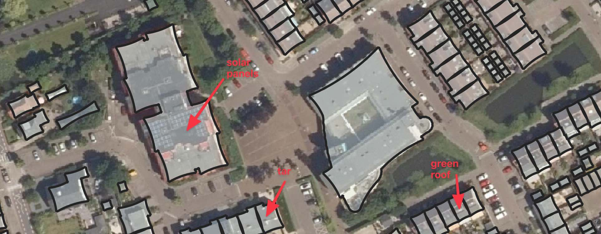
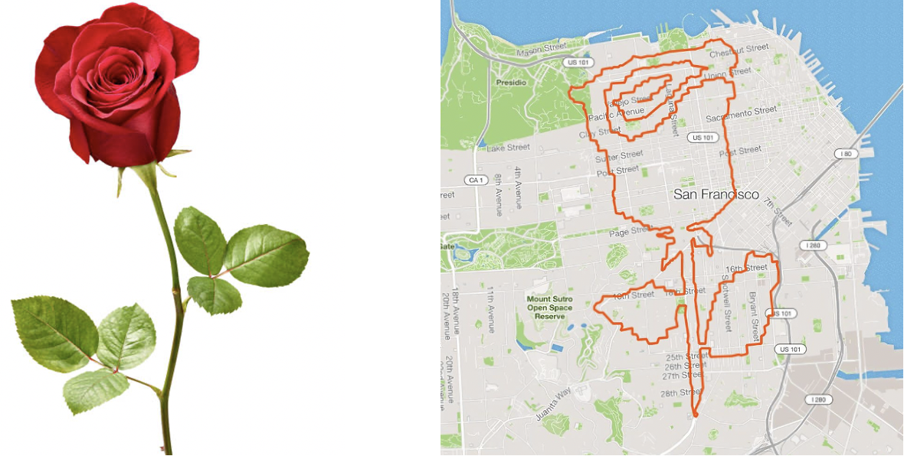
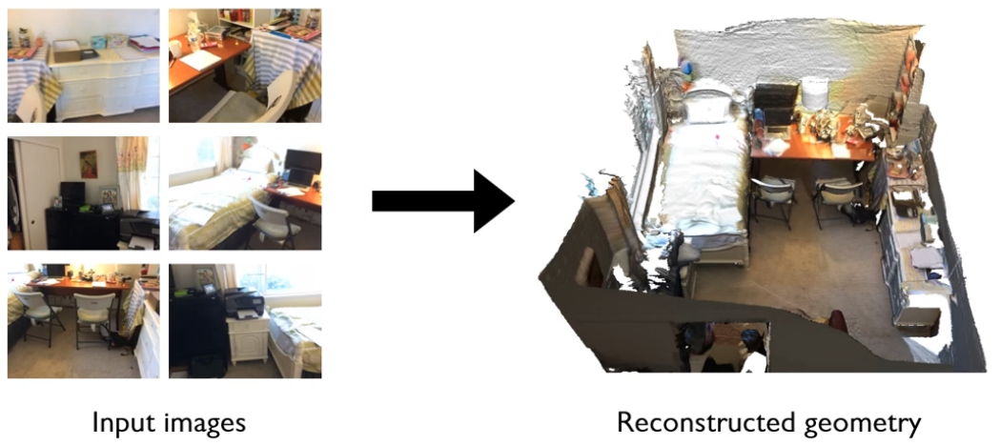

  <b>Heads up!</b> Theses done in our group should follow the <a href="https://3d.bk.tudelft.nl/courses/geo2020/openscience/">requirements for open science</a>.

- - -

* Table of Content
{:toc}

- - -
## Linking Urban Heat Island effects with 3D urban morphology

With the increase in urbanization and gentifrication the Urban Heat Island (UHI) effect is becoming a priority concern for many cities and municipalities. As such several studies have been recently published linking urban morphology and plausible UHI remedies such as green roofs, for example. 

In this MSc thesis we will combine for the first time three sources of data: landsat imagery, city measurements for air temperature and the results from a brand new open-source tool that automatically computes Global Building Morphology Indicators (GBMI). The first goal of the project is to link temperature data and GBMI results and analyse the sensitivity of the different indicators to UHI scenarios in Amsterdam city. The second goal would be to generalize the tool application to other cities with diverse morphology to further analyze its predictability capabilities in relation to UHI effects and potential solutions.

If you choose this topic, you can expect to learn about UHI and urban morphology analysis. Programming experience and interest is an advantage for this topic. Your work might require to implement source code for the analysis of the set-ups (in C++ or Python or any other language you prefer).

{:width="800px"}

**Contact:** [Clara Garcia-Sanchez](https://3d.bk.tudelft.nl/gsclara), [Lukas Beuster](https://3d.bk.tudelft.nl/lbeuster/)

## Coupled and decoupled simulations of urban wind flow for indoor natural ventilation modelling

Urban wind flow is an important factor in the efficiency of the indoor natural ventilation, which is becoming a really essential ventilation strategy under the current pandemic life environment.
To model natural ventilation in buildings, running Computational Fluid Dynamics (CFD) simulations is not so straightforward because two levels of wind flow are present in the computational domain.
Researchers usually rely on decoupled simulations of urban wind flow and indoor ventilation.
This means that the urban wind flow is modelled first and then relevant values near the openings of the studied building are used to later model the indoor ventilation.
However, recently with the increase of computational power, there is a rise in the use of coupled simulations where outdoor and indoor air are modelled together.

{:width="800px"}

In this MSc thesis, we will try to compare the results of the two approaches and try to validate them with an existing case study. The results could show us if there is a need for a more computationally expensive coupled simulation, or if there are available approaches that allow us to represent accurately outdoor conditions by just imposing appropriate boundary conditions. If you choose this topic, you can expect to learn about indoor ventilation, the level of detail needed in the urban area surrounding the building of interest, and validation CFD simulations. Programming experience and interest is an advantage for this topic. Your work will require to implement source code for the analysis of the set-ups (in C++ or Python or any other language you prefer).

**Contact:** [Clara Garcia-Sanchez](https://3d.bk.tudelft.nl/gsclara), [Nadine Hobeika](https://3d.bk.tudelft.nl/nhobeika/)

## (Further) Development and Testing of the Energy Extension for CityJSON (v1.x)

The goal of the thesis is to extend and further improve the current development of the CityJSON Energy Extension. The existing implementation is the result of a MSc Thesis which is schedule to finish in June 2022. The CityJSON extension is expected to support several energy applications as its counterpart the [CityGML Energy ADE](https://opengeospatialdata.springeropen.com/track/pdf/10.1186/s40965-018-0042-y.pdf) does.

{:width="800px"}

It is expected that this implementation will include the development of a software tool to translate the data from the CityJSON and CityGML encoding formats.

Attendance of elective course [GEO5014](https://studiegids.tudelft.nl/a101_displayCourse.do?course_id=52747) in Q5 (September 2022) is highly recommended, as many relevant topics needed for this thesis will be covered.

**Contact:** [Camilo León Sánchez](https://3d.bk.tudelft.nl/cleon/)

## Urban energy simulations linking CitySim with the 3DCityDB 

[CitySim](http://www.kaemco.ch/download.php) is an open-source simulation software to perform different energy simulations for buildings/districts (e.g. space heating energy demand, solar irradiation, urban heat islands). The [3D City Database](https://www.3dcitydb.org/3dcitydb/) (3DCityDB) is the reference database for CityGML data (and its Energy ADE extension) where input AND output data will be stored.
The scope of this thesis is to build upon, test and extend the functionalities of a first prototype developed in a MSc thesis scheduled to finish in June 2022. The goal is to allow for a seamless flow of information and perform energy simulations in CitySim. More specifically, the thesis will focus on (further) developing a Python-based bidirectional interface and add a GUI to feed/retrieve data between the 3DCityDB and CitySim.

{:width="800px"}

The thesis is a collaboration between the 3DGeoinformation group and the [Idiap Research Institute](https://www.idiap.ch/en/scientific-research/energy-informatics/index_html) in Switzerland. Attendance of elective course [GEO5014](https://studiegids.tudelft.nl/a101_displayCourse.do?course_id=60400) in Q5 (September 2022) is highly recommended, as many relevant topics needed for this thesis will be covered.

You will programm in Python and in PL/pgSQL.
Before picking the topic, please contact us!

**Contact:** [Camilo León-Sánchez](https://3d.bk.tudelft.nl/cleon/)

## Using urban morphology to optimize biking and running routes in cities?

RIVM monitoring tool [NSL tool](https://www.nsl-monitoring.nl/), provides information regarding air pollution in streets for the most areas in the Netherlands. The tool uses urban morphology along other parameters to estimate local air quality. 

{:width="400px"}

Within this MSc thesis we will exploit urban morphologies and NSL monitoring to optimize running and biking paths within Netherlands urban areas. For that open source tools such as [momepy](http://docs.momepy.org/en/stable/), and previously developed approaches such as [de Jongh thesis](http://resolver.tudelft.nl/uuid:fdbff288-fede-4796-9972-54627af0db77) (see image attached) will be explored. 

**Contact:** [Clara Garcia-Sanchez](https://3d.bk.tudelft.nl/gsclara), [Hugo Ledoux](https://3d.bk.tudelft.nl/hledoux/)

- - -

## Predicting pedestrian wind comfort and thermal comfort with Large-Eddy Simulations in uDALES

Pedestrian wind and thermal comfort still remain an important topic in the development of future urban scenarios. Considering the current climate change conditions, with increased frequency in heat waves and extreme weather events, the way we design our cities can further impact their resilience and comfort. Computational fluid dynamics (CFD) approaches can help us improving and adapting future and current urban designs to maximize sustainability and comfort. To maximize the predictability capabilities approaches such as Large-Eddy Simulations [LES](https://en.wikipedia.org/wiki/Large_eddy_simulation) can be used to resolve most of the urban scales and model uniquely the small scales. 

{:width="400px"}

Within this MSc thesis we will exploit the capabilities of open-source tools such as [uDALES](https://github.com/uDALES/u-dales) to predict wind and thermal comfort in real urban scenarios. The initial set-up focuses on using part of the Clementi neighbourhood in Singapore, which was already set-up by previous MSc thesis to run RANS simulations in [Opsomer](https://repository.tudelft.nl/islandora/object/uuid%3A97304da6-8938-48eb-8117-ca53321b1e34?collection=education). Considering the demanding computational capabilities required by LES, this area can be potentially reduced, or other test cases can be also explored. Attendance of elective course [GEO5015](https://studiegids.tudelft.nl/a101_displayCourse.do?course_id=57094) in Q4 or similar CFD knowledge is required. 

**Contact:** [Clara Garcia-Sanchez](http://3d.bk.tudelft.nl/gsclara), [Ivan Pađen](http://3d.bk.tudelft.nl/ipaden)

- - -

## Heating energy demand of the Dutch building stock with the help of the 3D BAG 2.0

The [3D BAG 2.0](https://3dbag.nl/en/viewer), a dataset containing LoD2 geometries of buildings of the whole Netherlands, has been recently released by the 3D Geoinformation group. The scope of this thesis is to test the suitability of the 3D BAG to estimate the energy demand of residential buildings. In this thesis, the energy demand computation will be based on the quasi-static energy-balance method and will implemement a Python-based subset of the specifications defined by the recently introduced Dutch norm [NTA8800](https://www.gebouwenergieprestatie.nl/).

{:width="800px"}

The thesis is a collaboration between the 3DGeoinformation group and the [Building Energy Epidemiology](https://www.tudelft.nl/bk/over-faculteit/afdelingen/management-in-the-built-environment/organisatie/leerstoelen/building-energy-epidemiology) group at TU Delft. Attendance of elective course [GEO5014](https://studiegids.tudelft.nl/a101_displayCourse.do?course_id=60400) in Q5 (September 2022) is highly recommended, as many relevant topics needed for this thesis will be covered.

You will programm in Python and (a bit) in PL/pgSQL.
Before picking the topic, please contact us!

**Contact:** [Giorgio Agugiaro](https://3d.bk.tudelft.nl/gagugiaro/) (3D Geoinformation Group), [Paula van den Brom](https://online-learning.tudelft.nl/instructors/paula-van-den-brom/) (Building Energy Epidemiology group)

- - -

## Optimizing building mesh designs for computational fluid dynamics using machine learning 

Since one of the major burdens when performing computational fluid dynamic simulations (CFD) is to set up a good mesh, improving the current capabilities to mesh automatically complex geometries would have a large impact for the computational fluid dynamics community. This task becomes really essential when geometries are complex, such as high resolution level of detail buildings, and severals hundreds of simulations need to be run to quantify uncertainties.  

In this MSc thesis we will apply the automatic meshers available in OpenFOAM (SnappyHexMesh and cfMesh) and combined them with machine learning techniques to improve current mesh set-ups. We will start by simplified geometries with low level of detail, and increase progressively details. The results can potentially help us reducing the amount of time spent designing our city mesh, and thus allow us to perform faster analysis.   

If you work on this topic, you can expect to learn about mesh generation aligned with CFD best practice guidelines, set-ups and flow simulations. Programming experience and interest is an advantage for this topic. Your work will require to implement source code for the analysis of the set-ups (in C++ or Python). 

{:width="400px"}

**Contact:** [Clara García-Sánchez](http://3d.bk.tudelft.nl/gsclara) and [Ivan Pađen](http://3d.bk.tudelft.nl/ipaden)

- - -

## To mesh or not to mesh: immersed boundary methods and porosity in OpenFOAM

One of the major burdens when performing computational fluid dynamic simulations (CFD) is to set up a good mesh. This task becomes really time consuming when geometries are complex, such as high resolution buildings. There are a few strategies to avoid the usage of an explicit mesh, but using immersed boundary methods or porosity definitions which in a very general description allow to construct regular meshes and represent the buildings through forces. 

In this MSc thesis we will apply the already developed immersed boundary method in OpenFOAM-extended and compare it with a porosity approach through several standarzied CFD study cases. The results can potentially help us reducing the number of buildings to be mesh explicitely, and therefore the amount of time spent designing our city mesh.  

If you work on this topic, you can expect to learn about CFD best practice guidelines, set-ups and flow simulations. You will also work with real experimental wind and turbulence data recorded in wind tunnels. Programming experience and interest is an advantage for this topic. Your work will require to implement source code for the analysis of the set-ups (in C++ or Python). 

{:width="800px"}

**Contact:** [Clara García-Sánchez](http://3d.bk.tudelft.nl/gsclara) and [Ivan Pađen](http://3d.bk.tudelft.nl/ipaden).

- - -

## Extension of a GIS-supported design tool for new urban development areas

The thesis builds upon work carried out in previous MSc theses (e.g. [this](http://resolver.tudelft.nl/uuid:844b92d4-aa22-4ae7-b6c3-3b563dd3318e), check out the [video](https://www.youtube.com/watch?v=cPYT5_cFIgw) ) in which a first prototype of a geodata-supported design tool for new urban development areas was created. The tool is coupled with semantic 3D city models as a source of integrated spatial and non-spatial information.
The thesis will focus first on testing the existing tool and will then implement new functionalities. Possible examples are the computation of KPIs for urban analyses, 3D web-based visualisation and interaction interfaces, as well as scenarios management. The precise development focus of the thesis will be agreed upon with the student.

{:width="600px"}

The research will be carried out on a selected case study and in cooperation with the Cross Domain-City of the Future graduation [studio](https://www.tudelft.nl/en/education/programmes/masters/architecture-urbanism-and-building-sciences/msc-architecture-urbanism-and-building-sciences/master-tracks/architecture/programme/studios/city-of-the-future/), which focuses on how to design and develop in an integrated way a transformation area into an attractive future urban environment.

**Contacts:** [Giorgio Agugiaro](https://3d.bk.tudelft.nl/gagugiaro/), [Roberto Cavallo](https://www.tudelft.nl/en/staff/r.cavallo) 

- - -

## Coupling 3D city models with Ladybug tools for environmental analyses

The MSc thesis will focus on interoperability between the Ladybug tools and semantic 3D city models encoded in CityJSON and extended with the Energy ADE. The [Ladybug Tools](https://www.ladybug.tools/) are a collection of free applications that support environmental design and education. They are among the most comprehensive, connecting 3D Computer-Aided Design (CAD) interfaces to a host of validated simulation engines. The thesis builds upon a previous [MSc thesis](https://repository.tudelft.nl/islandora/object/uuid:fb35db7c-9af8-488c-8d0b-263b138d8fd3) completed in 2020.

Particular attention will be paid to energy-related topics in order verify how and to which extent the CityGML [Energy ADE](http://www.citygmlwiki.org/index.php/CityGML_Energy_ADE) (Application Domain Extension) can be used to deliver and store additional energy-related data needed by the Ladybug tools.

The students’ task will consist in choosing (together with the supervisors) a specific application covered by a Ladybug tool, to analyse the software and data requirements of the selected Ladybug tool(s) and to perform a mapping to underlying CityGML/Energy ADE data models. In addition, proper interfaces will have to be developed and tested by means of a concrete case study. This topic is available for up to *two students* (each one choosing a different application area).

**Contact**: [Giorgio Agugiaro](https://3d.bk.tudelft.nl/gagugiaro/) and [Hugo Ledoux](https://3d.bk.tudelft.nl/hledoux/)

- - -

## Semantically enriching the 3D BAG

{:width="400px"}

With the 3D BAG we have LoD2.2 building models for the whole of the Netherlands. Unfortunately the semantics of these models is still very simplistic (only a very basic classification of wall/roof/floor surfaces is present). The goal of this project would be to develop an automatic method to semantically enrich these models by labeling rooftop structures such as chimneys, A/C units and dormers and/or detecting facade elements such as doors and and windows. This is to be achieved by analysing the geometry of the existing 3D BAG models, the source point cloud and/or (oblique) aerial photographs.

Programming required in python/C++.

**Contact:** [Ravi Peters](http://tudelft.nl/rypeters)

- - -

## 3D Cadastre

{:width="700px"}

Since more than 15 years, lots of studies have been done on 3D Cadastre to register multilevel ownership in a transparent and proper way.
In 2016, we realised the first 3D cadastral situation [3D cadastral registration]( https://3d.bk.tudelft.nl/news/2016/03/21/3DKadaster.html) in the Netherlands.
However, there is still a gap between research and practice. In this research you will analyse how a Level of Detail Framework, that defines specifc solutions for specific 3d cadatsre problems may help to close the 3D cadastre research-to-practice gap.
The idea is explained in [this](https://www.fig.net/resources/proceedings/fig_proceedings/fig2020/papers/ts04e/TS04E_stoter_ho_et_al_10503.pdf) short paper

*Contact:* [Jantien](http://3d.bk.tudelft.nl/jstoter) 

- - -

## Integrated modelling of utility networks in the urban environment

In the framework of Smart Cities, the MSc thesis will focus on interoperability issues when it comes the heterogeneous utility networks (e.g. gas, water, electricity, sewage, district heating, telecommunications, etc.) that are found in the urban environment.
Starting from a CityGML-based 3D city model, the Msc. thesis will focus on testing the Utility Network ADE (Application Domain Extension) and compare it to existing or newly proposed standards (IMKL or MUDDI), based on a concrete case study which will be agreed upon with the student. 
The image shown here is taken from a previous [thesis](https://repository.tudelft.nl/islandora/object/uuid:fed24b16-cf95-4fa0-a109-ece6e91b61e9?collection=education) and serves as example - and starting point - of the overall topic of the thesis proposed here.

**Contacts**: [Giorgio Agugiaro](https://3d.bk.tudelft.nl/gagugiaro/) and [Jantien Stoter](https://3d.bk.tudelft.nl/jstoter/)

- - -

## Performance and robustness of software libraries for computational geometry

{:width="500px"}

Software libraries for computational geometry underpin a lot of our research, but an in-depth comparison of how these different software libraries behave in terms of performance and robustness is not available. For example, the feasability of multi-disciplinary use of geometry in BIM/GIS integration and automated thermal analysis of IFC building models is largely shaped by the characteristics of the algorithmns offered in open source libraries such as CGAL and Open CASCADE. This research project is an opportunity to publish something novel, useful and relevant to many disciplines.

*Contact:* [Thomas Krijnen](mail@thomaskrijnen.com)

- - - 

## Something with streaming TINs for massive datasets

{:width="300px"}

The AHN3 dataset contains a lot of points (600+ billions), and while these are useful on their own, some applications would benefit from having a TIN, isocontours, objects extracted from them, etc.

You learned in GEO1015 how to create a Delaunay TIN, and for massive ones the theory about [streaming geometries](https://www.cs.unc.edu/~isenburg/papers/ilss-scdt-06.pdf) was explained.

The aim of this project is to extend the work already done ([sst](https://github.com/hugoledoux/sst/) + one [MSc thesis about simplification](http://resolver.tudelft.nl/uuid:e7df1d5a-8819-40aa-a3d1-1f6d50b8a39e)) and to add new operators useful for practitioners.
Exactly what I am not sure yet, but if you like the challenge of dealing with several billions of points, then we can find a good topic. The main ones are creating grids with interpolation and isolines extraction.

*Contact:* [Hugo Ledoux](https://3d.bk.tudelft.nl/hledoux)

- - - 

## Filling the gaps in aerial point clouds with deep learning

{:width="500px"}

Because of the way they are collected, aerial point cloud datasets acquired with lidar often contain areas with no measurements due to occlusion effects.
This occurs for building façades and other vertical surfaces (e.g., in dormers), but also other surfaces next to tall structures such as a church tower (see right part image above).
The gaps in the datasets are problematic for the processing of point cloud, for instance automatic reconstruction algorithms can fail or output 3D models with several artefacts (see left part image above).

The aim of this research project is to design and implement methods to complete aerial point clouds datasets such as the AHN3 dataset (that is fill those gaps).
The idea is to investigate how new developments in deep learning (specifically [DeepSDF](https://github.com/facebookresearch/DeepSDF), and [ShapeInversion](https://junzhezhang.github.io/projects/ShapeInversion/)) and to adapt it to aerial point clouds.
The focus would be in the first place on buildings, so that their regularity and verticality could be exploited.

The student would be expected to take a machine learning and/or deep learning course as elective.

*Contact:* [Hugo Ledoux](https://3d.bk.tudelft.nl/hledoux) + [Ravi Peters](http://tudelft.nl/rypeters) + [Weixiao Gao](https://3d.bk.tudelft.nl/weixiao/)

- - - 

## Developing methods for edge-matching with customisable heuristics (geometric, topological and semantic)

{:width="300px"}

The methodology will be studied from a use case of Statistics Netherlands (CBS).

CBS is responsible for the bi-annual publication of the land use register (in Dutch: Bestand Bodem Gebruik or BBG).
In this dataset, ground level land use for areas of 1 ha or larger is classified into 20+ land use categories. The area demarcation and classification have, up till now, been done manually. In the manual process CBS uses a combination of aerial imagery and a selection of cadastral topographical maps. 
CBS is developing a new methodology to automatically combine topographical information and other administrative (register-based) datasets (with a manual fine-tuning post-process, if needed).
By overlaying and prioritizing polyline-based planes from a set of different topographical data sources, adding attributes to these areas from administrative data sources, and applying a number of geo-processes, a new set of planar partitions is created. 
These automatically generated planar partitions will inevitably have some differences with the reference (manually coded) BBG year 2017, either in shape or in category. 
The challenge is on developing a method for describing and detecting important categorization and delineation issues, based on deviations from earlier versions of the BBG and developing (semi) automated solutions to solve these issues, in order to minimize the required manual post-processing. This also includes solving gaps, overlaps and disconnections, in the context of the neighboring areas.
There are different heuristics feasible, an important one being the combination size and the nature of the deviating area. In such a heuristic, small differences in size combined with a less important categorization difference (e.g. street and living area) are of less importance than a big difference in size and an important difference (e.g. forest vs living area). 
 
**Contacts:** [Jantien Stoter](https://3d.bk.tudelft.nl/jstoter/) + [Ken Arroyo Ohori](https://3d.bk.tudelft.nl/ken/en/) + someone at [CBS](https://www.cbs.nl/en-gb)

- - - 

## Enrich the 3DBAG with the "material type" for each surface

{:width="500px"}

The [3D BAG](https://3dbag.nl) contains the geometry of all buildings in the Netherlands, and some attributes are attached to these.

To increase the usefulness of the datasets, it would be useful if the *material* of each surface was known. 
For instance: (1) architects and spatial planners would like to know if a roof/surface is made of bricks, tar, green/vegetation, solar panels; (2) engineers working with CFD simulations have similar needs, the type can help better simulation the wind in a city.

The aim of this project is to enrich the surfaces of the 3D BAG with certain material types (what these are will need to be determined) by using [aerial photos openly available on PDOK](https://www.pdok.nl/introductie/-/article/luchtfoto-pdok), [street-view photos (of Amsterdam, which are openly available)](https://amsterdam.github.io/projects/open-panorama/), and/or the AHN3 properties (eg # of returns, intensity, etc.) to obtain the results. 
One issue is that the aerial photos are nadir photos, and the façades are often not visible; the project will try to solve this with perhaps other datasets or by using solely AHN3.

I assume that since it's a classification problem, machine learning will be used.

*Contact:* [Hugo Ledoux](https://3d.bk.tudelft.nl/hledoux) & [Lukas Beuster](https://3d.bk.tudelft.nl/lbeuster)

---

## Update 3D BAG from different point clouds

{:width="400px"}

The [3D BAG](https://3dbag.nl) contains the geometry of all buildings in the Netherlands.
The models are reconstructed from building-polygons (BAG) and AHN3, which is a point cloud obtained by airborne LiDAR technology. Now [AHN4](https://www.ahn.nl/ahn-4) is becoming available, the question is how to best update 3D BAG. AHN4 is of a more recent date, but it also has other characteristics than AHN3 such as higher point density and different occlusion (and the occasional lack of points on black roofs) in urban areas. In addition, some municipalities acquire their own point clouds on a yearly basis, with yet other characteristics. The aim of this MSc is to develop a methodology to automatically update the 3D BAG on a regular basis by combining different point clouds while using the strengths of each height source to obtain the most detailed and up to date 3D BAG models.

**Contacts:** [Jantien Stoter](https://3d.bk.tudelft.nl/jstoter/) + [Ravi Peters](https://3d.bk.tudelft.nl/rypeters/)

- - - 

## Modern metadata for CityJSON
{:width="400px"}

The standard [CityJSON](https://cityjson.org)--developed by us!--has some support for metadata. First [its core has a few useful properties](https://www.cityjson.org/specs/1.1.1/#metadata), and second there is an Extension (the [MetadataExtended Extension](https://github.com/cityjson/metadata-extended)) where most of the ISO19115 properties can be used.
The issue is that ISO19115 is being replaced in practice by [The SpatioTemporal Asset Catalog (STAC) specification](https://stacspec.org/) and by the [OGC API -- Records](https://github.com/opengeospatial/ogcapi-records/).
Those are targeted at imagery and (mostly) other 2D datasets.
The aim of the project is to create a [STAC extension](https://stac-extensions.github.io/) so that 3D city models in CityJSON be indexed/searched, and to (potentially) modify CityJSON.
The project is quite exploratory, and will necessitate to build a prototype on the web where the ideas are demonstrated; see [this page for some relevant links](https://www.cityjson.org/experimental/restful/) and work done by other MSc Geomatics students.
This projects fits in the new vision of the OGC to be "cloud-native", see that [interesting blog post](https://www.ogc.org/blog/4609).
Why the photo of the dog? Because I thought everyone would skip reading this if they see "metadata" in the title...

**Contact:** [Hugo Ledoux](https://3d.bk.tudelft.nl/hledoux/)

---

## Supporting earthquake risk assessment by 3D city models

Earthquake risk assessment models predict the probability of buildings being damaged due to earthquakes. These models make use of building typologies that describe the cluster of buildings with similar seismic vulnerabilities. The recent advances in digital transformation of the built environment presented new opportunities to conduct earthquake risk studies at individual building level instead of clustering similar buildings. Such a change in the risk modeling would have a tremendous effect on the studies related to finding collapse vulnerable buildings before a destructive earthquake.
In this thesis, the MSc student will investigate how the required parameters defining the building typology can be automatically derived from 3D city models and if more parameters can be derived to refine the typology for improving the earthquake risk assessment models. Examples are: geometry-complexity of the roof (single or dual pitch), the height of the vertical walls and surface of roofs (to estimate the mass), height of the free standing veneer walls, storey-heights etc. For the research, a validation data set is available consisting of 400 buildings in Groningen for which the parameters were collected in a field survey.

**Contact:** [Jantien Stoter](https://3d.bk.tudelft.nl/jstoter/), in collaboration with Ihsan Bal, Professor in Earthquake Resistant Structures, Hanze University of Applied Sciences Groningen & Research Centre for Built Environment NoorderRuimte.

---

## Reconstructing 3D apartment units from legal apartment drawings 

Ownership rights concerning apartments are registered by The Netherland’s Cadastre (Kadaster) in deeds that divide complete apartment complexes into individual units, the so called ‘splitsingsaktes’.  These (originally analague) deeds contain floor plans that show how the units are divided per floor. Kadaster would like to converting these scanned 2D floor plans into 3D geometries positioned in geographical space to obtain a subdivision of 3D building models into apartment units.
Up till now, a pipeline was developed to vectorize the information from the 2D floor plans. The end results are 2D polygons describing the separate floors. To obtain the 3D geometry, the original building geometry needs to be reconstructed. This includes scaling and georeferencing the 2D polygon results, as well as finding ways to properly position the different floors of an apartment complex in 3D. The main research focus will be on the 3D reconstruction of the apartment units. Questions to address are: What (additional) information would be needed to georeference and scale the floor plans? Can information be obtained from the textual part of the deed for this? What would be proper ways to position building floor plans in 3D? Could the story heights be estimated?

**Contact:** [Jantien Stoter](https://3d.bk.tudelft.nl/jstoter/), in collaboration with Kadaster

- - - 
## 3D delineation of urban river spaces

A wide range of applications in riverside urban areas, including flood mitigation, transport planning, ecological restoration, and public space design, rely on an accurate spatial description of riverside urban spaces. While methods of spatial delineation based on 2D geospatial data exist [Forgaci, 2018](https://books.bk.tudelft.nl/press/catalog/book/isbn.9789463661096), a method for automated spatial delineation based on 3D data is missing. A 3D delineation method would enable to better capture the spatial qualities of urban river spaces. 

This thesis will develop a 3D delineation method for urban river spaces adapting an existing 2D delineation method. The method will be based on 3D data [3D BAG](www.3dbag.nl), point cloud and other elevation data) for use in any riverside urban area where such data is available. The thesis will make as much as possible use of open data and will address challenges and opportunities regarding the scalability of the method within the Netherlands and globally.

**Contact:**  [Jantien Stoter](https://3d.bk.tudelft.nl/jstoter/) and [Claudiu Forgaci](https://www.tudelft.nl/staff/c.forgaci/)

- - - 

## Estimating noise pollution with machine learning?
{:width="300px"}

The government needs to produce so-called "noise maps", that is maps showing where the noise levels are higher than a certain threshold that is considered for the well-being and health of citizens ([site of RIVM on the topic](https://www.rivm.nl/geluid)).
These maps are created by using models of the noise, and not by measuring the values everywhere.
These models are rather complex, and preparing and collecting the (3D) data necessary are time-consuming and intensive tasks (see [a recent project by the 3d geoinformation group](https://doi.org/10.1016/j.compenvurbsys.2019.101424), and [a Synthesis project in 2020](https://github.com/Constantijn-Dinklo/3D_Noise_Modelling/blob/master/documentation/Final_report_Synthesis_project.pdf)). 

The aim of this MSc thesis is to learn from those models (and/or samples collected on the ground) and to build a model with machine learning that will predict the noise pollution in an area.

I think that features related to the urban morphology (density of buildings, height of buildings, wideness of streets, etc), the distance to noise sources (roads, factories, etc), and vegetation could be good predictors.
But I don't know, this would be for you to tell me if this is indeed the case.

The project can be done with Python, scikit-learn, and crunching of many (3D) data about cities.

**Contact:** [Hugo Ledoux](https://3d.bk.tudelft.nl/hledoux/)

- - - 

## How can 3D alpha wrapping be best used to repair buildings?
{:width="600px"}

The CGAL project has just released, in beta version, a new package: [3D alpha wrapping](https://cgal.geometryfactory.com/CGAL/doc/master/Alpha_wrap_3/index.html#Chapter_3D_Alpha_wrapping), which can be used to repair pretty much any 3D input.
It guarantees that you'll obtain a 2-manifold that is "watertight" and free of intersections.

As can be seen in the figure above (taken from their website), it works by *refining* the surface (and uses the alpha-shape concept) and thus to recover sharp edges (very frequent in 3D buildings) many Steiner points are added and we obtain a lot of triangles (which takes a lot of time to run, and those are unwanted).

The project would be to explore how we can either modify this algorithm so that it performs good for 3D buildings, or how can we post-process the output and remove points and/or simplify the mesh.
One application of those repaired 3D models is that we can use them for CFD simulations, so we could focus on that application. Or be generic, this can be discussed.

Also, how the semantics of surfaces could be preserved from the input, or inferred for the output, is another aspect of the research.

The project must be done in C++ using CGAL.

**Contact:** [Hugo Ledoux](https://3d.bk.tudelft.nl/hledoux/)

- - -

## Automatic reconstruction of window boundaries for efficient daylight simulation.
{:width="600px"}
Sufficient daylight is an essential aspect of building performance and is a key factor in users' satisfaction and well-being. Although there are studies on optimizing the performance of newly designed buildings, few studies are conducted on the methods to improve the performance of the existing buildings. The geometrical model is an essential part of daylight simulation. These models are commonly constructed with point-by-point field measurement and manual modeling in CAD environments, such as Rhinoceros and SketchUp. This workflow is costly for many buildings and projects and is a practical barrier to accurate daylight simulations and informed refurbishment decisions. Results from the novel techniques in light-weight polygonal reconstruction of various objects from dense scanned indoor point clouds have been promising and are expected to automate reconstruction tasks in relevant domains in the future, such as daylight. However, reconstruction of the window boundaries is still a challenge.

***Goal***: develop a method for automatic detection of window boundaries from laser scans, to further enrich an existing LoD2 model capturing the permanent structure of an indoor scene. The resulted models will be applied for daylight simulation using existing techniques.
For more information about this project, please refer to [this document](https://www.dropbox.com/s/iii4bcf33zxvcvh/MSc_Topic_Window_Reconstruction.pdf?dl=1).

**Contact:** [Nima Forouzandeh](https://www.tudelft.nl/staff/n.forouzandeh/?cHash=0eff827e919ebe7ba656d3542c3dcc42), [Liangliang Nan](https://3d.bk.tudelft.nl/liangliang/), [Eleonora Brembilla](https://www.tudelft.nl/staff/e.brembilla/?cHash=b81b85bf6c08dfd998139488a3a3f3dd).

---

## Image-guided automatic artistic route finding
{:width="600px"}

Creating artistic routes requires tedious user interaction and is not friendly for 
non-artist users. This project aims at automating artistic route creation by image 
abstraction and deformable shape matching. 
The research questions to be answered (you don't have to answer them all):

* How to extract abstracted, expressive, clean, and continuous lines/curves from an image?
* How can the abstracted image be used to guide route-finding such that the resulting route 
is as faithful/close as possible to the extracted image lines/curves?
* How to keep the route as smooth as possible? How to minimize repeated pathways (which 
sometimes are unavoidable)?
* How to evaluate the faithfulness of the generated route (e.g., quantitatively measure 
the similarity between the route and the abstracted image)? How to evaluate the aesthetic 
quality of the generated route?
* How to incorporate user preferences into route creation, e.g., a desired total length, 
preferred start point and endpoint, and must-have route segment(s)?

**Required skills**:
(1) Proficient in programming (C++ preferred but Python also fine). (2) Familiar with graph theory and computational geometry.

[//]: # ( <strong> Attention</strong>:)
[//]: # (You must discuss your ideas with the supervisor before this topic can be offered to you.)

**Contact**: [Liangliang Nan](https://3d.bk.tudelft.nl/liangliang/)

---

## Reconstructing permanent structures of textureless indoor scenes from multi-view images

{:width="600px"}

Reconstructing 3D models of permanent structures of indoor scenes has many applications, e.g., renovation, navigation, and room layout design and planning. Traditionally methods require dedicated devices (e.g., laser scanners) to capture the indoor environments, which is only affordable to very limited users.  They also require carefully positioning a scanner and registering the point clouds obtained at different locations. Recently developed image-based methods (i.e., MVS and its variants) are successful in the reconstruction of large-scale outdoor environments, but the major obstacle to applying such methods to indoor scenes is the lack of rich textures in indoor scenes, and thus insufficient image correspondences can be established derive 3D geometry. This project focuses on exploring piece-wise planar prior knowledge about indoor scenes to achieve patch (i.e., planar region) correspondences between images. The core is to extend the existing multi-view theoretical framework to incorporate piecewise planar constraints in the reconstruction pipeline. The developed technique will enable the 3D surface reconstruction of not only texture-less indoor scenes but also low-texture piecewise planar objects in general.

**Required Skills**:
(1) Proficient and enthusiastic in programming. (2) Familiar with the theory of photogrammetry/3DV and experience in geometry processing.
 <strong> 

[//]: # (Attention</strong>:)
[//]: # (You must discuss your ideas with the supervisor before this topic can be offered to you.)

**Contact**: [Liangliang Nan](https://3d.bk.tudelft.nl/liangliang/)

---

## Semi-Supervised Semantic Segmentation of 3D Point Clouds

Point cloud-based semantic segmentation has received much attention, which aims to assign each point in the urban scene a semantic label (e.g., building, vegetation, street, window). A number of learning-based works have made fruitful attempts in fully supervised point cloud semantic segmentation tasks. However, acquiring ground truth semantic labels of 3D point for such tasks usually requires massive human annotation and thus is very expensive in practice. The goal of this project is to answer the question: Can we learn a point cloud semantic segmentation model from only partially annotated points, and still achieve good performance compared to fully supervised models? The student will explore and adapt various models for semi-supervised/un-supervised point cloud semantic segmentation. The student will also get hands-on experience with real world datasets such as AHN3 and AHN4.

**Required Skills**:
(1) Proficient in Python programming. (2) Familiar with the theories of machine learning and deep learning. (3) Having prior experiences in deep learning for image / point cloud processing is recommended but not mandatory.
 <strong> 

[//]: # (Attention</strong>:)
[//]: # (You must discuss your ideas with the supervisor before this topic can be offered to you.)

**Contact**: [Shenglan Du](https://3d.bk.tudelft.nl/shenglandu/)

- - -

## Using 3D BAG to create a national subsidence vulnerability map

Land subsidence is causing damage to buildings and infrastructure all over the world. This is a serious problem in the Netherlands too, where a large proportion of the country is subjected to ground settlements. Satellite-based maps can nowadays provide information on ground displacements at regional and national scale. For an accurate assessment of building vulnerability to settlements, data on ground displacements need to be integrated with information on building location and geometry.

This MSc thesis aims to integrate current maps of ground displacements at national scale with the 3D BAG, which contains the geometries of buildings for the whole Netherlands. The main objective is to assess the suitability of the 3D BAG to support the estimation of building vulnerability to large scale subsidence. A background/interest in remote sensing and coding is required.

**Contact:** [Giorgia Giardina ](https://www.tudelft.nl/en/ceg/about-faculty/departments/geoscience-engineering/sections/geo-engineering/staff/academic-staff/giardina-g) + [Jantien Stoter](https://3d.bk.tudelft.nl/jstoter/)

- - -

## Using 3D BAG to develop finite element models of buildings at regional scale

Assessing the building response to external actions is a crucial component of improving urban resilience to hazards like earthquakes, subsidence, landslides. Due to the complexity of the interaction between structures, ground and external loading, advanced computational models are needed to simulate the behaviour of buildings. However, the creation of individual models for this computation, especially when analysing large areas simultaneously, is a very time-consuming task.

This MSc these aims to evaluate the suitability of the 3D BAG to support the automated creation of building Finite Element models on regional scale. The 3D BAG is based on LoD2.2 buildings models and contains basic information on building geometries that are currently being enriched with additional features on structural typologies and construction material. The main objective of this project is to develop an algorithm that can use the information included in the 3D BAG to guide the geometry definition and mesh creation of a large number of different buildings. A background/interest in computational modelling and coding is required.

**Contact:** [Giorgia Giardina ](https://www.tudelft.nl/en/ceg/about-faculty/departments/geoscience-engineering/sections/geo-engineering/staff/academic-staff/giardina-g) + [Jantien Stoter](https://3d.bk.tudelft.nl/jstoter/)

- - -

## Mesh reconstruction and indoor ventilation from images

**Multi-View Stereo** infers the dense 3D geometry from a set of calibrated image views. It is one of the main components of 3D reconstruction pipelines. Since 2015, deep learning has been increasingly used to solve several 3D vision problems due to its predominating performance, and since 2017 learning-based multi-view stereo problems has become a hot topic due to the robustness of CNN to scene variations.

**Neural Radiance Fields**  is a method that achieves state-of-the-art results for synthesizing novel views of complex scenes by optimizing an underlying continuous volumetric scene function using a set of input views.

### **Goal**
This project is divided in two parts. First, it will address the challenge of reconstructing 3D indoor scenes from a set of images. Current photogrammetry approaches have shown accurate and complete reconstruction results on textured objects while struggling with man-made textureless planar environments like man-made spaces. The main goal of this project is to incorporate planar constraints into the learning-based 3D reconstruction pipeline where the final output will be complete and accurate mesh. The second objective of this project is to use the reconstructed mesh furniture to run an indoor ventilation CFD simulation and evaluate the results with the reconstructed mesh.

Before contacting us, please refer to this [link](https://drive.google.com/file/d/1X820ZjlahRRdEbcqB2rH6t31gX3ZYoqb/view) for more details if you are considering.

**Contact:** [Nail Ibrahimli](https://3d.bk.tudelft.nl/nibrahimli/), [Nadine Hobeika](https://3d.bk.tudelft.nl/nhobeika/)
