- - -

* Table of Content
{:toc}

- - -
## Web application for Urban Computational Fluid Dynamics Simulations Set-Up validation.

Performing computational fluid dynamics (CFD) simulations in urban environments entails many pre-run set-up features that can have a drastic impact in the simulations performance. For example, the extension of the domain should be large enough to limit blockage around the buildings, or the mesh resolution should be refined enough to ensure the flow results grid independence. Many of these pre-run processes can be partially automatic, and tools that quickly check if the simulation set-up respects the CFD guidelines can be developed.

In this MSc thesis we will develop web application that allows to import CFD set-ups from users and check their correctness with respect with the most up to data CFD guidelines developed by the wind engineering community. The application will analyze the set-up and report back to the user with potential improvements, if needed. 

If you work on this topic, you can expect to learn about CFD best practice guidelines, set-ups and flow simulations, as well as online tool developments. Programming experience and interest is an advantage for this topic, since the work will require to implement online scripts for the checks in the simulations set-ups. 

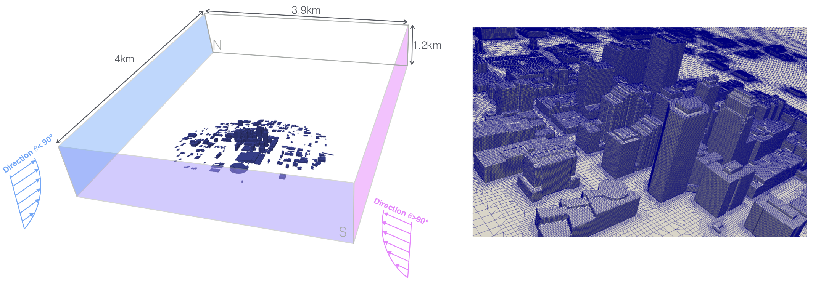{:width="400px"}

**Contact:** [Clara García-Sánchez](https://cgarcia-sanchez.com) and [Stelios Vitalis](http://3d.bk.tudelft.nl/svitalis).

- - -

## Exploring efficient ways to visualize and handle large data sets

Diverse processes in urban simulations, such as high-fidelity Computational Fluid Dynamic (CFD) simulations and the reconstruction of accurate 3D city models relay in the usability of very large datasets. This applications focused in realistic urban scenarios can be dealing with number of data points that lay in the hundreds of millions. The visualization and usability of these large datasets is a common problem that we face often at present and in the future, and determining efficient ways to deal with it would be of paramount importance. 

In this MSc thesis we will explore the existent techniques to deal with such problems, and build up from them to analyze and potentially develop additional strategies that ease this challenge. The application results from the thesis can largely impact fields of geomatics, CFD communities as well as 3D data visualization.

If you work on this topic, you can expect to learn about flow patterns (as in wind), geometric operations on 3D city models and multiple tools for visualization used for 3D city models and CFD results. Programming experience and interest is an advantage for this topic, since parallelization of the processes might be needed to improve the usability of large scale data. 

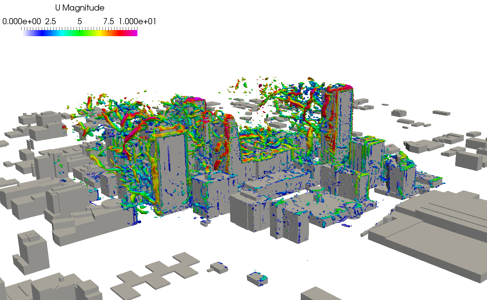{:width="400px"}

**Contact:** [Clara García-Sánchez](https://cgarcia-sanchez.com) and [Hugo Ledoux](https://3d.bk.tudelft.nl/hledoux/).

- - -

## Testing and extension of a GIS-supported design tool for new urban development areas

{:width="600px"}

The thesis builds upon work carried out in a previous MSc [thesis](http://resolver.tudelft.nl/uuid:844b92d4-aa22-4ae7-b6c3-3b563dd3318e) - check out the [video](https://www.youtube.com/watch?v=cPYT5_cFIgw)! - in which a first prototype of a geodata-supported design tool for new urban development areas was created. The tool is coupled with semantic 3D city models as a source of integrated spatial and non-spatial information.
The thesis will focus first on thoroughly testing the existing tool and will then implement new functionalities. Possible examples are the computation of KPIs for urban analyses, 3D web-based visualisation and interaction interfaces, as well as scenarios management. The precise development focus of the thesis will be agreed upon with the student.

The research will be carried out on a selected case study and in cooperation with the Cross Domain-City of the Future graduation [studio](https://www.tudelft.nl/en/education/programmes/masters/architecture-urbanism-and-building-sciences/msc-architecture-urbanism-and-building-sciences/master-tracks/architecture/programme/studios/city-of-the-future/), which focuses on how to design and develop in an integrated way a transformation area into an attractive future urban environment.

**Contacts:** [Giorgio Agugiaro](https://3d.bk.tudelft.nl/gagugiaro/), [Roberto Cavallo](https://www.tudelft.nl/en/staff/r.cavallo) 

- - -

## Utilization of alternative fuels in the transport sector and identification of their emission reduction potential regarding harmful air pollution

The air quality in cities is one of the big topics of modern society. This air quality is affected form harmful emission like nitrogen oxides and particulate matter that are, in urban areas, mainly produced from the transport sector. A promising option besides changing the modal split or reducing mileages is the change to alternative fuels. To identify suitable application cases for alternative fuels, analyses to determine which vehicles are the main polluters in agglomerations are mandatory. 

In the framework of this master thesis, you will work independently with a model developed at the Forschungszentrum Jülich that considers the mileages and resulting emissions of road transport, rail transport, inland waterway transport and air transport considering different fuels and conditions. Mileages and emissions are spatially presented in the results of the model. Your work will include development and extension of this model as well as the analysis of results for different future scenarios. The model is implemented in Python and QGIS is used to plot results.

This project is done in cooperation with Forschungszentrum Jülich GmbH, Jülich, Germany. The work will take place in Jülich, Germany. Experience in programming and a basic in German language is beneficial, but not essential.

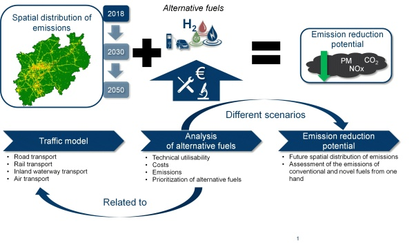{:width="600px"}

**Contacts:** [Giorgio Agugiaro](https://3d.bk.tudelft.nl/gagugiaro/) (3D Geoinformation), [Janos Breuer](https://www.fz-juelich.de/SharedDocs/Kontaktdaten/Mitarbeiter/B/Breuer_ja_breuer_fz_juelich_de.html?nn=557474) (Forschungszentrum Jülich, Germany)

- - -

## Coupling 3D city models with Ladybug tools for environmental analyses

The MSc thesis will focus on interoperability between the Ladybug tools and semantic 3D city models encoded in CityJSON and extended with the Energy ADE. The [Ladybug Tools](https://www.ladybug.tools/) are a collection of free applications that support environmental design and education. They are among the most comprehensive, connecting 3D Computer-Aided Design (CAD) interfaces to a host of validated simulation engines. The thesis builds upon a previous [MSc thesis](https://repository.tudelft.nl/islandora/object/uuid:fb35db7c-9af8-488c-8d0b-263b138d8fd3) completed in 2020.

Particular attention will be paid to energy-related topics in order verify how and to which extent the CityGML [Energy ADE](http://www.citygmlwiki.org/index.php/CityGML_Energy_ADE) (Application Domain Extension) can be used to deliver and store additional energy-related data needed by the Ladybug tools.

The students’ task will consist in choosing (together with the supervisors) a specific application covered by a Ladybug tool, to analyse the software and data requirements of the selected Ladybug tool(s) and to perform a mapping to underlying CityGML/Energy ADE data models. In addition, proper interfaces will have to be developed and tested by means of a concrete case study. This topic is available for up to *two students* (each one choosing a different application area).

**Contact**: [Giorgio Agugiaro](https://3d.bk.tudelft.nl/gagugiaro/) and [Hugo Ledoux](https://3d.bk.tudelft.nl/hledoux/)

- - -

## Where will you lose your hat? Finding the windiest street in the Netherlands
Wind speeds in small scale regional maps are commonly used to derive wind harvesting potential. Sometimes, these type of maps can also be used to infer the wind speed on the city level. However, we do not know yet how do such interpolated wind speeds correspond to real wind speeds in an urban setting, since the landscape and building structures largely modify the flow patterns. 

In this MSc thesis we will use Netherlands wind maps and 3D city models to explore the correspondence between larger wind maps and local winds. The data inherent in 3D city models will be used to derive fundamental parameters that describe urban morphologies, such as skyview factor, length-to-width ratio, orientation or building density. Through these parameters we will classify diverse urban areas, and explore relations between the derived urban parameters and the local potential for wind enhancement or reduction over the Netherlands. 

If you work on this topic, you can expect to learn about flow patterns (as in wind), geometric operations on 3D city models, how to convert a city object, city-parts into a machine-learnable representation, how various urban layouts influence wind distributions. Ideally, you would also explore how to scale up the operation to a whole country, and optionally you may also learn how to run Computational Fluid Dynamic (CFD) simulations for wind.

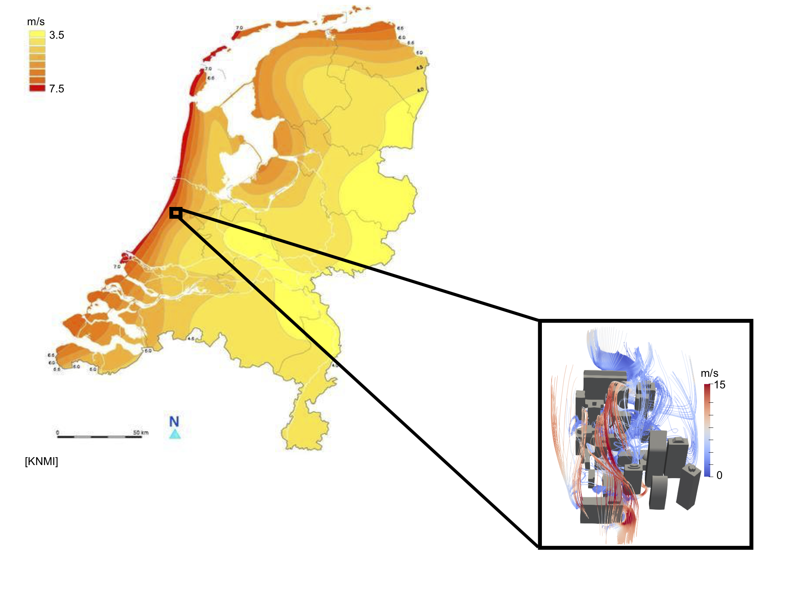{:width="400px"}

**Contact:** [Clara García-Sánchez](https://cgarcia-sanchez.com) and [Balázs Dukai](http://balazsdukai.com).

- - -

## GIS-based integrated modelling of building stock and supply networks for assessment of near-zero energy districts

This MSc thesis topic will be jointly supervised by staff of the 3D Geoinformation group (Dept. of Urbanism) and the Climate Design group (Dept. of Architectural Engineering and Technology). Ideally, two students (one for each research group) will work together, however focusing each on one of the following topics:

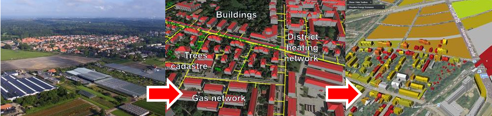{:width="600px"}

For the Geomatics track, the focus will be on modelling the building stock and the (energy) supply networks of a district in an integrated GIS environment. CityGML and its extensions Energy ADE and Utility Network ADE will be considered for the purpose. At least a basic knowledge of CityGML is required for this topic.
The focus of the energy track will be on developing a GIS-based Urban Energy Model (UEM) which simulates the building energy performance on the urban-scale. While the building  energy efficiency is getting greater attention, there is a lack of building energy simulation on the urban scale. The UEM has to be computationally efficient and simultaneously use a set of input parameters that is aggregated to a level which is proportional with the urban GIS data. This will make the model suited for the macro-level simulations. The data relates to the basic building information such as wall and window areas, shading coefficients, material properties, floor area, lighting density, internal heat production from appliances, plug loads, and occupancy schedules. 
The above-mentioned GIS-model will be integrated with the UEM, as well as design algorithm, in order to extract suitable data to be used as input to the energy models. The GIS platform collected and synthesized the data and then will be used as the input of the UEM to get energy use of buildings in the area. The model will also be applied to evaluate the energy savings of desired retrofit scenarios.
In case only one or more than 2 students are interested in this MSc thesis, specific arrangements will be made together with the supervisors.

**Contact:** [Giorgio Agugiaro](https://3d.bk.tudelft.nl/gagugiaro/) (3D Geoinformation), [Michiel Freemouw](https://www.tudelft.nl/en/staff/m.a.fremouw/) (Climate Design and Sustainability group)

- - -

## Façade parsing from textured meshes

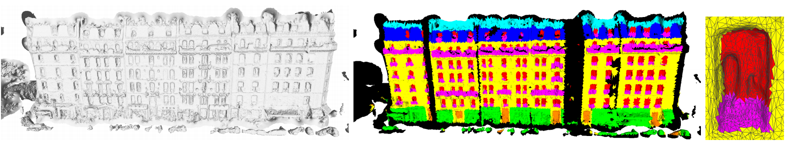{:width="600px"}

Recent advances in Structure from Motion (SfM) and Multi-View Stereo (MVS) enable generating textured meshes of large urban scenes. Many real-world applications (e.g., sun light simulation) require detailed semantic information of these models. This project aims at partitioning the façade models into semantically meaning regions, i.e., walls, doors, windows, chimneys, and balconies using state-of-the-art machine learning / deep learning techniques.

**Required Skills**: 
Experiences in 3D mesh processing; Proficient in one programming language (e.g., C/C++ or Python); Attendance in courses (CS4220, or CS4240, or related online courses) on machine learning / deep learning. 

**Contact**: [Weixiao GAO](https://3d.bk.tudelft.nl/weixiao/)

- - -

## Improving automatic meshing for buildings

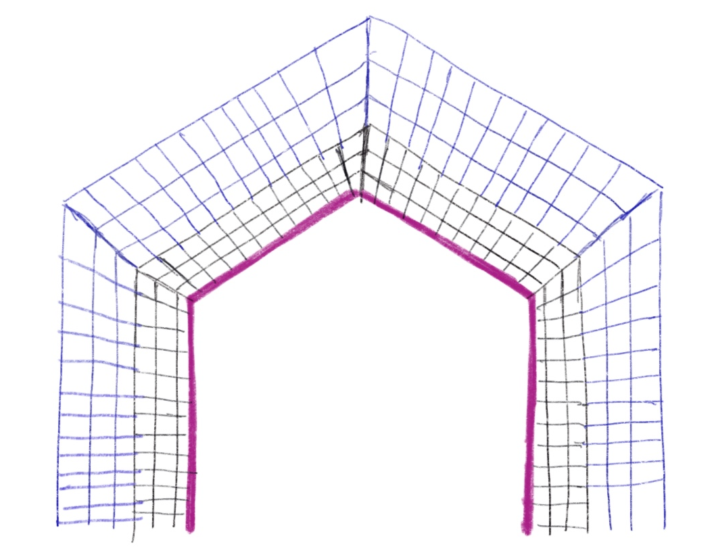{:width="600px"}
Computational fluid dynamic simulations require detailed meshes that can represent obstacles features accurately. In numerical simulations, the quality of the mesh can draw the line between good and poor results. Nowadays, mesh tools are general and they are not necessarily optimised for meshing entire cities, requiring large time investments to design and improve the mesh quality.

This MSc project focuses on developing an algorithm that create the mesh automatically around buildings by specifying a limited number of parameters that define the grid cells sizes. The mesh will be generated from a top-up perspective, initially extruding the geometrical edges to create cell layers close to the buildings. The approach will be first tested in 2D single and multiple building geometries.

Knowledge of programming in python is required.
Following elective course GEO5013 is an advantage.

**Contact:** [Clara Garcia-Sanchez](mailto:C.Garcia-Sanchez@tudelft.nl) and [Hugo Ledoux](http://tudelft.nl/hledoux)

- - -

## Automatic reconstruction of historical 3D city models

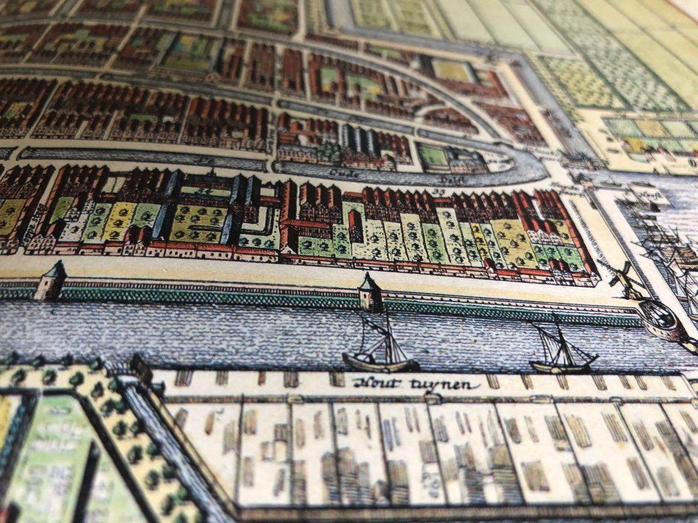{:width="500px"}

Several cities are currently attempting to reconstruct historial 3D models of their cities, see for instance [Rotterdam before/during/after WWII](https://www.stadsarchief.rotterdam.nl/rotterdam3d).
As far I know, all the efforts have been made manually, by hiring several students to draw buildings from historical photos.

The aim of the project is to investigate how historical 3D models of cities can be *automatically* reconstructed.
The idea is to use [2D topographic maps](https://www.topotijdreis.nl) and other sources (eg cadastre) and infer the height of buidings, [maybe with machine learning](https://3d.bk.tudelft.nl/hledoux/pdfs/17_ceus_3dnoelevation.pdf).

**Contact:** [Hugo Ledoux](http://tudelft.nl/hledoux)

- - -

## Modelling tree topology effects on wind

Urban landscapes incorporate vegetation elements that serve for different purposes. In open spaces trees can be used to ameliorate air quality, while in other locations they can help to mitigate heat island effects or to improve pedestrian wind comfort. Flow simulations in urban canopies usually oversight resolving tree structures. However, trees have been shown to always affect the wind flow, in some cases with non-negligible impacts.

In this MSc thesis we will simulate explicitly the wind around diverse tree topologies. The results will be compared with standard approaches that approximate the drag imposed by the tree on the wind flow. The study goal is twofold: 1) we will analyze the effect of different tree shapes, and their impact on the flow structure; 2) we will evaluate the performance of  traditional drag approaches and explore potential improvements.

Knowledge of programming in python is highly desirable.

**Contact:** [Clara Garcia-Sanchez](mailto:C.Garcia-Sanchez@tudelft.nl)

- - -

## Calculating street widths

{:width="700px"}

This project will be in partnership with researchers in the department of Urbanism examining the relationship between street design and automated vehicles. As part of this thesis you will examine ways to automatically calculate the width of roads (this is considered the total width including pedestrian walkways and cycling lanes). Part of this process will require you to find ways to automatically classify intersection areas as well as develop methods to automatically partition road segments. 

Knowledge of a programming language (preferably Python) is highly recommended.

**Contact:** [Anna Labetski](mailto:a.labetski@tudelft.nl)

- - -

## Sensor standards overview

Create an overview of the standards landscape related to sensors and observations that explains the scope of each of these standards, their application to practical use cases, impact on Spatial Data Infrastructures and mechanisms by which they may be combined. 
Are these standards, for example, overlapping in their application domain, or are they complementary? 
Are there gaps that need to be addressed? 

Different standards organizations are working on standards related to sensors and the measurements they produce: [ISO](https://www.iso.org/), the [OGC](http://www.opengeospatial.org), the [W3C](https://www.w3.org), the [IETF](https://www.ietf.org), and countless non-standardized community or platform-specific protocols and formats. These standards range from mature to early development stage, and from low level communication IoT protocols to ontologies describing sensor semantics.

This project is done in cooperation with [Geonovum](https://www.geonovum.nl/), the govermental organisation responsible for developing geo-standards.

**Contact:** [Linda van den Brink](l.vandenbrink@geonovum.nl) and [Jantien Stoter](http://3d.bk.tudelft.nl/jstoter)

- - -

## Moving objects on the Web

Describing trajectories and paths of moving objects requires a different approach to describing static ones. Research how best to support Web applications that generate or use data concerning moving objects. Use cases include transportation, tourism, migration, location-based services, travel blogs and wildlife tracking. There is an OGC standard for [Moving features](http://www.opengeospatial.org/standards/movingfeatures), but the XML encoding is too complex and verbose - not lightweight enough to conduct, for example, enhanced (near) real-time operations involving moving objects, via the Web.

This project is done in cooperation with [Geonovum](https://www.geonovum.nl/), the govermental organisation responsible for developing geo-standards.

**Contact:** [Linda van den Brink](l.vandenbrink@geonovum.nl) and [Jantien Stoter](http://3d.bk.tudelft.nl/jstoter)

- - -

## Develop a framework for sharing sensor data

The ISO/OGC standard [Observations and Measurements](http://www.opengeospatial.org/standards/om) (O&M) provides a model for the exchange of information about sensor observations. 
It’s a rather concise and abstract model and it has always raised questions about how to create a profile in order to use it in practice. 
A framework for this is needed.

Creating a profile involves the definition of an information model that extends the [abstract O&M model](http://portal.opengeospatial.org/files/?artifact_id=41579). 
O&M is defined in UML. 
In addition, there is an XML-based exchange format, the [O&M GML encoding](http://portal.opengeospatial.org/files/?artifact_id=41510), a [JSON implementation](https://portal.opengeospatial.org/files/64910), and a linked data based ontology called [Semantic Sensor Network ontology](https://www.w3.org/TR/vocab-ssn/). 
All of these may play a role in the framework, but the central question of this MSc topic is how to create a working O&M profile.

A practical case for the study could be the [Base Registry Underground](https://www.basisregistratieondergrond.nl), which will contain a lot of sensor data such as groundwater measurements and soil quality observations. 

This project is done in cooperation with [Geonovum](https://www.geonovum.nl/), the govermental organisation responsible for developing geo-standards.

**Contact:** [Linda van den Brink](l.vandenbrink@geonovum.nl) and [Jantien Stoter](http://3d.bk.tudelft.nl/jstoter)

- - -

## Linked data: Extend CityJSON with machine-readable semantics

[CityJSON](http://www.cityjson.org) is based on JavaScript Object Notation, a lightweight data-interchange format primarily used on the Web. 
However, JSON is just syntax, without any machine-readable knowledge about the meaning (semantics) of the data. Currently, the only way to figure out what the data in a CityJSON file means (e.g. what is a building?) is to read the [CityGML](https://www.citygml.org) specification (assuming you know where to find it), something only humans can do. 

The aim of this MSc project is to find out how to encode the meaning of CityJSON files in a machine-readable way, directly embedded or linked in the JSON document, and to discover what benefits (or disadvantages) this would bring. This could be done by creating a vocabulary which describes the keys that can be used in CityJSON, basically a CityGML vocabulary or (simple) ontology; and using [JSON-LD](https://json-ld.org/) to map the keys in CityJSON to this vocabulary. 

The "LD" in JSON-LD stands for "[linked data](https://www.w3.org/wiki/LinkedData)". 
Once CityJSON-LD is created, we effectively have a lightweight linked data format for CityGML. 
But this is not a benefit in itself. 
The project would go on to explore the advantages and disadvantages of working with CityJSON-LD, as opposed to just CityJSON.

This project is done in cooperation with [Geonovum](https://www.geonovum.nl/), the govermental organisation responsible for developing geo-standards.

**Contact:** [Linda van den Brink](l.vandenbrink@geonovum.nl) and [Jantien Stoter](http://3d.bk.tudelft.nl/jstoter)

- - -

## Inferring the needed building permission from a 3D building model

{:width="400px"}

In the Municipality of Rotterdam the building regulations are very different if a construction work on a roof is a dormer, an additional floor, or something else. It can be difficult to figure out what regulations apply for a given construction plan. To make this easier the municipality of Rotterdam would like to offer a tool that can automatically determine what permits are needed, given a 3D geometry of the building plans. The tool should be able to infer what kind of object is designed and provide to the designer the needed regulations and constraints.

In this research the aim is:
- to build a web application that can read an LoD2 CityJSON model of the current situation and allows the user to modify the building with the desired modifications;
- to develop a method that can infer what kind of object was designed in the web application (only objects on the roof will be considered) and deliver the related regulations accordingly.

**Contact:** [Francesca Noardo](http://www.noardo.eu), [Stelios Vitalis](http://3d.bk.tudelft.nl/svitalis), [Ravi Peters](http://tudelft.nl/rypeters), [Ken Arroyo Ohori](https://3d.bk.tudelft.nl/ken).

- - -

## 3D digital urban regulations to use GeoBIM for building permission checks

The automation of urban regulation checks for the planning use case requires the urban regulations to be archived in a digital and spatial (3D) format.
This project aims at the definition of an effective way to store those regulations digitally and spatially, for their use in checking urban regulations compliancy of new buildings through GeoBIM integrated information. The studied solution could start from extending [CityGML](https://www.citygmlwiki.org), employing [INSPIRE](https://inspire.ec.europa.eu/data-model/approved/r4618-ir/html/) data model, or other available standards.
In collaboration with [EuroSDR](http://www.eurosdr.net) and [Kadaster](https://www.kadaster.nl)

**Contact:** [Francesca Noardo](https://3d.bk.tudelft.nl/fnoardo/), [Ken Arroyo Ohori](https://3d.bk.tudelft.nl/ken) and [Jantien Stoter](http://3d.bk.tudelft.nl/jstoter)

- - -

## Extracting building/storey/dwelling/room shapes from a BIM models

{:width="400px"}

Given a Building Information Model in Industry Foundation Classes (IFC) format, it is necessary to extract useful information for automatic processes, such as the building envelope, number of dwellings, storeys or rooms in the building and the respective volumes and dimensions, for example to support compliancy check with the urban regulations.

Prior algorithmic knowlegde, recursion, graph concepts could be beneficial.

In collaboration with Municipality of Rotterdam.

**Contact:** [Francesca Noardo](https://3d.bk.tudelft.nl/fnoardo/), [Ken Arroyo Ohori](https://3d.bk.tudelft.nl/ken), [Thomas Krijnen](http://thomaskrijnen.com/) and [Jantien Stoter](http://3d.bk.tudelft.nl/jstoter)

- - -

## Point cloud normal estimation based on the 3D medial axis transform

{:width="400px"}

Point clouds, unstructured collections of 3D points in space, are nowadays collected with different acquisition methods, eg photogrammetry and LiDAR.
While current point clouds are dense and offer an accurate representation of real-world objects and landscapes, they lack structure and semantics.

The aim of this project is to properly *orient* a point cloud, ie to find an approximation of the normal at each point; this normal should point outwards.
Surface normals are essential for different processing of a point cloud, eg visualisation, shadow analysis or segmentation.

"Standard" methods, eg [that function in PCL](http://pointclouds.org/documentation/tutorials/normal_estimation.php), usually find the nearest points of a given point, fit a plane, and choose between the 2 possible normals (up or down) based on a viewpoint.
The problem is that in practice, eg with the [AHN3 dataset](http://www.ahn.nl), we do not have that information.

The topic involved building on our work with the [3D medial-axis transform (MAT)](https://3d.bk.tudelft.nl/projects/3dsm/) and use the 3D MAT of a point cloud as a base to obtain high quality normals with a proper orientation.

It is possible to use Python for this project, although some knowledge of C++ would surely help.

**Contact:** [Ravi Peters](http://tudelft.nl/rypeters) and [Hugo Ledoux](http://tudelft.nl/hledoux)

- - -

## 3D Cadastre

{:width="700px"}

Since more than 15 years, lots of studies have been done on 3D Cadastre to register multilevel ownership in a transparent and proper way.
In 2016, we realised the first 3D cadastral situation [3D cadastral registration]( https://3d.bk.tudelft.nl/news/2016/03/21/3DKadaster.html) in the Netherlands.
But still research is needed to develop a solution for 3D cadastral registration that covers all issues. An MSc thesis could focus on one of them, such as how to validate a 3D cadastral plan that was created from a BIM model? Traditionally, a 2D cadastral boundary is checked by surveyors in the field. What are the requirements for 3D cadastral boundaries? How can they be generated accordingly? And how can they be validated? How can a BIM model serve as input for this? Another issue is about how to maintain and exchange 3D data about property boundaries? And how to go beyond the limited visualisation and navigation possibilities of 3D PDF?

*Contact:* [Jantien Stoter](http://3d.bk.tudelft.nl/jstoter) and [Hugo Ledoux](http://tudelft.nl/hledoux)

- - -

## Automatic generalisation of depth contours

{:width="500px"}

For some years, we have been working on a novel method to automatically generate "good" depth-contours for hydrographic charts.
Our latest results, based on the [MSc thesis of Ravi Peters](http://repository.tudelft.nl/view/ir/uuid%3A5977a99b-0875-44b4-abe1-09288bf2aed1/) and published in that [paper](https://3d.bk.tudelft.nl/hledoux/pdfs/14_marinegeo.pdf), have been picked up by major companies who are implementing it.

The aim of the proposed project is to improve the results.
That is, we can at this moment generate smooth contours for most seabed types, but the generation is applied for the whole dataset and a human must decide when the results are okay.
The student would have to focus on automatically applying the algorithms only where they are needed and design methods to assess when sufficiently good results have been achieved.

The [code of the project](https://github.com/Ylannl/Surfonoi) is in C++, but probably possible to make do with Python.

**Contact:** [Hugo Ledoux](http://tudelft.nl/hledoux) and [Ravi Peters](http://tudelft.nl/rypeters)

- - -

## Snap rounding in a triangulation

{:width="500px"}

The most common way to do edge-matching or to clean small inconsistencies within and between datasets is to apply snapping (point-to-point or point-to-line).
However, simple snapping creates many problems, including topological changes and inconsistencies.
Snap rounding extends this method in order to give robustness guarantees, but current implementations, such as [the one in CGAL](http://doc.cgal.org/latest/Snap_rounding_2/index.html), are *extremely* slow.
Related to this, in the project [pprepair](https://github.com/tudelft3d/pprepair), we have previously used a constrained triangulation as a robust method to repair polygons and planar partitions.
Using this approach topological errors are automatically fixed.
We therefore believe that using a triangulation as a base structure is an intuitive and efficient way to optimize snap rounding, since we can perform simple snapping and recover from topological errors afterwards.

The existing prototype ([pprepair](https://github.com/tudelft3d/pprepair) that needs to be extended has been developed in C++, thus the knowledge of C++---or a strong desire to learn it---is necessary.

**Contact:** [Ken Arroyo Ohori](https://3d.bk.tudelft.nl/ken)

- - -

## Learning to synthesize detailed 3D building models

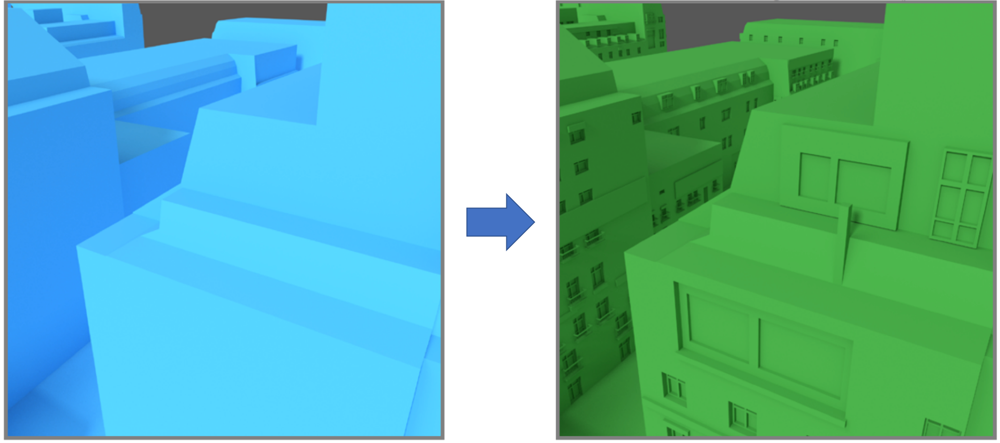

LoD1 or LoD2 building models can be relatively easily generated from building footprints and point cloud data. However, such models lack meaningful geometric detailed façade structures (e.g., doors, windows, and balconies), making them unsuitable for real-world applications such as visualization and simulation. The goal of this MSc thesis is to develop an algorithm that can automatically synthesize semantically meaningful façade details onto the given coarse models. The resulted models will have a plausible style conforming to the images of real-world buildings.

**Required Skills**: 
Proficient in one programming language, either C/C++ or Python; experiences in mesh processing; willing to follow courses on machine learning (in particular Deep Learning) before or at the beginning of the project.

**Contact**: [Liangliang Nan](https://3d.bk.tudelft.nl/liangliang/)

- - -

## Outer surface extraction for complex 3D models

The number of 3D building models is explosively increasing. These models can be easily obtained by applying state-of-the-art modeling/reconstruction techniques, or by manual creation using various software packages. It is quite common to observe errors and imperfections in these models, such as gaps, holes, self-intersections, duplicated geometry (e.g., double walls), non-manifold (e.g., more than two polygons meeting at the same edge). Applications, such as simulation, digital fabrication (e.g., 3D printing), and model editing tools, can only accept clean surface models as input, which restricts the existing models to visualization purpose only. It becomes extremely difficult to eliminate these flaws when a certain combination of them are present. 

In this project, we would like to develop robust algorithms and tools that can automatically resolve these commonly found issues in 3D models. We would expect the method to produce a closed surface representation of a building. With such a representation, a 3D building is partitioned into disjoint interior and exterior spaces without ambiguity.

**Required Skills**: 
Proficient in one programming language (e.g., C/C++ or Python); experiences in mesh processing; machine learning (in particular Deep Learning) is a bonus.

**Contact**: [Liangliang Nan](https://3d.bk.tudelft.nl/liangliang/)

- - -

## Integrated modelling of utility networks in the urban environment

In the framework of Smart Cities, the MSc thesis will focus on interoperability issues when it comes the heterogeneous utility networks (e.g. gas, water, electricity, sewage, district heating, telecommunications, etc.) that are found in the urban environment.
Starting from a CityGML-based 3D city model, the Msc. thesis will focus on testing the Utility Network ADE (Application Domain Extension) and compare it to existing or newly proposed standards (IMKL or MUDDI), based on a concrete case study which will be agreed upon with the student. 
The image shown here is taken from a previous [thesis](https://repository.tudelft.nl/islandora/object/uuid:fed24b16-cf95-4fa0-a109-ece6e91b61e9?collection=education) and serves as example - and starting point - of the overall topic of the thesis proposed here.

**Contacts**: [Giorgio Agugiaro](https://3d.bk.tudelft.nl/gagugiaro/) and [Jantien Stoter](https://3d.bk.tudelft.nl/jstoter/)

- - -

## Computation of spatial extent for massive point cloud datasets

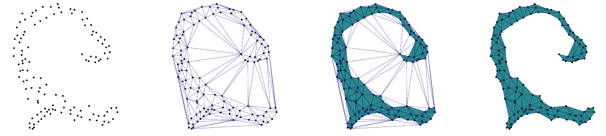

Given a raw LAS pointcloud datasets, how to generate its [spatial extent (a polygon)](https://3d.bk.tudelft.nl/courses/backup/geo1015/2019/les/13/)?

Finding the bounding-box (or the convex hull, or with a raster solution) is in most cases not sufficient, as the image above shows.
A better solution is to use the alpha-shape of the set of points, or similar complex structures.
The problem we would be tackling here is: how to do this for a dataset of say 800M points? It doesn't fit in memory, so what can we do?

Done in collaboration with [Deltares](https://www.deltares.nl).

*Contact:* [Hugo Ledoux](https://3d.bk.tudelft.nl/hledoux) 

- - -

## Semantic Feature Matching

{:width="500px"}

For large parts of the world, the available 3D geoinformation is limited, outdated or inaccurate. To cost-effectively obtain an up to date and high-resolution 3D (urban) environment model, automated 3D reconstruction techniques need to be applied on raw elevation and imagery sensor data, in order to find which features (vegetation, buildings, etc.) are present in the terrain and the representation of the relevant feature properties (tree species, roof type). Semantic model based feature matching is a reconstruction approach where a priori knowledge on the environment is used to represent and constrain a search space of possible feature models that can be found in the terrain. 

The key in this research is to devise semantic model representations and search algorithms that explore the search space and find instances of the semantic feature model that best match the available sensor data. The project will focus on encoding and using object relations (e.g. between a building and adjacent street) in semantic feature models to improve the correctness of the matches. The project is carried out in co-operation with [TNO in The Hague](https://www.tno.nl/nl/), where these techniques are applied in the field of gaming and simulation.

*Contact:* [Jantien Stoter](http://3d.bk.tudelft.nl/jstoter)

- - -

## DTM Filtering for Photogrammetric DSM’s

{:width="500px"}

Although laser point clouds have become a common data resource for world modelling, photogrammetrically derived digital surface models are still widely used as the basis for a terrain modelling work flow. With current high resolution camera systems, highly detailed Digital Surface Models (DSM) can be obtained. Digital Terrain Model (DTM) filtering is used to remove features from the DSM and obtain a ground level elevation model. Although DTM filtering is a very basic step in terrain modelling, it is still a challenging task. One of the difficulties is the filtering of forested areas in hilly terrain, but also rough terrain is often not a trivial case.

This research will aim at finding improved filtering and interpolation techniques to resolve the difficulties in DTM filtering for photogrammetrically derived DSM’s. The project is carried out in co-operation with [TNO in The Hague](https://www.tno.nl/nl/), where these techniques are applied in the field of gaming and simulation.

*Contact:* [Jantien Stoter](http://3d.bk.tudelft.nl/jstoter)

## Performance and robustness of software libraries for computational geometry

{:width="500px"}

Software libraries for computational geometry underpin a lot of our research, but an in-depth comparison of how these different software libraries behave in terms of performance and robustness is not available. For example, the feasability of multi-disciplinary use of geometry in BIM/GIS integration and automated thermal analysis of IFC building models is largely shaped by the characteristics of the algorithmns offered in open source libraries such as CGAL and Open CASCADE. This research project is an opportunity to publish something novel, useful and relevant to many disciplines.

*Contact:* [Thomas Krijnen](mail@thomaskrijnen.com)

---

## CityRest: RESTful access + streaming of 3D city models

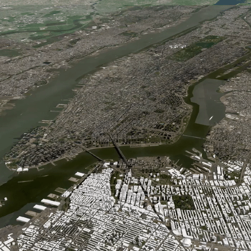{:width="300px"}

[CityJSON](https://cityjson.org) was developed to improve on the weaknesses of the XML-encoding of [CityGML](http://www.citygml.org/).
One of the major one is that CityGML files cannot be used on the web, they are often too big and too complex.

CityJSON fixed this (6X more compact and [ninja](https://ninja.cityjson.org/) shows a proof-of-concept), and this MSc topic will explore solutions and architectures to offer a [RESTful](https://en.wikipedia.org/wiki/Representational_state_transfer) web access to datasets, and also the possibility to *stream* them to a viewer (eg ninja; image above is from [Draco](https://cesium.com/blog/2018/04/09/draco-compression/)).

There is a newly developed standard that promises to do this: [OGC API--Features](http://docs.opengeospatial.org/is/17-069r3/17-069r3.html) (this is "WFS3" but with a new name).
Most of the demos are for simple 2D geometries, complex features of a 3D city model are not clearly supported (eg textures, 2+ geometries, several LoDs, etc.).

I have built a quick [proof-of-concept and a proposal](https://github.com/hugoledoux/cityjson_ogcapi) (see also the [demo](http://hugoledoux.pythonanywhere.com/)), and this project would bring this further by investigating how to support streaming, how to setup the server (right now it is simple and "cheap").
The aim would be to host most [publicly available 3D city models](https://3d.bk.tudelft.nl/opendata/opencities/) on such a server, and benchmark what would be the "optimal" solution.
A bit ambitious, I know.

*Contact:* [Hugo Ledoux](https://3d.bk.tudelft.nl/hledoux) & [Stelios Vitalis](https://3d.bk.tudelft.nl/svitalis/)

---

## Where do I turn? Investigate modeling of road networks in CityJSON, with implicit geometries

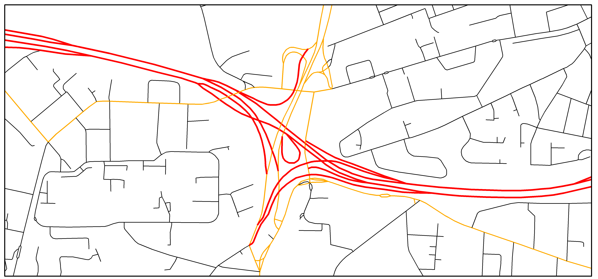{:width="700px"}

Roads are supported by CityJSON, but there is minimal support for road networks so far.
As part of a previous [thesis](http://resolver.tudelft.nl/uuid:ebfc48f8-4704-47d3-9654-cd00c765e0af), we have intestigated the requirements for complete roads representation for certain use cases.

In this thesis, the goal is to further refine the requirements to conclude to a concrete representation of road networks.
The point of the thesis is to utilise all possible mechanisms that CityJSON offers to store semantics of roads in the most efficient ways (e.g. geometry instancing, geometry semantics).
How will we store the network?
Can we imply the 3D geometry of roads from simple networks?
Can we store all necessary information with the existing functionality of CityJSON or is more necessary?

We are in the process of producing some sample road datasets.
As part of the project, you'll have to experiment with multiple representations, create variations, find interesting parties and evaluate the best way to have roads in CityJSON.

*Contact:* [Anna Labetski](https://3d.bk.tudelft.nl/alabetski/) & [Stelios Vitalis](https://3d.bk.tudelft.nl/svitalis/)

---

## Automatic repair of 3D city models

{:width="300px"}

Most 3D city models that are publicly available contain so many geometric errors (self-intersections, missing faces, duplicate vertices, etc.) that [they are more or less unusable in practice](https://speakerdeck.com/hugoledoux/how-useful-are-current-3d-city-models).

The aim of this project is to __automatically__ repair 3D city models, we can focus on the [publicly available models](https://3d.bk.tudelft.nl/opendata/opencities/) so there is plenty of data to play with.
While repair is a very-complex issue (if all cases are to be handled), this project will target the most common errors, and fix them. 
The [val3dity server](http://geovalidation.bk.tudelft.nl/val3dity/) has been logging all the validation reports for the last 4 years, so a starting point will be to analyse those and focus on what is most easy and has an impact.
Duplicate points and non-planar surfaces are pretty easy to solve; and for single polygons we [already have working code (prepair)](https://github.com/tudelft3d/prepair).
After that, more complex operators (eg [those from CGAL](https://doc.cgal.org/latest/Polygon_mesh_processing/index.html)) could be used.

The project is difficult to be done in Python, C++ is necessary (but it's a great way to improve!).
CityJSON files will be used, you will not have to deal with (the pain of parsing) CityGML files, I promise.

*Contact:* [Hugo Ledoux](https://3d.bk.tudelft.nl/hledoux)
