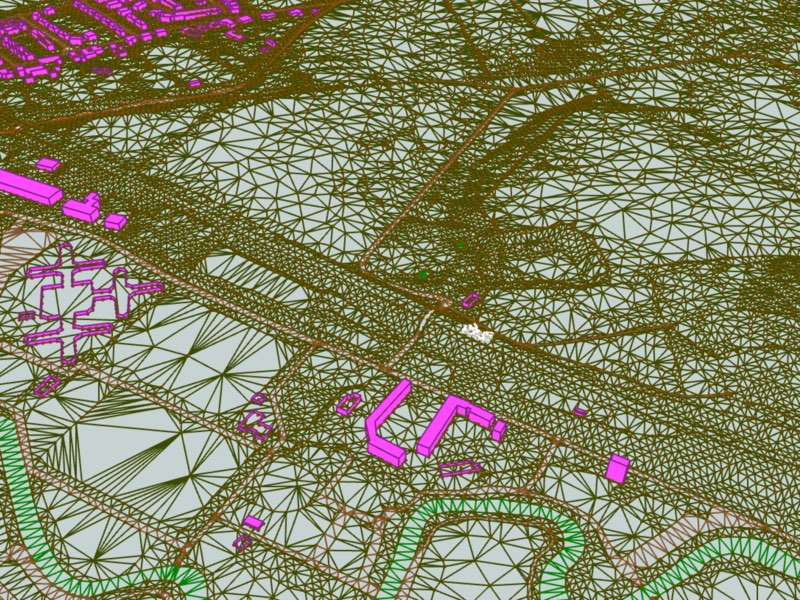
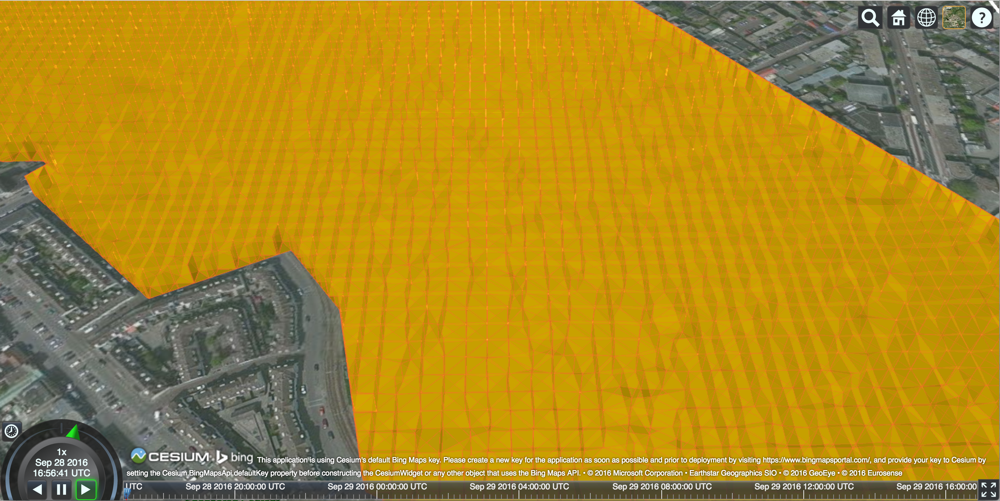
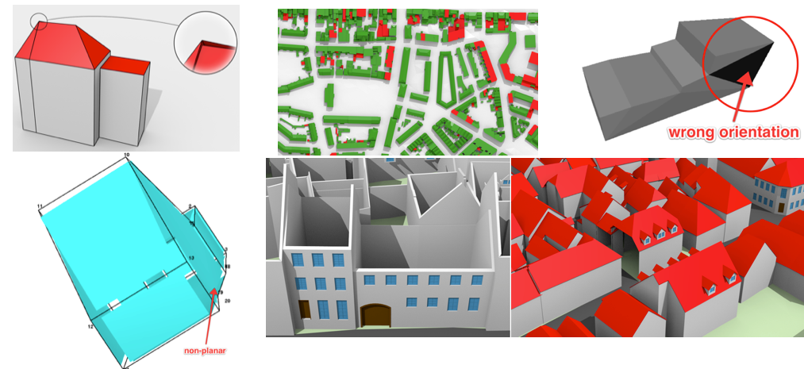
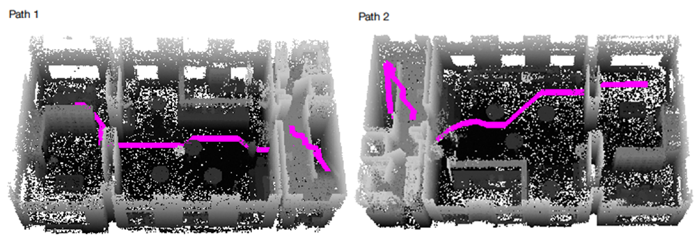
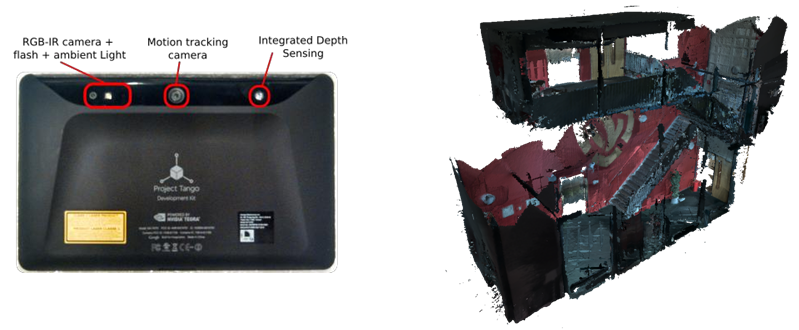
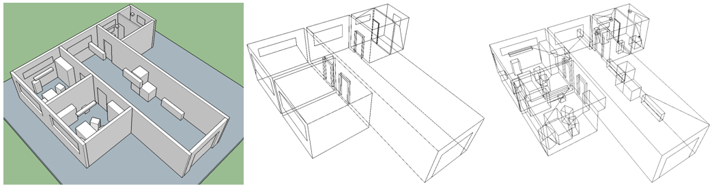

- - -

* Table of Content
{:toc}

- - -

## Extraction of 3D roof segments from aerial imagery 

{:width="350px"}

This project is done in cooperation with [Readaar](http://www.readaar.com).
Readaar already developed a method to efficiently determine 3D roof segments from LiDAR data. 
Their current method is extremely fast (less than 2 days to process the entire Netherlands on a normal workstation) and gives a coarse estimation (~1m planar accuracy) of all roof segments in the Netherlands. 
They want to upgrade their current method to combine LiDAR with aerial imagery to profit from the much higher resolution of imagery w.r.t. LiDAR. 
There are multiple ways to achieve this, which could be focused more on traditional point cloud processing methods or more on object detection/machine learning approaches.
Both stereo imagery and LiDAR data are available for the entire Netherlands. 

The student will be helped by a remote sensing specialist (ir. Sven Briels) and a machine learning expert (Jean-Michel Renders, PhD) from [Readaar](http://www.readaar.com), and supervisors from TU Delft.

For this position we ask for programming skills, preferably in Matlab. 
The student will have to develop and test a large number of algorithms and approaches to get information from the raw data.

[More information is found there.](http://jobs.readaar.com/blog/internship-remote-sensing-machine-learning)

*Contact:* [Hugo Ledoux](http://tudelft.nl/hledoux) 

- - -

## 3D visualization of massive TINs

{:width="350px"}

{:width="350px"}

Visualization is an important and complex issue in the context of 3D city models. The enormous amount of data to be fetched, the heterogeneity of data sources, and the complexity of rendering are only a few parts of this challenge. The project aims at investigating 3D tiling schemes for efficiently visualizing massive TINs using [Cesium](https://cesiumjs.org) 3D webglobe.
The knowledge of programming in C++ is required.

*Contact:* [Kavisha](http://3d.bk.tudelft.nl/kavisha) and [Hugo Ledoux](http://tudelft.nl/hledoux)

- - -

## Automatic repair of 3D buildings

{:width="650px"}

To be used as input in most simulation and modelling software, 3D city models should be geometrically and topologically valid.
Unfortunately, the vast majority of 3D city models (eg in CityGML) available are of very poor quality: they contain geometric errors such part of roofs missing, a bridge not connected to the shore, self-intersections of surfaces, two buildings overlapping, wrong orientation of surfaces, etc.
The aim of this project is to build a workflow so that the new [generic CGAL repair operators](http://doc.cgal.org/latest/Polygon_mesh_processing/) can be used to repair automatically 3D buildings.
Other modules of CGAL could also be used, eg the [Nef Polyhedra](http://doc.cgal.org/latest/Nef_3/index.html).

I have already experience in repairing 3D buildings, but these new operators would make the software simpler, robuster, and easier to maintain.
Moreover, a Geomatics student graduated 2 years ago on a similar topic: [voxel-based methods were then investigated](http://repository.tudelft.nl/islandora/object/uuid:8ef4459d-b940-4007-bc3c-d87349015129/?collection=research).

CGAL is in C++, thus the knowledge of C++---or a strong desire to learn it---is necessary.
I am patient if you want to take this opportunity to learn, and many staff of my group could help.

*Contact:* [Hugo Ledoux](http://tudelft.nl/hledoux)

- - -

## Semantic Feature Matching

{:width="400px"}

For large parts of the world, the available 3D geoinformation is limited, outdated or inaccurate. To cost-effectively obtain an up to date and high-resolution 3D (urban) environment model, automated 3D reconstruction techniques need to be applied on raw elevation and imagery sensor data, in order to find which features (vegetation, buildings, etc.) are present in the terrain and the representation of the relevant feature properties (tree species, roof type). Semantic model based feature matching is a reconstruction approach where a priori knowledge on the environment is used to represent and constrain a search space of possible feature models that can be found in the terrain. 

The key in this research is to devise semantic model representations and search algorithms that explore the search space and find instances of the semantic feature model that best match the available sensor data. The project will focus on encoding and using object relations (e.g. between a building and adjacent street) in semantic feature models to improve the correctness of the matches. The project is carried out in co-operation with [TNO in The Hague](https://www.tno.nl/nl/), where these techniques are applied in the field of gaming and simulation.

*Contact:* [Jantien Stoter](http://3d.bk.tudelft.nl/jstoter)

- - -

## DTM Filtering for Photogrammetric DSM’s

{:width="700px"}

Although laser point clouds have become a common data resource for world modelling, photogrammetrically derived digital surface models are still widely used as the basis for a terrain modelling work flow. With current high resolution camera systems, highly detailed Digital Surface Models (DSM) can be obtained. Digital Terrain Model (DTM) filtering is used to remove features from the DSM and obtain a ground level elevation model. Although DTM filtering is a very basic step in terrain modelling, it is still a challenging task. One of the difficulties is the filtering of forested areas in hilly terrain, but also rough terrain is often not a trivial case.

This research will aim at finding improved filtering and interpolation techniques to resolve the difficulties in DTM filtering for photogrammetrically derived DSM’s. The project is carried out in co-operation with [TNO in The Hague](https://www.tno.nl/nl/), where these techniques are applied in the field of gaming and simulation.

*Contact:* [Jantien Stoter](http://3d.bk.tudelft.nl/jstoter)

- - -

## Automatic generalisation of depth contours

{:width="500px"}

For some years, we have been working on a novel method to automatically generate "good" depth-contours for hydrographic charts. 
Our latest results, based on the [MSc thesis of Ravi Peters](http://repository.tudelft.nl/view/ir/uuid%3A5977a99b-0875-44b4-abe1-09288bf2aed1/) and published in that [paper](https://3d.bk.tudelft.nl/hledoux/pdfs/14_marinegeo.pdf), have been picked up by major companies who are implementing it.

The aim of the proposed project is to improve the results.
That is, we can at this moment generate smooth contours for most seabed types, but the generation is applied for the whole dataset and a human must decide when the results are okay.
The student would have to focus on automatically applying the algorithms only where they are needed and design methods to assess when sufficiently good results have been achieved.

The [code of the project](https://github.com/Ylannl/Surfonoi) is in C++, but probably possible to make do with Python.

*Contacts:* [Hugo Ledoux](http://tudelft.nl/hledoux) and [Ravi Peters](http://tudelft.nl/rypeters) 

- - -

## GeoOBJ: developing a spatial extension to OBJ

3D formats found in 3D computer graphics are in many ways superior to GIS formats such as CityGML: they have wide software support and great visualisation capabilities. However, they fall short with spatial analyses, because of various limitations, such as lack of geo-referencing, and lack of semantic structuring. The goal of this project is to bridge the two worlds, by developing a spatial extension to a computer graphics format such as OBJ. This thesis is suitable for MSc Geomatics students, and it may be adapted to any other format.

*Contacts:* [Filip Biljecki](https://3d.bk.tudelft.nl/biljecki) and [Hugo Ledoux](http://tudelft.nl/hledoux)

- - -

## Snap rounding in a triangulation 

{:width="500px"}

The most common way to do edge-matching or to clean small inconsistencies within and between datasets is to apply snapping (point-to-point or point-to-line). 
However, simple snapping creates many problems, including topological changes and inconsistencies. 
Snap rounding extends this method in order to give robustness guarantees, but current implementations, such as [the one in CGAL](http://doc.cgal.org/latest/Snap_rounding_2/index.html), are *extremely* slow. 
Related to this, in the project [pprepair](https://github.com/tudelft3d/pprepair), we have previously used a constrained triangulation as a robust method to repair polygons and planar partitions. 
Using this approach topological errors are automatically fixed.
We therefore believe that using a triangulation as a base structure is an intuitive and efficient way to optimize snap rounding, since we can perform simple snapping and recover from topological errors afterwards.

The existing prototype ([pprepair](https://github.com/tudelft3d/pprepair) that needs to be extended has been developed in C++, thus the knowledge of C++---or a strong desire to learn it---is necessary.

*Contact:* [Hugo Ledoux](http://tudelft.nl/hledoux)

- - -

## BIM/IFC and its integration with CityGML & 3D GIS

{:width="600px"}

An MSc Geomatics student recently completed his thesis work on the automatic conversion of IFC buildings to CityGML LOD3 models ([MSc thesis here](http://repository.tudelft.nl/view/ir/uuid%3A31380219-f8e8-4c66-a2dc-548c3680bb8d/); and also published as a [paper in Transactions in GIS](http://doi.org/10.1111/tgis.12162)). 
Several issues are still open, and an MSc project could investigate these. 
For instance: creation of interior rooms at different LODs (interior used to be LOD4, but CityGML v3.0 will have different interior LODs), integration with the terrain, and the conversion applied to other city objects (tunnels and bridges).

*Contact:* [Hugo Ledoux](http://tudelft.nl/hledoux) and [Jantien Stoter](http://3d.bk.tudelft.nl/jstoter)

- - -

## Estimating the cooling demand with 3D city models

This MSc thesis will be conducted in collaboration with the [European Institute for Energy Research (EIFER)](http://www.eifer.org).

It involves:

* Developing a cooling energy model based on 3D city model: morphological analysis, urban typological and classification of 3D data, cooling energy needs calculation, etc.

* Study the influence of urban morphology on cooling needs (e.g. through statistical regressions)

* Implement this relation (e.g. equation between urban density and cooling needs) in a procedural tool.

For more information, please read [here](https://lsecities.net/publications/reports/cities-and-energy-urban-morphology-and-heat-energy-demand/
) about a project that EIFER led with the LSE for studying the relation between urban morphology and cooling demand.

*Contact:* [Filip Biljecki](http://tudelft.nl/biljecki)

- - -

## Line of sight (visibility) and raytracing analyses on a 3D dataset

Calculating the visibility between two points using 3D city models provides valuable input to many application domains, such as solar analyses (shadowing) and finding the optimal place to install a surveillance camera or a billboard. This list is growing, e.g. a potential application could be to estimate the visibility of an urban canyon from a satellite.

This MSc thesis will investigate visibility algorithms and potential applications.

*Contacts:* [Ravi Peters](http://tudelft.nl/rypeters), [Filip Biljecki](http://tudelft.nl/biljecki) and [Hugo Ledoux](http://tudelft.nl/hledoux)

- - -

## Automatic matching of 3D city models 

3D city models may be derived with different acquisition techniques from different producers in different levels of detail (LOD), resulting in multiple datasets of the same area. The aim of this research is to design and implement a method that finds corresponding features in two or more datasets. The benefits of this research are, for instance, linking objects for consistency (e.g. updating only one model and propagate the changes in the other models).

This topic is analogous with data matching in cartography.

*Contact:* [Filip Biljecki](http://3d.bk.tudelft.nl/biljecki)

- - -

## Procedural modelling in CityGML

Procedural modelling deals with automatic model generation by means of a procedure. It is common in computer graphics, but less so in 3D city modelling. This aim of this thesis is to design a procedural modelling engine focused on 3D GIS and CityGML in multiple levels of detail (LOD). There are two possibilities: generating 3D models from real-world (2D) data supplementing synthetic content (e.g. height of a building, windows), or generating completely synthetic 3D data.

*Contact:* [Filip Biljecki](http://3d.bk.tudelft.nl/biljecki)

- - - 

## Extension of the ISO standard 19157 for 3D data

The standard ISO 19157:2013 Geographic information---Data quality is the principal standard for describing the quality of geodata. For instance, the positional and thematic errors. However, the standard falls short when it comes to 3D data. For instance, it is not possible to describe invalid 3D geometry such as solids, and that the dataset has been acquired in an insufficient level of detail. The aim of this thesis is to investigate how is it possible to extend the standard for quality concepts found in 3D.

Upon successful completion of this topic, the student will become proficient with this important standard, and potentially give valuable recommendations for the new version of the standard to the developers. 

*Contact:* [Filip Biljecki](http://3d.bk.tudelft.nl/biljecki)

- - -

## Shape grammar to subdivide spaces

Indoor environment in public buildings consist of very large spaces and usually it is difficult to give instructions how to get to a specific part of the such space. Therefore for indoor localisation and navigation, spaces are subdivided into functional areas. There several approaches to subdivide spaces. 

This research will concentrate on space subdivision using shape grammar. A shape grammar consists of number of shape rules and a generation process that selects and processes rules. In general, shape rule specifies the transformations on  existing (part of a) shape. This research is part of [SIMs3D](www.sims3d.net) project.

*Contact:* [Abdoulaye Diakité](http://3d.bk.tudelft.nl/adiakite)

- - -

## Octree – Indoor/Outdoor navigation

3D raster representation is increasingly gaining the interest of the researchers. They are simple structures but usually result in large data sets. Therefore in previous research we have investigated Octree data structure and its use for indoor path computation.

This research topic will continue and extend previous work by considering rasterization of outdoor space. The goal is to investigate what kind of Octree would be needed for seamless indoor/outdoor navigation. 

*Contact*: [Sisi Zlatanova](http://3d.bk.tudelft.nl/szlatanova) 

- - -

## Indoor modelling with the Google Tango tablet

The Google Tango tablet is a very intuitive, interactive and interesting tool for indoor scanning. The device contains suitable sensors to rapidly produce 3D models. But the few apps available for this task are very limited, and only provides either an already processed mesh or point cloud samples. 

The goal of this research is to evaluate to which extent the tablet can be used for indoor modelling. It is about fully exploiting the skills of the tablet to extract proper point clouds and perform semantically rich surface reconstruction, by relying on other information such as the scanning trajectories, the coloured pictures of the environment, etc. 

*Contact:* [Abdoulaye Diakité](http://3d.bk.tudelft.nl/adiakite)

- - -

## Dynamic changes of the 3D indoor spaces

In order to perform fine-grained indoor navigation, one needs to consider the entire 3D free and non-free space. The non-free space is often characterized by furniture elements and people activities (crowd, queue, etc).  The free space that is available for navigation cannot be evaluated without considering the obstacles. This problem is even more complex because the obstacles can move in the indoor space.

The goal of this research is to investigate the best way to consider the moving objects in an indoor environment to optimally evaluate the real free space available for navigation. This research is part of [SIMs3D](www.sims3d.net) project.
 
*Contact:* [Abdoulaye Diakité](http://3d.bk.tudelft.nl/adiakite)

- - -

## FaciliDat: 3D Indoor model and a database schema for facility management  

Most building managers have little to no information about the indoor status of their buildings: the number of buildings, their structure, rooms, size of windows, doors, area of room floors, etc. Many maintenance daily and yearly tasks such as cleaning, renovation, painting, refurnishing, safety are performed in an ad-hoc manner, which cost extra effort and money. There is great interest in a 3D indoor model, which geometry, topology and semantic information will serve the tasks of the building managers. 

Currently two international standards for 3D indoor modelling are available IFC and CityGML LOD4. Both standards have their advantages and disadvantages for such purposes. IFC has too many details and it is difficult to integrate with GIS. CityGML LOD4 is relatively simple, but hardly supported by major vendors.
* First option: Is it possible to establish a 3D indoor model that can serve facility management purposes? This research will evaluate the suitability of the two standards (and available database implementations such as 3DCityDB) and propose a solution: extend/adapt one of them or design a new model combining best characteristics of the two. The proposed approach should be realised as a data model in DBMS and validated against a predefined set of user requirements. A simple web application allowing access and view to the database would be recommendable.  (Required skills: UML, SQL, basic programming)
* Second option: What kind of algorithms are needed to convert automatically IFC to CityGML LOD4 taking care of valid geometry and semantics. It is expected that recommendations for design of a building model will be derived, which will facilitate a fully automatic conversion. This might also result in more strict rules for representing indoor objects in CityGML. (Required skills: computational geometry, programming)

*Contact*: [Sisi Zlatanova](http://3d.bk.tudelft.nl/szlatanova) (in cooperation with More For You, Charim) 

- - - 

## Flexible 3D Indoor model for navigation of different types of users  

Many indoor navigation apps are currently available but they are focussed on specific application (i.e. shopping, tourism) and have no flexibility. They cannot be adapted to the profile of the user or the task he/she is completing. They do not take into consideration temporal or permanent changes of the environment such as renovation, reorganisation of spaces or in case of emergency. User profiles and changed environment reflect the 3D Indoor model (geometry and network) that is used to compute the navigation paths. 

This research will investigate what kind of 3D indoor model which can provide sufficient information to navigate different users through changing indoor environments. Are different LOD/layers needed? How to maintain connectivity of spaces? Can the network be derived on the fly or should be stored with the geometry model? Fundamental concepts of IndoorGML such as dual graph and Multi-Layered Space Model will be the starting point of the research. Generic user profiles and parameters reflecting changing indoor environmental need to be identified. A final app should demonstrate the flexibility of the model and the proposed strategy for path navigation (Required skills: UML, SQL, programming)

*Contact*: [Sisi Zlatanova](http://3d.bk.tudelft.nl/szlatanova) (in cooperation with CGI) 

- - - 

## 3D Indoor navigation: what kind of path?  

Current navigation outdoor and indoor system are relatively simple and offer limited choices. Car navigation systems offer a choice between the shorter path or faster path, or avoiding tolls, highways. Indoor navigation apps can compute optimal path to visit a sequence of targets (e.g. in shopping). Various other options have been reported in the literature such as the least turn’s path, the most interesting paths, the least traversing path or the least obstruction path. Furthermore, the current navigation systems mostly consider that one person is navigated to one static target point. But are these options sufficient for indoor navigation? How the people want to move indoors? What kind of algorithms should be used, or developed. What kind of network is needed? 

	

	

	

This research should investigate conditions for indoor navigation, corresponding algorithms and networks. Starting point of the research will be the taxonomy for navigation of emergency responders developed at the 3D geoinformation group. The research should identify, implement and validate new ways for indoor navigation (Required skills: graph theory, programming) 

*Contact*: [Sisi Zlatanova](http://3d.bk.tudelft.nl/szlatanova), Liu Liu

- - - 

## Indoor scanning for 3D modelling

3D indoor models are still very rare and difficult to obtain. 3D BIM models hardly contain recent modifications, 2D floor plans are not accurate and lack 3D. Range or optical images are some of the relatively easy and cheap way to collect 3D data to be provided for 3D modelling algorithms. There several interesting technologies currently at the market, which seem suited for indoor modelling, but they have never been thoroughly investigated and compared.

	

	

	

	

This research will concentrated on several technologies for collection point clouds ZEB1, Tango, terrestrial scanner, and optical video/images. A comparative study will be completed on the basis of a set of parameters, including time for collecting and processing data to a uniform point cloud. The 4 technologies will be tested on the same building under the same conditions. The most prominent technology should be identified for quick update of parts of 3D models. A test bed for testing and evaluation should be set up.  (Required skills interest on scanning technology, processing of point clouds).      

*Contact*: [Sisi Zlatanova](http://3d.bk.tudelft.nl/szlatanova) (related to M4C project SIMs3D)

- - - 

## 3D reconstruction of rooms (floors, ceilings and walls) from point clouds

3D reconstruction of indoor environments is complex task: rooms contain many objects in rooms or attached to walls and ceilings; many of the indoor spaces are half open and there are intermediate floors, balconies and strains. Manual reconstruction is tedious and time consuming; no automatic or semi-automatic approaches currently exist. This research will investigate and design/adapt approaches for **identifying** the walls, ceilings and floors belonging to an indoor space and construct solids (where possible). The research should also suggest a data structure for integrated management of vector geometry and corresponding point clouds. Several approaches can be addressed that can lead to different Master topics: shape grammar, voxels, segmentation/classification, etc.  (Required skills: interest in processing point clouds, programming alternatively using existing software)

*Contact*: [Sisi Zlatanova](http://3d.bk.tudelft.nl/szlatanova), Ben Gorte (related to M4C project SIMs3D)

- - - 

## 3D reconstruction of doors and windows from point clouds

Doors and windows are of critical importance for indoor navigation and localisation, but very difficult to identify from point clouds: doors and windows can be closed or open during the scanning, windows can be covered with curtains or sun shutters.  This research will concentrate investigated which outdoor approach could be appropriate for indoor environments. Recently completed research of [Kaixuan Zhou](http://repository.tudelft.nl/view/ir/uuid%3A8f548788-1e42-475b-adbf-93f9dbcd04a1/) could be used as starting point. Different approaches can lead to different MSc topics: use of floor plans, semi-automatics, feature detection, etc. (Required skills: interest in processing point clouds, programming or alternatively using existing software)

*Contact*: [Sisi Zlatanova](http://3d.bk.tudelft.nl/szlatanova), Ben Gorte (related to M4C project SIMs3D)

- - - 

## System architecture for flexible indoor path computation making use of IndoorGML

IndoorGML is recently accepted standard for exchange of indoor information needed mostly for navigation. The standard suggests three options for encoding geometry and network information that is needed for navigation:  1) the geometry is provided by IFC, KML or CityGML file and the IndoorGML contains only the path/network for navigation, 2) simple geometry&semantics is stored in the IndoorGML file, and finally 3) no geometry is provided

The three different options have their pros and cons for different types of server-client applications. Sever-based or client-based computations? How much information to be sent to the client: only the navigation path or the navigation path and the building model? Provide the whole path or wait for requests from the user? An android application should be developed that demonstrates the different approaches 
(Required skills: web technology, app development)

*Contact*: [Sisi Zlatanova](http://3d.bk.tudelft.nl/szlatanova) (related to OGC pilot project)

- - - 

## Colouring point clouds obtained from ZEB1

Scanning indoor environments with ZEB1 is quick and accurate method for obtaining indoor point clouds. However,  the point clouds don’t have colour. This research will investigate an approach for integrating images with the ZEB1 point clouds to obtain coloured points. The research will be in collaboration with CSIRO, GeoSlam and university of Picardie. (Required skills: interest in processing point clouds, programming)

*Contact*: [Sisi Zlatanova](http://3d.bk.tudelft.nl/szlatanova) (in cooperation with LEAP3D)

- - - 

## Smart City 

Connecting and visualizing real-time sensors with point cloud. Used for analysis of data and influencing the environment (smart city concept). Details to be provided later. 

*Contact*: [Sisi Zlatanova](http://3d.bk.tudelft.nl/szlatanova) and Ester de Bruin (LEAP3D) 

