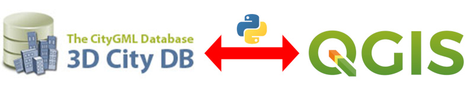
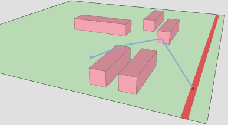
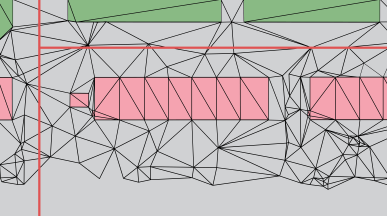
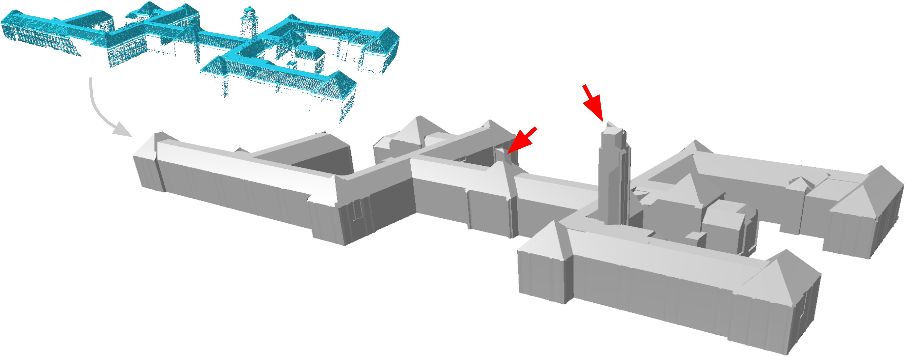
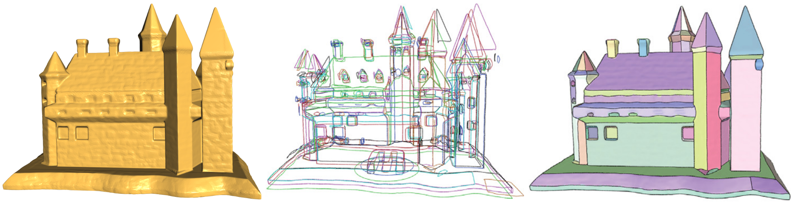
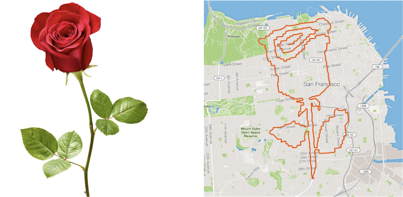
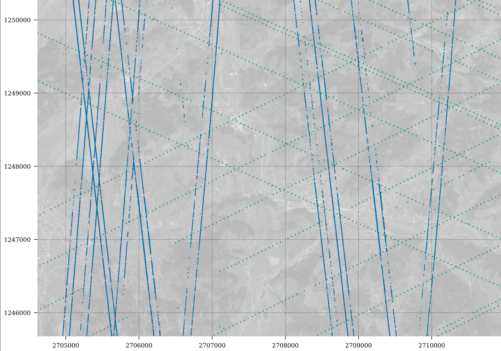
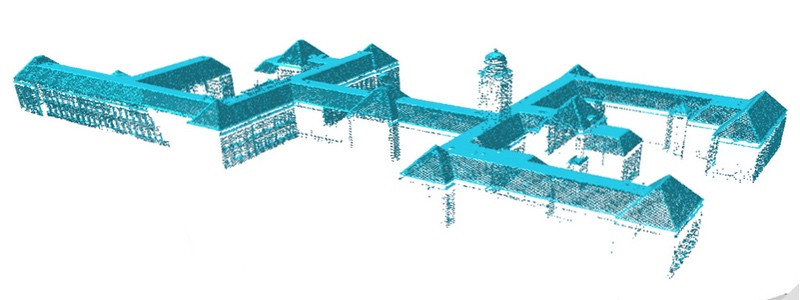

  <b>Heads up!</b> Theses done in our group should follow the <a href="https://3d.bk.tudelft.nl/courses/geo2020/openscience/">requirements for open science</a>.

- - -

* Table of Content
{:toc}

- - -

## Development and Testing of the Energy Extension for CityJSON (v1.x)

In the current time, there are some freeware simulation software tools to perform different energy simulation of buildings (SimStadt, CitySim), which support 3D City Models as input data and will produce results and exported following the [CityGML Energy ADE](https://opengeospatialdata.springeropen.com/track/pdf/10.1186/s40965-018-0042-y.pdf). The purpose of this master thesis is to design the Energy Extension to the main core of CityJSON v.1.x so it supports the storage of energy data of cases such as space heating energy demand or solar irradiation values to mention some. It has been documented that CityJSON Extensions and less flexible than CityGML ADEs so it is expected to identify and evaluate the existing limitations and if thay would mean critical losses. 

{:width="800px"}

It is desirable in this thesis to work in the consumption of this new datasets for visualization or analysis in existing software such as [Azul](https://github.com/tudelft3d/azul).

Attendance of elective course [GEO5014](https://studiegids.tudelft.nl/a101_displayCourse.do?course_id=52747) in Q5 (September 2021) is highly recommended, as many relevant topics needed for this thesis will be covered.

**Contact:** [Camilo León Sánchez](https://3d.bk.tudelft.nl/cleon/), [Ken Arroyo Ohori](https://3d.bk.tudelft.nl/ken) 

- - -

## Heating energy demand of the Dutch building stock with the help of the 3D BAG 2.0

The [3D BAG 2.0](https://3dbag.nl/en/viewer), a dataset containing LoD2 geometries of buildings of the whole Netherlands, has been recently released by the 3D Geoinformation group. The scope of this thesis is to test the suitability of the 3D BAG to estimate the energy demand of residential buildings. In this thesis, the energy demand computation will be based on the quasi-static energy-balance method and will implemement a Python-based subset of the specifications defined by the recently introduced Dutch norm [NTA8800](https://www.gebouwenergieprestatie.nl/).

{:width="800px"}

The thesis is a collaboration between the 3DGeoinformation group and the [Building Energy Epidemiology](https://www.tudelft.nl/bk/over-faculteit/afdelingen/management-in-the-built-environment/organisatie/leerstoelen/building-energy-epidemiology) group at TU Delft. Attendance of elective course [GEO5014](https://studiegids.tudelft.nl/a101_displayCourse.do?course_id=52747) in Q5 (September 2021) is highly recommended, as many relevant topics needed for this thesis will be covered.

**Contact:** [Giorgio Agugiaro](https://3d.bk.tudelft.nl/gagugiaro/) (3D Geoinformation Group), [Paula van den Brom](https://online-learning.tudelft.nl/instructors/paula-van-den-brom/) (Building Energy Epidemiology group)

- - -

## Dynamic energy simulations based on the 3D BAG 2.0 

The 3DGeoinformation has recently released the [3D BAG 2.0](https://3dbag.nl/en/viewer), a dataset containing LoD2 buildings of the whole Netherlands. [CitySim](http://www.kaemco.ch/download.php) is an open-source simulation software to perform different energy simulations for buildings/districts (e.g. space heating energy demand, solar irradiation, urban heat islands). The [3D City Database](https://www.3dcitydb.org/3dcitydb/) (3DCityDB) is the reference database for CityGML data (and its Energy ADE extension) where input AND output data will be stored.
The scope of this thesis is to link these three elements in order to allow for a seamless flow of information and perform energy simulations in CitySim. More specifically, the thesis will focus on (further) developing a Python-based bidirectional interface to feed/retrieve data between the 3DCityDB and CitySim.

{:width="800px"}

The thesis is a collaboration between the 3DGeoinformation group and the [Idiap Research Institute](https://www.idiap.ch/en/scientific-research/energy-informatics/index_html) in Switzerland. Attendance of elective course [GEO5014](https://studiegids.tudelft.nl/a101_displayCourse.do?course_id=52747) in Q5 (September 2021) is highly recommended , as many relevant topics needed for this thesis will be covered.

**Contact:** [Giorgio Agugiaro](https://3d.bk.tudelft.nl/gagugiaro/) (3DGeoinformation Group) and [Jérôme Kämpf](https://www.idiap.ch/en/people/directory/750) (Idiap).

- - -

## Development of a QGIS plugin for the CityGML 3D City Database

The goal of the thesis is to develop a plugin for QGIS 3 to interact with the open-source [3D City Database](https://www.3dcitydb.org/3dcitydb/) (3DCityDB, PostgreSQL/PostGIS version), which is the reference database implementation of the CityGML data model. The plugin will facilitate interaction with the 3D City Database from within QGIS, enabling the user to visualise 3D geometries and to edit attributes of all features (e.g. buildings, bridges, roads, etc.) contained in the database.

{:width="800px"}

The thesis is a collaboration between the 3DGeoinformation group and [Virtual City Systems](https://vc.systems/en/) in Germany, one of the companies developing the 3D City Database. 
Attendance of elective course [GEO5014](https://studiegids.tudelft.nl/a101_displayCourse.do?course_id=52747) in Q5 (September 2021) is highly recommended, as many relevant topics needed for this thesis will be covered.

Contact: [Camilo León-Sánchez](https://3d.bk.tudelft.nl/cleon/) & Giorgio Agugiaro (3D Geoinformation Group), [Claus Nagel](https://github.com/clausnagel) (Virtual City Systems)

- - -

## Optimizing building mesh designs for computational fluid dynamics using machine learning. 

Since one of the major burdens when performing computational fluid dynamic simulations (CFD) is to set up a good mesh, improving the current capabilities to mesh automatically complex geometries would have a large impact for the computational fluid dynamics community. This task becomes really essential when geometries are complex, such as high resolution level of detail buildings, and severals hundreds of simulations need to be run to quantify uncertainties.  

In this MSc thesis we will apply the automatic meshers available in OpenFOAM (SnappyHexMesh and cfMesh) and combined them with machine learning techniques to improve current mesh set-ups. We will start by simplified geometries with low level of detail, and increase progressively details. The results can potentially help us reducing the amount of time spent designing our city mesh, and thus allow us to perform faster analysis.   

If you work on this topic, you can expect to learn about mesh generation aligned with CFD best practice guidelines, set-ups and flow simulations. Programming experience and interest is an advantage for this topic. Your work will require to implement source code for the analysis of the set-ups (in C++ or Python). 

{:width="400px"}

**Contact:** [Clara García-Sánchez](https://cgarcia-sanchez.com) and [Ivan Pađen](http://3d.bk.tudelft.nl/ipaden).

- - -

## To mesh or not to mesh: immersed boundary methods and porosity in OpenFOAM.

One of the major burdens when performing computational fluid dynamic simulations (CFD) is to set up a good mesh. This task becomes really time consuming when geometries are complex, such as high resolution buildings. There are a few strategies to avoid the usage of an explicit mesh, but using immersed boundary methods or porosity definitions which in a very general description allow to construct regular meshes and represent the buildings through forces. 

In this MSc thesis we will apply the already developed immersed boundary method in OpenFOAM-extended and compare it with a porosity approach through several standarzied CFD study cases. The results can potentially help us reducing the number of buildings to be mesh explicitely, and therefore the amount of time spent designing our city mesh.  

If you work on this topic, you can expect to learn about CFD best practice guidelines, set-ups and flow simulations. You will also work with real experimental wind and turbulence data recorded in wind tunnels. Programming experience and interest is an advantage for this topic. Your work will require to implement source code for the analysis of the set-ups (in C++ or Python). 

{:width="800px"}

**Contact:** [Clara García-Sánchez](https://cgarcia-sanchez.com) and [Ivan Pađen](http://3d.bk.tudelft.nl/ipaden).

- - -

## Towards true 3D noise calculations

{:width="400px"}

The current implementations of noise calculation software simplify the environment into cross sections and 2D calculations. Such simplifications were necessary at the times when these software were created in order to make the calculations computationally feasible. Since then both hardware and algorithms evolved, potentially opening the door toward true 3D noise calculations.

The aim is to investigate how could we create a modern, efficient, true 3D noise calculation software, and if the added complexity is justified by the improved accuracy. Special attention needs to be given to make sure that noise experts are able to verify the correctness of the software.

This is a software focused project, in which you can expect to explore the geometry of sound propagation, 3D computations, data structures, learn the details of the European noise assessment method (CNOSSOS-EU) and/or the Dutch method.

This topic continues the work of the synthesis project *3D noise simulation based on advanced input data using automatically generated TINs* and is closely related to our research on [Automated reconstruction of 3D input data for noise studies](https://3d.bk.tudelft.nl/projects/noise3d/).

Potentially in collaboration with [RIVM](https://www.rivm.nl/) and/or [RWS](https://www.rijkswaterstaat.nl/).

**Contact:** [Balázs Dukai](http://balazsdukai.com/) and someone

- - - 

## How much detail is too much for 3D noise calculations?

{:width="400px"}

People generally assume that more detail leads to higher accuracy, also in noise calculations. However, there is no clear consensus on what is sufficient or superfluous when it comes to the geometric detail of input data. This makes it difficult to create a standardized input data set for noise calculations. 

The aim is to find out to what extent does the inclusion of more data detail improve the 3D noise calculations while staying computationally feasible. We are particularly interested in the geometric detail in terrain, buildings, ground types, bridges, noise barriers and any other object prescribed by the noise calculation method.

This is a data driven project in which you can expect to run many noise calculations, explore and investigate data sets, create your own data sets, learn the details of the European noise assessment method (CNOSSOS-EU) and/or the Dutch method.

This topic continues the work of the synthesis project *3D noise simulation based on advanced input data using automatically generated TINs* and is closely related to our research on [Automated reconstruction of 3D input data for noise studies](https://3d.bk.tudelft.nl/projects/noise3d/).

Potentially in collaboration with [RIVM](https://www.rivm.nl/) and/or [RWS](https://www.rijkswaterstaat.nl/).

**Contact:** [Balázs Dukai](http://balazsdukai.com/) and someone

- - -

## Web application for Urban Computational Fluid Dynamics Simulations Set-Up validation.

Performing computational fluid dynamics (CFD) simulations in urban environments entails many pre-run set-up features that can have a drastic impact in the simulations performance. For example, the extension of the domain should be large enough to limit blockage around the buildings, or the mesh resolution should be refined enough to ensure the flow results grid independence. Many of these pre-run processes can be partially automatic, and tools that quickly check if the simulation set-up respects the CFD guidelines can be developed.

In this MSc thesis we will develop a web application that allows to import CFD set-ups from users and check their compatibility with the most up to data CFD guidelines developed by the wind engineering community. The application will analyze the set-up and report back to the user with potential improvements, if needed. 

If you work on this topic, you can expect to learn about CFD best practice guidelines, set-ups and flow simulations, as well as web development. Programming experience and interest is an advantage for this topic. Your work will require to implement source code for the analysis of the set-ups (in C++ or Python) and the web interface (in HTML and JavaScript). 

{:width="400px"}

**Contact:** [Clara García-Sánchez](https://cgarcia-sanchez.com) and [Stelios Vitalis](http://3d.bk.tudelft.nl/svitalis).

- - -

## Extension of a GIS-supported design tool for new urban development areas

The thesis builds upon work carried out in previous MSc theses (e.g. [this](http://resolver.tudelft.nl/uuid:844b92d4-aa22-4ae7-b6c3-3b563dd3318e), check out the [video](https://www.youtube.com/watch?v=cPYT5_cFIgw) ) in which a first prototype of a geodata-supported design tool for new urban development areas was created. The tool is coupled with semantic 3D city models as a source of integrated spatial and non-spatial information.
The thesis will focus first on testing the existing tool and will then implement new functionalities. Possible examples are the computation of KPIs for urban analyses, 3D web-based visualisation and interaction interfaces, as well as scenarios management. The precise development focus of the thesis will be agreed upon with the student.

{:width="600px"}

The research will be carried out on a selected case study and in cooperation with the Cross Domain-City of the Future graduation [studio](https://www.tudelft.nl/en/education/programmes/masters/architecture-urbanism-and-building-sciences/msc-architecture-urbanism-and-building-sciences/master-tracks/architecture/programme/studios/city-of-the-future/), which focuses on how to design and develop in an integrated way a transformation area into an attractive future urban environment.

**Contacts:** [Giorgio Agugiaro](https://3d.bk.tudelft.nl/gagugiaro/), [Roberto Cavallo](https://www.tudelft.nl/en/staff/r.cavallo) 

- - -

## Coupling 3D city models with Ladybug tools for environmental analyses

The MSc thesis will focus on interoperability between the Ladybug tools and semantic 3D city models encoded in CityJSON and extended with the Energy ADE. The [Ladybug Tools](https://www.ladybug.tools/) are a collection of free applications that support environmental design and education. They are among the most comprehensive, connecting 3D Computer-Aided Design (CAD) interfaces to a host of validated simulation engines. The thesis builds upon a previous [MSc thesis](https://repository.tudelft.nl/islandora/object/uuid:fb35db7c-9af8-488c-8d0b-263b138d8fd3) completed in 2020.

Particular attention will be paid to energy-related topics in order verify how and to which extent the CityGML [Energy ADE](http://www.citygmlwiki.org/index.php/CityGML_Energy_ADE) (Application Domain Extension) can be used to deliver and store additional energy-related data needed by the Ladybug tools.

The students’ task will consist in choosing (together with the supervisors) a specific application covered by a Ladybug tool, to analyse the software and data requirements of the selected Ladybug tool(s) and to perform a mapping to underlying CityGML/Energy ADE data models. In addition, proper interfaces will have to be developed and tested by means of a concrete case study. This topic is available for up to *two students* (each one choosing a different application area).

**Contact**: [Giorgio Agugiaro](https://3d.bk.tudelft.nl/gagugiaro/) and [Hugo Ledoux](https://3d.bk.tudelft.nl/hledoux/)

- - -

## Improving automatic meshing for buildings

{:width="600px"}
Computational fluid dynamic simulations require detailed meshes that can represent obstacles features accurately. In numerical simulations, the quality of the mesh can draw the line between good and poor results. Nowadays, mesh tools are general and they are not necessarily optimised for meshing entire cities, requiring large time investments to design and improve the mesh quality.

This MSc project focuses on developing an algorithm that create the mesh automatically around buildings by specifying a limited number of parameters that define the grid cells sizes. The mesh will be generated from a top-up perspective, initially extruding the geometrical edges to create cell layers close to the buildings. The approach will be first tested in 2D single and multiple building geometries.

Knowledge of programming in python is required.
Following elective course GEO5013 is an advantage.

**Contact:** [Clara Garcia-Sanchez](mailto:C.Garcia-Sanchez@tudelft.nl) and [Hugo Ledoux](http://tudelft.nl/hledoux)

- - -

## Modelling tree topology effects on wind

Urban landscapes incorporate vegetation elements that serve for different purposes. In open spaces trees can be used to ameliorate air quality, while in other locations they can help to mitigate heat island effects or to improve pedestrian wind comfort. Flow simulations in urban canopies usually oversight resolving tree structures. However, trees have been shown to always affect the wind flow, in some cases with non-negligible impacts.

In this MSc thesis we will simulate explicitly the wind around diverse tree topologies. The results will be compared with standard approaches that approximate the drag imposed by the tree on the wind flow. The study goal is twofold: 1) we will analyze the effect of different tree shapes, and their impact on the flow structure; 2) we will evaluate the performance of  traditional drag approaches and explore potential improvements.

Knowledge of programming in python is highly desirable.

**Contact:** [Clara Garcia-Sanchez](mailto:C.Garcia-Sanchez@tudelft.nl)

- - -

## Inferring the needed building permission from a 3D building model

{:width="400px"}

In the Municipality of Rotterdam the building regulations are very different if a construction work on a roof is a dormer, an additional floor, or something else. It can be difficult to figure out what regulations apply for a given construction plan. To make this easier the municipality of Rotterdam would like to offer a tool that can automatically determine what permits are needed, given a 3D geometry of the building plans. The tool should be able to infer what kind of object is designed and provide to the designer the needed regulations and constraints.

In this research the aim is:
- to build a web application that can read an LoD2 CityJSON model of the current situation and allows the user to modify the building with the desired modifications;
- to develop a method that can infer what kind of object was designed in the web application (only objects on the roof will be considered) and deliver the related regulations accordingly.

**Contact:** [Francesca Noardo](http://www.noardo.eu) and [Stelios Vitalis](http://3d.bk.tudelft.nl/svitalis).

- - -

## Extracting building/storey/dwelling/room shapes from a BIM models

{:width="400px"}

Given a Building Information Model in Industry Foundation Classes (IFC) format, it is necessary to extract useful information for automatic processes, such as the building envelope, number of dwellings, storeys or rooms in the building and the respective volumes and dimensions, for example to support compliancy check with the urban regulations.

Prior algorithmic knowlegde, recursion, graph concepts could be beneficial.

In collaboration with Municipality of Rotterdam.

**Contact:** [Ken Arroyo Ohori](https://3d.bk.tudelft.nl/ken) and [Francesca Noardo](https://3d.bk.tudelft.nl/fnoardo/)

- - -

## Quality control and fusion of point cloud datasets in the Netherlands for building reconstruction

{:width="800px"}

There are several point cloud datasets available in the Netherlands. Apart from the well known AHN, the Dutch Kadaster maintains a national one derived from aerial imagery, and also some municipalities maintain their own point cloud (for example Rotterdam) as well as some commercial companies. These point clouds have different qualities, eg due to different acquisition techniques. And they have different acquisition dates and different update intervals. Typically the points clouds with higher quality are less often updated. 

For many applications it makes sense to use a combination of several point clouds: the highest quality point cloud where it is not outdated and the lower quality point cloud where there have been changes. The two point cloud applications that could be looked at are 1) reconstructed buildings and 2) terrain model (TIN).

The aims of this project would be to

* gain insight in the faults that occur in the different point clouds. Both consider general characteristics (eg. point density, noise, shadow, occlusion, vegetation penetration), but also some dataset specific problems. For instance in the image above we observe a part of the roof of a house that is several meters higher than it should be. Were does that error come from?

* Research what are the implications of combining different point clouds to get eg. a building/terrain dataset that is both as detailed as possible and as up-to-date as possible. It is possible to also involve other datasets like the BAG that have information on when buildings are modified. 

and possibly:

* How to prevent issues like the one in the image above? Can we smartly combine/fuse several point clouds to fix such issues?

**Contact:** [Ravi Peters](http://tudelft.nl/rypeters)

- - -

## Improving the automatic LoD2 building reconstruction from AHN3

{:width="800px"}

We have a working method to automatically reconstruct LoD2.2/LoD1.3 buildings from the AHN3 point cloud that we are using to construct LoD2 building models for the whole of the Netherlands. These models will for example be used as input data for noise simulation, and will be available as open data as part of the next version of our [3D BAG dataset](http://3dbag.bk.tudelft.nl).

The aim of this project will be to improve/extend the method with one or several of the following items:

* The detection of primitive shapes in roof structures such as speheres and cones. Currently the method can only detect planes. If we also detect other types of primitive we will be able to create more accurate models.
* Making the method work without requiring a building footprint as input (next to the point cloud). Currently the method 'forces' the boundary of the model to exactly follow the BAG footprint. However, these are not always accurate and may include underground parts of the building that we would like to ignore.

Programming required, C++ recommended.

**Contact:** [Ravi Peters](http://tudelft.nl/rypeters)

## 3D Cadastre

{:width="700px"}

Since more than 15 years, lots of studies have been done on 3D Cadastre to register multilevel ownership in a transparent and proper way.
In 2016, we realised the first 3D cadastral situation [3D cadastral registration]( https://3d.bk.tudelft.nl/news/2016/03/21/3DKadaster.html) in the Netherlands.
However, there is still a gap between research and practice. In this research you will analyse how a Level of Detail Framework, that defines specifc solutions for specific 3d cadatsre problems may help to close the 3D cadastre research-to-practice gap.
The idea is explained in [this](https://www.fig.net/resources/proceedings/fig_proceedings/fig2020/papers/ts04e/TS04E_stoter_ho_et_al_10503.pdf) short paper

*Contact:* [Jantien](http://3d.bk.tudelft.nl/jstoter) 

- - -

## Snap rounding in a triangulation

{:width="500px"}

The most common way to do merge adjoining datasets from different sources or to clean small inconsistencies within and between datasets is to apply snapping (point-to-point or point-to-line).
Snap rounding extends this method in order to give robustness guarantees, like a minimum distance between points or points to lines, but current implementations, such as [the one in CGAL](http://doc.cgal.org/latest/Snap_rounding_2/index.html), are *extremely* slow.
Related to this, in the project [pprepair](https://github.com/tudelft3d/pprepair), we have previously used a constrained triangulation as a robust method to repair polygons and planar partitions.
Using this approach topological errors are automatically fixed.
We think that using a triangulation as a base structure is an intuitive and efficient way to optimize snap rounding, since we can perform simple snapping and recover from topological errors afterwards.

The existing prototype ([pprepair](https://github.com/tudelft3d/pprepair) has been developed in C++, and the best libraries are also in C++, so knowledge of C++---or a strong desire to learn it---is necessary.

**Contact:** [Ken Arroyo Ohori](https://3d.bk.tudelft.nl/ken)

- - -

## Synthesizing semantically meaningful building details 

LoD2 building models can now be easily generated from footprints and point cloud data (e.g., [3D BAG](http://3dbag.bk.tudelft.nl)). Such models lack meaningful facade structures (e.g., doors, windows, and balconies) and thus not suitable for some real-world applications such as virtual reality. The goal of this project is to enrich the realism of given coarse models. In this project, we want to synthesize semantically meaningful facade and roof details onto existing LoD2 models. The resulting models should have a plausible appearance (e.g., conforming to design rules or images of real-world buildings).

**Required Skills**:
(1) Proficient in programming (C++ preferred). (2) It would be interesting to explore learning-based approaches, so you may need to follow courses in machine learning (e.g., deep learning) before or at the beginning of the project. (3) Experience in mesh processing is a plus.

 <strong> Attention</strong>:
You must discuss your ideas with the supervisor before this topic can be offered to you.

**Contact**: [Liangliang Nan](https://3d.bk.tudelft.nl/liangliang/)

- - -

## Curve network extraction for MVS building meshes

MVS (multi-view stereo) building models have become more and more popular in recent years, typically obtained by standard photogrammetry or computer vision pipelines. These models are dense triangular meshes consisting of piecewise smooth surfaces. The boundaries of the smooth regions naturally form a curve network that conveys the high-level topological structure of the building. This project aims at extracting curve networks from MVS building models and exploring how the extracted curve networks can be used for processing of the models, e.g., piecewise smooth segmentation and simplification.

**Required Skills**: 
(1) Proficient in programming (C++ preferred). (2) It would be interesting to explore learning-based approaches, so you may need to follow courses in machine learning (e.g., deep learning) before or at the beginning of the project. (3) Experience in mesh processing is a plus.

 <strong> Attention</strong>:
You must discuss your ideas with the supervisor before this topic can be offered to you.

**Contact**: [Liangliang Nan](https://3d.bk.tudelft.nl/liangliang/)

- - -

## Image-guided artistic route finding

Creating artistic routes requires tedious user interaction and is not friendly for non-artist users. This project aims at automating artistic route creation by image abstraction and deformable shape matching. The research questions to be answered:

* How to extract abstracted, expressive, clean, and continuous lines/curves from an image? 
* How can the abstracted image be used to guide route-finding such that the resulting route is as faithful/close as possible to the extracted image lines/curves?
* How to keep the route as smooth as possible? How to minimize repeated pathways (which sometimes are unavoidable)?
* How to evaluate the faithfulness of the generated route (e.g., quantitatively measure the similarity between the route and the abstracted image)? How to evaluate the aesthetic quality of the generated route?
* How to incorporate user preferences into route creation, e.g., a desired total length, preferred start point and endpoint, and must-have route segment(s)?

**Required Skills**: 
(1) Proficient in programming (C++ preferred). (2) Familiar with graph theory and computational geometry.

 <strong> Attention</strong>:
You must discuss your ideas with the supervisor before this topic can be offered to you.

**Contact**: [Liangliang Nan](https://3d.bk.tudelft.nl/liangliang/)

- - -

## Integrated modelling of utility networks in the urban environment

In the framework of Smart Cities, the MSc thesis will focus on interoperability issues when it comes the heterogeneous utility networks (e.g. gas, water, electricity, sewage, district heating, telecommunications, etc.) that are found in the urban environment.
Starting from a CityGML-based 3D city model, the Msc. thesis will focus on testing the Utility Network ADE (Application Domain Extension) and compare it to existing or newly proposed standards (IMKL or MUDDI), based on a concrete case study which will be agreed upon with the student. 
The image shown here is taken from a previous [thesis](https://repository.tudelft.nl/islandora/object/uuid:fed24b16-cf95-4fa0-a109-ece6e91b61e9?collection=education) and serves as example - and starting point - of the overall topic of the thesis proposed here.

**Contacts**: [Giorgio Agugiaro](https://3d.bk.tudelft.nl/gagugiaro/) and [Jantien Stoter](https://3d.bk.tudelft.nl/jstoter/)

- - -

## Performance and robustness of software libraries for computational geometry

{:width="500px"}

Software libraries for computational geometry underpin a lot of our research, but an in-depth comparison of how these different software libraries behave in terms of performance and robustness is not available. For example, the feasability of multi-disciplinary use of geometry in BIM/GIS integration and automated thermal analysis of IFC building models is largely shaped by the characteristics of the algorithmns offered in open source libraries such as CGAL and Open CASCADE. This research project is an opportunity to publish something novel, useful and relevant to many disciplines.

*Contact:* [Thomas Krijnen](mail@thomaskrijnen.com)

---

## Automatic repair of 3D city models

{:width="400px"}

Most 3D city models that are publicly available contain so many geometric errors (self-intersections, missing faces, duplicate vertices, etc.) that [they are more or less unusable in practice](https://speakerdeck.com/hugoledoux/how-useful-are-current-3d-city-models).

The aim of this project is to __automatically__ repair 3D city models, we can focus on the [publicly available models](https://3d.bk.tudelft.nl/opendata/opencities/) so there is plenty of data to play with.
While repair is a very-complex issue (if all cases are to be handled), this project will target the most common errors, and fix them. 
The [val3dity server](http://geovalidation.bk.tudelft.nl/val3dity/) has been logging all the validation reports for the last 4 years, so a starting point will be to analyse those and focus on what is most easy and has an impact.
Duplicate points and non-planar surfaces are pretty easy to solve; and for single polygons we [already have working code (prepair)](https://github.com/tudelft3d/prepair).
After that, more complex operators (eg [those from CGAL](https://doc.cgal.org/latest/Polygon_mesh_processing/index.html)) could be used.

The project is difficult to be done in Python, C++ is necessary (but it's a great way to improve!).
CityJSON files will be used, you will not have to deal with (the pain of parsing) CityGML files, I promise.

*Contact:* [Hugo Ledoux](https://3d.bk.tudelft.nl/hledoux)

---

## Building floor count determination by Convolutional Neural Network

{:width="300px"}

Accurately knowing the number of floors of a building is an important factor when assessing the built environment. However, there is no accurate global dataset that contains this information. Simple techniques like diving the total building height by an average height per floor are sometimes used, but this obtains merely an approximation.

In collaboration with the company [Superworld](https://www.superworld.nl), the idea is to develop a method that uses images (eg Google Street View) and a base map (eg BAG in the Netherlands) to automatically derive the number of floors in a building using Convolutional Neural Networks (CNN). 

**Contact:** [Ken Arroyo Ohori](https://3d.bk.tudelft.nl/ken)

---

## Creation of a sample dataset of construction of additional floors on top of existing building

{:width="300px"}

Additional floors are sometimes added to buildings for various reasons, such as redensification. However, this is a complex process subject to technical and legal issues.

In collaboration with the company [Superworld](https://www.superworld.nl), the idea is to develop a method that uses publicly available datasets (eg BAG) and building permit applications in order to create a reference dataset containing all buildings where a vertical extension or a construction on top of an existing building have been conducted. Such a dataset can then be used to give a confidence factor for the feasibility of an extension to an existing building.

**Contact:** [Ken Arroyo Ohori](https://3d.bk.tudelft.nl/ken)

- - -

## Space lidar to estimate the height of all buildings in the world?

{:width="300px"}

By using the recent LiDAR [satellite ICESat-2](https://icesat-2.gsfc.nasa.gov/) data, one can potentially measure the height of buildings, see [those very recent results](https://iopscience.iop.org/article/10.1088/2634-4505/abf820).

The problem is that the data is very sparse (kilometres with no data) and thus a global coverage is difficult.

The projects aims at reimplementing, and perhaps improve, the methodology above (eg filtering and classification of the points) and build a training dataset that could be used to train a machine learning network (similar to [this MSc thesis last year of Imke Lánský](https://repository.tudelft.nl/islandora/object/uuid:ddcae7d1-6cc8-42a7-8c1d-a922ec7551f0?collection=education)).

The idea is to use the [3DBAG dataset](https://3dbag.nl) as a start, and see how this can be applied to other areas.

This topic would be in collaboration with [Deltares](https://www.deltares.nl) (Maarten Pronk, who gave the guest lecture in GEO1015), and thus the [Julia programming language](https://julialang.org/) is preferred (since they already have some code to help you start). 

**Contact**: [Hugo Ledoux](https://3d.bk.tudelft.nl/hledoux/)

- - - 

## Something with streaming TINs for massive datasets

{:width="300px"}

The AHN3 dataset contains a lot of points (600+ billions), and while these are useful on their own, some applications would benefit from having a TIN, isocontours, objects extracted from them, etc.

You learned in GEO1015 how to create a Delaunay TIN, and for massive ones the theory about [streaming geometries](https://www.cs.unc.edu/~isenburg/papers/ilss-scdt-06.pdf) was explained.

The aim of this project is to extend the work already done ([sst](https://github.com/hugoledoux/sst/) + one ongoing MSc thesis about simplification) and do *something* with all those points.
Exactly what I am not sure yet, but if you like the challenge of dealing with several billions of points, then we can find a good topic. Isolines extraction, or gridding, or improving the code and scale to the whole of the Netherlands are potential examples.

*Contact:* [Hugo Ledoux](https://3d.bk.tudelft.nl/hledoux)

- - - 

## Filling the gaps in aerial point clouds with deep learning

{:width="500px"}

Because of the way they are collected, aerial point cloud datasets acquired with lidar often contain areas with no measurements.
This occurs mostly for building façades and other vertical surfaces (eg in dormers), but other features can be affected.
The gaps in the datasets are problematic for the processing of point cloud, for instance automatic reconstruction algorithms can fail or output 3D models with several artefacts.

The aim of this research project is to design and implement methods to complete aerial point clouds datasets such as the AHN3 dataset (that is fill those gaps).
The idea is to investigate how new developments in deep learning (specifically DeepSDF, [see article](https://arxiv.org/abs/1901.05103)) and to adapt it to aerial point clouds.
The focus would be in the first place on buildings, so that their regularity and verticality could be exploited.

The student would be expected to take a machine learning and/or deep learning course as elective.

*Contact:* [Hugo Ledoux](https://3d.bk.tudelft.nl/hledoux) + [Ravi Peters](http://tudelft.nl/rypeters) + [Weixiao Gao](https://3d.bk.tudelft.nl/weixiao/)