

  <b>Heads up!</b> Theses done in our group should follow the <a href="https://3d.bk.tudelft.nl/courses/geo2020/openscience/">requirements for open science</a>.

- - -

* Table of Contents
{:toc}

- - -

## Integration of 3DcityDB + Energy ADE into a Solar Potential Analysis Engine
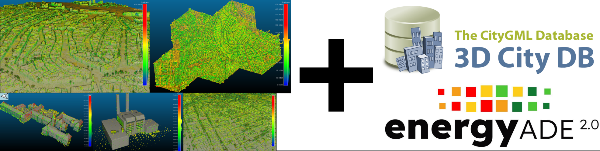{:width="800px"}

This MSc thesis topic builds upon the work in Longxiang Xu’s MSc thesis project, [“High-resolution, large-scale, and fast calculation of solar irradiance with 3D City Models”](https://repository.tudelft.nl/record/uuid:d97174a3-3e1b-4e64-8de0-33a6ec2c48b2). Therefore, it is planned to extend, review, and update current functionalities, and to add new ones. Among the new functionalities expected are:
•⁠  ⁠Provide support for loading CityObjects into the simulation scene via a 3DcityDB instance.
•⁠  ⁠Enable writing results to a 3DCityDB + Energy ADE instance.
•⁠  ⁠Allow selection of CityObjects for simulation (i.e., computing the solar potential of a selected building within a scene).
•⁠  ⁠Generation of appearances based on the simulation results and export them to a 3DcityDB instance.

Attendance of elective course [GEO5014](https://studiegids.tudelft.nl/a101_displayCourse.do?course_id=67386) in Q5 is _highly_ suggested, as relevant topics needed for this thesis will be covered. Proficiency in programming is a plus, preferably C++. Before picking the topic, please contact us!

**Contact:** [Camilo León Sánchez](https://3d.bk.tudelft.nl/cleon/), [Giorgio Agugiaro](https://3d.bk.tudelft.nl/gagugiaro/), 

- - -

## Too cool or too hot? Cooling and heating demand scenarios based on the semantic 3D city model of Rotterdam
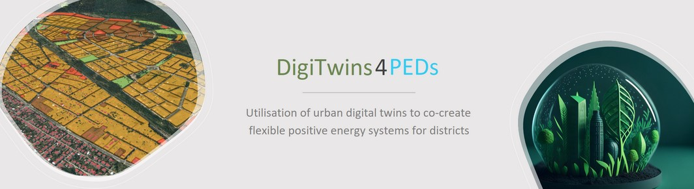{:width="800px"}

This thesis is embedded within the European project [DigiTwins4PEDs](https://digitwins4peds.eu), which investigates how Urban Digital Twins can be exploited to foster the trasformation of urban districts into PEDs (Positive Energy Districts).
As the municipality of Rotterdam is one of the project partners, the topic of the thesis will be to investigate how different scenarios of energy demand for heating _and_ cooling can be computed and managed for the building stock using the CityGML-based 3D city model of Rotterdam. Additionally, a "smart" and systematic way to deal with scenarios (data, metadata, results, etc.) will have to be developed within the thesis.

Attendance of elective course [GEO5014](https://studiegids.tudelft.nl/a101_displayCourse.do?course_id=67386) in Q5 is _highly_ suggested, as relevant topics needed for this thesis will be covered.

You will programm mainly in Python, and you will interact with the 3DCityDB using a bit of PL/pgSQL, too.
Before picking the topic, please contact us!

**Contact:** [Camilo León Sánchez](https://3d.bk.tudelft.nl/cleon/), [Giorgio Agugiaro](https://3d.bk.tudelft.nl/gagugiaro/), 

- - -

## IFC in PostgreSQL/PostGIS

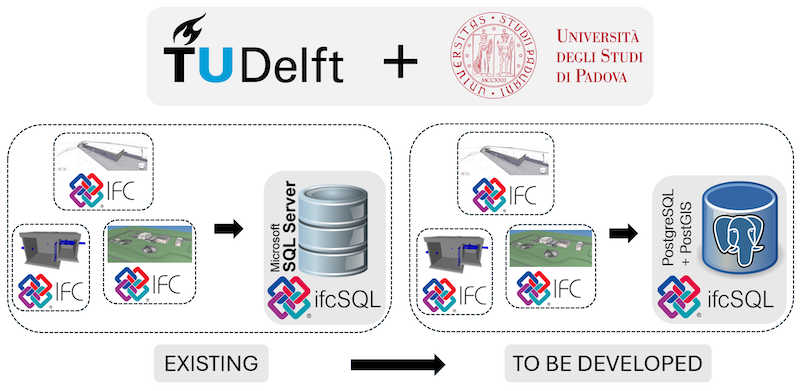{:width="800px"}

The Industry Foundation Classes (IFC) schema is a widely used open standard for Building Information Modeling (BIM). IFC data mostly rely on files for storage, but storing such data in databases has the potential to improve the handling multiple - possibly very large - datasets, performing therefore spatial and non-spatial queries and integrating them with other systems.
 
Database implementations of IFC exist, such as the one inside BIMserver, but perhaps the most interesting one is [IfcSQL](https://github.com/IfcSharp/IfcSQL), which currently runs only on Microsoft SQL Server. However, Microsoft SQL is not open and provides very limited spatial functionalities (e.g. no 3D support at all), which means that only very basic spatial queries can be run – and limited to 2D.
 
Two are the main goals of this thesis: the first one is to port the database schema of IfcSQL to PostgreSQL/PostGIS. The second one is to investigate how the spatial functionalities of PostGIS can be exploited for IfcSQL, either directly at database level (e.g. via PL/pgSQL functions) or by developing a python-based interface.
The usability of the developed solution will be tested in the context of water infrastructure management use cases and in collaboration with the University of Padua, Italy, and the development team of IfcSQL.
 
**Requirements**: GEO1006 and GEO1004, suggested: GEO5014
 
**Contact persons**: [Ken Arroyo Ohori](https://3d.bk.tudelft.nl/ken/en/), [Giorgio Agugiaro](https://3d.bk.tudelft.nl/gagugiaro/)

- - -

## Creation of planar partitions from mismatched datasets

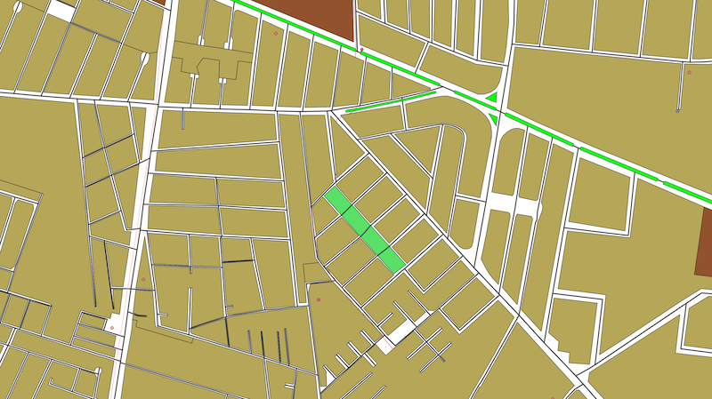{:width="800px"}

Many GIS applications are based around a planar partition of polygons—a set of polygons covering the map with no overlaps and no gaps between them. For example, 3D city models are generally built by raising polygons representing building footprints, roads, water bodies, etc. to different heights according to different rules.

However, good planar partition datasets are relatively rare. For many countries and cities, there’s only linear data for many features (e.g. roads, railways, rivers, etc). In other cases, the different features come from different sources and do not fit neatly together. Finally, there’s also data that is missing altogether and can only be computed based on the gaps in other data using more complex rules (e.g. roads from the space between parcels or terrain from the remainder of all other features.

The goal of this thesis would be to create a robust method to create planar partitions from multiple datasets based on customisable rules (e.g. line buffers, priority lists, Boolean set ops, etc). Another possibility would be a narrower thesis focussing on creating more detailed data for only one of these types, such as in [this thesis](https://3d.bk.tudelft.nl/ken/files/24_chengzhi.pdf).

**Requirements**: proficiency in programming, preferably with C++.

**Contact:** [Ken Arroyo Ohori](https://3d.bk.tudelft.nl/ken/en/)

- - -

## Different heuristics for CGAL polygon repair

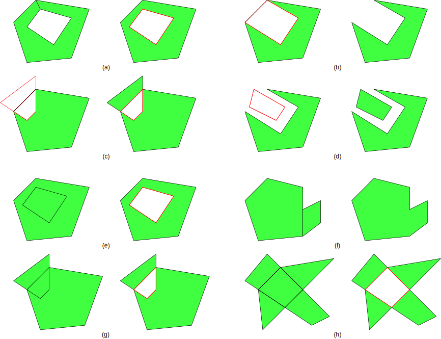{:width="500px"}

Invalid polygons are a common headache for GIS practitioners. There are a number of methods and tools to deal with them, including the new [Polygon repair](https://doc.cgal.org/6.0-beta1/Polygon_repair/index.html) package of CGAL.

Included in that package, so far there’s only one repair method based on the odd-even rule. This works by starting from the exterior of the polygon and every time that a line is crossed one switches from the exterior to the interior of the polygon and vice versa. However, this is not a one-size-fits-all problem and it would be best to have several repair methods based on different heuristics, such as Boolean set union (merger of all rings into one shape) or difference (inner rings should always carve out holes in the polygon).

The goal of this thesis would be to investigate what other heuristics are useful in practice and to implement them.

**Requirements**: proficiency in C++ programming, some familiarity with CGAL would be desirable.

**Contact:** [Ken Arroyo Ohori](https://3d.bk.tudelft.nl/ken/en/)

- - -

## Urban mesh segmentation

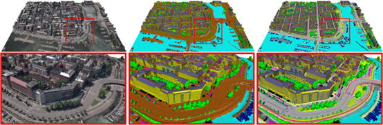{:width="800px"}

The aim of this research is to develop instance or semantic segmentation methods for urban meshes. 
We will equip students with datasets, annotation tools, backbone networks, and pre-formulated ideas to facilitate the successful completion of this project. 
Your task is to enhance the performance of existing 3D segmentation methods to achieve better results on urban textured mesh data. 
You will learn about the most advanced deep learning techniques for 3D semantic segmentation tasks and/or interactive 3D annotation strategies. 
The outcomes of this research are eligible for publication in high-quality journals or conference proceedings. 
Additionally, students have the freedom to choose an additional co-supervisor. 
Participants in this project can select from the following three research directions:
1. Develop automatic or interactive instance segmentation methods for urban objects.
2. Develop semantic segmentation methods for urban meshes and their textures.
3. Develop a local adaptive receptive filed approach for 3D semantic segmentation of urban scenes.

**Requirements:** 1) Experiences in mesh processing. 
2) Proficiency in Python or C++ programming. 3) Knowledge of machine learning or deep learning.

**Contact:** [WeixiaoGao](https://3d.bk.tudelft.nl/weixiao), [Hugo Ledoux](https://3d.bk.tudelft.nl/hledoux/).

- - -

## Spatial intelligence for applications in semantic 3D city models

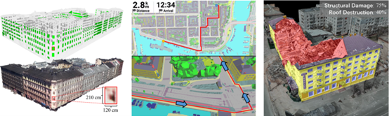{:width="800px"}

The goal of this research is to develop spatial intelligence applications for semantic 3D city models. 
We will provide datasets and research guidelines to facilitate students' successful completion of the project. 
Your task is to develop prototypes of algorithms related to applications based on 3D city models. 
You will learn about cutting-edge spatial intelligence computing methods and their applications in semantic 3D urban models. 
The findings from this study can be published in high-quality journals or conference papers. 
Additionally, students have the option to choose a secondary supervisor. 
Participants in this project can choose from the following four research directions:
1. Develop a method for arranging solar panels on roofs to enhance solar potential estimation.
2. Create prototypes for semantic-based automatic geometric measurements.
3. Develop a routing method for pedestrian or vehicle navigation using 3D maps.
4. Design a language model for interpreting or editing 3D city models.

**Requirements:** 1) Experiences in 3D city models analysis and processing. 
2) Proficiency in Python or C++ programming. 3) Knowledge of spatial analysis or computational geometry or deep learning.

**Contact:** [WeixiaoGao](https://3d.bk.tudelft.nl/weixiao), [Hugo Ledoux](https://3d.bk.tudelft.nl/hledoux/).

- - -

## Citizen Voices in Climate Action: Developing digital platforms for citizen engagement in climate planning and design

Municipalities worldwide are developing plans and strategies to deal with increasing climate risks. Many of these interventions require citizen support and active participation, e.g., adopting solar PV panels or green roofs or increasing biodiversity in private backyards. Other strategies require people to change their behaviour and social norms. There is, therefore, a need to meaningfully engage citizens in climate strategies. Digital tools provide a means to do so with the potential to reach a large number of citizens. In this context, the [Citizen Voice Initiative](https://zenodo.org/records/12169892) has developed several prototypes for citizen engagement in urban planning and design: (1) [Citizens meet Climate (CmC)](https://zenodo.org/records/12183035): A digital participatory platform to empower citizens to take climate action and (2) [BIO-CiVo](https://zenodo.org/records/12180644): A digital platform to support citizens in improving neighbourhood biodiversity. Navigate through the prototypes: 

[CmC](https://tinyurl.com/PrototypeCmC)

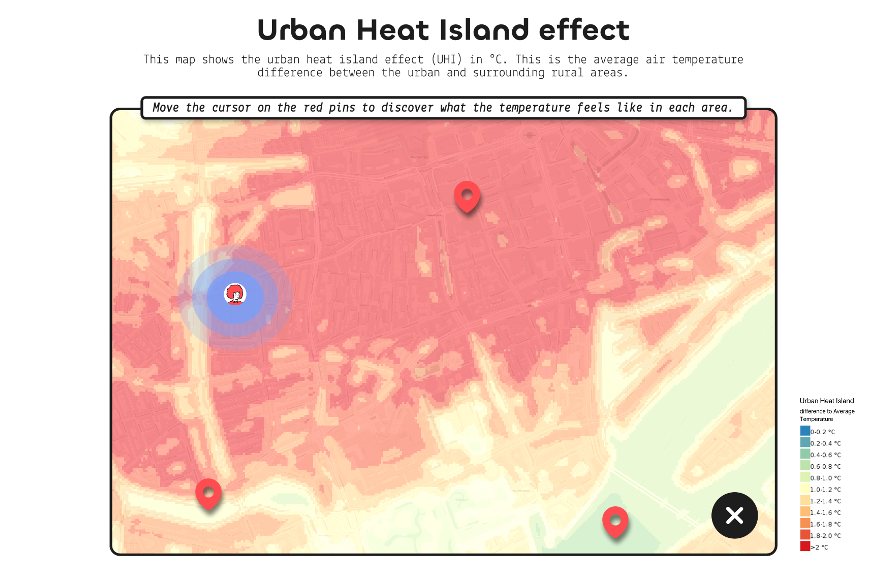{:width="800px"}

[BIO-CiVo-Evaluation Tool](https://edu.nl/geeax), and [BIO-CiVo-Building Tool](https://edu.nl/96erf)

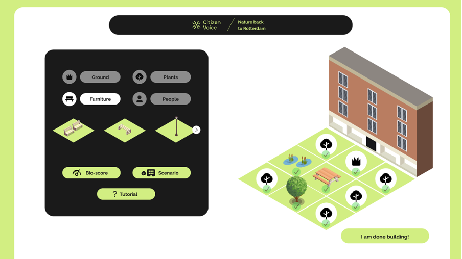{:width="800px"}

The MSc thesis will develop these prototypes into real platforms. This entails (1) translating the prototypes from Figma to URL in a static form and (2) progressively developing the interactive features, which include e.g., maps (present in all prototypes), the use of different types of spatial data (climate data in the CmC prototype) and 3D environment (BIO-CiVo-Building).

If you choose this topic, you can expect to learn about citizen engagement, web development, and spatial data handling. Programming experience and interest are advantages of this topic.

**Contact:** [Clara Garcia-Sanchez](https://3d.bk.tudelft.nl/gsclara), [Juliana Goncalves](https://www.tudelft.nl/staff/j.e.goncalves/)

## Revealing energy inequalities in The Netherlands

With technological advances and decreasing prices, solar energy is a key technology in the urban energy transition. The current policy focus on increasing the overall installed capacity via financial mechanisms has overshadowed energy justice considerations, leading to inequalities in solar energy adoption. This pattern of inequality is bound to deepen as financial mechanisms continue to be the preferred policy choice for other energy transition interventions, such as heat pumps or renovation incentives.

The MSc thesis will delve into questions of energy justice through the use of spatial data. To start the topic, you will delve into the work by [Kraaijvanger et al., (2023)](https://www.sciencedirect.com/science/article/pii/S2214629623003055#sec6), which reveals socio-spatial inequalities in the transition to solar energy in The Hague, The Netherlands. You will extend their work in one of these two directions (1) go beyond solar PV to look into heat pumps and renovation incentives, or (2) go beyond The Hague and create a map of energy inequalities in The Netherlands. The direction depends on your interests as well as on data availability.

If you choose this topic, you can expect to learn about spatial justice, energy transition technologies, and spatial analysis.

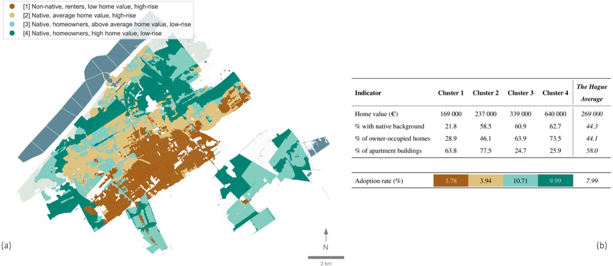{:width="800px"}

Figure: (a) Spatial distribution of the four access groups across the The Hague per PC5 zone. A short description of the characteristics of each group/cluster is provided in the legend presented in the top left of the figure. (b) The upper table in Figure b provides the mean values of the clusters for each of the indicators. This is compared with the average values for the respective indicator observed in the city. The lower table in Figure b presents the adoption rate across each cluster. The adoption rate (%) is defined as the percentage of residential buildings with solar PV systems ([Kraaijvanger et al., 2023](https://www.sciencedirect.com/science/article/pii/S2214629623003055#sec6)).

**Contact:** [Clara Garcia-Sanchez](https://3d.bk.tudelft.nl/gsclara), [Juliana Goncalves](https://www.tudelft.nl/staff/j.e.goncalves/)

- - -

## Developing an open-source GIS pipeline tailored for FastEddy

{:width="800px"}

Within the past year, we have been actively collaborating with the National Center for Atmospheric Research (NCAR) which recently developed [Fast Eddy](https://ral.ucar.edu/fasteddy), a resident GPU code, that is capable of running large urban microclimate simulations with high efficiency. Our collaboration aims to develop an open-source GIS pipeline that allows the automatic reconstruction of urban environments that can be swiftly prepared and used within their Fast Eddy framework. 

The MSc thesis will entail the full chain of the tailored automatic reconstruction (related to the work performed within GEO1004) starting by exploring the impact that the different projections available within their boundary software [WRF](https://www.mmm.ucar.edu/models/wrf) can have, the available footprint and point cloud data in the areas of interest, and finishing by the translation into the language that FastEddy uses [netcdf](https://www.unidata.ucar.edu/software/netcdf/). The thesis does NOT include running their fluid dynamics code. 

If you choose this topic, you can expect to learn about automatic geometry reconstruction and GIS data handling. Programming experience and interest is an advantage for this topic. Your work might require to implement source code (in C++ or Python or any other language you prefer).

**Contact:** [Clara Garcia-Sanchez](https://3d.bk.tudelft.nl/gsclara), [Hugo Ledoux](https://3d.bk.tudelft.nl/hledoux)

- - - 

## Water (level) detection with ICESat-2 measurements

{:width="600px"}

ICESat-2, a spaceborne lidar system, can measure terrain elevations every 0.7m along its ground track.
As such, it can be seen as a profiling lidar, drawing cross-sections over the Earth.
When combined with a water mask, it can also be used to measure water levels.
For this topic we will investigate automatic water (level) detection methods, making use of the multiple return pattern that ICESat-2 exhibits over strong reflectors such as water (see figure).
If successful, we could update and expand mangrove and wetland maps (which are now based on optical imagery) critical for conservation purposes and carbon stock models.
The method(s) should be able to scale to the full ICESat-2 dataset (1 PB), and therefore ideally be implemented in the Julia programming language (if you know C++ and Python it's not very difficult to learn Julia, we can help).

**Contact:** [Maarten Pronk](https://www.evetion.nl/) + [Hugo Ledoux](https://3d.bk.tudelft.nl/hledoux)

- - -

## Filling the massive gaps in space lidar datasets with a diffusion model

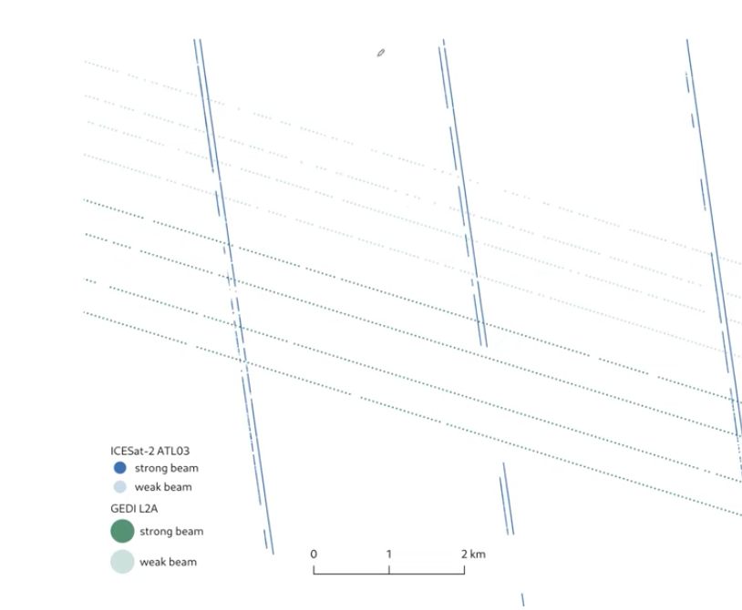{:width="300px"}

As you saw during the GEO1015 lecture of Maarten Pronk, space lidar datasets, [ICESat-2](https://icesat-2.gsfc.nasa.gov/) and [GEDI](https://gedi.umd.edu/), have very sparse distribution (often kilometres with no data) and thus a global coverage is difficult.

The aim of this thesis is to test, compare to others, and further develop the deep learning diffusion model presented [in this paper](https://doi.org/10.1109/LGRS.2024.3403835).

The [project has open-source code](https://github.com/kylelo/Diff-DEM), Python can be used.

**Contact:** [Hugo Ledoux](https://3d.bk.tudelft.nl/hledoux/) + [Maarten Pronk](https://evetion.nl)

- - - 

## The effect of different LoDs of indoor geometry from IFC models for ventilation applications
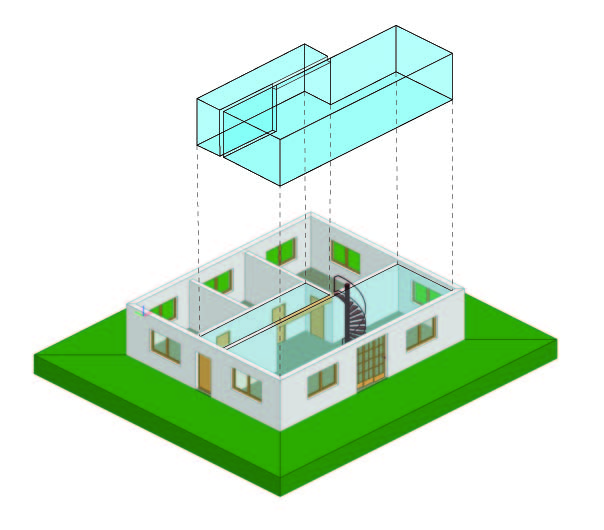{:width="530px"}
To conduct Computational Fluid Dynamics (CFD) simulations for indoor ventilation, a 3D model of the room is essential. 
Automating the reconstruction of room geometries for these simulations can significantly enhance efficiency for architects and engineers, allowing them to focus on optimising ventilation solutions. 
The level of detail in the reconstructed room model is a critical factor, yet there is no standard definition of LoD for indoor ventilation simulations.

This MSc thesis aims to explore the relevant levels of detail for indoor ventilation applications. 
You can expect to work with IFC models, voxelisation techniques, and indoor CFD simulations.
We recommend you look at the [current work](https://github.com/jaspervdv/IFC_BuildingEnvExtractor) for exterior LoD abstraction of IFC models.

**Contact:** [Nadine Hobeika](https://3d.bk.tudelft.nl/nhobeika), [Jasper van der Vaart](https://3d.bk.tudelft.nl/jvdvaart/), [Clara Garcia-Sanchez](https://3d.bk.tudelft.nl/gsclara)

- - -

## Influential geometric parameters for indoor ventilation

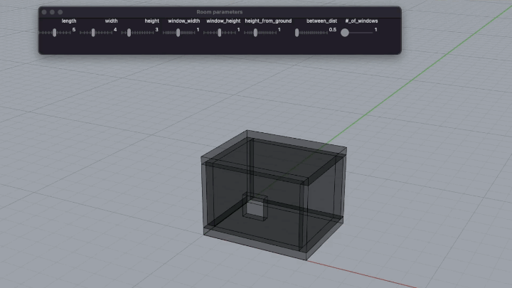{:width="700px"}

Different geometrical design parameters impact the ventilation airflow in a room differently.
Researchers have typically studied the room's height, the dimension and position of the inlet and outlet of mechanical ventilation, and the ratio of window-to-volume-of-room.
However, most studies evaluate the ventilation efficiency of the room from the volumetric perspective of the room rather than from the perspective of breathing individuals.
Optimising the design of a room based on the most sensitive parameters for an individual is still an important step in enhancing the design of rooms for better ventilation at the breathing level.

In this thesis, you can expect to work with parametric generation of 3D geometry, CFD simulations, OpenFoam, and optimisation algorithms.

**Contact:** [Nadine Hobeika](https://3d.bk.tudelft.nl/nhobeika), [Clara Garcia-Sanchez](https://3d.bk.tudelft.nl/gsclara)

- - -

## Urban microclimate simulations using vegetation

The aim of this project is to use the OpenFoam solver created by the ETH Zurich to perform simulations of urban microclimates at the neighbourhood scale to test several vegetation models ([here](https://gitlab.ethz.ch/openfoam-cbp/solvers/urbanmicroclimatefoam)). Simulations should be performed over the university campus of TU Delft using the City4CFD as an input for building geometry.
From the outcomes of this MSc thesis, it will be expected to:
1. Generate the simulation domain and meshing from a set of buildings that can be selected in the 3DBAG;
2. Specify boundary conditions from weather data;
3. Perform simulations on a test case located in the university campus of TU Delft;
4. Study the outdoor air temperature resulting from various vegetation models that are specified in the urbanMicroclimateFoam solver.

{:width="500px"}

The prerequisites for this project are basic knowledge in CFD simulations, programming skills in C/C++, and experience in using Unix operating system.

*Contact:* [Miguel Martin](https://miguelmartin.org/) & [Clara Garcia-Sanchez](https://3d.bk.tudelft.nl/gsclara)

- - -

## Urban microclimate simulations @ TU Delft

The aim of this project is to use the OpenFoam solver created by the ETH Zurich to perform simulations of urban microclimates at the neighbourhood scale ([here](https://gitlab.ethz.ch/openfoam-cbp/solvers/urbanmicroclimatefoam)). Simulations should be performed over the university campus of TU Delft using the City4CFD as an input for building geometry.
From the outcomes of this MSc thesis, it will be expected to:
1. Generate the simulation domain and meshing from a set of buildings that can be selected in the 3DBAG
2. Specify boundary conditions from weather data;
3. Perform simulations on a test case located in the university campus of TU Delft; and
4. Study the various output variables that can be obtained from the urbanMicroclimateFoam solver.

{:width="500px"}

The prerequisites for this project are basic knowledge in CFD simulations, programming skills in C/C++, and experience in using Unix operating system.

*Contact:* [Miguel Martin](https://miguelmartin.org/) & [Clara Garcia-Sanchez](https://3d.bk.tudelft.nl/gsclara)

- - -

## Automatic creation of detailed building energy models from 3DBAG

The aim of this project is to develop a procedure from which a sequence of detailed building energy models can be automatically created from the 3DBAG. From the models, it should be possible to estimate the energy consumed by buildings at the neighbourhood scale using the EnergyPlus simulation program (<a href="https://energyplus.net/">here</a>). The procedure should be implemented in Python.
This project is a continuity of another MSc thesis on inferring the residential building type from 3DBAG (<a href="https://3d.bk.tudelft.nl/education/#theses">here</a>). From the outcomes of this MSc thesis, it will be expected to:
1. Identify material properties, internal heat gains, and HVAC systems for each type of buildings;
2. Include these information in EnergyPlus template files;
3. Automatically create a sequence of detailed building energy models from EnergyPlus template files and 3DBAG;
4. Perform simulations (in sequence or in parallel) to assess the energy consume by buildings at the neighbourhood scale and evaluate retrofitting strategies.

The prerequisites for this project are basic knowledge in building physics and programming skills in Python.

**Contact:** [Dr. Miguel Martin](https://3d.bk.tudelft.nl/mmartin/); [Camilo Leon-Sanchez](https://3d.bk.tudelft.nl/cleon/)

- - -

## The Utrecht – BARCODE  - Between Planning, Modelling, and Participation: modelling and communicating the effects of urban densification

Michael Batty (2022) recently stated, “Despite a wide array of new tools embodying different theories, the gulf between planning theory and practice remains. … for this, the challenge is for model-builders and users to work in practice and for practitioners to work with theory”.
In this spirit, the proposed graduation projects focus on further developing the Utrecht BARCODE. The Utrecht BARCODE is a planning tool developed by the city planning department, and part of the is the Ruimtelijke Strategie Utrecht (RSU 2040, which quantifies and communicates the spatial needs of a growing city to develop a sustainable, just and healthy way using the 10-minute city concept. Policymakers acclaim the BARCODE for its clear and quantitative communication and practitioners for the simple way of visualising the complexity of future urban development needs.

This graduation project focuses on two aspects of the Barcode:
-	The first concerns i) streamlining and increasing the automation of calculating and visualisation of the Barcode for existing Areas; and ii) calculating the project’s effect on the Barcode of an area and its 10-minute catchment area.
-	The second involves i) developing a four-by-four block-wide 3D model of the city that allows illustrating potential changes according to the 10-minute city project and ii) developing and implementing a switchboard that allows different users to choose their priorities, which are then displayed in the 3D model.

The Department of Urbanism collaborates with the City of Utrecht in the [New European Bauhaus](https://new-european-bauhaus.europa.eu/index_en) project. Therefore, the graduation student may be able to interact with researchers and creatives across Europe.

{:height="400"}

Prerequisites: QGIS, Proficiency in programming languages such as R.

**Contact:** [Daniele Cannatella](https://3d.bk.tudelft.nl/dcannatella/); [Alex Wandl](https://www.tudelft.nl/en/staff/a.wandl/?cHash=842e397ae7c998ecc880d440e2a0ccf0)

- - -

## Investigating Predictive Modeling for Land Use Planning and Management 

This graduation project focuses on predictive modelling and its role in land use planning and management. This project aims to provide valuable insights into future land use planning by exploring various factors that influence land use change and evaluating the effectiveness of different modelling approaches. In this MSc thesis, you will delve into the physical, environmental, and socio-economic factors that shape land use patterns. By analysing the impacts of land use policies, you will contribute to the foundation of effective decision-making processes in sustainable land management.

Key objectives of this project include, among others:

1.	Identifying the factors that significantly influence land use change: You will investigate a range of physical, environmental, and socio-economic factors and their relationship with land use dynamics making as much as possible use of open data. This analysis will contribute to understanding the underlying drivers of land use change.
2.	Evaluating different modelling approaches: Considering the varying scale and resolution of land use and other spatial data, you will explore and compare different modelling techniques. This analysis will help identify the most suitable algorithms for specific land use tasks.
3.	Assessing the performance of predictive algorithms: By comparing the performance of different algorithms, you will assess their accuracy, efficiency, and applicability to land use prediction. This evaluation will provide insights into the strengths and limitations of each approach.
   
Prerequisites: QGIS, Proficiency in programming languages such as R or Python and knowledge of machine learning concepts.

**Contact:** [Daniele Cannatella](https://3d.bk.tudelft.nl/dcannatella/)

- - -

## Designing a Nature-Based Solutions Planning Support System

This project aims to develop an innovative tool that facilitates the integration and implementation of nature-based solutions in urban planning processes. In this MSc thesis, you will delve into the field of nature-based solutions, which involve using nature-inspired approaches to address various environmental challenges while providing social and economic benefits. Your objective will be to design a planning support system that enables decision-makers and stakeholders to identify, evaluate, and prioritize nature-based solutions for different contexts.

Key objectives of this project include, among others:

1.	Literature review and best practices analysis: You will conduct an in-depth review of existing literature and case studies related to nature-based solutions. By analysing successful examples, you will identify key design principles and considerations for the planning support system.
2.	System architecture and interface design: Based on the identified design principles, you will develop a conceptual architecture and user-friendly interface for the planning support system. This system should facilitate data integration, analysis, visualization, and decision-making related to nature-based solutions.
3.	Integration of spatial and non-spatial data: You will explore methods for integrating diverse data types, including spatial data (e.g., land cover, ecosystem services) and non-spatial data (e.g., socio-economic indicators, climate data). The system should enable data-driven analysis and decision-making processes.
Prototype development and evaluation: Using appropriate software tools, you will develop a functional prototype of the planning support system. You will then evaluate its usability, functionality, and effectiveness through user feedback and case study applications.

Prerequisites: Proficiency in GIS and software development (e.g., QGIS, R, Python) and understanding of nature-based solutions and urban/landscape planning.

**Contact:** [Daniele Cannatella](https://3d.bk.tudelft.nl/dcannatella/)

- - -

## Development of the *client-side* part of the 3DCityDB-Tools plugin for QGIS to support CityGML 3.0 data

The [3DCityDB-Tools](https://github.com/tudelft3d/3DCityDB-Tools-for-QGIS) plugin for QGIS allows to conveniently use CityGML/CitySON data stored in the free and open-source [3D City Database](https://www.3dcitydb.org/3dcitydb/) (3DCityDB). For the new 3DCityDB v.5.0, which introduces support for CityGML 3.0., a MSc thesis has already investigated and developed the (PostgreSQL-based) server-side part of the plugin.
  
The scope of this thesis is build upon it and to develop the client-side part of the plugin, thus facilitating the user's interaction with CityGML 3.0 data in the database using the usual QGIS GUI, instead of writing SQL commands. 

{:width="800px"}

Attendance of elective course [GEO5014](https://studiegids.tudelft.nl/a101_displayCourse.do?course_id=67386) in Q5 is _highly_ suggested, as relevant topics needed for this thesis will be covered.

You will programm mainly in Python, you will learn how to use the Qt libraries, and you will need to use (a bit of) PL/pgSQL, too.
Before picking the topic, please contact us!

**Contact:** [Giorgio Agugiaro](https://3d.bk.tudelft.nl/gagugiaro/)

- - -

## Adding support for CitySim to the 3DCityDB-Tools plugin for QGIS

[CitySim](http://www.kaemco.ch/download.php) is an open-source simulation software to perform different energy simulations for buildings/districts (e.g. space heating energy demand, solar irradiation, urban heat islands). The [3DCityDB-Tools](https://github.com/tudelft3d/3DCityDB-Tools-for-QGIS) plugin for QGIS allows to conveniently use CityGML/CityJSON data stored in the free and open-source [3D City Database](https://www.3dcitydb.org/3dcitydb/) (3DCityDB).
The scope of this thesis is to extend to QGIS plugin in order to allow for data preparation, run CitySim's energy simulations, collect and analyse of the simulation results from within QGIS by developing a GUI dialog and extending a bidirectional interface between the two software packages. A python-based first prototype of the interface was already partially developed in a [thesis completed in June 2022](http://resolver.tudelft.nl/uuid:3ae123bd-cae4-45b2-be48-27ffe5cab980). The ultimate goal is to allow for a seamless flow of information and to perform energy simulations in CitySim exploting the added value of a semantic 3D city model encoded using the CityGML data model.

{:width="800px"}

The thesis is a collaboration between the 3DGeoinformation group and the [Idiap Research Institute](https://www.idiap.ch/en/scientific-research/energy-informatics/index_html) in Switzerland. Attendance of elective course [GEO5014](https://studiegids.tudelft.nl/a101_displayCourse.do?course_id=67386) in Q5 is highly recommended, as many relevant topics needed for this thesis will be covered.

You will programm in Python and in PL/pgSQL.
Before picking the topic, please contact us!

**Contact:** [Giorgio Agugiaro](https://3d.bk.tudelft.nl/gagugiaro/), [Camilo León Sánchez](https://3d.bk.tudelft.nl/cleon/)

- - -

## Accuracy assesment of EnergyBAG (in-house urban energy building simulation tool)
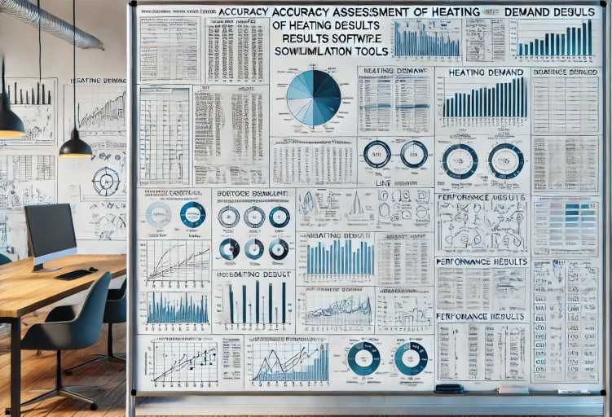{:width="800px"}

The aim of this MSc thesis is the evaluation of the output EnergyBAG, an in-house urban energy building simulation software tool (UBES) develop by Camilo León-Sánchez during his PhD research.

The scope of the research is to asses the accuracy of the results obtained by the UBES while computing the energy demand of buildings while pointing possible source of errors in the workflow. It is expected to use other existing UBES in this research such as [SimStadt](https://simstadt.hft-stuttgart.de/), [CitySim](http://www.kaemco.ch/download.php), [City Energy Analyst (CEA)](https://www.cityenergyanalyst.com/) or [EnergyPlus](https://energyplus.net), to mention some.

Attendance of elective course [GEO5014](https://studiegids.tudelft.nl/a101_displayCourse.do?course_id=67386) in Q5 is highly recommended, as many relevant topics needed for this thesis will be covered.

**Contact:** [Camilo León Sánchez](https://3d.bk.tudelft.nl/cleon/), [Giorgio Agugiaro](https://3d.bk.tudelft.nl/gagugiaro/)

- - -

## Development of a Graphical User Interface for EnergyBAG in-house urban energy building simulation tool)
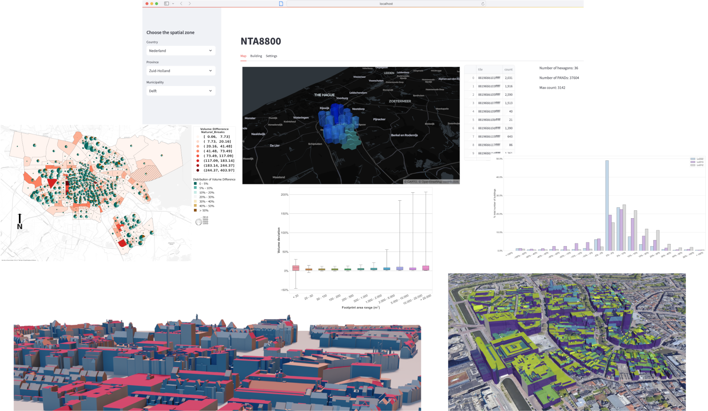{:width="800px"}

The scope of this MSc thesis is the design and development of a web-based Graphical User Interface (GUI) that enables the interaction with EnergyBAG, an in-house urban energy building simulation software tool (UBES) develop by Camilo León-Sánchez during his PhD research.

Within its functionalities, the GUI should allow 3D visualization of semantic 3D city models (3DCM) and generate graphs and plots that aggregate the output of the simulation tool. Data are managed in a 3DCityDB instance that supports the Energy ADE.

Attendance of elective course [GEO5014](https://studiegids.tudelft.nl/a101_displayCourse.do?course_id=67386) in Q5 is highly recommended, as many relevant topics needed for this thesis will be covered.

**Contact:** [Camilo León Sánchez](https://3d.bk.tudelft.nl/cleon/), [Giorgio Agugiaro](https://3d.bk.tudelft.nl/gagugiaro/)

- - -

## The effects of building model automatic reconstruction methods for CFD simulations

The digitalization of the architecture and the build environment means that there is a new wealth of digital data that can help generate city scale models. However, not all these sources allow for models to be created of the same quality. The effects of different quality or alternatively abstracted models on CFD has been sparsely evaluated. Even more rare is the evaluation of models that fall outside of the established LoD frameworks e.g., voxelated and marching cubed models.
 
In this thesis these different models and their effects on CFD simulations will be evaluated. Based on these results it might be possible to do suggestions or set up rules to describe viable models that can be used for CFD processing. Extensions to other parts of City analysis could be made as well if desired.

If you choose this topic you can expect to work with building models, voxelization and computational fluid dynamic simulations performed with OpenFOAM. 

{:width="800px"}

**Contact:** [Clara Garcia-Sanchez](https://3d.bk.tudelft.nl/gsclara), [Jasper van der Vaart](https://3d.bk.tudelft.nl/jvdvaart/)

- - -

## Development on quality assessment of point cloud datasets
Rijkswaterstaat is transitioning into a data-driven organization, with 3D point cloud data playing a crucial role in the work processes and digital twin vision.The effectiveness of the current research project, which focuses on merging different 3D point clouds into the Integrated Heightdataset of the Netherlands (IHN), relies on the validation process as a key component. Therefore the focus of this MSc thesis is to research the possibilities for validating the quality of point clouds received from large infrastructure projects like the Moerdijkbridge zone or tunnels in the area of Rotterdam. If you choose this topic, you will have the opportunity to work for the Department of Advice and Validation of Geodata at Rijkswaterstaat, with access to numerous amount of elevation data products and the opportunity to contribute to the digital twin & IHN research projects.

Programming experience and interest is an advantages for this topic. Your work might require to implement source code for the analysis on different large point clouds (in C++, Python or any other language you prefer).

{:width="800px"}

**Contact:** [Daan van der Heide](https://3d.bk.tudelft.nl/dvdheide/),  [Jantien Stoter](https://3d.bk.tudelft.nl/jstoter/)

- - -

## Using urban morphology to optimize biking and running routes in cities?

RIVM monitoring tool [NSL tool](https://www.nsl-monitoring.nl/), provides information regarding air pollution in streets for the most areas in the Netherlands. The tool uses urban morphology along other parameters to estimate local air quality. 

{:width="400px"}

Within this MSc thesis we will exploit urban morphologies and NSL monitoring to optimize running and biking paths within Netherlands urban areas. For that open source tools such as [momepy](http://docs.momepy.org/en/stable/), and previously developed approaches such as [de Jongh thesis](http://resolver.tudelft.nl/uuid:fdbff288-fede-4796-9972-54627af0db77) (see image attached) will be explored. 

**Contact:** [Clara Garcia-Sanchez](https://3d.bk.tudelft.nl/gsclara), [Hugo Ledoux](https://3d.bk.tudelft.nl/hledoux/)

- - -

## Predicting pedestrian wind comfort and thermal comfort with Large-Eddy Simulations in uDALES

Pedestrian wind and thermal comfort still remain an important topic in the development of future urban scenarios. Considering the current climate change conditions, with increased frequency in heat waves and extreme weather events, the way we design our cities can further impact their resilience and comfort. Computational fluid dynamics (CFD) approaches can help us improving and adapting future and current urban designs to maximize sustainability and comfort. To maximize the predictability capabilities approaches such as Large-Eddy Simulations [LES](https://en.wikipedia.org/wiki/Large_eddy_simulation) can be used to resolve most of the urban scales and model uniquely the small scales. 

{:width="400px"}

Within this MSc thesis we will exploit the capabilities of open-source tools such as [uDALES](https://github.com/uDALES/u-dales) to predict wind and thermal comfort in real urban scenarios. The initial set-up focuses on using part of the Clementi neighbourhood in Singapore, which was already set-up by previous MSc thesis to run RANS simulations in [Opsomer](https://repository.tudelft.nl/islandora/object/uuid%3A97304da6-8938-48eb-8117-ca53321b1e34?collection=education). Considering the demanding computational capabilities required by LES, this area can be potentially reduced, or other test cases can be also explored. Attendance of elective course [GEO5015](https://studiegids.tudelft.nl/a101_displayCourse.do?course_id=57094) in Q4 or similar CFD knowledge is required. 

**Contact:** [Clara Garcia-Sanchez](http://3d.bk.tudelft.nl/gsclara), [Ivan Pađen](http://3d.bk.tudelft.nl/ipaden)

- - -

## Optimizing building mesh designs for computational fluid dynamics using machine learning 

Since one of the major burdens when performing computational fluid dynamic simulations (CFD) is to set up a good mesh, improving the current capabilities to mesh automatically complex geometries would have a large impact for the computational fluid dynamics community. This task becomes really essential when geometries are complex, such as high resolution level of detail buildings, and severals hundreds of simulations need to be run to quantify uncertainties.  

In this MSc thesis we will apply the automatic meshers available in OpenFOAM (SnappyHexMesh and cfMesh) and combined them with machine learning techniques to improve current mesh set-ups. We will start by simplified geometries with low level of detail, and increase progressively details. The results can potentially help us reducing the amount of time spent designing our city mesh, and thus allow us to perform faster analysis.   

If you work on this topic, you can expect to learn about mesh generation aligned with CFD best practice guidelines, set-ups and flow simulations. Programming experience and interest is an advantage for this topic. Your work will require to implement source code for the analysis of the set-ups (in C++ or Python). 

{:width="400px"}

**Contact:** [Clara García-Sánchez](http://3d.bk.tudelft.nl/gsclara) and [Ivan Pađen](http://3d.bk.tudelft.nl/ipaden)

- - -

## To mesh or not to mesh: immersed boundary methods and porosity in OpenFOAM

One of the major burdens when performing computational fluid dynamic simulations (CFD) is to set up a good mesh. This task becomes really time consuming when geometries are complex, such as high resolution buildings. There are a few strategies to avoid the usage of an explicit mesh, but using immersed boundary methods or porosity definitions which in a very general description allow to construct regular meshes and represent the buildings through forces. 

In this MSc thesis we will apply the already developed immersed boundary method in OpenFOAM-extended and compare it with a porosity approach through several standarzied CFD study cases. The results can potentially help us reducing the number of buildings to be mesh explicitely, and therefore the amount of time spent designing our city mesh.  

If you work on this topic, you can expect to learn about CFD best practice guidelines, set-ups and flow simulations. You will also work with real experimental wind and turbulence data recorded in wind tunnels. Programming experience and interest is an advantage for this topic. Your work will require to implement source code for the analysis of the set-ups (in C++ or Python). 

{:width="800px"}

**Contact:** [Clara García-Sánchez](http://3d.bk.tudelft.nl/gsclara) and [Ivan Pađen](http://3d.bk.tudelft.nl/ipaden).

- - -

## Semantically enriching the 3D BAG

{:width="400px"}

With the 3D BAG we have LoD2.2 building models for the whole of the Netherlands. Unfortunately the semantics of these models is still very simplistic (only a very basic classification of wall/roof/floor surfaces is present). The goal of this project would be to develop an automatic method to semantically enrich these models by labeling rooftop structures such as chimneys, A/C units and dormers and/or detecting facade elements such as doors and and windows. This is to be achieved by analysing the geometry of the existing 3D BAG models, the source point cloud and/or (oblique) aerial photographs.

Programming required in python/C++.

**Contact:** [Hugo Ledoux](https://3d.bk.tudelft.nl/hledoux) + [Ravi Peters](http://tudelft.nl/rypeters)

- - -

## 3D Cadastre

{:width="700px"}

Since more than 15 years, lots of studies have been done on 3D Cadastre to register multilevel ownership in a transparent and proper way.
In 2016, we realised the first 3D cadastral situation [3D cadastral registration]( https://3d.bk.tudelft.nl/news/2016/03/21/3DKadaster.html) in the Netherlands.
However, there is still a gap between research and practice. In this research you will analyse how a Level of Detail Framework, that defines specifc solutions for specific 3d cadatsre problems may help to close the 3D cadastre research-to-practice gap.
The idea is explained in [this](https://www.fig.net/resources/proceedings/fig_proceedings/fig2020/papers/ts04e/TS04E_stoter_ho_et_al_10503.pdf) short paper

*Contact:* [Jantien](http://3d.bk.tudelft.nl/jstoter) 

- - -

## Performance and robustness of software libraries for computational geometry

{:width="500px"}

Software libraries for computational geometry underpin a lot of our research, but an in-depth comparison of how these different software libraries behave in terms of performance and robustness is not available. For example, the feasability of multi-disciplinary use of geometry in BIM/GIS integration and automated thermal analysis of IFC building models is largely shaped by the characteristics of the algorithmns offered in open source libraries such as CGAL and Open CASCADE. This research project is an opportunity to publish something novel, useful and relevant to many disciplines.

*Contact:* [Thomas Krijnen](mail@thomaskrijnen.com) or [Ken Arroyo Ohori](https://3d.bk.tudelft.nl/ken/en/)

- - - 

## Something with streaming TINs for massive datasets

{:width="300px"}

The AHN3 dataset contains a lot of points (600+ billions), and while these are useful on their own, some applications would benefit from having a TIN, isocontours, objects extracted from them, etc.

You learned in GEO1015 how to create a Delaunay TIN, and for massive ones the theory about [streaming geometries](https://www.cs.unc.edu/~isenburg/papers/ilss-scdt-06.pdf) was explained.

The aim of this project is to extend the work already done ([sst](https://github.com/hugoledoux/sst/) + one [MSc thesis about simplification](http://resolver.tudelft.nl/uuid:e7df1d5a-8819-40aa-a3d1-1f6d50b8a39e)) and to add new operators useful for practitioners.
Exactly what I am not sure yet, but if you like the challenge of dealing with several billions of points, then we can find a good topic. The main ones are creating grids with interpolation and isolines extraction.

*Contact:* [Hugo Ledoux](https://3d.bk.tudelft.nl/hledoux)

- - - 

## Developing methods for edge-matching with customisable heuristics (geometric, topological and semantic)

{:width="300px"}

The methodology will be studied from a use case of Statistics Netherlands (CBS).

CBS is responsible for the bi-annual publication of the land use register (in Dutch: Bestand Bodem Gebruik or BBG).
In this dataset, ground level land use for areas of 1 ha or larger is classified into 20+ land use categories. The area demarcation and classification have, up till now, been done manually. In the manual process CBS uses a combination of aerial imagery and a selection of cadastral topographical maps. 
CBS is developing a new methodology to automatically combine topographical information and other administrative (register-based) datasets (with a manual fine-tuning post-process, if needed).
By overlaying and prioritizing polyline-based planes from a set of different topographical data sources, adding attributes to these areas from administrative data sources, and applying a number of geo-processes, a new set of planar partitions is created. 
These automatically generated planar partitions will inevitably have some differences with the reference (manually coded) BBG year 2017, either in shape or in category. 
The challenge is on developing a method for describing and detecting important categorization and delineation issues, based on deviations from earlier versions of the BBG and developing (semi) automated solutions to solve these issues, in order to minimize the required manual post-processing. This also includes solving gaps, overlaps and disconnections, in the context of the neighboring areas.
There are different heuristics feasible, an important one being the combination size and the nature of the deviating area. In such a heuristic, small differences in size combined with a less important categorization difference (e.g. street and living area) are of less importance than a big difference in size and an important difference (e.g. forest vs living area). 
 
**Contacts:** [Jantien Stoter](https://3d.bk.tudelft.nl/jstoter/) + [Ken Arroyo Ohori](https://3d.bk.tudelft.nl/ken/en/) + someone at [CBS](https://www.cbs.nl/en-gb)

- - - 

## Modern metadata for CityJSON
{:width="400px"}

The standard [CityJSON](https://cityjson.org)--developed by us!--has some support for metadata. First [its core has a few useful properties](https://www.cityjson.org/specs/1.1.1/#metadata), and second there is an Extension (the [MetadataExtended Extension](https://github.com/cityjson/metadata-extended)) where most of the ISO19115 properties can be used.
The issue is that ISO19115 is being replaced in practice by [The SpatioTemporal Asset Catalog (STAC) specification](https://stacspec.org/) and by the [OGC API -- Records](https://github.com/opengeospatial/ogcapi-records/).
Those are targeted at imagery and (mostly) other 2D datasets.
The aim of the project is to create a [STAC extension](https://stac-extensions.github.io/) so that 3D city models in CityJSON be indexed/searched, and to (potentially) modify CityJSON.
The project is quite exploratory, and will necessitate to build a prototype on the web where the ideas are demonstrated; see [this page for some relevant links](https://www.cityjson.org/experimental/restful/) and work done by other MSc Geomatics students.
This projects fits in the new vision of the OGC to be "cloud-native", see that [interesting blog post](https://www.ogc.org/blog/4609).
Why the photo of the dog? Because I thought everyone would skip reading this if they see "metadata" in the title...

**Contact:** [Hugo Ledoux](https://3d.bk.tudelft.nl/hledoux/)

---

## Supporting earthquake risk assessment by 3D city models

Earthquake risk assessment models predict the probability of buildings being damaged due to earthquakes. These models make use of building typologies that describe the cluster of buildings with similar seismic vulnerabilities. The recent advances in digital transformation of the built environment presented new opportunities to conduct earthquake risk studies at individual building level instead of clustering similar buildings. Such a change in the risk modeling would have a tremendous effect on the studies related to finding collapse vulnerable buildings before a destructive earthquake.
In this thesis, the MSc student will investigate how the required parameters defining the building typology can be automatically derived from 3D city models and if more parameters can be derived to refine the typology for improving the earthquake risk assessment models. Examples are: geometry-complexity of the roof (single or dual pitch), the height of the vertical walls and surface of roofs (to estimate the mass), height of the free standing veneer walls, storey-heights etc. For the research, a validation data set is available consisting of 400 buildings in Groningen for which the parameters were collected in a field survey.

**Contact:** [Jantien Stoter](https://3d.bk.tudelft.nl/jstoter/), in collaboration with Ihsan Bal, Professor in Earthquake Resistant Structures, Hanze University of Applied Sciences Groningen & Research Centre for Built Environment NoorderRuimte.

---

## Reconstructing 3D apartment units from legal apartment drawings 

Ownership rights concerning apartments are registered by The Netherland’s Cadastre (Kadaster) in deeds that divide complete apartment complexes into individual units, the so called ‘splitsingsaktes’.  These (originally analague) deeds contain floor plans that show how the units are divided per floor. Kadaster would like to converting these scanned 2D floor plans into 3D geometries positioned in geographical space to obtain a subdivision of 3D building models into apartment units.
Up till now, a pipeline was developed to vectorize the information from the 2D floor plans. The end results are 2D polygons describing the separate floors. To obtain the 3D geometry, the original building geometry needs to be reconstructed. This includes scaling and georeferencing the 2D polygon results, as well as finding ways to properly position the different floors of an apartment complex in 3D. The main research focus will be on the 3D reconstruction of the apartment units. Questions to address are: What (additional) information would be needed to georeference and scale the floor plans? Can information be obtained from the textual part of the deed for this? What would be proper ways to position building floor plans in 3D? Could the story heights be estimated?

**Contact:** [Jantien Stoter](https://3d.bk.tudelft.nl/jstoter/), in collaboration with Kadaster

- - - 
## 3D delineation of urban river spaces

A wide range of applications in riverside urban areas, including flood mitigation, transport planning, ecological restoration, and public space design, rely on an accurate spatial description of riverside urban spaces. While methods of spatial delineation based on 2D geospatial data exist [Forgaci, 2018](https://books.bk.tudelft.nl/press/catalog/book/isbn.9789463661096), a method for automated spatial delineation based on 3D data is missing. A 3D delineation method would enable to better capture the spatial qualities of urban river spaces. 

This thesis will develop a 3D delineation method for urban river spaces adapting an existing 2D delineation method. The method will be based on 3D data [3D BAG](www.3dbag.nl), point cloud and other elevation data) for use in any riverside urban area where such data is available. The thesis will make as much as possible use of open data and will address challenges and opportunities regarding the scalability of the method within the Netherlands and globally.

**Contact:**  [Jantien Stoter](https://3d.bk.tudelft.nl/jstoter/) and [Claudiu Forgaci](https://www.tudelft.nl/staff/c.forgaci/)

- - - 

## Estimating noise pollution with machine learning?
{:width="300px"}

The government needs to produce so-called "noise maps", that is maps showing where the noise levels are higher than a certain threshold that is considered for the well-being and health of citizens ([site of RIVM on the topic](https://www.rivm.nl/geluid)).
These maps are created by using models of the noise, and not by measuring the values everywhere.
These models are rather complex, and preparing and collecting the (3D) data necessary are time-consuming and intensive tasks (see [a recent project by the 3d geoinformation group](https://doi.org/10.1016/j.compenvurbsys.2019.101424), and [a Synthesis project in 2020](https://github.com/Constantijn-Dinklo/3D_Noise_Modelling/blob/master/documentation/Final_report_Synthesis_project.pdf)). 

The aim of this MSc thesis is to learn from those models (and/or samples collected on the ground) and to build a model with machine learning that will predict the noise pollution in an area.

I think that features related to the urban morphology (density of buildings, height of buildings, wideness of streets, etc), the distance to noise sources (roads, factories, etc), and vegetation could be good predictors.
But I don't know, this would be for you to tell me if this is indeed the case.

The project can be done with Python, scikit-learn, and crunching of many (3D) data about cities.

**Contact:** [Hugo Ledoux](https://3d.bk.tudelft.nl/hledoux/)

- - - 

## How can 3D alpha wrapping be best used to repair buildings?
{:width="600px"}

The CGAL project has just released, in beta version, a new package: [3D alpha wrapping](https://cgal.geometryfactory.com/CGAL/doc/master/Alpha_wrap_3/index.html#Chapter_3D_Alpha_wrapping), which can be used to repair pretty much any 3D input.
It guarantees that you'll obtain a 2-manifold that is "watertight" and free of intersections.

As can be seen in the figure above (taken from their website), it works by *refining* the surface (and uses the alpha-shape concept) and thus to recover sharp edges (very frequent in 3D buildings) many Steiner points are added and we obtain a lot of triangles (which takes a lot of time to run, and those are unwanted).

The project would be to explore how we can either modify this algorithm so that it performs good for 3D buildings, or how can we post-process the output and remove points and/or simplify the mesh.
One application of those repaired 3D models is that we can use them for CFD simulations, so we could focus on that application. Or be generic, this can be discussed.

Also, how the semantics of surfaces could be preserved from the input, or inferred for the output, is another aspect of the research.

The project must be done in C++ using CGAL.

**Contact:** [Hugo Ledoux](https://3d.bk.tudelft.nl/hledoux/)

- - -

## Automatic generation of digital twins for heritage buildings 

{:width="600px"}

**Background and aim**:
The geometrical model is an essential part of daylight simulation in existing buildings. These models are commonly constructed with point-by-point field measurement and manual modeling in CAD environments, such as Rhinoceros and Sketchup. This workflow is costly for many buildings and projects and is a practical barrier to accurate daylight simulations and informed refurbishment decisions. Results from the novel techniques in point-cloud semantic segmentation (e.g., with convolutional neural networks) and light-weight polygonal reconstruction of various objects from scanned indoor point clouds have been promising and are expected to automate reconstruction tasks in relevant domains in the future, such as daylight. The goal of this project is to (semi-) automatically reconstruct the digital twin of a historic building and to evaluate the received daylight based on the requirements of heritage preservation.

**Research question**:
How to build digital twins for heritage buildings automatically with minimum onsite cost?

**Methods**:
Literature search to find potential pipelines and techniques for surface reconstruction. Numerical ray-tracing simulation.
(potentially) a few site visits for data acquisition.

**Final results**: (a) Pipelines, algorithms, and workflows for automatic modeling of building interior for daylight simulation. (b) Software prototype for practitioners (optional).

**Contact:** [Eleonora Brembilla](https://www.tudelft.nl/staff/e.brembilla/?cHash=b81b85bf6c08dfd998139488a3a3f3dd), [Nima Forouzandeh](https://www.tudelft.nl/staff/n.forouzandeh/?cHash=0eff827e919ebe7ba656d3542c3dcc42), [Uta Pottgiesser](https://www.tudelft.nl/bk/over-faculteit/hoogleraren/prof-dr-ing-uta-pottgiesser), and [Jantien Stoter](https://3d.bk.tudelft.nl/jstoter/)

- - -

## Urban building daylight modeling – improving city models 

{:width="600px"}

**Background and aim**:
Decarbonization and improvement of the building stock cannot be realistically planned without considering the existing buildings. Decision-makers need accurate models on different levels of granularity for different types of decision-making. A crucial aspect of building performance is the availability of natural light in indoor spaces which has a direct impact on users' well-being and comfort, as well as its influence on reducing electric lighting consumption.
The aim of this project is an urban-level assessment of buildings in terms of their daylight performance.
LOD2 geometry and typical material properties will be used as the key inputs and Radiance as the simulation engine.

**Research question**:
To what extent do the existing building stock meet the requirements for daylight availability?
How to efficiently model the existing building stock in urban level?

**Methods**:
General literature search to find potential pipelines and techniques, and to understand city-level geometry data models (CityGML). Numerical simulation of daylight.

**Final results**: (a) Urban-level assessments of buildings daylight availability, or visual comfort. (b) Suggestions for policy-makers to improve daylight availability in existing buildings. (c) Suggestions (and implementation) for improving CityGML data model and its Application Domain Extension (ADE).

**Contact:** [Eleonora Brembilla](https://www.tudelft.nl/staff/e.brembilla/?cHash=b81b85bf6c08dfd998139488a3a3f3dd), [Nima Forouzandeh](https://www.tudelft.nl/staff/n.forouzandeh/?cHash=0eff827e919ebe7ba656d3542c3dcc42), [Camilo León-Sánchez](https://3d.bk.tudelft.nl/cleon/), and [Giorgio Agugiaro](https://3d.bk.tudelft.nl/gagugiaro/).

- - -

## Reconstructing permanent indoor structures from multi-view images

{:width="600px"}

Reconstructing 3D models of permanent structures of indoor scenes has many applications, e.g., renovation, navigation, and room layout design and planning. Traditionally methods require dedicated devices (e.g., laser scanners) to capture the indoor environments, which is only affordable to very limited users.  They also require carefully positioning a scanner and registering the point clouds obtained at different locations. Recently developed image-based methods (i.e., MVS and its variants) are successful in the reconstruction of large-scale outdoor environments, but the major obstacle to applying such methods to indoor scenes is the lack of rich textures in indoor scenes, and thus insufficient image correspondences can be established to derive 3D geometry. This project focuses on exploring piece-wise planar prior knowledge about indoor scenes to achieve patch (i.e., planar region) correspondences between images. The core is to extend the existing multi-view theoretical framework to incorporate piecewise planar constraints in the reconstruction pipeline. The developed technique will enable the 3D surface reconstruction of not only texture-less indoor scenes but also low-texture piecewise planar objects in general.

**Required skills**:
(1) Proficient in programming. (2) Enthusiastic about 3DV modeling and geometry processing.

**Contact**: [Liangliang Nan](https://3d.bk.tudelft.nl/liangliang/)

- - -

## BuildingBlocks: Enhancing 3D urban understanding and reconstruction with a comprehensive multi-modal dataset

{:width="600px"}

Deep learning research has facilitated significant advancements in large-scale urban scene understanding and reconstruction. However, current methods are limited to coarse levels of scene perception and 3D reconstruction. To bridge this gap and propel research and applications to the next level, fine-grained understanding and 3D reconstruction of urban buildings are necessary. Unfortunately, the lack of suitable datasets for training powerful neural networks hinders progress in this area.

This research aims to bridge this gap by introducing BuildingBlocks, a multi-modal, feature-rich, large-scale, and detailed 3D building dataset. BuildingBlocks encompasses 3D building models at LoD3+ levels, corresponding point clouds, multi-view images, camera parameters, and wireframe models for several expansive urban scenes, with fine-grained annotations at the semantic, instance, and part levels for all modalities.
With these multi-modal data sources and rich correspondences between different modalities, this project will benchmark state-of-the-art methods and develop novel techniques for highly automated and detailed 3D building reconstruction.

In short, BuildingBlocks will provide a valuable resource for advancing research in deep learning-based urban understanding and 3D reconstruction, enabling fine-grained analysis and detailed modeling of urban buildings for various applications.

**Required skills**:
(1) Proficient in programming. (2) Enthusiastic about 3D modeling and deep learning.

**Contact**: [Liangliang Nan](https://3d.bk.tudelft.nl/liangliang/)

- - -

