

  <b>Heads up!</b> Theses done in our group should follow the <a href="https://3d.bk.tudelft.nl/courses/geo2020/openscience/">requirements for open science</a>.

- - -

* Table of Contents
{:toc}

- - -

## 3D city model processing using LLMs

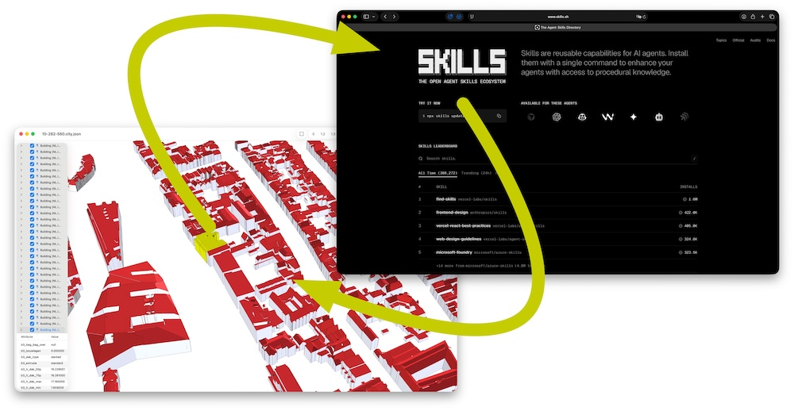{:width="800px"}

3D city models are pretty daunting for non-specialists. But what if anyone could use an LLM to query the information in a 3D city model? We could just ask it questions (in any human language) to extract information, or perhaps even to perform an analysis or to edit the model?

The goal of this MSc thesis would be to create methodologies to make this possible. The problem could be tackled from many different directions. Perhaps it would involve developing a tool to extract the necessary context from a 3D city model, or perhaps it could be a [skill](https://www.skills.sh/) for AI agents to link existing tools to LLMs with tool support.

**Contact:** [Ken Arroyo Ohori](https://3d.bk.tudelft.nl/ken/en/) or [Hugo Ledoux](https://3d.bk.tudelft.nl/hledoux/)

## 3D city models without building footprints

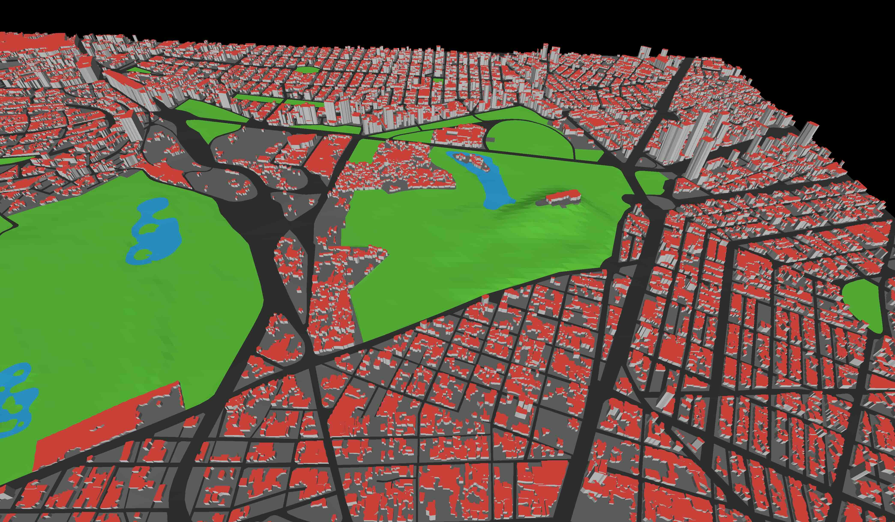{:width="800px"}

We typically create 3D city models based on 2D topography + elevation data, but most of the topographic data shouldn't be really necessary. Our eyes can see buildings and many other features clearly enough in both a dense Lidar point cloud or a DSM with decent resolution.

Why do we want to avoid using the topographic data? Many reasons: it might not be up to date (or from the same time as the elevation data), it might not have the required quality (eg misaligned footprints), or maybe it just doesn't exist.

The goal of this MSc thesis would be to develop methods to extract usable footprints for 3D city model generation directly from elevation data.

**Contact:** [Ken Arroyo Ohori](https://3d.bk.tudelft.nl/ken/en/)

## Procedural generation of 3D buildings

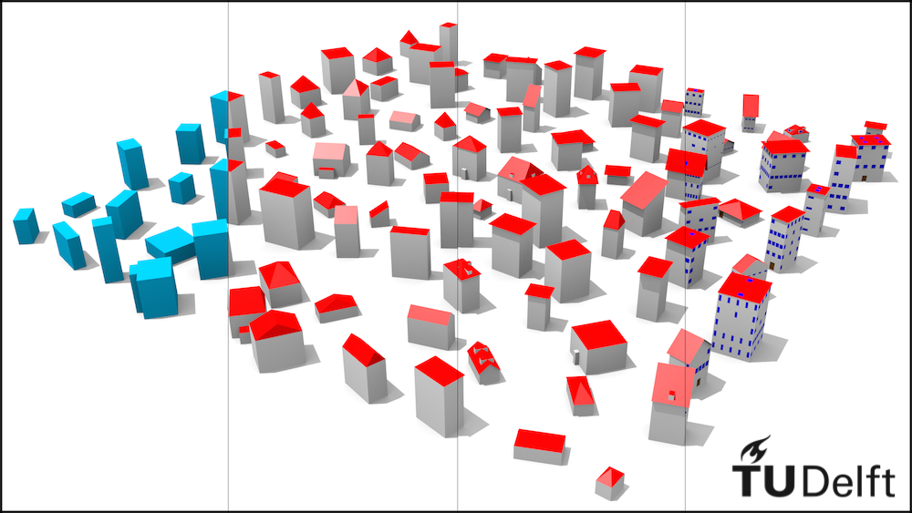{:width="800px"}

Three-dimensional city models are used across all sorts of research domains, but creating them is still a pain -- data is scarce, full of errors, and manual modelling is incredibly labour-intensive.

Parametric generation of 3D cities is an attractive alternative. 
It lets you create *plausible* urban environments on demand, whether you're training machine learning models or testing urban planning scenarios.

A Geomatics MSc thesis a couple of years ago ([see full thesis by Oliver Post](https://repository.tudelft.nl/record/uuid:d6dc629c-c75e-4578-b1a1-8ac741133751)) laid the foundations for procedurally generating cities in 2D. 
The idea was the *City Stack*: a morphology-based framework that treats a city as layers -- roads, blocks, buildings, green spaces -- each with its own typology. 
Around 50 real cities (based on OSM data) were analysed, their morphological patterns extracted, and then entirely new road networks and building footprints were generated by adapting those typology grids.

Your task would be to build on this work (and the [open-source code](https://github.com/OliverJPost/CityStack)) and add the third dimension -- by generating plausible roof shapes and building heights. 
The same methodology applies: study real cities to understand roof shape distributions and height patterns, then generate new ones that feel authentic.

Python programming is probably enough, but the source code of Oliver is (mostly) in Rust. This is a nice chance to learn some Rust also.

**Contact:** [Hugo Ledoux](https://3d.bk.tudelft.nl/hledoux/)

## An API for standardized data exchange in the Dutch Renovation Passport

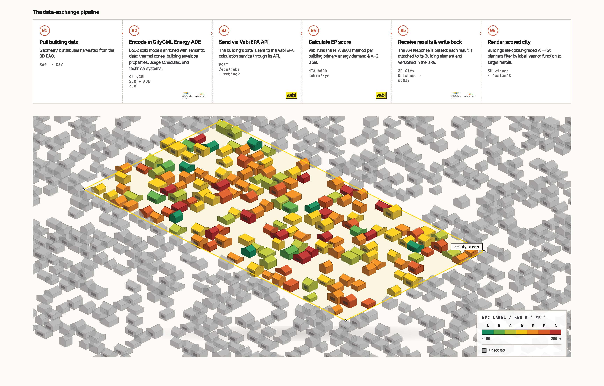{:width="800px"}

**This MSc thesis is carried out in collaboration with Vabi**, who provide the software that performs the EPC calculation.

The building data needed to plan a renovation is scattered across many separate repositories, each with its own format. Sharing and reusing this data — between owners, advisors, municipalities and software tools — requires a common, standardized way to exchange it.

In a recent paper ([link to the abstract](#TODO)), we showed that the CityGML standard 2.0, together with the updated [Energy ADE 3.0](https://github.com/tudelft3d/Energy_ADE), can serve as exactly that common standard: together they cover the data that a Building Renovation Passport needs. This thesis puts that claim to a practical test.

The objective is to design an API that provides access to CityGML and Energy ADE 3.0 data. As these standards form the basis of the Building Renovation Passport, the API would enable integration with a real industry stakeholder. The partner, Vabi, runs software that performs the EPC (energy performance certificate) calculation. The thesis is therefore not about the calculation itself; it is about whether the standardized data can flow cleanly from the repository to a real calculation service and back.

The goal of this thesis is to design and implement that API. You will:

1. Populate a CityGML and Energy ADE 3.0 database with building data.
2. Study Vabi's EPC calculation and the inputs it requires.
3. Build an API that sends building data to the Vabi servers for the EPC calculation and writes the returned results back into the database.
4. Test the pipeline on a set of buildings, and identify where the data or the standard still falls short.

The thesis does **not** include developing the EPC calculation method itself; that is provided by Vabi.

**Contact:** [Hiba Doi](https://3d.bk.tudelft.nl/hiba/), [Giorgio Agugiaro](https://3d.bk.tudelft.nl/gagugiaro/)

- - -

## Japan's PLATEAU: from CityGML to CityJSON
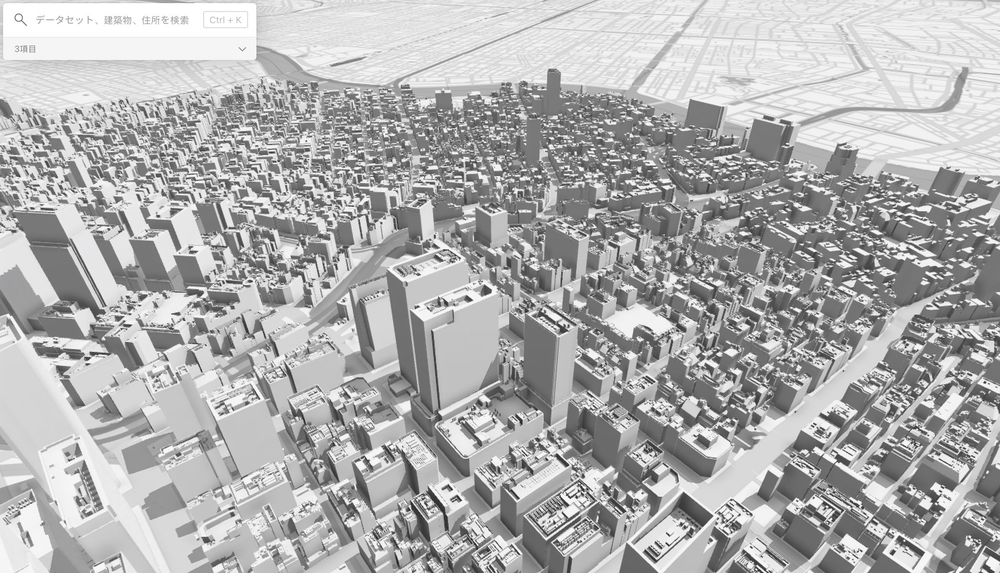{:width="600px"}

Japan's PLATEAU project is the world's most ambitious 3D city modelling effort, covering 300+ cities with over 170,000 CityGML files where buildings and other city objects are modelled. The [project page](https://www.mlit.go.jp/plateau/en/) gives a good overview, and the datasets in CityGML are [openly available for download](https://www.mlit.go.jp/plateau/open-data/). One of the most notable aspects of PLATEAU is the variety and richness of its content: besides buildings, it includes transportation models, water bodies, land use, vegetation, natural-disaster-related information, and in some cases even LoD3 and LoD4 data with rich textures.

The datasets use CityGML (still v2) with a behemoth of an Application Domain Extension (ADE): the i-Urban Revitalization (i-UR) ADE (to support all aspects of urban planning). The full details of the i-UR ADE are [here:ja](https://www.chisou.go.jp/tiiki/toshisaisei/itoshisaisei/iur/index.html) and there is a [scientific summary there](https://isprs-archives.copernicus.org/articles/XLVIII-4-W7-2023/201/2023/isprs-archives-XLVIII-4-W7-2023-201-2023.pdf).

In practice, mainly because of the complexity of this ADE, PLATEAU datasets have neither been adapted to CityGML 3.0 nor fully ported to other formats. Moreover, despite being open data, international adoption has remained limited due to Japanese language barriers. Converting the geometries and basic attributes is straightforward with [citygml-tools](https://www.cityjson.org/tutorials/conversion/), but that ignores all the rich extra attributes and new city objects defined in the i-UR ADE. Through PLATEAU, this research will help reveal how some of the richest CityGML datasets can be converted into CityJSON together with appropriate ADE replacements in the form of [CityJSON extension](https://www.cityjson.org/extensions/).

The goal of this MSc thesis is to convert these massive CityGML datasets into CityJSON (or design and implement a workflow to do it at scale).

Your tasks:

1. Analyse the current ADE and design and implement a [CityJSON extension](https://www.cityjson.org/extensions/) to replace it---a mix of manual detective work and smart design decisions
2. Implement the conversion software/prototype in the language of your choice

The result would be a showcase for the PLATEAU project and you'd be helping unblock one of the world's largest 3D city model repositories.

**Contact:** [Hugo Ledoux](https://3d.bk.tudelft.nl/hledoux/) + [Hidemichi Baba](http://3d.bk.tudelft.nl/hbaba) + [Toshikazu Seto](https://www.linkedin.com/in/toshikazu-seto-a33577154/) (visiting from Komazawa University, Japan, with us until March 2027)

- - - 

## Global River Model

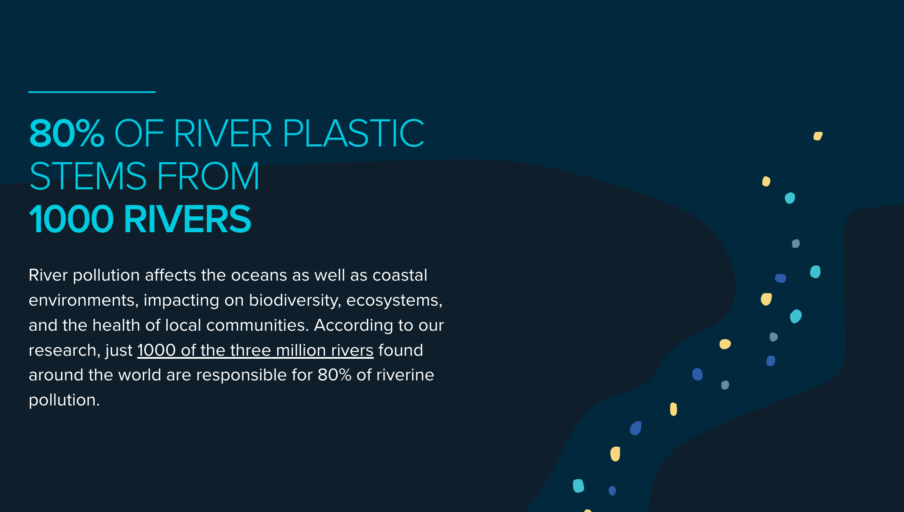{:width="800px"}

**This MSc thesis is in collaboration with [The Ocean Cleanup](https://theoceancleanup.com)**

Plastic pollution in the world's oceans is a critical environmental challenge. 
Understanding the sources, transport, and fate of ocean plastics is essential for effective mitigation strategies. A significant proportion of ocean plastic pollution originates from riverine inputs, making it crucial to model the emission of plastic through river systems at a global scale.

This MSc thesis topic involves improving a global river model that simulates monthly riverine plastic emissions. 
The model currently relies on the MERIT (Multi-Error-Removed Improved-Terrain) dataset to identify river positions and simulate the pathways of water and plastic through hydrological systems. 
However, the MERIT dataset has significant limitations in capturing complex waterway networks, particularly in urban environments where artificial waterways and canals play an important role in water transport.

The objective of this project is to enhance the accuracy of riverine plastic emission estimates by integrating data on artificial waterways from global sources. 
The work is structured in two main phases:

*Phase 1: Algorithm Development*: Develop methods to incorporate artificial waterway data into the model input datasets, specifically:
- Upper drainage area grids
- Flow direction grids
- Elevation grids

Based on the MERIT database structure, create algorithms that can transform information from artificial waterway maps into compatible hydrographic datasets.

*Phase 2: Global Implementation*: Automate the identification and integration of artificial waterways from publicly available global datasets (e.g., OpenStreetMap) and scale the methodology to global coverage.

*Key Responsibilities:*
- Identify and evaluate suitable datasets for artificial waterway mapping
- Design and implement algorithms to transform geospatial data into hydrographic inputs
- Document the methodology and validate results against reference datasets
- Assess the impact of artificial waterway integration on model accuracy

**Requirements:** GIS/geospatial data processing skills, proficiency in Python or similar programming languages, and understanding of hydrological modeling concepts.

**Contact:** [Maarten de Jong](mailto:m.dejong@theoceancleanup.com) and [Hugo Ledoux](https://3d.bk.tudelft.nl/hledoux/)

- - -

## How much polluted air we breath in our bike paths?

.

**Contact:** [Clara Garcia-Sanchez](https://3d.bk.tudelft.nl/gsclara), [Themis Vargiemezis](https://3d.bk.tudelft.nl/tvargiemezis)

- - -

## IFC in PostgreSQL/PostGIS

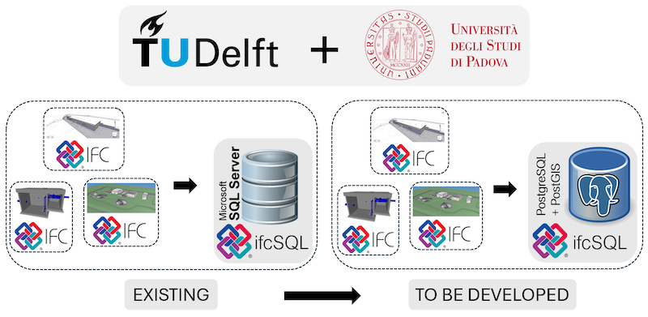{:width="800px"}

The Industry Foundation Classes (IFC) schema is a widely used open standard for Building Information Modeling (BIM). IFC data mostly rely on files for storage, but storing such data in databases has the potential to improve the handling multiple - possibly very large - datasets, performing therefore spatial and non-spatial queries and integrating them with other systems.
 
Database implementations of IFC exist, such as the one inside BIMserver, but perhaps the most interesting one is [IfcSQL](https://github.com/IfcSharp/IfcSQL), which currently runs only on Microsoft SQL Server. However, Microsoft SQL is not open and provides very limited spatial functionalities (e.g. no 3D support at all), which means that only very basic spatial queries can be run – and limited to 2D.
 
Two are the main goals of this thesis: the first one is to port the database schema of IfcSQL to PostgreSQL/PostGIS. The second one is to investigate how the spatial functionalities of PostGIS can be exploited for IfcSQL, either directly at database level (e.g. via PL/pgSQL functions) or by developing a python-based interface.
The usability of the developed solution will be tested in the context of water infrastructure management use cases and in collaboration with the University of Padua, Italy, and the development team of IfcSQL.
 
**Requirements**: GEO1006 and GEO1004
 
**Contact persons**: [Ken Arroyo Ohori](https://3d.bk.tudelft.nl/ken/en/), [Giorgio Agugiaro](https://3d.bk.tudelft.nl/gagugiaro/)

- - -

## Creation of planar partitions from mismatched datasets

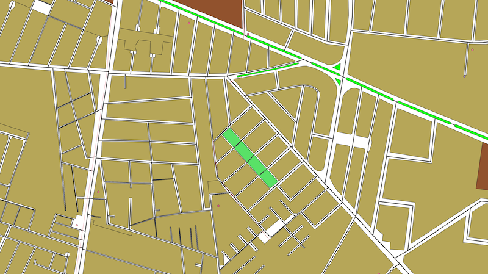{:width="800px"}

Many GIS applications are based around a planar partition of polygons—a set of polygons covering the map with no overlaps and no gaps between them. For example, 3D city models are generally built by raising polygons representing building footprints, roads, water bodies, etc. to different heights according to different rules.

However, good planar partition datasets are relatively rare. For many countries and cities, there’s only linear data for many features (e.g. roads, railways, rivers, etc). In other cases, the different features come from different sources and do not fit neatly together. Finally, there’s also data that is missing altogether and can only be computed based on the gaps in other data using more complex rules (e.g. roads from the space between parcels or terrain from the remainder of all other features.

The goal of this thesis would be to create a robust method to create planar partitions from multiple datasets based on customisable rules (e.g. line buffers, priority lists, Boolean set ops, etc). Another possibility would be a narrower thesis focussing on creating more detailed data for only one of these types, such as in [this thesis](https://3d.bk.tudelft.nl/ken/files/24_chengzhi.pdf).

**Requirements**: proficiency in programming, preferably with C++.

**Contact:** [Ken Arroyo Ohori](https://3d.bk.tudelft.nl/ken/en/)

- - -

## Citizen Voices in Climate Action: Developing digital platforms for citizen engagement in climate planning and design

Municipalities worldwide are developing plans and strategies to deal with increasing climate risks. Many of these interventions require citizen support and active participation, e.g., adopting solar PV panels or green roofs or increasing biodiversity in private backyards. Other strategies require people to change their behaviour and social norms. There is, therefore, a need to meaningfully engage citizens in climate strategies. Digital tools provide a means to do so with the potential to reach a large number of citizens. In this context, the [Citizen Voice Initiative](https://zenodo.org/records/12169892) has developed several prototypes for citizen engagement in urban planning and design: (1) [Citizens meet Climate (CmC)](https://zenodo.org/records/12183035): A digital participatory platform to empower citizens to take climate action and (2) [BIO-CiVo](https://zenodo.org/records/12180644): A digital platform to support citizens in improving neighbourhood biodiversity. Navigate through the prototypes: 

[CmC](https://tinyurl.com/PrototypeCmC)

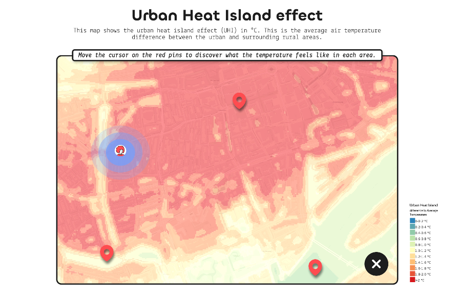{:width="800px"}

[BIO-CiVo-Evaluation Tool](https://edu.nl/geeax), and [BIO-CiVo-Building Tool](https://edu.nl/96erf)

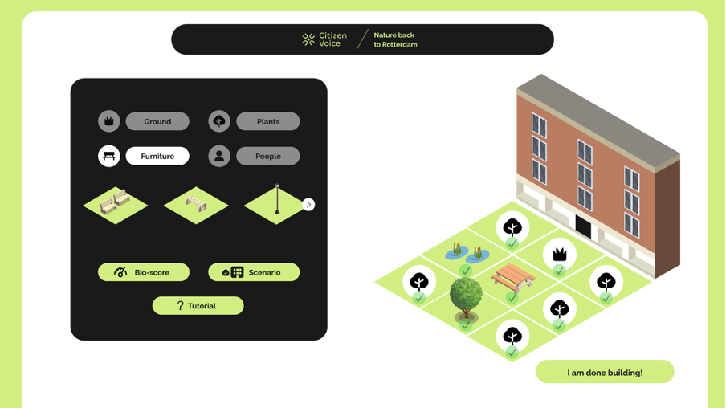{:width="800px"}

The MSc thesis will develop these prototypes into real platforms. This entails (1) translating the prototypes from Figma to URL in a static form and (2) progressively developing the interactive features, which include e.g., maps (present in all prototypes), the use of different types of spatial data (climate data in the CmC prototype) and 3D environment (BIO-CiVo-Building).

If you choose this topic, you can expect to learn about citizen engagement, web development, and spatial data handling. Programming experience and interest are advantages of this topic.

**Contact:** [Clara Garcia-Sanchez](https://3d.bk.tudelft.nl/gsclara), [Juliana Goncalves](https://www.tudelft.nl/staff/j.e.goncalves/)

- - -

## Revealing energy inequalities in The Netherlands

With technological advances and decreasing prices, solar energy is a key technology in the urban energy transition. The current policy focus on increasing the overall installed capacity via financial mechanisms has overshadowed energy justice considerations, leading to inequalities in solar energy adoption. This pattern of inequality is bound to deepen as financial mechanisms continue to be the preferred policy choice for other energy transition interventions, such as heat pumps or renovation incentives.

The MSc thesis will delve into questions of energy justice through the use of spatial data. To start the topic, you will delve into the work by [Kraaijvanger et al., (2023)](https://www.sciencedirect.com/science/article/pii/S2214629623003055#sec6), which reveals socio-spatial inequalities in the transition to solar energy in The Hague, The Netherlands. You will extend their work in one of these two directions (1) go beyond solar PV to look into heat pumps and renovation incentives, or (2) go beyond The Hague and create a map of energy inequalities in The Netherlands. The direction depends on your interests as well as on data availability.

If you choose this topic, you can expect to learn about spatial justice, energy transition technologies, and spatial analysis.

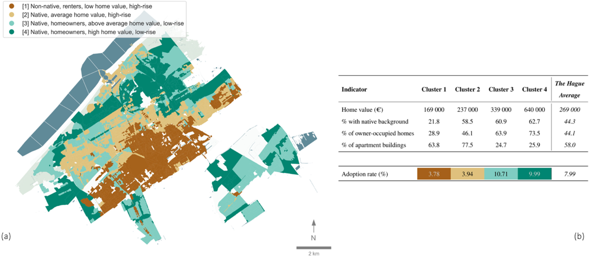{:width="800px"}

Figure: (a) Spatial distribution of the four access groups across the The Hague per PC5 zone. A short description of the characteristics of each group/cluster is provided in the legend presented in the top left of the figure. (b) The upper table in Figure b provides the mean values of the clusters for each of the indicators. This is compared with the average values for the respective indicator observed in the city. The lower table in Figure b presents the adoption rate across each cluster. The adoption rate (%) is defined as the percentage of residential buildings with solar PV systems ([Kraaijvanger et al., 2023](https://www.sciencedirect.com/science/article/pii/S2214629623003055#sec6)).

**Contact:** [Clara Garcia-Sanchez](https://3d.bk.tudelft.nl/gsclara), [Juliana Goncalves](https://www.tudelft.nl/staff/j.e.goncalves/)

- - -

## Developing an open-source GIS pipeline tailored for FastEddy

{:width="800px"}

Within the past year, we have been actively collaborating with the National Center for Atmospheric Research (NCAR) which recently developed [Fast Eddy](https://ral.ucar.edu/fasteddy), a resident GPU code, that is capable of running large urban microclimate simulations with high efficiency. Our collaboration aims to develop an open-source GIS pipeline that allows the automatic reconstruction of urban environments that can be swiftly prepared and used within their Fast Eddy framework. 

The MSc thesis will entail the full chain of the tailored automatic reconstruction (related to the work performed within GEO1004) starting by exploring the impact that the different projections available within their boundary software [WRF](https://www.mmm.ucar.edu/models/wrf) can have, the available footprint and point cloud data in the areas of interest, and finishing by the translation into the language that FastEddy uses [netcdf](https://www.unidata.ucar.edu/software/netcdf/). The thesis does NOT include running their fluid dynamics code. 

If you choose this topic, you can expect to learn about automatic geometry reconstruction and GIS data handling. Programming experience and interest is an advantage for this topic. Your work might require to implement source code (in C++ or Python or any other language you prefer).

**Contact:** [Clara Garcia-Sanchez](https://3d.bk.tudelft.nl/gsclara), [Hugo Ledoux](https://3d.bk.tudelft.nl/hledoux)

- - - 

## Filling the massive gaps in space lidar datasets with a diffusion model

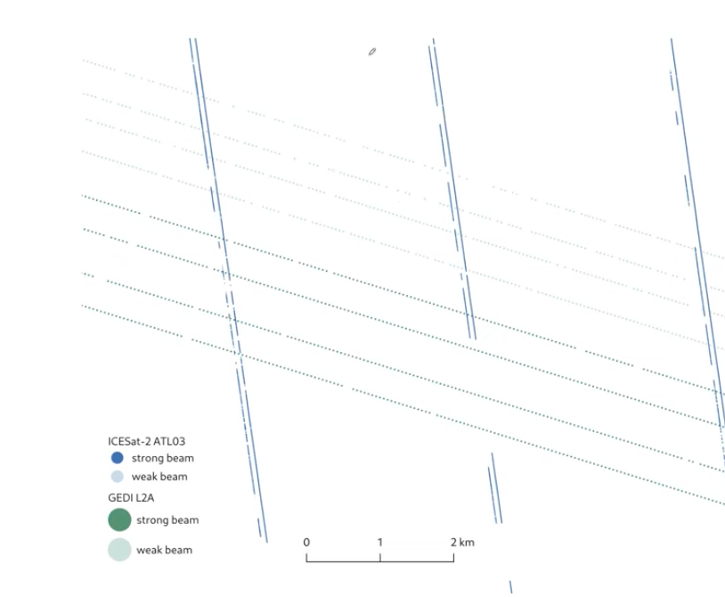{:width="300px"}

As you saw during the GEO1015 lecture of Maarten Pronk, space lidar datasets, [ICESat-2](https://icesat-2.gsfc.nasa.gov/) and [GEDI](https://gedi.umd.edu/), have very sparse distribution (often kilometres with no data) and thus a global coverage is difficult.

The aim of this thesis is to test, compare to others, and further develop the deep learning diffusion model presented [in this paper](https://doi.org/10.1109/LGRS.2024.3403835).

The [project has open-source code](https://github.com/kylelo/Diff-DEM), Python can be used.

**Contact:** [Hugo Ledoux](https://3d.bk.tudelft.nl/hledoux/) + [Maarten Pronk](https://evetion.nl)

- - -

## Developing an open-source Multifunctional Green Infrastructure Planning Support System

Urban areas face increasing pressure to address multiple environmental and social challenges simultaneously, including climate change adaptation, biodiversity loss, social inequality, and public health concerns. Traditional infrastructure planning approaches often address these issues in isolation, leading to inefficient resource allocation and missed opportunities for synergistic solutions.

Multifunctional Green-Blue Infrastructure (GBI) offers a nature-based approach that can simultaneously deliver multiple ecosystem services across different spatial scales. However, current planning processes lack integrated digital tools that can effectively guide stakeholders through collaborative decision-making while ensuring equitable distribution of benefits and addressing diverse societal needs.
The primary objective of this research  is to develop an innovative interactive geospatial planning support system that facilitates collaborative evidence-based decision-making for multifunctional green-blue infrastructure implementation in urban areas.

If you are interested in this topic, you can expect to learn about **advanced geospatial technologies and methodologies** including **multi-criteria spatial analysis**, **web-based GIS development**, and **spatial decision support system design**.
Through this interdisciplinary approach, you will gain valuable experience in **translating complex spatial analysis into accessible decision-making tools**, preparing you for careers in smart city development, environmental consulting, urban planning technology, or spatial data science with a focus on sustainability and social equity.

Prerequisites: Proficiency in GIS and software development (e.g., QGIS, R, Python) and understanding of/interest in GBI and urban/landscape planning.

**Contact:** [Daniele Cannatella](https://3d.bk.tudelft.nl/dcannatella/)

- - -

## Predicting pedestrian wind comfort and thermal comfort with Large-Eddy Simulations in uDALES

Pedestrian wind and thermal comfort still remain an important topic in the development of future urban scenarios. Considering the current climate change conditions, with increased frequency in heat waves and extreme weather events, the way we design our cities can further impact their resilience and comfort. Computational fluid dynamics (CFD) approaches can help us improving and adapting future and current urban designs to maximize sustainability and comfort. To maximize the predictability capabilities approaches such as Large-Eddy Simulations [LES](https://en.wikipedia.org/wiki/Large_eddy_simulation) can be used to resolve most of the urban scales and model uniquely the small scales. 

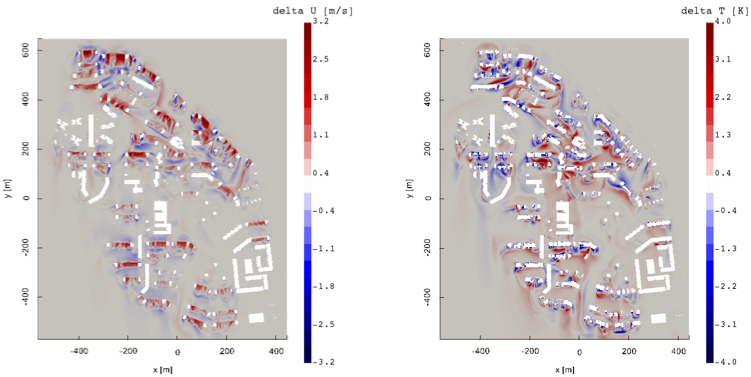{:width="400px"}

Within this MSc thesis we will exploit the capabilities of open-source tools such as [uDALES](https://github.com/uDALES/u-dales) to predict wind and thermal comfort in real urban scenarios. The initial set-up focuses on using part of the Clementi neighbourhood in Singapore, which was already set-up by previous MSc thesis to run RANS simulations in [Opsomer](https://repository.tudelft.nl/islandora/object/uuid%3A97304da6-8938-48eb-8117-ca53321b1e34?collection=education). Considering the demanding computational capabilities required by LES, this area can be potentially reduced, or other test cases can be also explored. Attendance of elective course [GEO5015](https://studiegids.tudelft.nl/a101_displayCourse.do?course_id=57094) in Q4 or similar CFD knowledge is required. 

**Contact:** [Clara Garcia-Sanchez](http://3d.bk.tudelft.nl/gsclara), [Themis Vargiemezis](https://3d.bk.tudelft.nl/tvargiemezis)

- - -

## Optimizing building mesh designs for computational fluid dynamics using machine learning 

Since one of the major burdens when performing computational fluid dynamic simulations (CFD) is to set up a good mesh, improving the current capabilities to mesh automatically complex geometries would have a large impact for the computational fluid dynamics community. This task becomes really essential when geometries are complex, such as high resolution level of detail buildings, and severals hundreds of simulations need to be run to quantify uncertainties.  

In this MSc thesis we will apply the automatic meshers available in OpenFOAM (SnappyHexMesh and cfMesh) and combined them with machine learning techniques to improve current mesh set-ups. We will start by simplified geometries with low level of detail, and increase progressively details. The results can potentially help us reducing the amount of time spent designing our city mesh, and thus allow us to perform faster analysis.   

If you work on this topic, you can expect to learn about mesh generation aligned with CFD best practice guidelines, set-ups and flow simulations. Programming experience and interest is an advantage for this topic. Your work will require to implement source code for the analysis of the set-ups (in C++ or Python). 

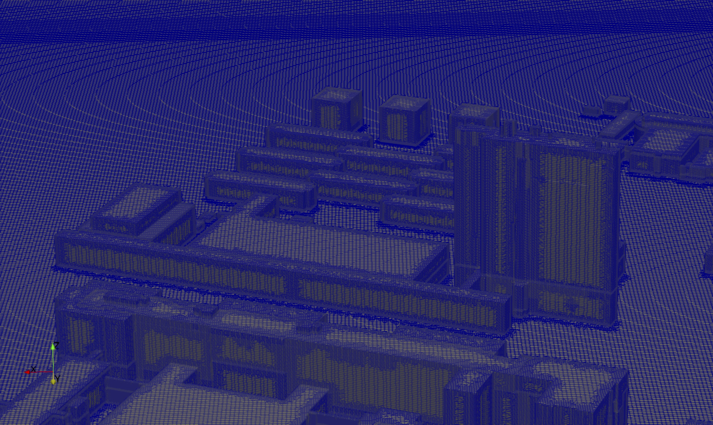{:width="400px"}

**Contact:** [Clara García-Sánchez](http://3d.bk.tudelft.nl/gsclara) and [Themis Vargiemezis](https://3d.bk.tudelft.nl/tvargiemezis)

- - -

## Semantically enriching the 3D BAG

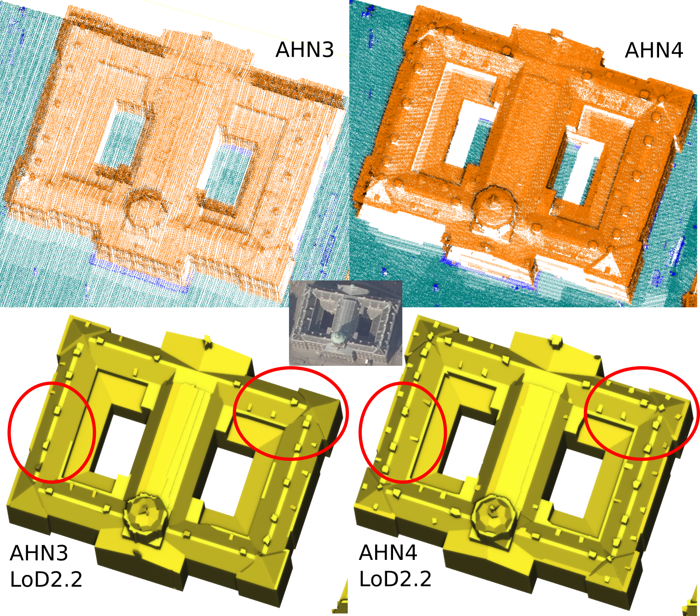{:width="400px"}

With the 3D BAG we have LoD2.2 building models for the whole of the Netherlands. Unfortunately the semantics of these models is still very simplistic (only a very basic classification of wall/roof/floor surfaces is present). The goal of this project would be to develop an automatic method to semantically enrich these models by labeling rooftop structures such as chimneys, A/C units and dormers and/or detecting facade elements such as doors and and windows. This is to be achieved by analysing the geometry of the existing 3D BAG models, the source point cloud and/or (oblique) aerial photographs.

Programming required in python/C++.

**Contact:** [Hugo Ledoux](https://3d.bk.tudelft.nl/hledoux) + [Ravi Peters](http://tudelft.nl/rypeters)

- - -

## 3D Cadastre

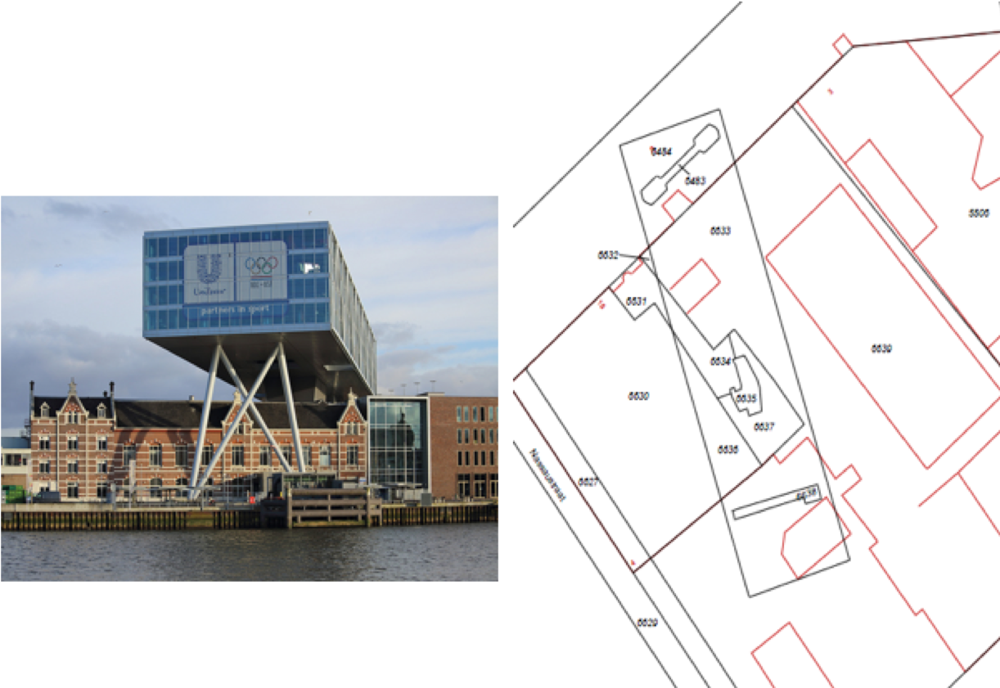{:width="700px"}

Since more than 15 years, lots of studies have been done on 3D Cadastre to register multilevel ownership in a transparent and proper way.
In 2016, we realised the first 3D cadastral situation [3D cadastral registration]( https://3d.bk.tudelft.nl/news/2016/03/21/3DKadaster.html) in the Netherlands.
However, there is still a gap between research and practice. In this research you will analyse how a Level of Detail Framework, that defines specifc solutions for specific 3d cadatsre problems may help to close the 3D cadastre research-to-practice gap.
The idea is explained in [this](https://www.fig.net/resources/proceedings/fig_proceedings/fig2020/papers/ts04e/TS04E_stoter_ho_et_al_10503.pdf) short paper

*Contact:* [Jantien](http://3d.bk.tudelft.nl/jstoter) 

- - -

## Performance and robustness of software libraries for computational geometry

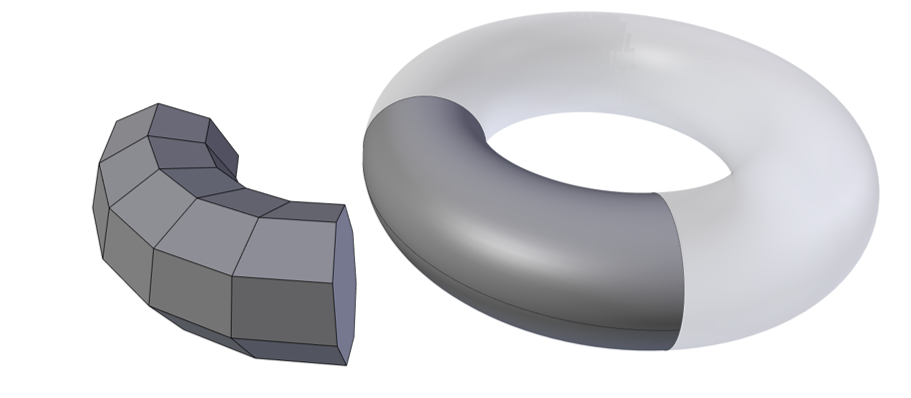{:width="500px"}

Software libraries for computational geometry underpin a lot of our research, but an in-depth comparison of how these different software libraries behave in terms of performance and robustness is not available. For example, the feasability of multi-disciplinary use of geometry in BIM/GIS integration and automated thermal analysis of IFC building models is largely shaped by the characteristics of the algorithmns offered in open source libraries such as CGAL and Open CASCADE. This research project is an opportunity to publish something novel, useful and relevant to many disciplines.

*Contact:* [Thomas Krijnen](mail@thomaskrijnen.com) or [Ken Arroyo Ohori](https://3d.bk.tudelft.nl/ken/en/)

- - - 

## Developing methods for edge-matching with customisable heuristics (geometric, topological and semantic)

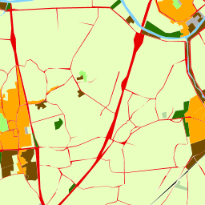{:width="300px"}

The methodology will be studied from a use case of Statistics Netherlands (CBS).

CBS is responsible for the bi-annual publication of the land use register (in Dutch: Bestand Bodem Gebruik or BBG).
In this dataset, ground level land use for areas of 1 ha or larger is classified into 20+ land use categories. The area demarcation and classification have, up till now, been done manually. In the manual process CBS uses a combination of aerial imagery and a selection of cadastral topographical maps. 
CBS is developing a new methodology to automatically combine topographical information and other administrative (register-based) datasets (with a manual fine-tuning post-process, if needed).
By overlaying and prioritizing polyline-based planes from a set of different topographical data sources, adding attributes to these areas from administrative data sources, and applying a number of geo-processes, a new set of planar partitions is created. 
These automatically generated planar partitions will inevitably have some differences with the reference (manually coded) BBG year 2017, either in shape or in category. 
The challenge is on developing a method for describing and detecting important categorization and delineation issues, based on deviations from earlier versions of the BBG and developing (semi) automated solutions to solve these issues, in order to minimize the required manual post-processing. This also includes solving gaps, overlaps and disconnections, in the context of the neighboring areas.
There are different heuristics feasible, an important one being the combination size and the nature of the deviating area. In such a heuristic, small differences in size combined with a less important categorization difference (e.g. street and living area) are of less importance than a big difference in size and an important difference (e.g. forest vs living area). 
 
**Contacts:** [Jantien Stoter](https://3d.bk.tudelft.nl/jstoter/) + [Ken Arroyo Ohori](https://3d.bk.tudelft.nl/ken/en/) + someone at [CBS](https://www.cbs.nl/en-gb)

- - - 
## 3D delineation of urban river spaces
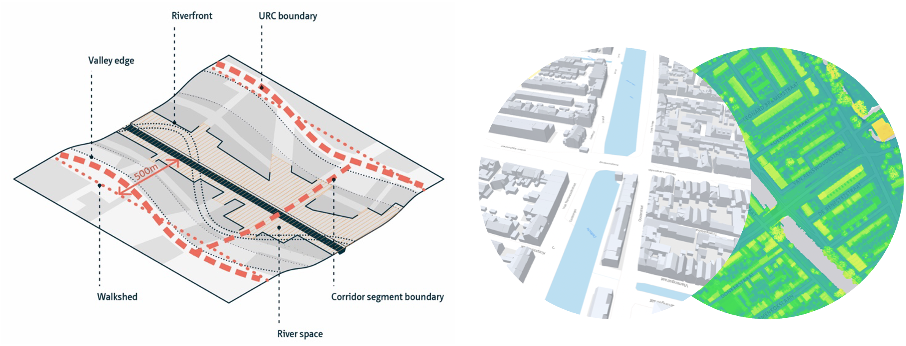

A wide range of applications in riverside urban areas, including flood mitigation, transport planning, ecological restoration, and public space design, rely on an accurate spatial description of riverside urban spaces. While methods of spatial delineation based on 2D geospatial data exist [Forgaci, 2018](https://books.bk.tudelft.nl/press/catalog/book/isbn.9789463661096), a method for automated spatial delineation based on 3D data is missing. A 3D delineation method would enable to better capture the spatial qualities of urban river spaces. 

This thesis will develop a 3D delineation method for urban river spaces adapting an existing 2D delineation method. The method will be based on 3D data [3D BAG](www.3dbag.nl), point cloud and other elevation data) for use in any riverside urban area where such data is available. The thesis will make as much as possible use of open data and will address challenges and opportunities regarding the scalability of the method within the Netherlands and globally.

**Contact:**  [Jantien Stoter](https://3d.bk.tudelft.nl/jstoter/) and [Claudiu Forgaci](https://www.tudelft.nl/staff/c.forgaci/)

- - - 

## Urban building daylight modeling – improving city models 

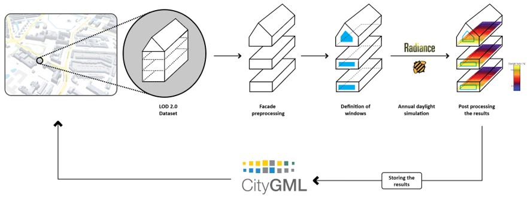{:width="600px"}

**Background and aim**:
Decarbonization and improvement of the building stock cannot be realistically planned without considering the existing buildings. Decision-makers need accurate models on different levels of granularity for different types of decision-making. A crucial aspect of building performance is the availability of natural light in indoor spaces which has a direct impact on users' well-being and comfort, as well as its influence on reducing electric lighting consumption.
The aim of this project is an urban-level assessment of buildings in terms of their daylight performance.
LOD2 geometry and typical material properties will be used as the key inputs and Radiance as the simulation engine.

**Research question**:
To what extent do the existing building stock meet the requirements for daylight availability?
How to efficiently model the existing building stock in urban level?

**Methods**:
General literature search to find potential pipelines and techniques, and to understand city-level geometry data models (CityGML). Numerical simulation of daylight.

**Final results**: (a) Urban-level assessments of buildings daylight availability, or visual comfort. (b) Suggestions for policy-makers to improve daylight availability in existing buildings. (c) Suggestions (and implementation) for improving CityGML data model and its Application Domain Extension (ADE).

**Contact:** [Eleonora Brembilla](https://www.tudelft.nl/staff/e.brembilla/?cHash=b81b85bf6c08dfd998139488a3a3f3dd), [Nima Forouzandeh](https://www.tudelft.nl/staff/n.forouzandeh/?cHash=0eff827e919ebe7ba656d3542c3dcc42), [Camilo León-Sánchez](https://3d.bk.tudelft.nl/cleon/), and [Giorgio Agugiaro](https://3d.bk.tudelft.nl/gagugiaro/).

- - -

## Reconstructing permanent indoor structures from multi-view images

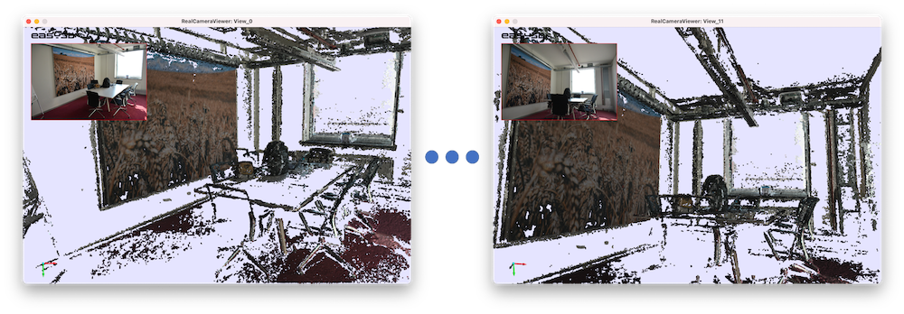{:width="600px"}

Reconstructing 3D models of permanent structures of indoor scenes has many applications, e.g., renovation, navigation, and room layout design and planning. Traditionally methods require dedicated devices (e.g., laser scanners) to capture the indoor environments, which is only affordable to very limited users.  They also require carefully positioning a scanner and registering the point clouds obtained at different locations. Recently developed image-based methods (i.e., MVS and its variants) are successful in the reconstruction of large-scale outdoor environments, but the major obstacle to applying such methods to indoor scenes is the lack of rich textures in indoor scenes, and thus insufficient image correspondences can be established to derive 3D geometry. This project focuses on exploring piece-wise planar prior knowledge about indoor scenes to achieve patch (i.e., planar region) correspondences between images. The core is to extend the existing multi-view theoretical framework to incorporate piecewise planar constraints in the reconstruction pipeline. The developed technique will enable the 3D surface reconstruction of not only texture-less indoor scenes but also low-texture piecewise planar objects in general.

**Required skills**:
(1) Proficient in programming. (2) Enthusiastic about 3DV modeling and geometry processing.

**Contact**: [Liangliang Nan](https://3d.bk.tudelft.nl/liangliang/)

- - -

## BuildingBlocks: Enhancing 3D urban understanding and reconstruction with a comprehensive multi-modal dataset

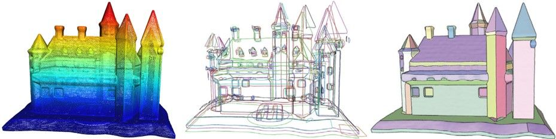{:width="600px"}

Deep learning research has facilitated significant advancements in large-scale urban scene understanding and reconstruction. However, current methods are limited to coarse levels of scene perception and 3D reconstruction. To bridge this gap and propel research and applications to the next level, fine-grained understanding and 3D reconstruction of urban buildings are necessary. Unfortunately, the lack of suitable datasets for training powerful neural networks hinders progress in this area.

This research aims to bridge this gap by introducing BuildingBlocks, a multi-modal, feature-rich, large-scale, and detailed 3D building dataset. BuildingBlocks encompasses 3D building models at LoD3+ levels, corresponding point clouds, multi-view images, camera parameters, and wireframe models for several expansive urban scenes, with fine-grained annotations at the semantic, instance, and part levels for all modalities.
With these multi-modal data sources and rich correspondences between different modalities, this project will benchmark state-of-the-art methods and develop novel techniques for highly automated and detailed 3D building reconstruction.

In short, BuildingBlocks will provide a valuable resource for advancing research in deep learning-based urban understanding and 3D reconstruction, enabling fine-grained analysis and detailed modeling of urban buildings for various applications.

**Required skills**:
(1) Proficient in programming. (2) Enthusiastic about 3D modeling and deep learning.

**Contact**: [Liangliang Nan](https://3d.bk.tudelft.nl/liangliang/)

- - -

## Holistic indoor scene understanding and reconstruction

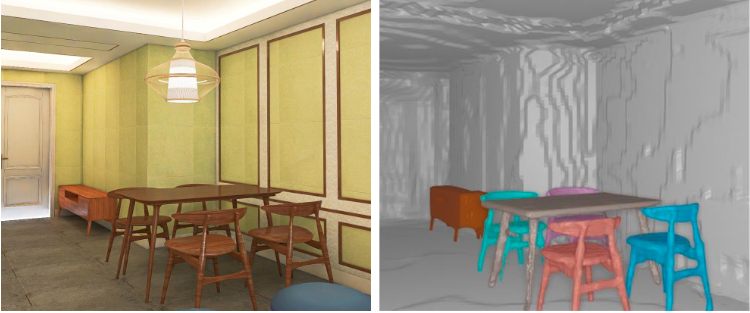{:width="600px"}

This project is for MSc students interested in cutting-edge 3D vision and scene understanding. 

Holistic indoor scene reconstruction from a single image (or a few images), especially using implicit representations, pushes the boundaries of what machines can perceive from minimal input. 
This project explores high-fidelity recovery of both objects and complex room geometries, enabling applications in robotics, AR/VR, and smart environments. 
Whether your interest lies in detailed shape modeling, occlusion-aware perception, or efficient scene approximation, there’s ample room for innovation. 
You can choose to focus on the full reconstruction pipeline or zoom in on specific aspects like scene layout understanding or surface reconstruction. 
This topic provides a solid foundation for research that is both technically rigorous and highly relevant to emerging real-world applications.

**Required skills**:
(1) Enthusiastic about 3D modeling and deep learning. (2) Proficient in programming. 

**Contact**: [Liangliang Nan](https://3d.bk.tudelft.nl/liangliang/)
