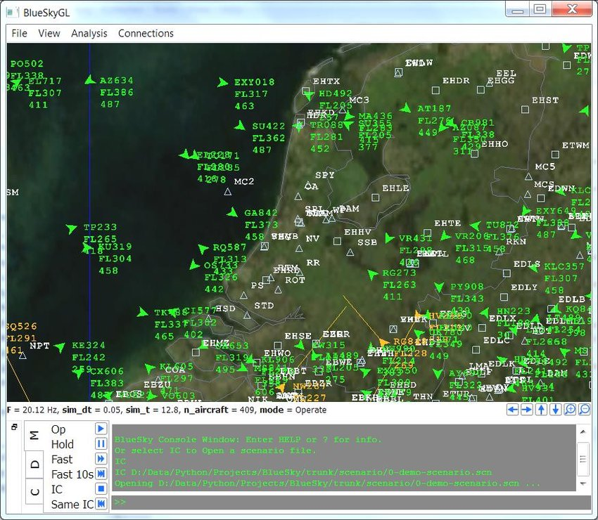
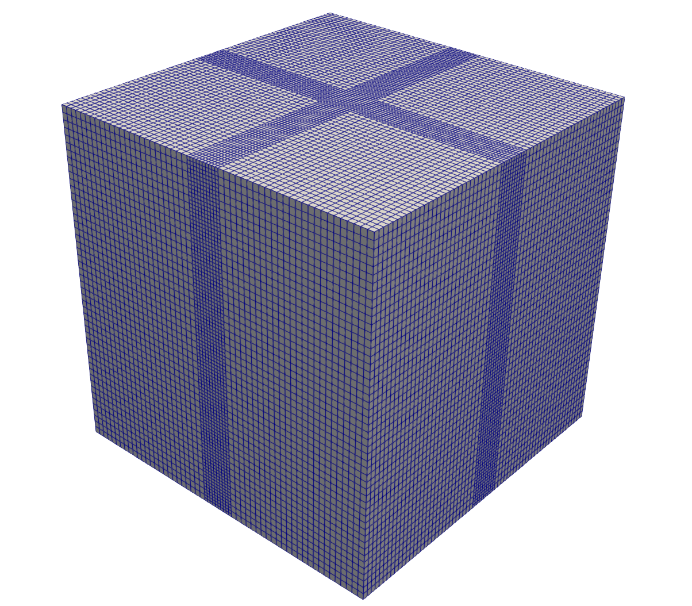

- - -

* Table of Content
{:toc}

- - -

## Add support for CityJSON in BlueSky

{:width="400px"}

[BlueSky](https://github.com/TUDelft-CNS-ATM/bluesky) is an open Air Traffic Simulator that is being actively used to perform research on Air Traffic Management and Air Traffic Flows. It would be extremely beneficial for such simulations to take advantage of 3D city models by adding support for [CityJSON](https://www.cityjson.org/) loading.

In this project you'll have to implement parsing of CityJSON for the needs of BlueSky. The tool is open source and is written in Python. There will be support from the developers of the tool in the process.

You'll improve your programming skills in the process and learn a lot about manipulating 3D geometry.

**Contact:** [Stelios Vitalis](https://3d.bk.tudelft.nl/svitalis)

## Automate generating blockMesh files for OpenFOAM

{:width="400px"}

Generating blocks for CFD meshes is quite a trivial task that still takes quite some manual effort resulting in wasted time. The assignment’s objective is to automatically generate the [OpenFOAM](https://openfoam.org/) blockMesh dictionary based on some user defined parameters (such as number of blocks, size of domain, etc.). It could be through Shell or Python, but optimally it will be an online Javascript application.

**Contact:** [Nadine Hobeika](https://3d.bk.tudelft.nl/nhobeika)
