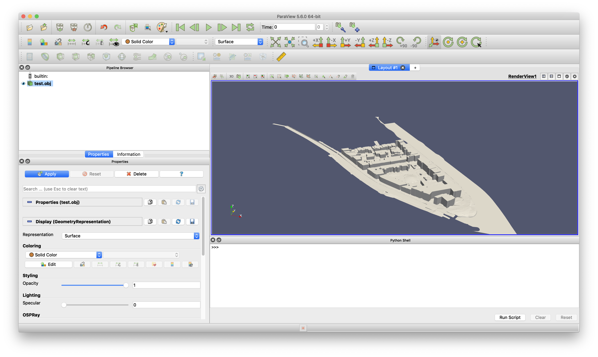

- - -

* Table of Content
{:toc}

- - -

## A CityJSON loader for ParaView

{:width="400px"}

Paraview is an open-source, multi-platform data-analysis and visualization application. It is used for the visualization of simulation results in fields such as CFD calculations.

In this research topic, your goal is to develop a loader for CityJSON files in ParaView. You will have to work in the C++ programming language and ParaView's API in order to build a respective reader.

Resources: [ParaView plugins how-to](https://www.paraview.org/Wiki/ParaView/Plugin_HowTo).

**Contact:** [Clara García-Sánchez](https://cgarcia-sanchez.com)

- - -

