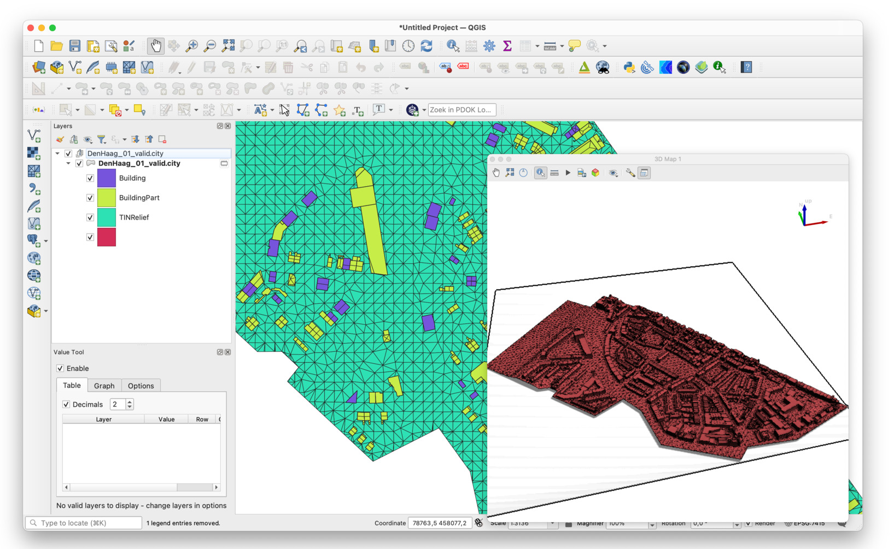
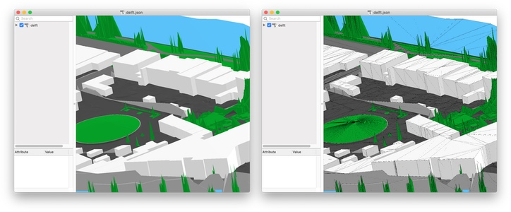
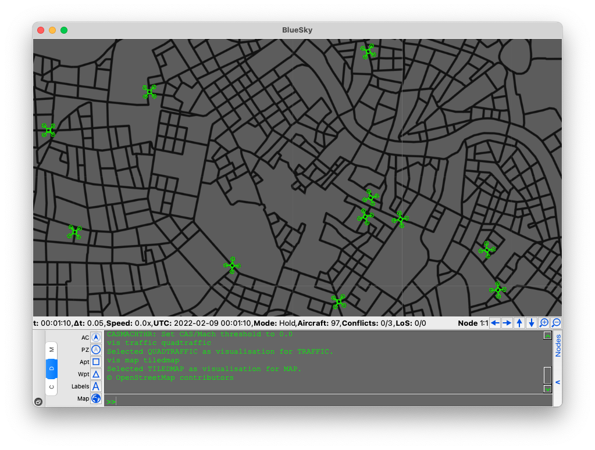
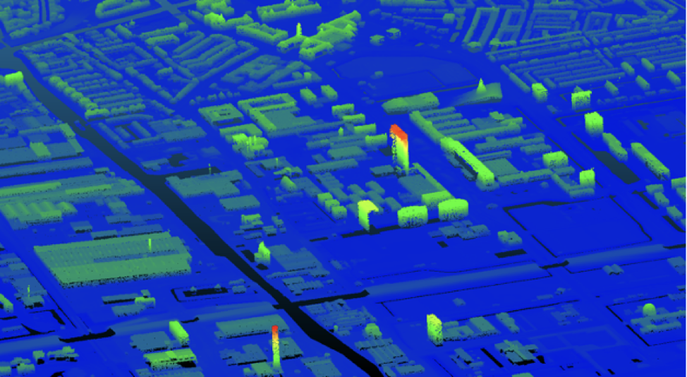

- - -

* Table of Content
{:toc}

- - -

## Adding trees in City4CFD

[City4CFD](https://github.com/tudelft3d/City4CFD) is an open-source tool that automatically reconstructs 3D city geometries tailored for microscale urban flow simulations. Its capabilities include reconstruction at multiple levels of detail, as well as including semantic surfaces, best practice guidelines set-up, and even multi-level geometry based on distance from point of interest.

This MSc thesis aims to add to City4CFD the automatic reconstruction of trees, this would facilitate their use within microclimate urban flow simulations with OpenFOAM. To start this topic, you would need to delve into the work from [De Groot 2020](https://repository.tudelft.nl/islandora/object/uuid%3A3e169fc7-5336-4742-ab9b-18c158637cfe), and explore how his approach to reconstruct trees at a different level of detail could be improved and implemented within City4CFD.

If you choose this topic, you can expect to learn about automatic geometry reconstruction and GIS data handling. To run CFD for testing can be optional. Programming experience and interest is an advantage for this topic. Your work will require the implementation of source code (in C++ preferably, but Python or others could be used).

{:width="800px"}

**Contact:** [Clara Garcia-Sanchez](https://3d.bk.tudelft.nl/gsclara), [Hugo Ledoux](https://3d.bk.tudelft.nl/hledoux)

- - -
## Add CityJSON export to QGIS plugin 

{:width="400px"}

The current [QGIS CityJSON plugin](https://github.com/cityjson/cityjson-qgis-plugin), developed by us, can only import CityJSON files to QGIS.

This project would add an **export** function to it, or at least explore how it could be done and start the work.

All coding is in Python.

**Contact:** [Hugo Ledoux](https://3d.bk.tudelft.nl/hledoux)

## Implement a cjio operator to de-triangulate CityJSON files 

{:width="400px"}

Files containing objects that are triangulated are often easier work with (the triangle is the primitive for visualisation, and the resulting geometries do not contain inner rings) but some use-cases are hindered by the amount of surfaces.

The aim of this project is simple: add an [cjio](https://github.com/cityjson/cjio) operator that will de-triangulate (or un-triangulate?) a given CityJSON files, and allows us to store a new file where the same information is stored coplanar triangles are merged into polygons (potentially with inner rings).

Textures and materials (if any) also need to be handled.

If successful, the new operator would be added to cjio. All coding is in Python.

**Contact:** [Hugo Ledoux](https://3d.bk.tudelft.nl/hledoux)

- - - 

## Add support for CityJSON in BlueSky

{:width="400px"}

[BlueSky](https://github.com/TUDelft-CNS-ATM/bluesky) is an open Air Traffic Simulator that is being actively used to perform research on Air Traffic Management and Air Traffic Flows. It would be extremely beneficial for such simulations to take advantage of 3D city models by adding support for [CityJSON](https://www.cityjson.org/) loading.

In this project you'll have to implement parsing of CityJSON for the needs of BlueSky. The tool is open source and is written in Python. There will be support from the developers of the tool in the process.

You'll improve your programming skills in the process and learn a lot about manipulating 3D geometry.

**Contact:** [Stelios Vitalis](https://3d.bk.tudelft.nl/svitalis)

## Tool for automatic collection and set-up of 3D point clouds

{:width="400px"}

When reconstructing automatically the geometries of urban scenarios (eg all the buildings with the terrain), the first step is to collect the necessary point clouds for the area of interest. 
This process is generally done mostly manual, which can require a few hours of work to have the optimal location extension and point cloud density. 
With this research assignment we would like to develop an (online) tool that automatically collects the desired point cloud in the Netherlands based on municipalities and/or areas of interest. 
The tool could be a Python package (and potentially use [click](https://click.palletsprojects.com/en/8.0.x/)) that fetches the AHN3 tile required from [PDOK-AHN](https://app.pdok.nl/ahn3-downloadpage/) and could for instance filter the appropriate LAS classes and/or thin the datasets.

And online tool hosted somewehere (by using the Python framework [flask](https://flask.palletsprojects.com/en/2.0.x/)) would be an alternative.

**Contact:** [Hugo Ledoux](https://3d.bk.tudelft.nl/hledoux/) and [Ivan Pađen](https://3d.bk.tudelft.nl/ipaden)

## Automatic underpass height estimation from oblique images

{:width="400px"}

For the 3DBAG project we are working on the addition of underpasses to the 3D building models. This assignment is about determining the correct height of building underpasses from oblique images. Ideally the approach should be automatic and robust so that we can scale it to the national level for the production of the 3DBAG dataset in the future.

**Contact:** [Gina Stavropoulou](https://3d.bk.tudelft.nl/gstavropoulou/) and [Jantien Stoter](https://3d.bk.tudelft.nl/jstoter) in collaboration with the company that maintains the 3DBAG with us (3DGI)[https://3dgi.xyz]

