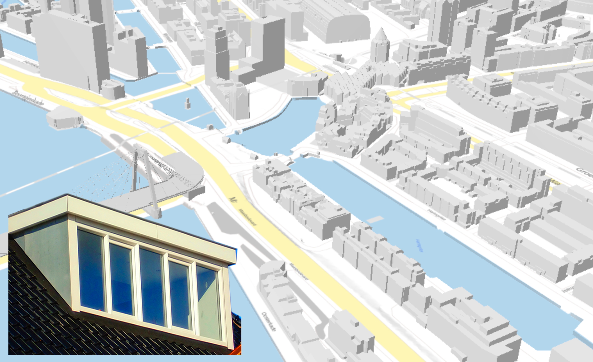
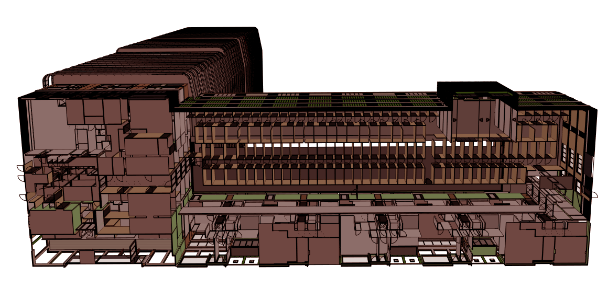

- - -

* Table of Content
{:toc}

- - -

## A CityJSON loader for ParaView

{:width="400px"}

Paraview is an open-source, multi-platform data-analysis and visualization application. It is used for the visualization of simulation results in fields such as CFD calculations.

In this research topic, your goal is to develop a loader for CityJSON files in ParaView. You will have to work in the C++ programming language and ParaView's API in order to build a respective reader.

Resources: [ParaView plugins how-to](https://www.paraview.org/Wiki/ParaView/Plugin_HowTo).

**Contact:** [Clara García-Sánchez](https://cgarcia-sanchez.com)

- - -

## Inferring the needed building permission from a 3D building model

{:width="400px"}

In the Municipality of Rotterdam the building regulations are very different if a construction work on a roof is a dormer, an additional floor, or something else. It can be difficult to figure out what regulations apply for a given construction plan. To make this easier the municipality of Rotterdam would like to offer a tool that can automatically determine what permits are needed, given a 3D geometry of the building plans. The tool should be able to infer what kind of object is designed and provide to the designer the needed regulations and constraints.

In this research the aim is:
- to build a web application that can read an LoD2 CityJSON model of the current situation and allows the user to modify the building with the desired modifications;
- to develop a method that can infer what kind of object was designed in the web application (only objects on the roof will be considered) and deliver the related regulations accordingly.

*This topic can be chosen by 2 people*

**Contact:** [Francesca Noardo](http://www.noardo.eu), [Stelios Vitalis](http://3d.bk.tudelft.nl/svitalis), [Ravi Peters](http://tudelft.nl/rypeters).

- - -

## Checking dwellings and volumes in BIM

{:width="400px"}

Given a Building Information Model in Industry Foundation Classes (IFC) format, it is necessary to compute the number of dwellings in the building and the respective volumes, to check compliancy with the urban regulations.

In this research, it is possible either to make a literature review on the topic and apply the found methods, or to develop a tool from scratch.

Prior algorithmic knowlegde, recursion, graph concepts could be beneficial.

**Contact:** [Francesca Noardo](http://www.noardo.eu), [Thomas Krijnen](http://thomaskrijnen.com/)