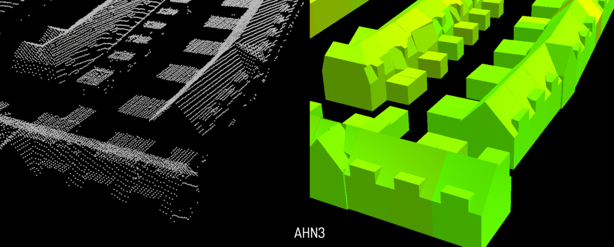

- - -

* Table of Content
{:toc}

- - -

## A CityJSON loader for ParaView

{:width="400px"}

Paraview is an open-source, multi-platform data-analysis and visualization application. It is used for the visualization of simulation results in fields such as CFD calculations.

In this research topic, your goal is to develop a loader for CityJSON files in ParaView. You will have to work in the C++ programming language and ParaView's API in order to build a respective reader.

Resources: [ParaView plugins how-to](https://www.paraview.org/Wiki/ParaView/Plugin_HowTo).

**Contact:** [Clara García-Sánchez](https://cgarcia-sanchez.com)

- - -

## Quality control and fusion of point cloud datasets in the Netherlands for automatic building reconstruction

{:width="800px"}

There are several point cloud datasets available in the Netherlands. Apart from the well known AHN, the Dutch Kadaster maintains a national one derived from aerial imagery, and also some municipalities maintain their own point cloud (for example Rotterdam). These point clouds have different qualities, eg due to different acquisition techniques. And they have different acquisition dates and different update intervals. Typically the points clouds with higher quality are less often updated. 

For building reconstruction it makes sense to use a combination of several point clouds: the highest quality point cloud where it is not outdated and the lower quality point cloud where there have been changes. 

The aim of this project would be to

* gain insight in the faults in the different point clouds. For instance we have observed that some point clouds contain big errors (e.g. a part of the roof of a house that is several meters higher than it should be). We would like to know how often and where these errors occur. 

And possibly 

* investigate how to best combine the different point clouds to get a building model dataset that is both as detailed as possible and as up-to-date as possible. It is possible to also involve other datasets like the BAG that have information on when buildings are modified. 

The project would likely require doing change detection for between the various point clouds for large areas on our linux server.

**Contact:** [Ravi Peters](http://tudelft.nl/rypeters)
