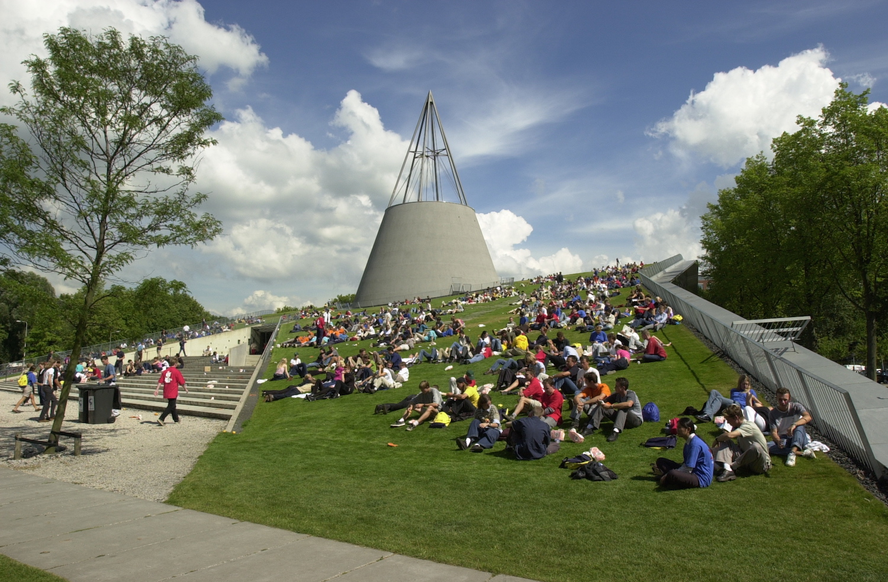

Eurographics Workshop on Urban Data Modelling and Visualisation 2015 at the Delft University of Technology.

## Monday 23 November 2015

## Introduction

The objective of this workshop is to discuss the modelling and visualisation of the city at various temporal and spatial scales, and aims at sharing associated techniques, methods, uses and points of view.

## Venue

The workshop will be hosted by the 3D Geoinformation Research Group at the Delft University of Technology in the Netherlands (N52.005234, E4.370134).

## Call for papers

Contributions addressing the following topics are welcome:

- Modelling the static and dynamic features of the city (spatio-temporal data)
- Multi-scale geometric data (from building scale to urban scale)
- Multi-scale temporal data (from real time to history time)
- Visualisation of several urban data layers (aggregated indicators)
- Visual analytics using urban data (decision making processes and CAD)
- Acquisition and generation of real or realistic urban data

### Submissions and publications

Expected contributions are research papers, 6 pages in EG publication format, presenting unpublished methods, algorithms and techniques with established results. All accepted papers will be presented orally at the conference by one of the authors, and will be published in the EG Digital Library.

You can download the LaTeX template from here. Submissions in Word and other formats will not be accepted.

### Post-event journal publications

Researchers of selected papers will be contacted to submit an extension of their work for the EG journal.

## Important dates

- ??, 2015 : Paper submission
- ??, 2015 : Author notification
- ??, 2015 : Camera-Ready Paper Due
- November 23, 2015 : Workshop date

## Registration

The registration will cost €??, and it covers proceedings, lunch, and coffee breaks.

## Organisation and scientific committee

## Sponsors

## Programme

Tentative programme:

#### Sunday 22 November

#### Monday 23 November

## Getting there

## Accommodation