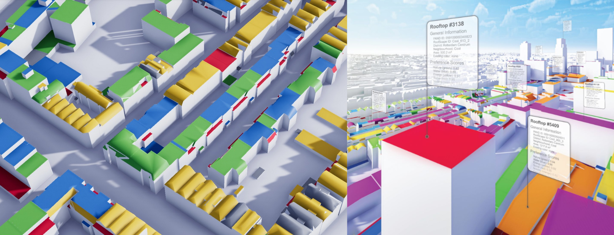

<figure class="image">
  
</figure>

## 3D Reconstruction and modelling of roofs in European cities 

# Teaser: Are you passionate about urban innovation, advanced 3D modeling, and impactful European research? Join the EU-funded "MultiRoofs" project, and shape the European cities’ skyline of tomorrow!

The overall goal of this fully-funded PhD position is to support the researchers and practitioners in the project "MultiRoofs" by designing and implementing algorithms for the 3D reconstruction of buildings and for the classification of roofs.

MultiRoofs (**Multi**functional **Roof**scapes for smart, green and just urban densification) is an EU-project that aims to enable public authorities to increase the multifunctional use of rooftops in their urban areas.
The project is composed of 25+ partners in Western Europe (including Rotterdam, Paris, Dublin, Brussels, companies, and universities) and it is an extension of a prototype developed in Rotterdam, the Netherlands ([see details](https://mvrdv.com/news/4290/mvrdv-launches-roofscape-a-new-software-to-help-reimagine-rotterdams-rooftops)).

The backbone of the current prototype is the [3DBAG](https://3dbag.nl), a dataset containing automatically reconstructed 3D models of all 10M+ buildings in the Netherlands; this dataset is (jointly) developed and maintained by our research group.

The tasks of the PhD candidate are:

* modify the [algorithms for the reconstruction of the 3D buildings](https://github.com/3DBAG/roofer) so that other source datasets can be used (aerial imagery, lidar with different densities, coarser footprints, etc.) to reconstruct 3D models of other European cities
* improve the algorithms to reconstruct [LoD3.0](https://3d.bk.tudelft.nl/lod/) models, ie dormers and chimneys and other objects relevant to roofs should be identified and modelled
* develop a solution for a better regularisation and symmetry of the dormers (one current weakness)
* work on workflows to (better) categorise the roofs for the different uses identified by the project partners.

The project will take place in the [3D geoinformation group at TU Delft](https://3d.bk.tudelft.nl) under the supervision of [Dr Hugo Ledoux](https://3d.bk.tudelft.nl/hledoux) and [Prof. Jantien Stoter](https://3d.bk.tudelft.nl/jstoter)

## Research group

The position will be embedded in the [3D geoinformation research group](https://3d.bk.tudelft.nl) at the [Delft University of Technology](https://tudelft.nl).

It focuses on the technologies underpinning geographical information systems (GIS) and aims at designing, developing, and implementing better systems to model 3D cities, buildings, and landscapes.

It is a multidisciplinary group (computer scientists, geomatics/mechanical/aerospace engineers, and geographers) composed of 8 permanent research staff, several PhD students, postdocs, and visitors.

It has a history of successful collaborations with the industry and the government: its research has led to [open source software](https://github.com/tudelft3d) and [open standards](https://www.cityjson.org) for the management of 3D geographic information.

We cover several aspects of 3D geoinformation: 3D reconstruction, analysis, CFD, energy

<!-- TODO: this section is incomplete! -->

## Job requirements

We are looking for one highly motivated candidate who holds an MSc degree (or is almost completed) in geomatics/civil/aerospace/environmental engineering, geoinformatics, computer science, or in a related discipline. 

The candidate is expected to have:

* strong interest in computational geometry and 3D reconstruction
* experience with the management and analysis of 3D geo-data, 
* good programming skills (C++ being an advantage), 
* an affinity for working in multi‐disciplinary teams in an international oriented environment
* excellent oral and written communication skills (in English); see [requirements at TUDelft](https://www.tudelft.nl/onderwijs/opleidingen/phd/admission). 

The starting date is in consultation with the candidate, and we aim at 1 July 2024 at the latest.

## Doing a PhD at TU Delft

At the [Delft University of Technology](https://tudelft.nl), a PhD student is a full-time employee of the university who gets paid a salary; no extra funding is necessary, and no tuition fees need to be paid.

Salary and benefits are in accordance with the Collective Labour Agreement for Dutch Universities.
The salary is min. €2.872,- to max. € 3.670,- gross per month. Besides the salary you also receive an annual holiday payment of 8% and an end of year bonus payment of 8.3%.

TU Delft also offers an attractive benefits package, including a flexible work week and the option of assembling a customised compensation and benefits package.

An International Children’s Centre offers childcare and an international primary school. Dual Career Services offers support to accompanying partners. Salary and benefits are in accordance with the Collective Labour Agreement for Dutch Universities.

More information about doing a PhD at TU Delft and in the Netherlands can be found [here](http://www.graduateschool.tudelft.nl) and [there](https://www.studyinnl.org/dutch-education/phd).

## What we offer

* Salary and benefits are in accordance with the Collective Labour Agreement for Dutch Universities. The salary is min. €2.872,- to max. € 3.670,- gross per month. Besides the salary you also receive an annual holiday payment of 8% and an end of year bonus payment of 8.3%. 
* The position has a fixed-term contract of 4 years.
* As a PhD candidate you will be enrolled in the TU Delft Graduate School. The TU Delft Graduate School provides an inspiring research environment with an excellent team of supervisors, academic staff and a mentor. The Doctoral Education Programme is aimed at developing your transferable, discipline-related and research skills.
* The TU Delft offers a customisable compensation package, a discount on health insurance and sport memberships, and a monthly work costs contribution. Flexible work schedules can be arranged.
* For international applicants we offer the Coming to Delft Service and Partner Career Advice to assist you with your relocation. An International Children's Centre offers childcare and there is an international primary school.

## How to apply

Deadline to apply is XXX.

<!-- TODO: add deadline -->

You can apply via this [webpage](https://3d.bk.tudelft.nl)

<!-- TODO: add URL to apply -->

To apply, please submit:
* A letter of application (maximum 1 page) and a detailed curriculum vitae. Those should contain examples that prove your previous work related to the position (projects, experience, software, research, publications).
* The names of two references, with contact information (letters not required at this stage).

For more information about this position, please contact directly [Dr Hugo Ledoux](https://3d.bk.tudelft.nl/hledoux) and [Dr Jantien Stoter](https://3d.bk.tudelft.nl/jstoter).

