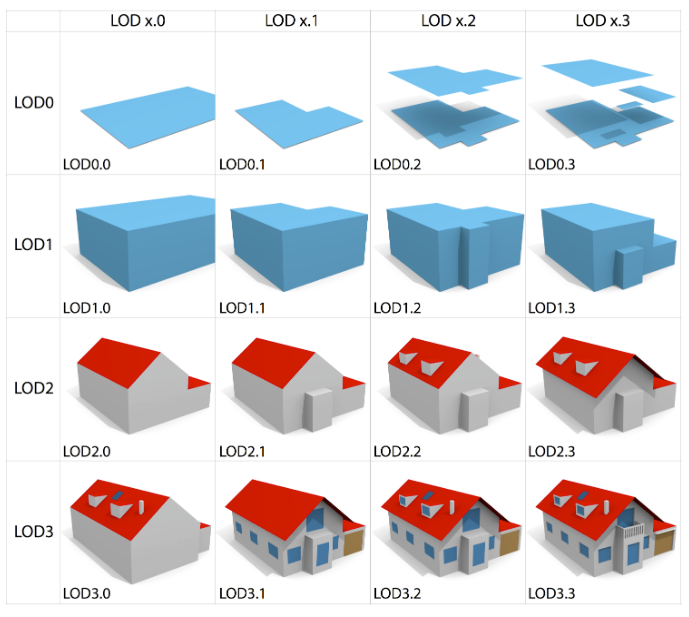

# Multiroofs 2nd-round interview task

## Aim

The aim of this task is to create a small software program that converts one building in a 3D city model from LoD2.2 to LoD1.2 (level-of-detail).

However, since the full process is rather long and complex, we will consider a simpler version of the problem with the following simplifications:

- Semantics will not be taken into account, so this task is purely about geometry.
- The input and output will be in the format [OBJ files (Wavefront)](https://en.wikipedia.org/wiki/Wavefront_.obj_file), rather than the common [CityJSON](https://cityjson.org).
- The input will consist of a single building in LoD2.2, and all faces have been triangulated. 

In 3D city modelling, the LoD1.2 is a "block-shaped" representation: roofs will be horizontal planes without additional structures (such as dormers or chimneys), and walls will be vertical planes ([for more details](https://3d.bk.tudelft.nl/lod/)).
It's used by many, eg Google Maps.

## The buildings

We sampled four buildings on the TUDelft campus from the [3DBAG](https://3dbag.nl) and we converted them to LoD2.2 and to OBJ files:

1. [simple.obj](simple.obj)
1. [beeb.obj](beeb.obj)
1. [otb.obj](otb.obj)
1. [bk.obj](bk.obj)

## Dos and don'ts

- Don't spend more than 4-5 hours on this task. We are looking for a simple solution.
- Don't use libraries that solve the entire task for you.
- Don't read or implement the entire specifications for the Wavefront OBJ files (eg for the textures). It is not necessary, stick to the file given.
- Choose the language you prefer, and please document your code.
- Do use libraries for the geometric operations or to handle input/output, if you want. 
However, you should be able to explain how these operations work at a low level.
- Do feel free to take shortcuts and to simplify the problem further, if necessary.

## What to submit

- the source code, 
- instructions to compile and run it

Ideally create a GitHub repository, add us ([@hugoledoux](https://github.com/hugoledoux/) + [@GinaStavropoulou](https://github.com/GinaStavropoulou/)) as collaborator, and email us the URL.
You can alternatively email us a zip.

Submit this Wednesday 2 April 2025 before 9:00.

Then, at the second interview, you should give a quick technical presentation of up to 10 minutes explaining how your program works (you can prepare slides and share your screen if you want), the engineering choices you made while programming, and how it could be improved (given more time). 
We will ask you a few questions about it. 
Bear in mind that while we do care about the quality of your code, we are more interested in discussing the details of your technical solution and its advantages/disadvantages.

