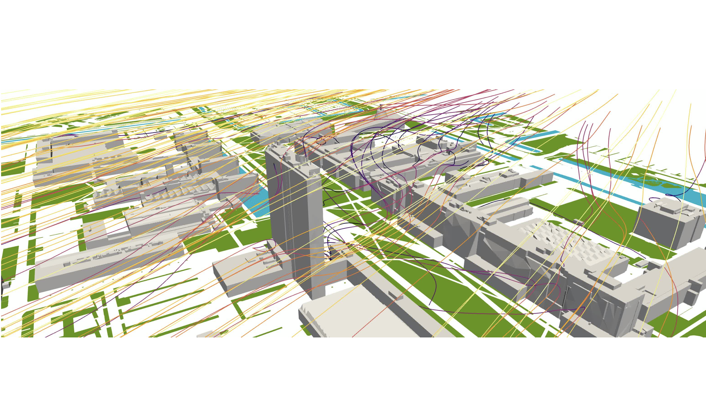

<figure class="image">
  
</figure>

The 3D Geoinformation research group is looking for a postdoc to work in the intradisciplanary project UrbanAIR.
You will explore the reconstruction of urban environments tailored for CFD simulations (low-high fidelity). The work includes both reconstruction and simulation running experiences.

The last decades there has been a growing interest in urban flows, linked to an increase attraction to the adaptation of the urban environment towards climate change. Some contributions have focused on evaluating the impact of urban layouts on airflows, specifically looking at wind, heat and pollution dispersion. In this position, you will explore techniques (that combine low and high-fidelity CFD simulations) to improve numerical predictions in urban environments, specifically addressing uncertainties related to atmospheric stratification, geometry simplification and changing inflow conditions.

The 3D Geoinformation research group, Section Urban Data Science has an open 3-year position postdoc position to specifically address the project tasks:

- Tailor urban reconstruction, including vegetation, for multiple CFD codes (low/high fidelity).
- Explore the impact of atmospheric stratification for urban flow simulations considering RANS methodologies, with the aim to develop an uncertainty quantification framework that can account for such variations.
 
## Research group

The position will be embedded in the [3D geoinformation research group](https://3d.bk.tudelft.nl), Section Urban Data Science part of the [Faculty of Architecture and the Built Environment](https://www.tudelft.nl/en/architecture-and-the-built-environment).
The group focuses on technologies underpinning open geo-data and the integration with Building Information. Models and aims at designing, developing, and implementing open data and open source solutions to model cities, buildings, and landscapes in 3D for environmental and urban studies.
Open Science is an important principle of our research.
We are also the main provider of education in the [MSc Geomatics](http://geomatics.tudelft.nl).
It is a multidisciplinary group of about [25 people](https://3d.bk.tudelft.nl/about/#people), including computer scientists, geomatics engineers, and geographers.
It has a history of successful collaborations with the industry and the government: its research has led to [software](https://github.com/tudelft3d), standards and patents for the management of 3D geographic information.

The researcher will be part of the UrbanAIR project, funded by the European Union, in which we will collaborate with experts in atmospheric modelling, urban planning, data assimilation and decision making at various European universities, research organizations and companies.

## Job requirements

- Holds an PhD degree (or almost completed) in aerospace engineering, mechanical engineering, geoinformatics/geomatics, computer science, applied mathematics, or in a related engineering discipline.
- Has experience in computational fluid dynamics, machine learning, 3D modelling, preferably from a programming perspective.
- Has good software development skills. Experience with C++ is beneficial.
- Has excellent oral and written communication skills. See [requirements](https://www.tudelft.nl/onderwijs/opleidingen/phd/admission) at TUDelft. 
- Has an affinity with working in multi‐disciplinary teams in an international oriented environment.

## What we offer
- The position has a fixed-term contract of 3 years.
- The TU Delft offers a customisable compensation package, a discount on health insurance and sport memberships, and a monthly work costs contribution. Flexible work schedules can be arranged.
- For international applicants we offer the Coming to Delft Service and Partner Career Advice to assist you with your relocation. An International Children's Centre offers childcare and there is an international primary school.

## How to apply

Deadline to apply is 27th of April 2025.

You can apply via this [webpage](https://careers.tudelft.nl/job/Delft-Postdoc-High-Resolution-Reconstruction-and-Urban-CFD-%28UrbanAIR%29-2628-CD/817228302/)

To apply, please submit:
- A letter of application and a detailed CV.
- A list of examples that prove your previous work related to the position (projects, experience, software, research, publications).
- The names of two references, with contact information (letters not required at this stage).

For more information about this position, please contact directly dr [Clara Garcia-Sanchez](https://3d.bk.tudelft.nl/gsclara).

