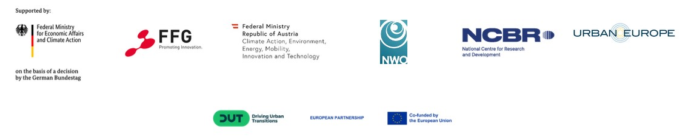

  

- - -

* Table of Content
{:toc}

- - -
## Summary

The main idea of the [DigiTwins4PEDs](https://digitwins4peds.eu/) project is to use Urban Digital Twins as a digital representation of the real world, opening up a wide range of possibilities for modeling the energy aspects of cities. This innovative approach aims to create a platform for residents and stakeholders to exchange information, enabling them to visualize various PED scenarios before their actual implementation. The project started in autumn 2023 and is planned to finish in spring 2026.

- - -
## Our role in the project

WP4 Leader (“Integration of Urban Digital Twin into the co-creation process for different case studies"). Contribution to other WPs, especially WP3 ("Extension of the Urban Digital Twin Concept with flexibilisation strategies"). Support to the other case studies, in particular Rotterdam.

- - -
## Funding

The project is funded by the European Commission under the Horizon Europe Partnership scheme. The DUT Call 2022 also contributes to the Urban Transition Mission of Mission Innovation as part of the MICall 2022 initiative.

- - -

## Team

  

      
    <h3>Giorgio Agugiaro <small>Assistant Professor (TUD)</small></h3>
    

        <a href="https://3d.bk.tudelft.nl/gagugiaro"><i class="fas fa-home"></i></a>
        <a href="mailto:g.agugiaro@tudelft.nl"><i class="fas fa-envelope"></i></a> 
         
         
    

  

  

      
    <h3>Weixiao Gao <small>PostDoc</small></h3>
    

        <a href="https://3d.bk.tudelft.nl/weixiao"><i class="fas fa-home"></i></a>
        <a href="mailto:w.gao-1@tudelft.nl"><i class="fas fa-envelope"></i></a> 
         
         
    

  

  

      
    <h3>Camilo León-Sánchez <small>PostDoc</small></h3>
    

        <a href="https://3d.bk.tudelft.nl/cleon"><i class="fas fa-home"></i></a>
        <a href="mailto:c.a.leonsanchez@tudelft.nl"><i class="fas fa-envelope"></i></a> 
         
         
    

  

  
  
