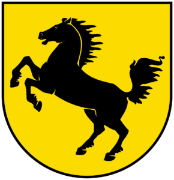

  

- - -

* Table of Content
{:toc}

- - -
## Summary

The **CityGML Energy Application Domain Extension 2.0** (or, in short: **Energy ADE 2.0**) offers an open and standardised data model to facilitate multi-scale Urban Energy Modelling applications.

The current version is based on and builds upon the first version of the [Energy ADE](https://www.citygmlwiki.org/index.php/CityGML_Energy_ADE), released in 2018, which has been already used in several national and international projects, mainly focusing on the simulation and computation of the building energy performance based on the integration of semantic 3D city models and other sources of information.

The technological innovations and the experiences and feedback collected since its release have contributed to forge several new ideas to improve and update the Energy ADE. Since 2024, work has been going on to harmonise and implement such ideas, towards a so-called Energy ADE 2.0.

The Energy ADE 2.0 extends [CityGML 2.0](https://portal.ogc.org/files/?artifact_id=47842), but its development already keeps in consideration its future porting to [CityGML 3.0](https://docs.ogc.org/is/20-010/20-010.html)

- - -
## Our role in the project

Development of the Energy ADE 2.0 has originally started in spring 2024 within the European project [DigiTwins4PEDs](https://3d.bk.tudelft.nl/projects/digitwins4peds/), in which TU Delft was leading a Work Package task specifically dedicated to updating the Energy ADE. However, a several "external" contributors, early testers, and technology enthusiasts have since joined on a volunteer basis.

The Energy ADE 2.0 is now being collaboratively developed with the goal to become fully open-source starting from September 2025.

Willing to join? Get in contact!

- - -

## Contact person

  

      
    <h3>Giorgio Agugiaro <small>Assistant Professor (TUD)</small></h3>
    

        <a href="https://3d.bk.tudelft.nl/gagugiaro"><i class="fas fa-home"></i></a>
        <a href="mailto:g.agugiaro@tudelft.nl"><i class="fas fa-envelope"></i></a> 
         
         
    

  

  
  
## Main contributors 

<table align="center">
  <tr>
    <td align="center" valign="middle"></td>
    <td align="center" valign="middle"></td>
    <td align="center" valign="middle"></td>
    <td align="center" valign="middle"></td>
    <td align="center" valign="middle"></td>
  </tr>
</table>

## Early testers and technology enthusiasts

<table align="center">
  <tr>
    <td align="center" valign="middle"></td>
    <td align="center" valign="middle"></td>
    <td align="center" valign="middle"></td>
    <td align="center" valign="middle"></td>
    <td align="center" valign="middle"></td>
    <td align="center" valign="middle"></td>
  </tr>
  <tr>
    <td align="center" valign="middle"></td>
    <td align="center" valign="middle"></td>
    <td align="center" valign="middle"></td>
    <td align="center" valign="middle"></td>
  </tr>
</table>