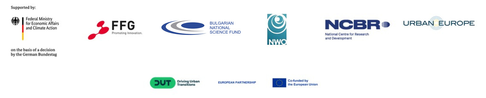

  

- - -

* Table of Content
{:toc}

- - -
## Summary

Project [FlexPED](https://flexped.eu) focuses on deleveloping an open, intelligent, and scalable energy data management and flexibility framework for city districts, using an Urban Digital Twins (UDT) platform integrated with generative AI as decision support system. The central idea is that an operational UDT platform, integrated with AI-powered agent-based simulation, can actively support stakeholders in co-developing, implementing, and monitoring adaptive and decentralised energy flexibility strategies.

- - -
## Our role in the project

Work Package Leader (WP4 "Development of data integration services for energy data management and flexibility in city districts"). Contribution to other WPs, support to the case studies, scientific dissemination.

- - -
## Partners

- - -
## Funding

The project is funded by the European Commission under the Horizon Europe Partnership scheme. The [DUT Call 2024](https://dutpartnership.eu/calls/dut-call-2024) also contributes to the Urban Transition Mission as part of the MICall 2024 initiative.
In the Netherlands, the project is funded through the Dutch Research Counsil [(NWO)](https://www.nwo.nl/en).

- - -

## Team

  

      
    <h3>Giorgio Agugiaro <small>Assistant Professor</small></h3>
    

        <a href="https://3d.bk.tudelft.nl/gagugiaro"><i class="fas fa-home"></i></a>
        <a href="mailto:g.agugiaro@tudelft.nl"><i class="fas fa-envelope"></i></a> 
         
         
    

  

  

      
    <h3>Taşkın Ökzan <small>PostDoc</small></h3>
    

        <a href="https://3d.bk.tudelft.nl/tokzan"><i class="fas fa-home"></i></a>
        <a href="mailto:t.okzan@tudelft.nl"><i class="fas fa-envelope"></i></a> 
         
         
    

  

  
  
