

  <!-- 

 -->
  

  

	

---

* blablabla
{:toc}

---

## About

The aim of the 5D modelling research project is to integrate the multi-dimensional characteristics of geographic data, i.e. 2D/3D, time and scale (also indicated as 'Level of Detail', 'resolution' or 'granularity') at a fundamental level of data modelling. 
The resulting conceptual 5D model creates a new approach for modelling geographic data (geo-data), as until now geo-data modelling has focused on the issues of single dimensions only, with at most some minimum attention for the other dimensions.

The integrated approach provides a sustainable foundation for spatial data infrastructures:

  - A true 5D approach accomplishes a highly formal definition of geo-data that fully addresses the relationships between space, time and scale. This avoids having to handle special cases separately.
  - The model enforces consistency across dimensional borders, which improves data quality.
  - Optimal efficient 5D searching and maintenance can only be realised if a 5D data structure is used, otherwise the DBMS query plan has to select first on space, then on time and then on scale (or in another order).

The 5D data modelling is being studied at two levels. At first a 5D data model and data structure are being accomplished on which any geo-information model can be founded. Secondly, it is being studied how GIS data can be modelled in an nD way accordingly.

Because of the high ambitions to realise a true 5D model, the focus is on laying down a foundation for n-dimensional data modelling by defining a theory validated through prototype implementations, which can be further developed in the future. In addition, in a step-wise approach mathematical theories on n-dimensional modelling are being applied to established principles in 2D/3D, time and multi-scale modelling. Studying several combinations of the different dimensions will identify the optimal method for including multi-dimensional concepts and notions in geo-data modelling.

The research will result in well-tested technology for 5D data modelling after 5 years. However as the research approach extends currently available single-dimensional models in a step-wise approach, the intermediate models that integrate multiple but not all dimensional concepts are already in reach for use in practice and commercial implementations within the next few years, i.e. several 3D models after one to two years (3D space, 2D space+time, 2D space+scale) and several 4D models after several years (3D space+time, 3D space+scale, 2D space+time+scale), all based on a solid mathematical theory and recent GIS technology developments.

In 2010 this research project was awarded with a Vidi grant from the [Dutch Technology Foundation STW](http://www.stw.nl), which is part of the [Netherlands Organisation for Scientific Research (NWO)](http://www.nwo.nl). Since then several PhDs, Post-docs, MSc students and visiting scientists have been working in the project.

---

## Main publications

The complete list of publications of the project is available <a href="publications.html">here</a>.



---

## Research topics and tasks

    
 
        <a data-toggle="collapse" href="#k">
          <b>Realising the foundations of a higher dimensional GIS PhD research of Ken Arroyo Ohori (06/2011 &ndash; ongoing)</b>
        </a>
    

      

      

        

        

          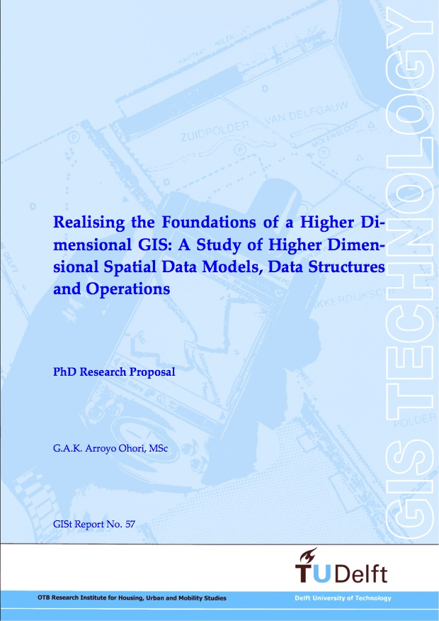
        

        

          

          Geographic Information Systems are still relatively weak in 3D, with most systems only able to support at most some form of limited 3D storage and visualisation with the help of external modules.
          This is not because of a lack of applications for higher dimensional GIS.
          We can gain powerful new insights by integrating additional dimensions into GIS, such as time, scale, and other application-dependent feature spaces.
        

        

          At the same time, techniques to create and manipulate spatial data were developed much further within other fields, such as algebraic topology and computer graphics.
          This included strong mathematical formulations and their extension to higher dimensions.
          Thus, 3D (and more) became widespread in these fields, to the point that is now a standard part of them.
        

        

          The purpose of my research is therefore to take advantage of these developments in other fields and develop the new representations and techniques needed to support a higher dimensional GIS, as well as to put these into practice by building actual working prototypes.
        

          <strong>Realising the foundations of a higher dimensional GIS: a study of higher dimensional spatial data models, data structures and operations</strong>. Ken Arroyo Ohori. PhD Proposal 57, OTB Research Institute for the Built Environment, Delft University of Technology, December 2011. ISBN: 978-90-77029-29-9 ISSN: 1560-0245.   <a href="http://www.gdmc.nl/ken/files/11_phd_proposal.pdf"><i class="fa fa-file-text-o"></i> PDF</a> <a href="http://www.gdmc.nl/ken/files/11_phd_proposal_presentation.pdf"><i class="fa fa-picture-o"></i> Slides</a> <a href="#bib11phdproposal" data-toggle="collapse"><i class="fa fa-caret-square-o-down"></i> BibTeX</a>
<pre>@techreport{11phdproposal,
  author = {Ken {Arroyo Ohori}},
  title = {Realising the Foundations of a Higher Dimensional {GIS}: A Study of Higher Dimensional Spatial Data Models, Data Structures and Operations},
  institution = {OTB Research Institute for the Built Environment, Delft University of Technology},
  year = {2011},
  type = {PhD Proposal},
  number = {57},
  month = dec,
  note = {ISBN: 978-90-77029-29-9 ISSN: 1560-0245}
}</pre>

        

      

      

          

            

            

              

                  <a data-toggle="collapse" href="#k1">
                      <b>1. <em>n</em>D data structures and data models</b> <i class="fa fa-angle-double-down"></i>
                  </a>
              

              

                  

                 
                

                  

                    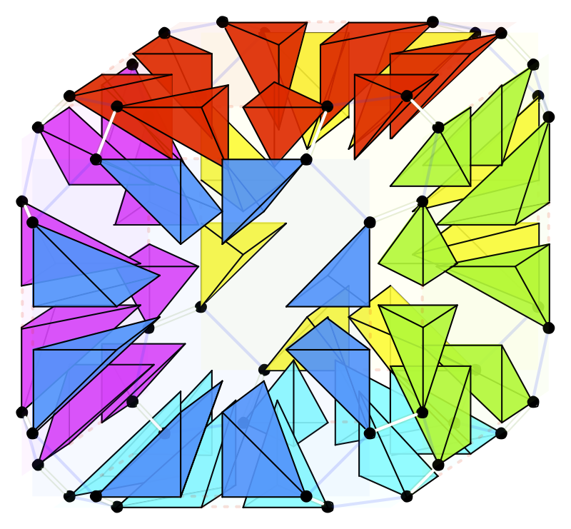
                  

                  

                    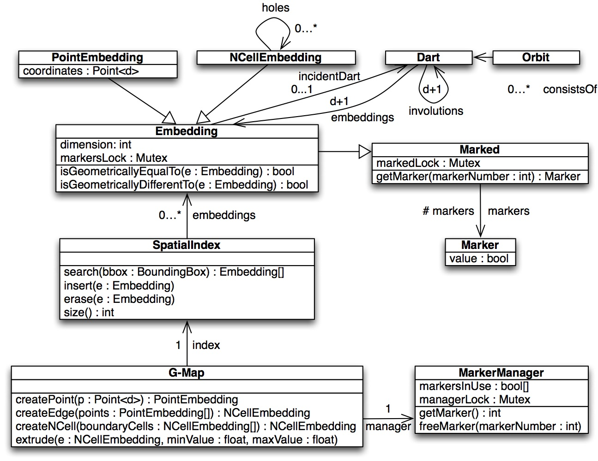
                  

                

                 
                

                  Current GIS data structures and data models only support 2D and 3D features in a limited form.
                  At the same time, there are representations developed in other domains (e.g. computer science, computer science and algebraic topology) that support nD data but cannot directly be aplied to GIS.
                  The aim of this research is to study the capabilities of existing nD data models and structures, together with the necessary adaptations in order to use them in GIS.
                   
                      <b>Read more:</b>
                      <?php echo($bibhtmler->process('publications.bib', '13iccsa')) ?>
                    

                  

              

            

            
            

              

                  <a data-toggle="collapse" href="#k2">
                      <b>2. Construction of nD objects: nD extrusion</b> <i class="fa fa-angle-double-down"></i>
                  </a>
              

              

                  

                 
                

                  

                    
                  

                  

                    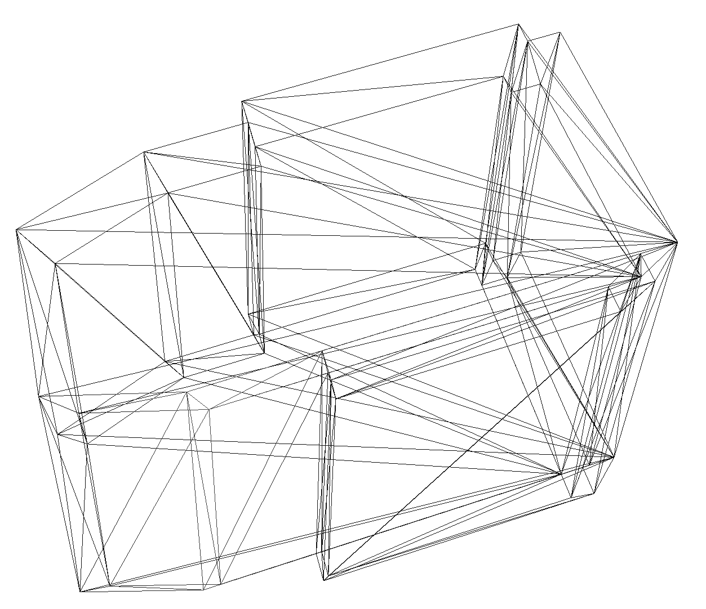
                  

                

                 
                

                  It is possible to construct nD objects from (n-1)D ones by assuming that these remain unchanged along the n-th dimension, such as when the footprint of a building doesn't change along the vertical direction or when a 3D building's geometry doesn't change in time.
                  This is a generalised version of the 2D to 3D operator as known in GIS.
                  The aim of this research is to develop an nD extrusion operator that is able to construct and maintain all topological relationships correctly.
                   
                      <b>Read more:</b>
                      <?php echo($bibhtmler->process('publications.bib', '13acmsigspatial')) ?>
                    

                  

              

            

          

              

                  <a data-toggle="collapse" href="#k3">
                      <b>3. Construction of nD objects: incremental construction</b> <i class="fa fa-angle-double-down"></i>
                  </a>
              

              

                  

                 
                

                  

                    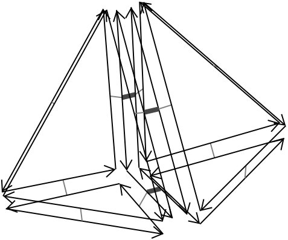
                  

                  

                    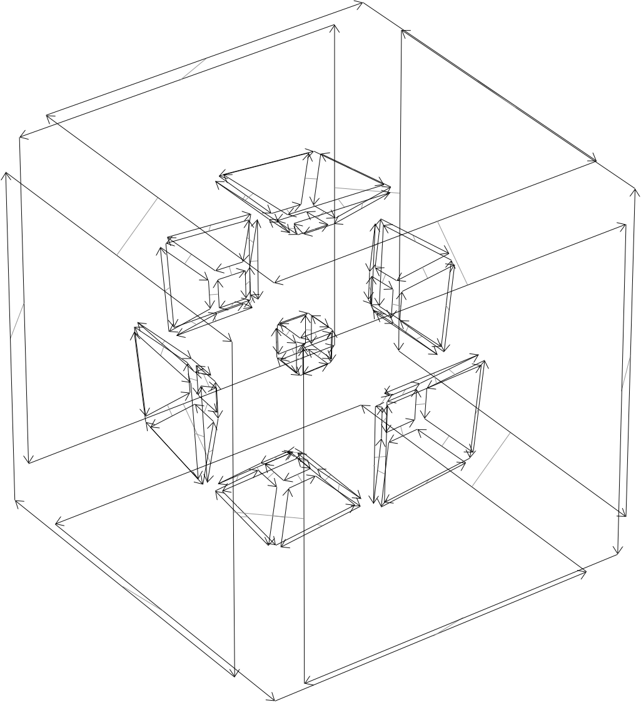
                  

                

                 
                

                  Constructing arbitrary nD objects is very difficult, largely because such objects are themselves difficult to describe and understand.
                  However, there is a relatively intuitive way to describe such nD objects, one that significantly reduces the complexity of their description: doing so based on their (n-1)D boundary.
                  This can be applied iteratively in increasing dimension, starting from simple nD points defined by their coordinates, and then moving on to facets, volumes, and so on.
                  The aim of this research is to develop an operator that is able to connect the "soup" of (n-1)D faces in the boundary of an object to form this nD object.
                   
                      <b>Read more:</b>
                      <?php echo($bibhtmler->process('publications.bib', '14icaa')) ?>
                    

                  

              

            

            

              

                  <a data-toggle="collapse" href="#k4">
                      <b>4. Manipulating higher dimensional GIS models</b> <i class="fa fa-angle-double-down"></i>
                  </a>
              

              

                  

                 
                

                  

                    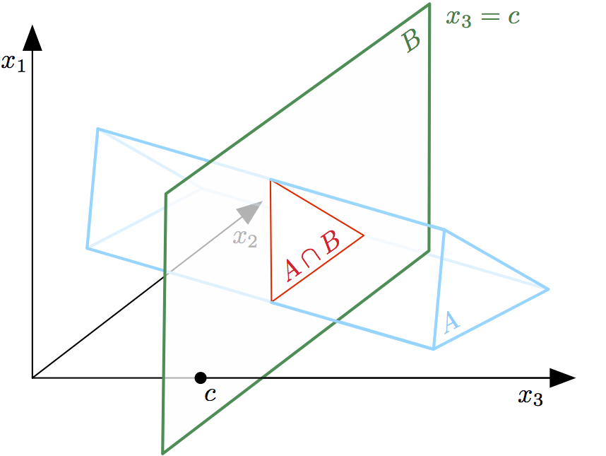
                  

                  

                    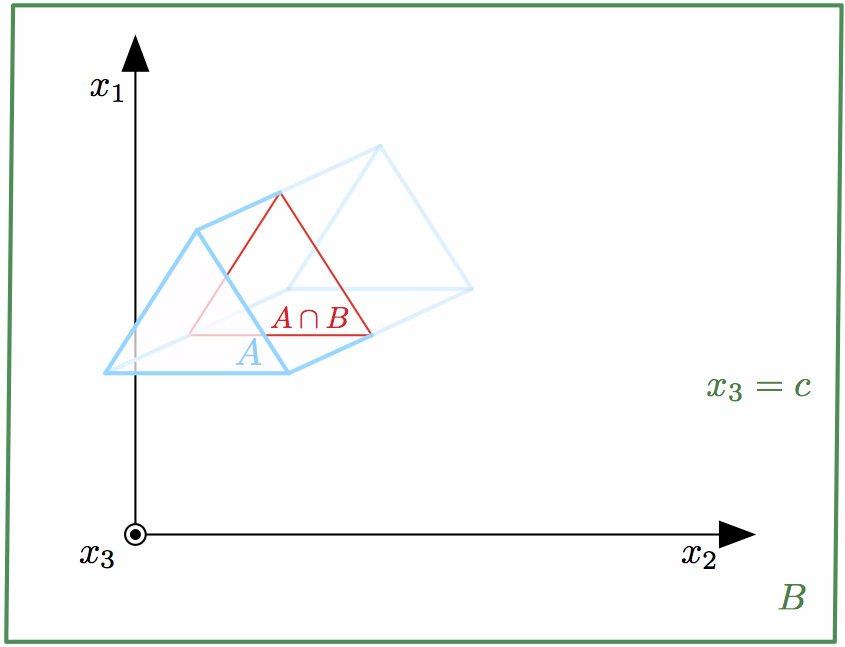
                  

                

                 
                

                  Editing and extracting useful information from higher dimensional models is complex since we are only used to working with 2D/3D data and tools.
                  Moreover, there is a lack of understanding and multiple misconceptions in the GIS community regarding what a higher dimensional GIS could do, how higher dimensional data would look like and how this data could be manipulated.
                  The aim of this research is therefore to describe the kind of data that would be used in a higher dimensional GIS, the work flow to do editing operations on it, and the techniques to extract 2D/3D data from it for use in standard 2D/3D GIS.
                   
                      <b>Read more:</b>
                      <?php echo($bibhtmler->process('publications.bib', '13agile')) ?>
                    

                  

              

            

            

              

                  <a data-toggle="collapse" href="#k5">
                      <b>5. Realising a higher dimensional GIS</b> <i class="fa fa-angle-double-down"></i>
                  </a>
              

              

                  

                 
                

                  Taking the developed theories and algorithms for a higher dimensional GIS and putting them into practice is not trivial.
                  The curse of dimensionality causes huge datasets and non-linear behaviour in even simple problems, programming and using dimension-independent libraries and functions requires advanced techniques, and the generic nature of GIS further complicates matters.
                  The aim of this research is to find and develop techniques to overcome these difficulties, and to build actual working prototypes to showcase the developed theories and algorithms.
                   
                    

                  

              

            

           
        

      

      

  

    
 
        <a data-toggle="collapse" href="#j">
          <b>Automatic repair of 3D city models John Zhao (07/2012 &ndash; 12/2013)</b>
        </a>
    

      

      

        <iframe src="//player.vimeo.com/video/80282908" width="500" height="375" frameborder="0" webkitallowfullscreen mozallowfullscreen allowfullscreen></iframe> 
<a href="http://vimeo.com/80282908">Repair of 3D building models using shrink-wrapping</a> from <a href="http://vimeo.com/user18215271">Junqiao Zhao</a> on <a href="https://vimeo.com">Vimeo</a>.

      

  

    
 
        <a data-toggle="collapse" href="#h">
          <b>Validation of 3D datasets Hugo Ledoux (06/2011 &ndash; ongoing)</b>
        </a>
    

    

    

      
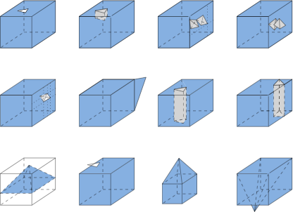

      
The international standard <a href="http://www.iso.org/iso/catalogue_detail.htm?csnumber=26012">ISO19107</a> provides definitions of geometric primitives, with the aim of fostering exchange and interoperability in the GIS community. In 2D, these are well-accepted and there are several implementations available to <em>validate</em> primitives. However, while there exists an equivalent definition in 3D (for solids), it is ignored by most researchers and by software vendors. We are working on an open-source validator for 3D datasets, one that is ISO19107-compliant. It is called <em>val3dity</em>, the code is freely <a href="https://github.com/tudelft3d/val3dity">available</a>, and we offer a <a href="http://geovalidation.bk.tudelft.nl/val3dity">web application</a>.

    

      

    
 
        <a data-toggle="collapse" href="#f">
          <b>Level of Detail in 3D city modelling PhD research of Filip Biljecki (07/2012 &ndash; ongoing)</b>
        </a>
      

        

      

      

        

        

          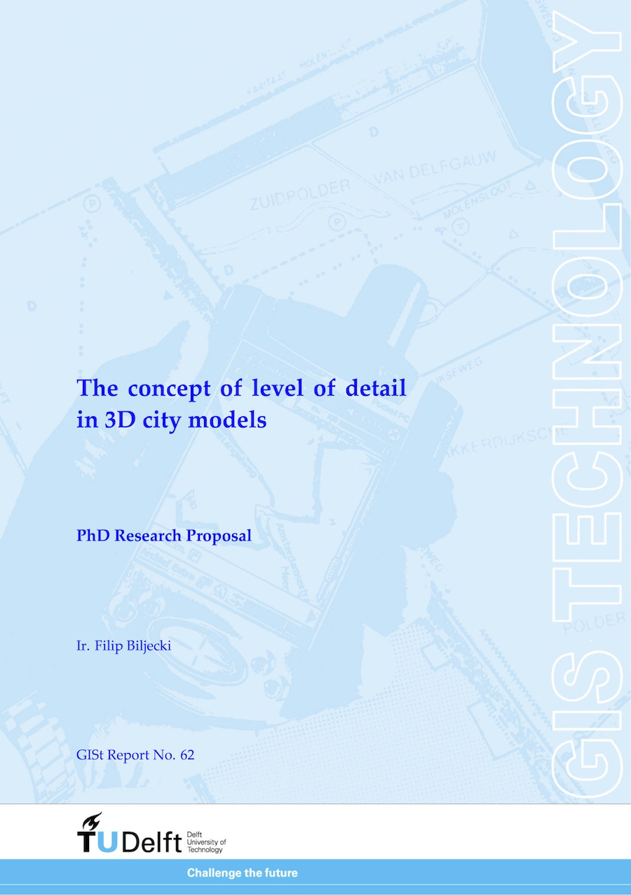
           
        

        

        

            Level of detail is a concept available in various disciplines from computer graphics and cartography to electrical circuit design. 
            For GIS practitioners, the discipline where LOD is most relevant and well known is 3D city modelling. 
            While current LOD paradigms, such as the one found in CityGML 2.0, fulfil the requirements of many applications and users, there are significant shortcomings: the LODs are discrete and their number is limited, the specifications are not clear, potentially there is inconsistency between different LODs, the paradigms do not take into account the application and user’s needs, and redundancy is present in virtually all parts of the modelling-storage-query-visualisation workflow. Further, there is no framework in which LODs can be compared and translated.
          

          
The aim of this PhD research is to investigate and to improve the concept of level of detail (LOD) in 3D city modelling. The two most important aspects of the improvement are the formalisation of the concept in the frame of 3D city modelling, and the integration of LOD with 3D space in a 4D model (3D+scale). 
          

        

          This research is associated with the OGC CityGML Standards Working group, and the results may be used for the upcoming version of the standard due in 2016.
        

         
        
        <?php echo($bibhtmler->process('publications.bib', '13phdproposal')) ?>
        <?php echo($bibhtmler->process('publications.bib', '13eurosdr')) ?>
        
        

      

        

      

        

          <a data-toggle="collapse" href="#fs">    
              <b>Stages and research questions</b> <i class="fa fa-angle-double-down"></i>
            </a>
          

          

            

            

              

                  <a data-toggle="collapse" href="#f1">
                      <b>1. Formalisation:</b> What is the concept of LOD, what is an LOD? How to specify it? <i class="fa fa-angle-double-down"></i>
                  </a>
              

              

                  

                
The concept of LOD is an ambiguous term in 3D city modelling. The goal here is to formalise the concept in a consistent framework, and to derive a specification format in order to unambiguously specify a discrete LOD which can be used, for instance, in contracting and the process of procurement of 3D city models. 
                    <b>Most relevant publication:</b> Under submission, to be updated.

                  

              

            

             
          
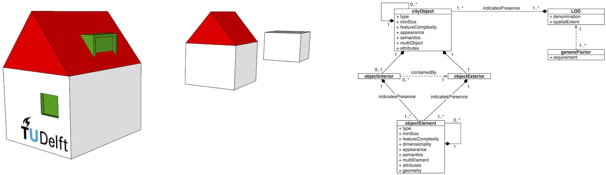

           

            

              

                <a data-toggle="collapse" href="#f2">
                      <b>2. Hyper-dimensional integration of space and scale: </b>Can we model LOD as a spatial dimension, i.e. in a space-scale hypercube? <i class="fa fa-angle-double-down"></i>
                  </a>
        
              

          
  
            

                

                  
This part of the research deals with the integration of 3D geometry and LOD in a 4D model. The benefits of this approach are, for instance, consistency and vario-scale 3D models. 
                  <b>Most relevant publication:</b> An introduction is available in <i>Stoter et al. (2012): Integrating scale and space in 3D city models</i> [<a href="http://dx.doi.org/10.5194/isprsarchives-XXXVIII-4-C26-7-2012" target="_blank">DOI</a>]

                

            

          

          
         
      
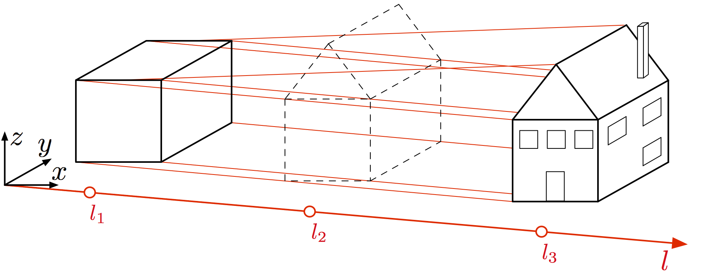

       

        

          

            <a data-toggle="collapse" href="#f3">
                    <b>3. Context-awareness:</b> Can we define contexts and use-cases in 3D city modelling, and create LODs which are customised for an application? <i class="fa fa-angle-double-down"></i>
              </a>
        
          

  
          

              

          
3D city models can be used for more than 30 different applications. Each application has different requirements, for instance, noise modelling might not benefit from appeareance and semantics in the model. The goal of this research is to investigate what metrics are important for an application, and create Application LODs (ALOD) which are context-aware and suited for a specific application. The benefit of this research is the better understanding of the requirements of an application, and cutting the costs of acquisition, modelling, and storage of the models. 
          The figure below shows three different 3D models which all produce the same result when used in the estimation of the solar potential of the rooftops. 
          <b>Most relevant publication:</b> No publications at the moment (work in progress)

              

          

        

         
      
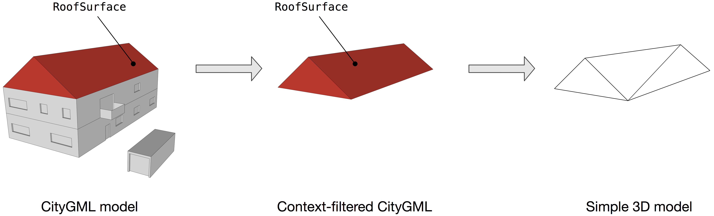
 

      

          

           <a data-toggle="collapse" href="#f4">
          <b>4. Linking of features in between LODs:</b> Can we match features represented in multi-LOD datasets, and re-use data? <i class="fa fa-angle-double-down"></i>
            </a>
        
        

  
          

            

              
CityGML files may be derived in multi-scale representations, i.e. more than one LOD in the same file. Some of the features overlap, i.e. the geometry and texture of a roof may be the same in two or more LODs. This part of the PhD investigates is it possible to link and re-use such features for consistency (e.g. update only one LOD and propagate the changes), and avoid their storage redundancy (e.g. store only once). 
          <b>Most relevant publication:</b> No publications at the moment (work in progress)

            

        

      

   
         
      
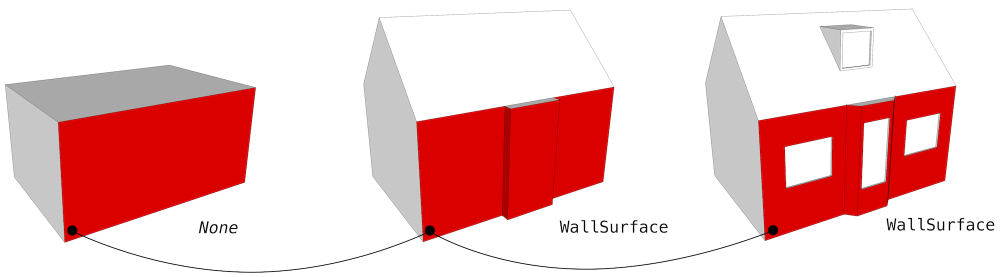
 

        

      

    

      

  

---

## Users' committee

### Members

1Spatial, Bentley, ESRI, Kadaster, Municipality of Amsterdam, Municipality of the Hague, Municipality of Rotterdam, Rijkswaterstaat, Oracle

### Problems identified by the users' committee

  <table class="table table-hover">
    <thead>
      <tr>
        <th>#</th>
        <th>Problem</th>
        <th>Dimension</th>
        <th>Stakeholder</th>
      </tr>
    </thead>
    <tbody>
      <tr>
        <td>1</td>
        <td>BGT/BRT generalisation</td>
        <td>2D+scale</td>
        <td>BGT sourceholders &amp; Kadaster</td>
      </tr>
      <tr>
        <td>2</td>
        <td>Centre line generator</td>
        <td>2D+scale</td>
        <td>BGT sourceholders &amp; Kadaster</td>
      </tr>
      <tr>
        <td>3</td>
        <td>Operations within tGap</td>
        <td>2D+scale</td>
        <td>BGT sourceholders &amp; Kadaster</td>
      </tr>
      <tr>
        <td>4</td>
        <td>Validation and repair of 3D city models</td>
        <td>3D</td>
        <td>Municipalities of the Hague &amp; Rotterdam</td>
      </tr>
      <tr>
        <td>5</td>
        <td>LOD and BIM</td>
        <td>3D+scale</td>
        <td>Bentley </td>
      </tr>
      <tr>
        <td>6</td>
        <td>LOD in city modelling</td>
        <td>3D+scale</td>
        <td>Municipalities of the Hague &amp; Rotterdam</td>
      </tr>
      <tr>
        <td>7</td>
        <td>Generalisation of 3D city models</td>
        <td>3D+scale</td>
        <td>Municipalities of the Hague &amp; Rotterdam</td>
      </tr>
      <tr>
        <td>8</td>
        <td>Time topology</td>
        <td>2D+time</td>
        <td>Municipality of Amsterdam</td>
      </tr>
      <tr>
        <td>9</td>
        <td>Maintaining 3D city models</td>
        <td>3D+time</td>
        <td>Municipalities of the Hague &amp; Rotterdam</td>
      </tr>
    </tbody>
  </table>

---

## Team

    

      
    
      <h3>Ken Arroyo Ohori <small>PhD candidate</small></h3>
      

          <i class="fa fa-home"></i> <a href="http://3dgeoinfo.bk.tudelft.nl/ken">3dgeoinfo.bk.tudelft.nl/ken</a> 
          <i class="fa fa-envelope"></i> <a href="mailto:g.a.k.arroyoohori@tudelft.nl">g.a.k.arroyoohori@tudelft.nl</a> 
           
           
      

    

    
    
    

      
      <h3>Filip Biljecki <small>PhD candidate</small></h3>
      

          <i class="fa fa-home"></i> <a href="http://3dgeoinfo.bk.tudelft.nl/biljecki">3dgeoinfo.bk.tudelft.nl/biljecki</a> 
          <i class="fa fa-envelope"></i> <a href="mailto:f.biljecki@tudelft.nl">f.biljecki@tudelft.nl</a> 
          <i class="fa fa-phone"></i> <a href="tel:+31 15 27 82798">+31 15 27 82798</a> 
      

    

    
    

      
      <h3>Hugo Ledoux <small>Assistant-prof.</small></h3>
      

          <i class="fa fa-home"></i> <a href="http://tudelft.nl/hledoux">tudelft.nl/hledoux</a> 
          <i class="fa fa-envelope"></i> <a href="mailto:h.ledoux@tudelft.nl">h.ledoux@tudelft.nl</a> 
          <i class="fa fa-phone"></i> <a href="tel:+31 15 27 86114">+31 15 27 86114</a> 
          <i class="fa fa-twitter"></i> <a href="https://twitter.com/hugoledoux">@hugoledoux</a> 
      

    

      

      
    
      <h3>Martijn Meijers <small>Postdoc</small></h3>
      

          <i class="fa fa-home"></i> <a href="http://www.gdmc.nl/martijn">www.gdmc.nl/martijn</a> 
          <i class="fa fa-envelope"></i> <a href="mailto:b.m.meijers@tudelft.nl">b.m.meijers@tudelft.nl</a> 
           
           
      

    

    
    

      
      <h3>Jantien Stoter <small>Professor</small></h3>
      

          <i class="fa fa-home"></i> <a href="http://3dgeoinfo.bk.tudelft.nl/jstoter">3dgeoinfo.bk.tudelft.nl/jstoter</a> 
          <i class="fa fa-envelope"></i> <a href="mailto:j.e.stoter@tudelft.nl">j.e.stoter@tudelft.nl</a> 
          <i class="fa fa-phone"></i> <a href="tel:+31 15 27 81664">+31 15 27 81664</a> 
          <i class="fa fa-twitter"></i> <a href="https://twitter.com/jantienstoter">@jantienstoter</a> 
      

    

