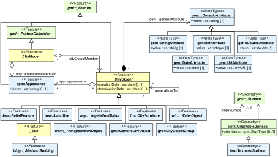

<h1>CityGML</h1>

CityGML [Open Geospatial Consortium, 2012] is the most prominent standard to store and exchange 3D city models with semantics in the GIS domain. It presents a structured way to describe the geometry and semantics of city objects. CityGML as a data format is implemented as an application schema for the Geography Markup Language (GML) (CityGML uses version 3.1.1 of GML) [OGC, 2004].

CityGML 2.0 (current version) contains a small number of classes structured into 12 modules, most of which are meant to model different types of objects (e.g. Building, Bridge, WaterBody) (Figure 1). These classes differ in the way objects are structured into smaller parts and the attributes that are expected for each. However, CityGML geometries are essentially the same for all classes: objects are represented as boundary surfaces embedded in 3D and consist of triangular and polygonal faces. The part of CityGML which is most of interest for the GeoBIM topic is the Building module (Figure 2).

CityGML 2.0 supports five levels of detail (LODs). Figure 3 illustrates the five LODs (LOD0 to LOD4) for the building object:

<ul>
	<li>LOD0 is non-volumetric, is horizontal footprint and/or roof surface representation;</li>
	<li>LOD1 is a block-shaped model of a building (with a horizontal roof);</li>
	<li>LOD2 adds a generalised roof and installations such as balconies;</li>
	<li>LOD3 adds, among others, windows, doors, and a full architectural exterior;</li>
	<li>LOD4 models the interior of the building, potentially with pieces of furniture.</li>
</ul>

	

		
	

Figure 1. CityGML's top level class hierarchy. Prefixes are used to indicate XML namespaces associated with model elements. Element names without a prefix are defined within the CityGML Core module.

	

		
	

Figure 2. UML diagram of CityGML's building model. Prefixes are used to indicate XML namespaces associated with model elements. Element names without a prefix are defined within the CityGML Building module.

	

		
	

Figure 3. A building represented in LOD0 to LOD4 (image from Biljecki et al. [2016]).

For more information about CityGML visit [http://www.citygmlwiki.org](citygmlwiki.org) and [www.citygml.org](citygml.org).

### References

OGC. Geography markup language (GML) encoding specification. Open Geospatial Consortium inc., 2004. Document 03-105r1, version 3.1.1. 

Open Geospatial Consortium. OGC City Geography Markup Language (CityGML) Encoding Standard 2.0.0. Technical report, April 2012. 

Filip Biljecki, Hugo Ledoux, and Jantien Stoter. An improved LOD specification for 3D building models. Computers, Environment and Urban Systems, 59:25–37, 2016. 
