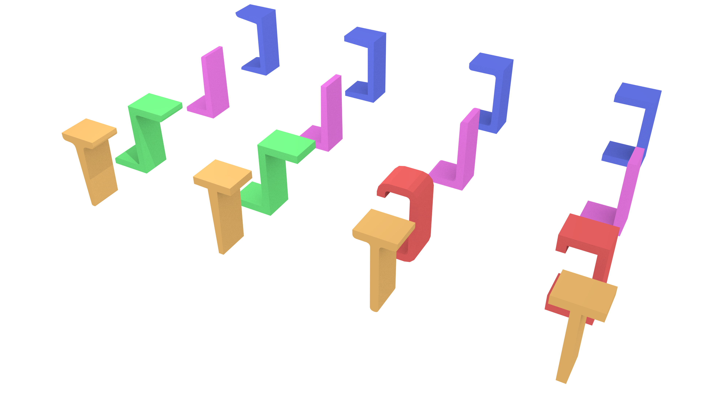
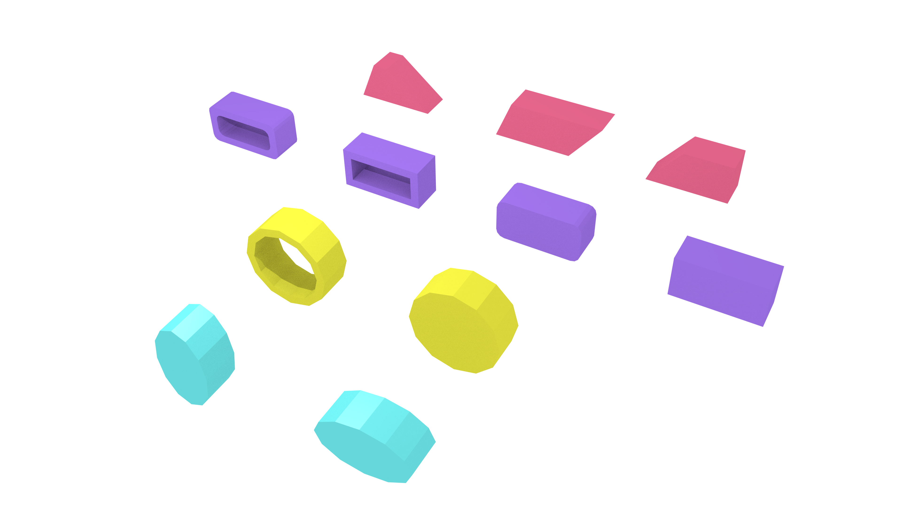

<h1>IFC</h1>

The BuildingSmart [Industry Foundation Classes (IFC)](http://www.buildingsmar-tech.org/specifications/ifc-releases) standard is an open data model used in the Building-information modelling (BIM) domain for the exchange of construction models, including 3D models of buildings. It has also been adapted as the ISO 16739 international standard [ISO, 2013]. Its geometric aspects are however mostly defined or derived from a different standard, ISO 10303 [ISO, 2014], which also specifies the STEP Physical File (SPF) encoding that is most commonly used in IFC files (.ifc).

IFC files can contain many types of classes (130 defined types, 207 enumeration types, 60 select types, 776 entities, 47 functions, and 2 rules in IFC 4 Addendum 2). The description of the models and the diagrams representing its entities can be found [here](http://www.buildingsmart-tech.org/ifc/IFC4/Add2/html/). The geometries in them can use several different representation paradigms which can be combined freely. In practice, most IFC objects are built using sweep volumes, explicit faceted surface models and CSG [El-Mekawy and Östman, 2010]. The representation paradigms include:

<ul>
	<li>Primitive instancing: an object is represented based on a set number of predefined parameters. IFC uses this paradigm to define various forms of 2D profiles, as well as volumetric objects such as spheres, cones and pyramids.</li>
	<li>CSG: an object is represented as a tree of Boolean set operations (union, intersection and difference) of volumetric objects (see Requicha [1982] for more details). Half-spaces are often used to cut out the undesired parts of surfaces or volumes.</li>
	<li>Sweep volumes: a solid can also be defined by a 2D profile (a circle, a rectangle or an arbitrary polygon with or without holes) and a curve [Wang and Wang, 1986] along which the surface is extruded.</li>
	<li>B-rep: an object is represented by its bounding surfaces, either triangulated meshes, polygonal meshes or topological arrangements of free-form surfaces.</li>
</ul>

	

		
		
(a)

	

	

		
		
(b)

	

Figure 1. IFC defines various types of parametric curved profiles such as (a) those based on the characters U, L, Z, C and T and (b) those based on trapezia, (rounded) rectangles, circles with/without holes and ellipses. Note the various types of tapered and curved parts of the profiles. These are most commonly used in extrusions such as those shown here.

For more information about IFC visit [here](http://www.buildingsmart-tech.org/specifications/ifc-overview).

### References

ISO 16739:2013. Industry Foundation Classes (IFC) for data sharing in the construction and facility management industries. International Organization for Standardization, March 2013. 

ISO. Industrial automation systems and integration - Product data representation and exchange. International Organization for Standardization, August 2014. 

Mohamed El-Mekawy and Anders Östman. Semantic mapping: an ontology engineering method for integrating building models in IFC and CityGML. Proceedings of the 3rd ISDE Digital Earth Summit, pages 12–14, 2010. 

A. A. G. Requicha. Representation of rigid solids—theory, methods and systems. ACM Computing Surveys, 12(4):437–464, 1982. 

WP Wang and KK Wang. Geometric modeling for swept volume of moving solids. Computer Graphics and Applications, IEEE, 6(12):8–17, 1986. 
