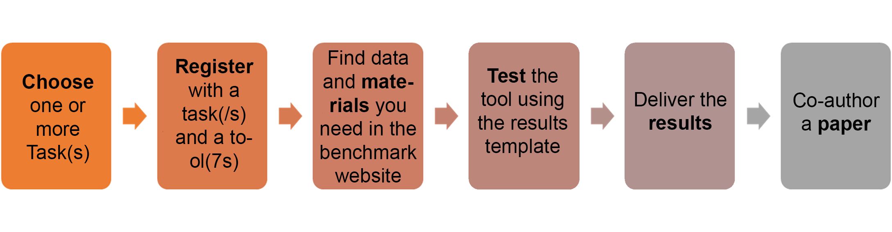

<!--

	

		
	

	

		<h1>GeoBIM benchmark 2019</h1>
	

-->
<h1>GeoBIM benchmark 2019</h1>

  

  
  

<b>Recent news</b>  
	
  
  	
<small>{{ news.date | date: "%b %d" }}</small> {{ news.news }}

  
  <a href="news.html">All news</a>

The website and the FAQ section tries to answer possible doubts about the test and the data. Do you have more and would you like to talk about them or about found issues? You can register in this doodle: [Q&A session about the GeoBIM benchmark](https://doodle.com/poll/fz6a6vvvz3dft5g9) If a few people are interested, the session will be hold on 3rd October 2019 h.10.00-11.00 CET via web (we will publish the link to join).

<iframe width="560" height="315" src="https://www.youtube.com/embed/uXcGYA72IaA" frameborder="0" allow="accelerometer; autoplay; encrypted-media; gyroscope; picture-in-picture" allowfullscreen></iframe>

<h3>Reference study on software support for open standards of city and building models</h3>

This benchmark will investigate the available **technical solutions** to support research and activities related to GeoBIM, through the use of the **open standards IFC** (by buildingSMART) and **CityGML** (by OGC):

.

<h4>1. What is the <strong>support for IFC</strong> within BIM (and other) software?</h4>

<h4>2. What options for <strong>geo-referencing BIM</strong> data are available?</h4>

<h4>3. What is the <strong>support for CityGML</strong> within GIS (and other) tools?</h4>

<h4>4. What options for <strong>conversion (IFC↔CityGML)</strong> are available?</h4>
.

### We want you

**You can be part** of this scientific initiative!

Take part in this benchmark activity by performing one or more tasks.

	

		
	

	

		
Volunteers will be welcome to perform one or more tasks using the tools they are familiar with, <strong>contributing to build a common reference list of tools</strong> to be used for GeoBIM-related activities.

		
At least one <strong>scientific publication co-authored by both the benchmark proponents and volunteers</strong> will be written, and final results will be published on the website.

	

### How to participate

	

		
	

#### [**Register to this link**](https://francescanoardo.typeform.com/to/IbdpZD) to participate!

And browse the website to know all the details.

Download the [call for participation](https://www.dropbox.com/s/2f6q7ckla9wm9e6/callGeoBIMbenchmark.pdf?dl=0)

### If you only want to be up-to-date about GeoBIM benchmark activities
<!-- Begin Mailchimp Signup Form -->
<link href="//cdn-images.mailchimp.com/embedcode/horizontal-slim-10_7.css" rel="stylesheet" type="text/css">

<form action="https://tudelft.us20.list-manage.com/subscribe/post?u=66a8cb733c926f8b1f6d7948f&amp;id=671ef6a5b1" method="post" id="mc-embedded-subscribe-form" name="mc-embedded-subscribe-form" class="validate" target="_blank" novalidate>
    

	<label for="mce-EMAIL">Subscribe to GeoBIM benchmark mailing list</label>
	<input type="email" value="" name="EMAIL" class="email" id="mce-EMAIL" placeholder="email address" required>
    <!-- real people should not fill this in and expect good things - do not remove this or risk form bot signups-->
    
<input type="text" name="b_66a8cb733c926f8b1f6d7948f_671ef6a5b1" tabindex="-1" value="">

    
<input type="submit" value="Subscribe" name="subscribe" id="mc-embedded-subscribe" class="button">

    

</form>

<!--End mc_embed_signup-->