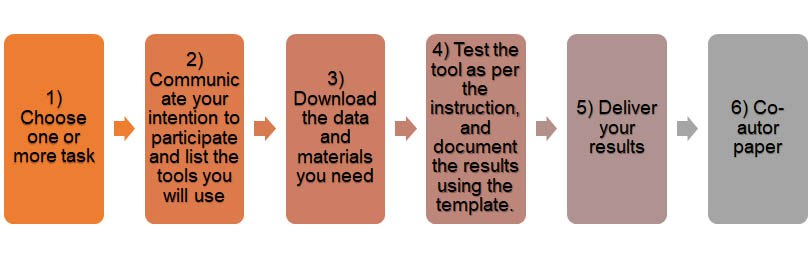

	

		
	

	

		<h1>GeoBIM benchmark 2019</h1>
	

<b>Recent news</b>  
	
  
  	
<small>{{ news.date | date: "%b %d" }}</small> {{ news.news }}

  
  <a href="news.html">All news</a>

<h3>Reference study on software support for open standards of city and building models</h3>

This benchmark will investigate the available **technical solutions** to support research and activities related to GeoBIM, through the use of the **open standards IFC** (by buildingSMART) and **CityGML** (by OGC).  We will address the following questions:

1. What is the **support for IFC** within BIM (and other) software?
2. What options for **geo-referencing BIM** data are available?
3. What is the **support for CityGML** within GIS (and other) tools?
4. What options for **conversion (IFC↔CityGML)** are available?
5. What is the support of different types of **IFC geometries**?

You are invited to take part in this benchmark activity by performing one or more tasks.

	

		
	

	

		
Volunteers will be required to perform one or more tasks using  the tools they are familiar with, and deliver their results using the results template.

		
At least one scientific publication co-authored by both the benchmark proponents and volunteers will be written, and final results will be published on the website.

	

<h4>How to participate</h4>

	

		
	

