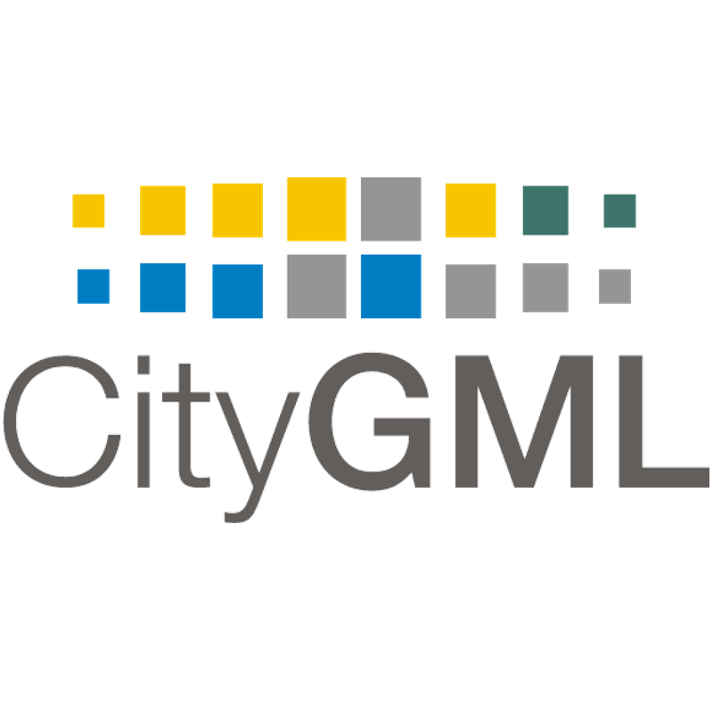

	

		
	

<h1>GeoBIM benchmark</h1>
<h3>Reference study on software support for open standards of city and building models</h3>

In the (spatial) information world, **interoperability** is a key condition for the reuse of information, and is realised via standardisation. Within this context, increasing attention is being paid to GeoBIM --- the exchange of information from geospatial and Building Information Modelling (BIM) sources --- by scholars (very critical for a number of smart city applications), public entities (e.g. land description, control, analysis), practitioners (e.g. city planners, building designers, asset managers).

**Objective:** The benchmark will provide insight into the state of the art of support for CityGML and IFC and the developments that are needed to make a better integration of Geo and BIM data possible. Its main objective is to **provide a framework** describing the present ability of existing software tools to **use** (read and visualise, import, manage, analyse, export) CityGML and IFC models and understand their **performance** whole doing so, both in terms of information loss and in terms of ability to handle large datasets.

Two **standards** underpin this information exchange:

	

		
	

	

		
The <strong>Open Geospatial Consortium (OGC)</strong> established <strong>CityGML</strong> in 2008, which is the most widespread standard for structuring the 3D geoinformation of urban areas.

		
For more information about CityGML, visit <a href="http://www.citygmlwiki.org">www.citygmlwiki.org</a>.

	

	

		
	

	

		
In the Architecture, Engineering and Construction fields, <strong>buildingSMART</strong> established the <strong>Industry Foundation Classes (IFC)</strong> standard for semantically structuring BIM.

		
For more information about IFC, visit <a href="http://www.buildingsmart-tech.org/specifications/ifc-overview">www.buildingsmart-tech.org/specifications/ifc-overview</a>.

	

**Conversion procedures** from IFC to CityGML and from CityGML to IFC have also been frequently studied. However, a comprehensive description and test of conversion procedures in a unified framework, together with an assessment of software performance and reliability, has never been done until now.

<h3>Benchmark tasks</h3>

[Task 1](task1.html) - The **support of IFC** within BIM software

[Task 2](task2.html) - What options for **georeferencing BIM** are available?

[Task 3](task3.html) - **Support for CityGML** within GIS tools

[Task 4](task4.html) - Software and workflows for **conversion** (**IFC to CityGML** and **CityGML to IFC**)

<h3>Benchmark data</h3>

