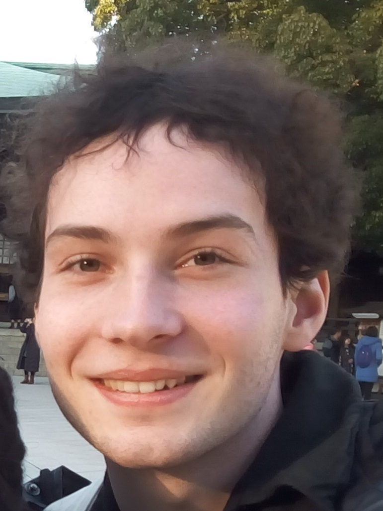

<h1>Participants</h1>

The following people are the registered participants to the GeoBIM benchmark, Thank you!

*Last update: 22nd December 2019*

- - -

* Table of Content
{:toc}

- - -

## Professionals

	<table class="table table-hover table-striped table-condensed">
		<thead>
			<tr>
				<th> </th>
				<th>Name</th>
				<th>Affiliation</th>
				<th>Country</th>
			</tr>
		</thead>
		<tbody>
			<tr>
				<td> </td>
				<td>Leire Leoz</td>
				<td>Tracasa</td>
				<td>Spain</td>
			</tr>
			<tr>
				<td>

</td>
				<td>Lorenzo Polia</td>
				<td> </td>
				<td>Italy</td>
			</tr>
			<tr>
				<td> </td>
				<td>Artur Warchol</td>
				<td>ProGea 4D sp. z.o.o.</td>
				<td>Poland</td>
			</tr>
		</tbody>
	</table>

## Software companies and developers

	<table class="table table-hover table-striped table-condensed">
		<thead>
			<tr>
				<th> </th>
				<th>Name</th>
				<th>Affiliation</th>
				<th>Country</th>
			</tr>
		</thead>
		<tbody>
			<tr>
				<td> </td>
				<td>Estelle de Simone</td>
				<td>CSTB</td>
				<td>France</td>
			</tr>
			<tr>
				<td> </td>
				<td>Dean Hintz</td>
				<td>Safe Software</td>
				<td>Canada</td>
			</tr>
			<tr>
				<td>

</td>
				<td>Sean Morrish</td>
				<td>ESRI, UCD, NYU</td>
				<td>USA</td>
			</tr>
			<tr>
				<td> </td>
				<td>Elisa Rolland</td>
				<td>CSTB</td>
				<td>France</td>
			</tr>
			<tr>
				<td>

</td>
				<td>Anne-Lise Poplavsky</td>
				<td>1spatial</td>
				<td>Belgium</td>
			</tr>
			<tr>
				<td>

</td>
				<td>Philipp Willkomm</td>
				<td>M.O.S.S. Computer Grafik Systeme GmbH</td>
				<td>Germany</td>
			</tr>
		</tbody>
	</table>

		
		
## Academy world

	<table class="table table-hover table-striped table-condensed">
		<thead>
			<tr>
				<th> </th>
				<th>Name</th>
				<th>Affiliation</th>
				<th>Country</th>
			</tr>
		</thead>
		<tbody>
			<tr>
				<td> </td>
				<td>Hendrik Görne</td>
				<td>Dresden, University of Applied Sciences (HTW)</td>
				<td>Germany</td>
			</tr>
			<tr>
				<td>

</td>
				<td>Doğuş Güler</td>
				<td>Instambul Technical University</td>
				<td>Turkey</td>
			</tr>
			<tr>
				<td>

</td>
				<td>Mojgan Jadidi</td>
				<td>York University</td>
				<td>Canada</td>
			</tr>
			<tr>
				<td> </td>
				<td>Tim Kaiser</td>
				<td>Dresden University of Applied Sciences</td>
				<td>Germany</td>
			</tr>
			<tr>
				<td>

</td>
				<td>Cristina Leoni</td>
				<td>Sapienza, Universitá di Roma</td>
				<td>Italy</td>
			</tr>
			<tr>
				<td>

</td>
				<td>Nebras Salheb</td>
				<td>TU Delft (MSc Geomatics)</td>
				<td>The Netherlands</td>
			</tr>
			<tr>
				<td> </td>
				<td>Ville-Pekka Soini</td>
				<td>Geoinformatics MSc student Lund University</td>
				<td>Sweden</td>
			</tr>
			<tr>
				<td> </td>
				<td>Rudi Stouffs</td>
				<td>National University of Singapore</td>
				<td>Singapore</td>
			</tr>
			<tr>
				<td> </td>
				<td>Helga Tauscher</td>
				<td>Dresden University of Applied Science</td>
				<td>Germany</td>
			</tr>
			<tr>
				<td> </td>
				<td>Jernej Tekavec</td>
				<td>University of Ljubljana, Faculty of Civil and Geodetic Engineering</td>
				<td>Slovenia</td>
			</tr>
			<tr>
				<td>

</td>
				<td>Jordi van Liempt</td>
				<td>Delft University of Technology</td>
				<td>The Netherlands</td>
			</tr>
			<tr>
				<td>

</td>
				<td>Stelios Vitalis</td>
				<td>TU Delft</td>
				<td>The Netherlands</td>
			</tr>
			<tr>
				<td> </td>
				<td>Imke Lánský & Celine Jansen</td>
				<td>Geomatics MSc students TU Delft</td>
				<td>The Netherlands</td>
			</tr>
			<tr>
				<td> </td>
				<td>Amber Mulder & Kostantinos Mastorakis</td>
				<td>Geomatics MSc students TU Delft</td>
				<td>The Netherlands</td>
			</tr>
			<tr>
				<td> </td>
				<td>Felix Dahle & Danny Marx</td>
				<td>Geomatics MSc students TU Delft</td>
				<td>The Netherlands</td>
			</tr>
			<tr>
				<td> </td>
				<td>Vasileios Alexandridis & Giulia Ceccarelli</td>
				<td>Geomatics MSc students TU Delft</td>
				<td>The Netherlands</td>
			</tr>
			<tr>
				<td> </td>
				<td>Pantelis Kaniouras & Maria Moscholaki</td>
				<td>Geomatics MSc students TU Delft</td>
				<td>The Netherlands</td>
			</tr>
			<tr>
				<td> </td>
				<td>Christina Fratzeskou & Chirag Garg & Wessel de Jong</td>
				<td>Geomatics MSc students TU Delft</td>
				<td>The Netherlands</td>
			</tr>
			<tr>
				<td> </td>
				<td>Gabriella Wiersma & Karin Staring & Jordi van Liempt</td>
				<td>Geomatics MSc students TU Delft</td>
				<td>The Netherlands</td>
			</tr>
			<tr>
				<td> </td>
				<td>Liyao Zhang & Mutian Deng</td>
				<td>Geomatics MSc students TU Delft</td>
				<td>The Netherlands</td>
			</tr>
			<tr>
				<td> </td>
				<td>Yifang Zhao & Jinglan Li</td>
				<td>Geomatics MSc students TU Delft</td>
				<td>The Netherlands</td>
			</tr>
			<tr>
				<td> </td>
				<td>Konrad Jarocki & Mark Huisjes</td>
				<td>Geomatics MSc students TU Delft</td>
				<td>The Netherlands</td>
			</tr>
		</tbody>
	</table>

## Public institutions

	<table class="table table-hover table-striped table-condensed">
		<thead>
			<tr>
				<th> </th>
				<th>Name</th>
				<th>Affiliation</th>
				<th>Country</th>
			</tr>
		</thead>
		<tbody>
			<tr>
				<td> </td>
				<td>Helen Eriksson</td>
				<td>Lantmäteriet and Lund University</td>
				<td>Sweden</td>
			</tr>
			<tr>
				<td> </td>
				<td>Rollo Home</td>
				<td>Ordnance Survey</td>
				<td>United Kingdom</td>
			</tr>
			<tr>
				<td>

</td>
				<td>Grégoire Maillet</td>
				<td>IGN</td>
				<td>France</td>
			</tr>
			<tr>
				<td> </td>
				<td>Diana Moraru</td>
				<td>Ordnance Survey</td>
				<td>United Kingdom</td>
			</tr>
			<tr>
				<td> </td>
				<td>Kate Noss</td>
				<td>Ordnance Survey</td>
				<td>United Kingdom</td>
			</tr>
			<tr>
				<td>

</td>
				<td>Maria Pla</td>
				<td>ICGC, Head Databases Department</td>
				<td>Spain</td>
			</tr>
		</tbody>
	</table>

## Benchmark Advisory Board

	<table class="table table-hover table-striped table-condensed">
		<thead>
			<tr>
				<th>Name</th>
				<th>Affiliation</th>
			</tr>
		</thead>
		<tbody>
			<tr>
				<td>Pawel Boguslawski</td>
				<td>Wroclaw University of Science and Technology (Poland) - ISPRS WG IV/1</td>
			</tr>
			<tr>
				<td>Eric Guilbert</td>
				<td>Université Laval Quebec, (Canada) - ISPRS WG IV/1</td>
			</tr>
			<tr>
				<td>Norbert Haala</td>
				<td>Institut für Photogrammetrie, Universität Stuttgart (Germany) - EuroSDR</td>
			</tr>
			<tr>
				<td>Bob Heester</td>
				<td>Antea group (Netherlands) and PhD at TUDelft</td>
			</tr>
			<tr>
				<td>Umit Isikdag</td>
				<td> Mimar Sinan Fine Arts University Istanbul (Turkey) - ISPRS WG IV/1</td>
			</tr>
			<tr>
				<td>Mila N. Koeva</td>
				<td>University of Twente (Netherlands) - ISPRS WG IV/10</td>
			</tr>
			<tr>
				<td>Matty Lakerveld</td>
				<td>SPOTinfo (private company in geo- and BIM information field); Municipality of Almere - Floriade EXPO manager (Netherlands)</td>
			</tr>
			<tr>
				<td>Mir Abolfazl Mostafavi</td>
				<td>Université Laval Quebec, (Canada) - ISPRS WG IV/2</td>
			</tr>
			<tr>
				<td>Antonia Spanò</td>
				<td>Politecnico di Torino (Italy) - ISPRS WG IV/2</td>
			</tr>
			<tr>
				<td>Wei Tu</td>
				<td>Shenzhen University (China) - ISPRS WG IV/10</td>
			</tr>
		</tbody>
	</table>

