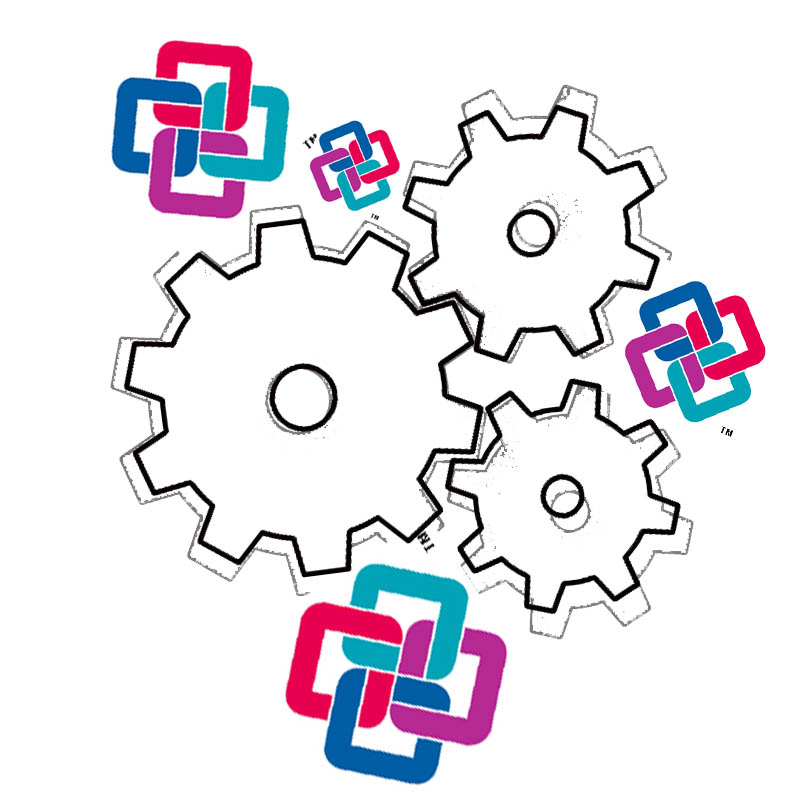
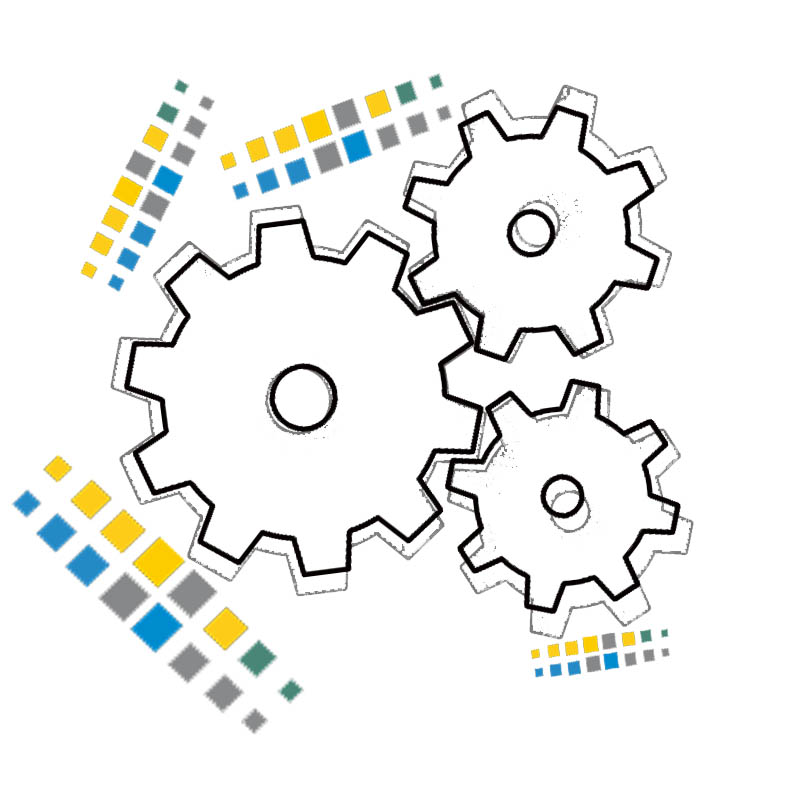

<h1>An in-depth insight into the GeoBIM benchmark project</h1>

  

The investigation of the available **technical solutions** to support research and activities related to the GeoBIM topic is the subject of this project.

This is the first project that will provide insight into the current state of the art of the open standards implementation in the 3D geo and BIM domain and will also identifying remaining issues.

It is a Scientific initiative funded by the [International Society for Photogrammetry and Remote Sensing (ISPRS)](http://www.isprs.org/) (**ISPRS Scientific Initiative 2019**) and the [European Spatial Data Research association (EuroSDR)](http://www.eurosdr.net).

- - -

* Table of Content
{:toc}

- - -

## Objective

The main objective of the benchmark is to **provide a framework** describing the present ability of existing software tools to **use** (read and visualise, import, manage, analyse, export) CityGML and IFC models and understand their **performance** while doing so, both in terms of information loss and in terms of ability to handle large datasets.

Three aspects of this problem are examined:

	
 col-xs-3">
		
	

	
 col-xs-3">
		
	

	
 col-xs-6">
		
- Firstly, <strong>software support for the individual standards (CityGML and IFC)</strong> within their respective domains – i.e. How well is CityGML supported by GIS (and other) tools and IFC by BIM (and other) tools?

	

	
 col-xs-3">
		
	

	
 col-xs-9">
		
- Secondly, options for <strong>IFC geo-referencing</strong> is explored, as this is a fundamental step in enabling information exchange.

	

	
 col-xs-3">
		
	

	
 col-xs-9">
		
- Thirdly, a critical test of the available <strong>conversion procedures</strong> between CityGML and IFC (in both directions) is conducted to objectively assess and compare potential for integrated data use, starting from the same premises.

	

## The Tasks

The benchmark defines specific **tasks** to test the following:

* [Task 1](https://3d.bk.tudelft.nl/projects/geobim-benchmark/task1.html) - Support for IFC within BIM (and other) software;

* [Task 2](https://3d.bk.tudelft.nl/projects/geobim-benchmark/task2.html) - Options for geo-referencing BIM data;

* [Task 3](https://3d.bk.tudelft.nl/projects/geobim-benchmark/task3.html) - Support for CityGML within GIS (and other) tools;

* [Task 4](https://3d.bk.tudelft.nl/projects/geobim-benchmark/task4.html) - Options for conversion (software and procedural) (both IFC to CityGML and CityGML to IFC).

## The Participants

  

**External voluntary Participants<!-- LINK TO THE PARTICIPANTS PAGE-->** are a very important part of the initiative. They perform one or more tasks with the tools they are familiar with, and deliver their results in the provided results template.

This will allow **joining the efforts and the individual experiences** with specific (technical) tools to build a common list of tools compared following common criteria.

They will all **co-author at least one scientific publication** together with the benchmark proponents reporting the main results of the benchmark.

## The tested tools
The aim is to test the highest number of tools, in order to provide the widest framework.

Both off-the-shelf tools and self-programmed software will be considered, both proprietary and open source.

The tested tools will be finally **objectively described following the results of the tests, with a look at their specific features, in order to be chosen for the users' specific needs**.

No 'winner' nor 'looser' will emerge, but a scientific in-sight into the offered functionality.

For this reason, also software vendors representatives and programmers are invited to be participants, for their tools to be part of the final benchmark list.

## Connected scientific material
The scientific material regarding the used procedures/tools (papers, reports, web resources, open repositories…) will be linked in a specific page of this website.

## Benchmark Data

Three datasets are provided for each of the two standards (IFC and CityGML).

The simpler ones will allow the test of **software functionality**. The more complex (larger) ones will also test the requirements in terms of **computer hardware** in order to support their management.

Most of them are data **produced by practice** (Myran.ifc, UpTown.ifc, RotterdamLOD12.gml and amsterdam.gml), therefore, they, although they were chosen also for their good quality, they are not specifically generated for the use of open standards.

This represents a further challenge, because more problems can rise, as it happens in the real-world practice.

For this benchmark it is important also to consider this aspect, in order to **provide a useful tool supporting the widest application possible** of open standards.

It is possible to see the full details of the use datasets in the [data description section](https://3d.bk.tudelft.nl/projects/geobim-benchmark/data.html).

## Results, deliverables and dissemination

The results of the tests delivered by the participants will be openly available (with the consent of participants), both during and after the end of the project, to download and use (for research, education, testing).

The provided models and their description will also be freely available (with some more limitations for the Myran.ifc and UpTown.ifc models), permitting eventual future benchmark comparisons.

A detailed report of the results and of their analysis will be written, published on the website and shared with the participants.

Finally, the final results will be published in an open-access journal paper and presented at relevant conferences in the field.

### The most interesting outcomes

<ol>
	<li>
		
A <strong>reference list of tools</strong> to be used for managing standard 3D models:

		
features, performance, required procedures, settings and best practices on the use of open standards clearly described and assessed in a unique framework, in a sample of commonly used software and conversion procedures.

		
As the project will <strong>identify bottlenecks</strong> in the current status of open standard, it will <strong>encourage further development and use of open standards and increase spatial information interoperability</strong>.

		
 The report of the benchmark will <strong>help to bring the use of open standard spatial data further outside the academic world</strong>, enhancing the possibility to effectively and actually use complex three (and more)-dimensional data in real-world applications.

	</li>
	<li>
		
The <strong>outline of the present implementation state</strong> (how much has been done and how much is left) of spatial open standards and feedback about the open standard data models to the standardisation entities (OGC and BuildingSmart).

		
This will encourage software vendors to implement better support, so that they can be used more effectively in more applications and use cases. The necessary next steps (what is needed in order to implement further or improve the support of OS) will be also outlined.

	</li>
	<li>The developed <strong>material and test datasets, answers and results analyses</strong>, together with the report of the activity describing in detail the material, methods and results of the study, will be made available after the end of the initiative (as long as permitted), as reference or material for future improvements, new software tools, tests, continued benchmarking or other similar research.</li>
</ol>

## Benchmark events

Two main events will be organised for the benchmark:
<ol>
	<li>
		
 <strong>July 2019</strong> - Intermediate <strong>meeting of proponents and participants</strong> 

		
In the meeting the intermediate results will be presented, discussed and disseminated. This will provide an opportunity to present the most promising workflows identified to date, propose their replication by other participants and to discuss eventual adjustments to the test datasets or further activities or developments.
</li>
		<li>
		
<strong>December 2019</strong> - GeoBIM benchmark winter school.

		
A final <strong>winter school</strong> will be organized at the end of the initiative to present the final results. It will be addressed to students, practitioners from industry and government, other interested parties and it will aim at disseminating the geoBIM topics connected to the benchmark results, and the results themselves. It will be structured as follows:

		<ul>
			<li>Educational component: IFC and CityGML open standards;</li>
			<li>Use Case presentation – highlighting situations where geoBIM is useful;</li>
			<li>Presentation of the benchmark and its results;</li>
			<li>Workshop outlining the most effective tools from the benchmark;</li>
			<li>Discussion and feedback, along with plans for future work.</li>
		</ul>
	</li>

</ol>

## Project plan

	

		
	

