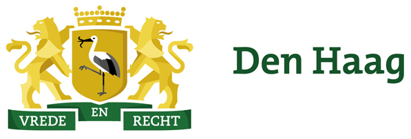
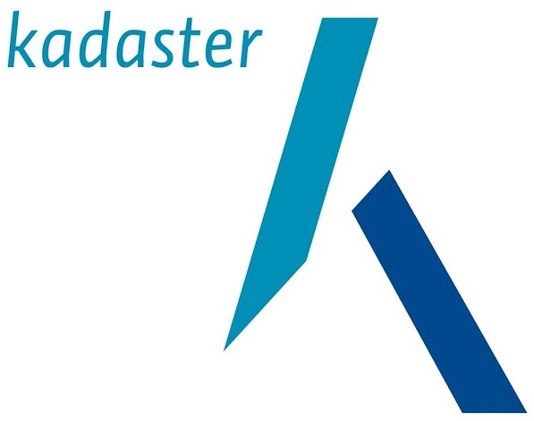

  

- - -

* Table of Content
{:toc}

- - -

## Summary

Geographic information systems (GIS) have long been used to model the environment and to perform 2D spatial analyses of large areas.
However, with the increasing availability of computing power, advanced data acquisition methods, and automated workflows that generate detailed 3D data, GIS models have become increasingly detailed and started to contain models of individual buildings---the traditional domain of building information modelling (BIM).

At the same time, the increase in computing power and the availability of better software have enabled BIM methodologies to move to the mainstream, disrupting more traditional building design platforms based on 2D CAD drawings.
As users of BIM software want to incorporate the surrounding features into their workflow, it is only logical that the BIM domain is currently enhancing its standards to support environmental information such as infrastructure and that BIM users turn to existing GIS datasets containing environmental information.
Both domains are thus now overlapping, increasingly modelling the same objects, even if the data is represented and stored in rather different ways.

While the GIS and the BIM domains clearly overlap when the modelling of cities is concerned, each domain retains its own focus and has its own characteristics.
The BIM domain focuses on information about the design and construction of building sites, and thus has very detailed and semantically rich information about all the physical elements that comprise an individual building as it is designed or built.
Meanwhile, GIS describe information about the environment as captured at different points in time, thus having less detailed but regularly updated datasets covering wide regions.

Due to the overlap in the features modelled in both domains as well as their differing strengths and weaknesses, it is widely acknowledged that the integration of data from both domains is beneficial and a crucial step forward for future 3D city modelling.
This integration can avoid unnecessary efforts in redundant modelling and allow for new data flows in both directions and new applications.
In this way, more detailed BIM data can feed more general GIS data and GIS data can provide the context that is usually missing in BIM data.
By pursuing the integration of GIS and BIM data, many new possibilities appear: with contextual GIS information, BIM methodologies can be better applied to infrastructural works; more detailed 3D city models can be built by reusing BIM data; smart city concepts can perform integrated reasoning on terrain, buildings and city infrastructure; and spatial analyses can support multiple levels of detail and the complete life cycles of objects.

Yet, the disciplines of GIS and BIM are disconnected by their modelling paradigms, software tools and open standards---respectively CityGML for GIS and IFC for BIM.
Consequently, GIS and BIM datasets differ fundamentally with respect to their semantics, geometry and level of detail, and because of the different modelling approach of both, there is not one optimal nor uniform conversion between the information models.
Even as researchers and practitioners have studied how to best share information between BIM and GIS and how to address all the differences from different perspectives, it is still very hard (if not impossible) to share 3D information among different users throughout the life cycle of urban and environmental processes, i.e. from plan, design and construction to maintenance.
Moreover, most of the research so far has focused on the semantic aspects of GIS-BIM integration (e.g. mapping equivalent types), leaving the difficult task of geometric processing on the background.

In view of these integration problems, in the beginning of 2017, we started the GeoBIM project, in which we worked on an interface to process complex architectural IFC models in an automated fashion, such as performing automated tests on them and converting them to CityGML.
We created such an interface based on IfcOpenShell and CGAL, a pair of libraries respectively used to process BIM and GIS models.
The project is a collaboration of two research groups on BIM and 3D GIS (Technical universities of Eindhoven respectively Delft), the two respective national standardisation bodies (BIM Loket and Geonovum) and several users who have a high interest in closer BIM/GIS integration, i.e. Rijkswaterstaat, Kadaster and the cities of Den Haag and Rotterdam.

The results of this project are mixed.
On one hand, we found a series of errors that seem to be pervasive in IFC models and which make automated processing of complex architectural models very difficult, and since fully dealing with such errors would require automatic repair algorithms, a complete working interface could unfortunately not be developed within the timeframe of the GeoBIM project.
However, we took the opportunity to look into these errors and converted them into a set of recommended guidelines that should enable the automated processing of IFC models.

Additionally, we took a more in-depth look at the issues surrounding the georeferencing of IFC models.
Our results show that there are several tools made available in BIM software (e.g. Revit) which support the proper definition of the georeferencing information for a BIM model when exported as IFC.
We have introduced the [IfcLocator](https://github.com/tudelft3d/IfcLocator) tool, which stands as an open-source alternative to the commercial software products.
Although it is at a very early stage, the tool is already able to provide an intuitive point of view of the actual location stored in an IFC file and perform a simple change of location.

## Final reports

  1. The final report of the project, including a recommended set of IFC guidelines for automated geometric processing, is found [here](https://3d.bk.tudelft.nl/ken/files/18_geobim.pdf).
  2. The additional report that explains the issues around georeferencing IFC models is [here](https://3d.bk.tudelft.nl/pdfs/18_georeferencing.pdf).
  3. The report that studies the integration between an IFC design and the geological subsurface can be found [here](https://3d.bk.tudelft.nl/pdfs/BIM_Subsurface%20report%20Version%20June%202017.pdf). NB: The title page is Dutch; but the report is written in English.

## Open-source software

  1. [IfcOpenShell_CGAL](https://github.com/aothms/IfcOpenShell_CGAL)
  2. [IfcLocator](https://github.com/tudelft3d/IfcLocator)

## Meetings

### Launch on 2017-02-15 at the BIM Loket in Delft

  

    
  

### First prototype on 2017-04-19

  

    
  

### Agreeing on IFC guidelines on 2017-09-05

  

    
  

- - -

## Sponsors

  

  

  

  

  

  

- - - 

## Team

  

      
    <h3>Ken Arroyo Ohori <small>Postdoc (TUD)</small></h3>
    

        <i class="fas fa-home"></i> <a href="https://3d.bk.tudelft.nl/ken">3d.bk.tudelft.nl/ken</a> 
        <i class="fas fa-envelope"></i> <a href="mailto:g.a.k.arroyoohori@tudelft.nl">g.a.k.arroyoohori@tudelft.nl</a> 
         
         
    

  

  

      
    <h3>Abdoulaye Diakité <small>Postdoc (TUD)</small></h3>
    

        <i class="fas fa-home"></i> <a href="https://3d.bk.tudelft.nl/adiakite">3d.bk.tudelft.nl/adiakite</a> 
        <i class="fas fa-envelope"></i> <a href="mailto:a.a.diakite@tudelft.nl">a.a.diakite@tudelft.nl</a> 
         
         
    

  

  

      
    <h3>Thomas Krijnen <small>PhD candidate (TU/e)</small></h3>
    

        <i class="fas fa-home"></i> <a href="http://thomaskrijnen.com">thomaskrijnen.com</a> 
        <i class="fas fa-envelope"></i> <a href="mailto:t.f.krijnen@tue.nl">t.f.krijnen@tue.nl</a> 
         
         
    

  

  

        
      <h3>Hugo Ledoux <small>Associate-prof. (TUD)</small></h3>
      

          <i class="fas fa-home"></i> <a href="https://www.tudelft.nl/hledoux">tudelft.nl/hledoux</a> 
          <i class="fas fa-envelope"></i> <a href="mailto:h.ledoux@tudelft.nl">h.ledoux@tudelft.nl</a> 
          <i class="fas fa-phone"></i> <a href="tel:+31 15 27 86114">+31 15 27 86114</a> 
          <i class="fab fa-twitter"></i> <a href="https://twitter.com/hugoledoux">@hugoledoux</a> 
      

  

  

        
      <h3>Jantien Stoter <small>Professor (TUD)</small></h3>
      

          <i class="fas fa-home"></i> <a href="http://3d.bk.tudelft.nl/jstoter">3d.bk.tudelft.nl/jstoter</a> 
          <i class="fas fa-envelope"></i> <a href="mailto:j.e.stoter@tudelft.nl">j.e.stoter@tudelft.nl</a> 
          <i class="fas fa-phone"></i> <a href="tel:+31 15 27 81664">+31 15 27 81664</a> 
          <i class="fab fa-twitter"></i> <a href="https://twitter.com/jantienstoter">@jantienstoter</a> 
      

  

