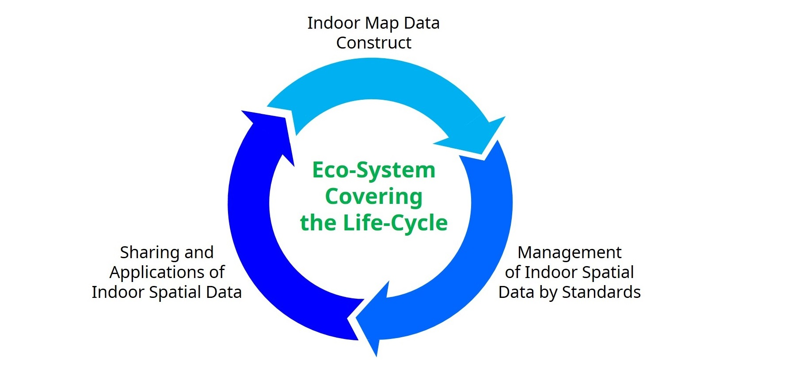

  

  

- - -

* Table of Content
{:toc}

- - -

## Summary

iNous (<strong>in</strong>door/<strong>ou</strong>tdoor <strong>s</strong>patial data services) is a large research project funded by the Korean government ([official webpage of the project](http://www.inous.net/).
The main objective is to develop an eco-systems of software for: 

  1. reconstructing indoor maps automatically
  2. managing these maps in an efficient way
  3. using these indoor maps in different applications

The focus of the project is on the [OGC standard IndoorGML](http://indoorgml.net/), but alternatives formats to represent the indoor of a building and its navigation graph will be sought.

{:width="500px"}

## What do we do?

We are responsible for 2 work packages:

### 1. The validation of IndoorGML files. 

This implies validating the geometry, topology, and general consistency of IndoorGML files. We have extended [val3dity](https://github.com/tudelft3d/val3dity) so that the rooms/cells in IndoorGML are validated, and so that the navigation graph is also validated. 

The support for IndoorGML was added in val3dity v2.2.0 ([download it there](https://github.com/tudelft3d/val3dity/releases)).

<strong> Are your IndoorGML files valid?</strong> Hugo Ledoux. In <em>Proceedings 15th 3D GeoInfo Conference 2020</em>, ISPRS, 2020, pp. 109&ndash;118. <a href="https://doi.org/10.5194/isprs-annals-VI-4-W1-2020-109-2020"><i class="ai ai-open-access-square"></i></a> <a href="#Vitalis3DGeoInfo2019" data-toggle="collapse"><i class="fas fa-caret-square-down"></i> BibTeX</a> 
<pre class="bibtex">@inproceedings{20_3dgeoinfo_indoorgml,
  author = {Ledoux, Hugo},
  title = {Are your {IndoorGML} files valid?},
  booktitle = {Proceedings 15th 3D GeoInfo Conference 2020},
  year = {2020},
  volume = {VI-4/W1-2020},
  pages = {109--118},
  publisher = {ISPRS}
</pre>

 

<iframe width="560" height="315" src="https://www.youtube.com/embed/jrSY4a4plz0" frameborder="0" allow="accelerometer; autoplay; clipboard-write; encrypted-media; gyroscope; picture-in-picture" allowfullscreen></iframe>

### 2. The develop of a [JSON-based encoding](https://json.org/) for IndoorGML. 

[Our proposal for IndoorJSON](https://github.com/tudelft3d/indoorjson) is online, with some software to convert IndoorGML files.

- - - 

## Open-source software and standards

  1. [val3dity](https://github.com/tudelft3d/val3dity) (v2.2+ has IndoorGML support out-of-the-box)
  2. [IndoorJSON](https://github.com/tudelft3d/indoorjson)

- - - 

## Team

     

