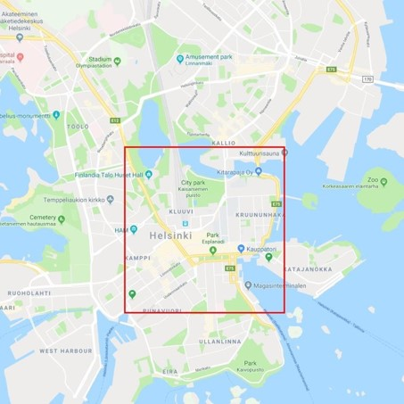
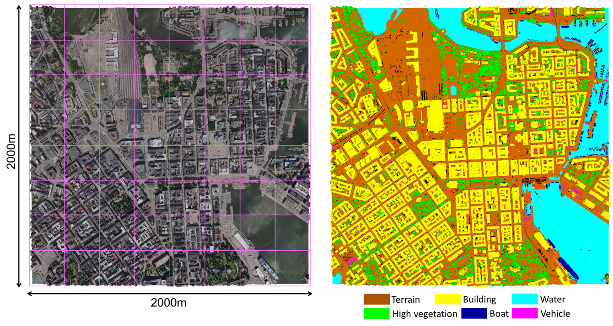

<!---

  

--->

    
    <figcaption>Overview of the semantic urban mesh benchmark. Left: the textured meshes. Right: the ground truth meshes.</figcaption>

- - -

* Table of Content
{:toc}

- - -

## Summary
We introduce a new benchmark dataset of semantic urban meshes which covers about 4 km2 in Helsinki (Finland), with six classes: *ground*, *building*, *vegetation*, *water*, *vehicle*, and *boat*. 

**Data download:** [SUM Helsinki 3D](https://3d.bk.tudelft.nl/opendata/sum3d/) 

We have used [Helsinki 3D](https://www.hel.fi/helsinki/en/administration/information/general/3d/3d) textured meshes as input and annotated them as a benchmark dataset of semantic urban meshes. 
The Helsinki's raw dataset covers about 12 km2 and was generated in 2017 from oblique aerial images that have about a 7.5 cm ground sampling distance (GSD) using an off-the-shelf commercial software namely [ContextCapture](https://www.bentley.com/en/products/brands/contextcapture). The entire region of Helsinki is split into tiles, and each of them covers about 250 m2. As shown in the figures below, we have selected the central region of Helsinki as the study area, which includes 64 tiles.   

  <!---
  --->

    
    <figcaption>Selected area of Helsinki </figcaption>

    
    <figcaption>The input textured mesh (part of our dataset). </figcaption>

    
    <figcaption>The labelled mesh (part of our dataset). </figcaption>

- - -

## Labelling workflow
Rather than manually labelling each individual triangle face of the raw meshes, we design a semi-automatic mesh labelling framework to accelerate the labelling process. Firstly, we over-segment the input meshes into a set of planar segments. To acquire the first ground truth data, we manually annotate the mesh (with segments) that is selected with the highest feature diversity. Then, we add the first labelled mesh into the training dataset for the supervised classification. Specifically, we use the segment-based features as input for the classifier, and the output is a pre-labelled mesh dataset. We then use the mesh annotation tool to manually refine the pre-labelled mesh according to feature diversity. In addition, the new refined mesh will be added to the training dataset in order to improve the automatic classification accuracy incrementally.

    
    <figcaption>he pipeline of the labelling workflow</figcaption>

Following the proposed framework, a total of 19,080,325 triangle faces have been labelled, which took around **400** working hours. Compared with a triangle-based manual approach, we estimate that our framework saved us more than **600** hours of manual labour.

## Comparison of existing 3D urban benchmark datasets
Urban datasets can be captured with different sensors and be reconstructed with different methods, and the resulting datasets will have different properties. The input of the semantic labelling process can be raw or pre-processed urban datasets such as the pre-labelled results of semantic segmentation. Regardless of the input data, it still needs to be manually checked and annotated with a labelling tool, which involves selecting a correct semantic label from a predefined list for each triangle (or point, depending on the dataset) by users. In addition, some interactive approaches can make the labelling process semi-manual. However, unlike our proposed approach, the labelling work of most of 3D benchmark data does not take full advantage of pre-processing steps like over-segmentation and semantic segmentation on 3D data, and interactive annotation in the 3D space.   
  

    
    <figcaption>Comparison of existing 3D urban benchmark datasets.</figcaption>

## Data split
To perform the semantic segmentation task, we randomly select 40 tiles from the annotated 64 tiles of Helsinki as training data, 12 tiles as test data, and 12 tiles as validation data. For each of the six semantic categories, we compute the total area in the training and test dataset to show the class distribution.

    
    <figcaption>Overview of the data used in our experiment. Left: The distribution of the training, test, and validation dataset. Right: Semantic categories of training (including validation data) and test dataset.</figcaption>

## Evaluation
We sample the mesh into coloured point clouds with a density of about 30 pts/m2 as input for the competing deep learning methods. To evaluate and compare with the current state-of-the-art 3D deep learning methods that can be applied to large-scale urban dataset, we select five representative approaches ([PointNet](http://openaccess.thecvf.com/content_cvpr_2017/papers/Qi_PointNet_Deep_Learning_CVPR_2017_paper.pdf), [PointNet++](https://ai.berkeley.edu/~ee290t/fa18/readings/point-net++-guibas.pdf), [SPG](http://openaccess.thecvf.com/content_cvpr_2018/papers/Landrieu_Large-Scale_Point_Cloud_CVPR_2018_paper.pdf), [KPConv](https://openaccess.thecvf.com/content_ICCV_2019/papers/Thomas_KPConv_Flexible_and_Deformable_Convolution_for_Point_Clouds_ICCV_2019_paper.pdf), and [RandLA-Net](http://openaccess.thecvf.com/content_CVPR_2020/papers/Hu_RandLA-Net_Efficient_Semantic_Segmentation_of_Large-Scale_Point_Clouds_CVPR_2020_paper.pdf)), and we perform the experiment on an NVIDIA GEFORCE GTX 1080Ti GPU. In addition, we also compare with the [joint RF-MRF](https://www.sciencedirect.com/science/article/pii/S0924271616301812?casa_token=dFyuttETI9gAAAAA:lRmrFeYuGZisXbi9WAKuTL9FS_H0XZQmgzPIgB9FZ395rRxOqHWMQas2AqzXn6Pcp8n7gHdaA9k), which is the only method that directly takes the mesh as input and without using GPU for computation. The hyper-parameters of all the competing methods are tuned to achieve the best results we could acquire. We achieve about **93.0%** overall accuracy and **66.2%** mIoU. Specifically, our approach outperforms RF-MRF with a margin of about 5.3% mIoU, and other deep learning methods from 0.7% to 28.1% mIoU.

    
    <figcaption>Comparison of various semantic segmentation methods on the new benchmark dataset. The results reported in this table are per-class IoU (%), mean IoU (mIoU, %), Overall Accuracy (OA, %), mean class Accuracy (mAcc, %), mean F1 score (mF1, %), and the running times for training and testing (minutes). The running times of RF-MRF and the baseline (ours) methods also include feature computation.
    </figcaption>

We also evaluated the performance of semantic segmentation with different amounts of input training data on our baseline approach and [KPConv](https://openaccess.thecvf.com/content_ICCV_2019/papers/Thomas_KPConv_Flexible_and_Deformable_Convolution_for_Point_Clouds_ICCV_2019_paper.pdf) with the intention of understanding the required amount of data to obtain decent results. We found that we only need about 7% of the training dataset (which covers about 0.23 km2) to achieve the acceptable and robust results compared to 33% (which covers about 1.0km2) for KPConv.

    
    <figcaption>Effect of the amount of input training data on the performance of our baseline method and KPConv.</figcaption>

## Video demo
<iframe src="https://player.vimeo.com/video/518579204" width="640" height="360" frameborder="0" allow="autoplay; fullscreen; picture-in-picture" allowfullscreen></iframe>

<iframe src="https://player.vimeo.com/video/518669528" width="640" height="360" frameborder="0" allow="autoplay; fullscreen; picture-in-picture" allowfullscreen></iframe>

## Funding

    

        
    

    

    

This project has received funding from [EuroSDR](http://www.eurosdr.net/) and support from [CycloMedia](http://www.cyclomedia.com).

- - - 

## Team

     

**Ziqian Ni**, assists in software development, from 2019-07 to 2019-09.   
**Mels Smit**, assists in mesh annotation, from 2020-07 to 2020-09.  
**Charalampos Chatzidiakos**, assists in mesh annotation, from 2020-07 to 2020-09.  