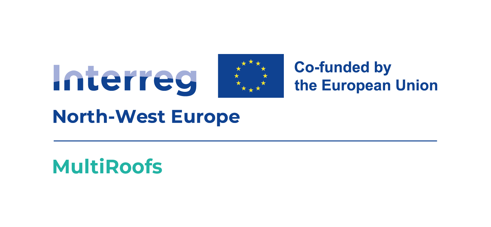

  

- - -

* Table of Content
{:toc}

- - -
## Summary

MultiRoofs aims to enable public authorities to increase the multifunctional use of rooftops in their urban areas. 
The project is composed of 25+ industry and academic partners in Western Europe (including Rotterdam, Paris, Dublin, Brussels) and it is an extension of a [prototype developed by MVRDV in Rotterdam](https://mvrdv.com/news/4290/mvrdv-launches-roofscape-a-new-software-to-help-reimagine-rotterdams-rooftops), the Netherlands which is based on our [3DBAG](www.3dbag.nl) solution.

- - -
## Our role in the project

TBC

- - -
## Funding

This project is funded by [Interreg North-West Europe (NWE)](https://www.nweurope.eu/), a European Territorial Cooperation programme aiming to support a balanced development across the area, making all regions more resilient, and contributing to a better quality of life and well-being of all NWE citizens.

- - -

## Team

     

  
  
